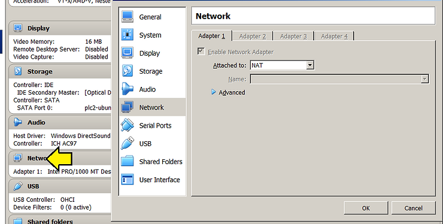
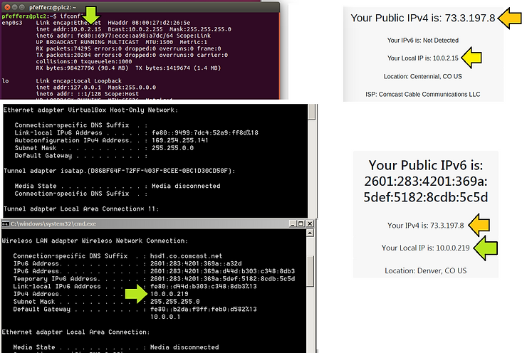
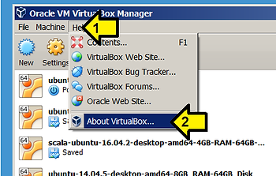
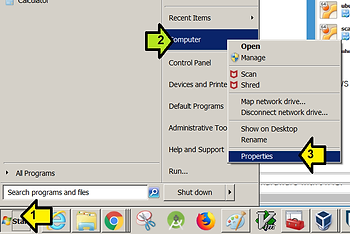
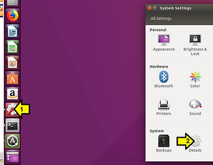

# How a VirtualBox Virtual Machine can Access the Internet

This post reviews how a VirtualBox Virtual Machine (VM) can access the internet.

**How a VirtualBox Virtual Machine can Access the Internet**

TL;DR

A VM accesses the internet through the **VirtualBox networking engine**. The **VirtualBox networking engine** creates and manages a private network that the host cannot access. The host can access this private network with additional configuration.

Detail

1\. The **VirtualBox networking engine** sits between each VM and the host.

2\. It maps traffic from and to the virtual machine when Network Address Translation (NAT) has been enabled. Click **Network** and look at what **Adapter 1** is connected to:

3\. The VMs network frames are received by **VirtualBox’s networking engine**.

4\. The engine extracts the TCP/IP data and resends it using the Windows.

5\. To an application on the Windows host it looks like the data was sent by the VirtualBox application using the Window's host IP. Another computer on the same network sees the same thing.

6\. When the Window's host gets a reply, the VirtualBox application repacks the packets and resends them to the guest running Ubuntu on the private network it manages.

7\. The **VirtualBox’s networking engine** also acts as a DHCP server for the Ubuntu guest.

**Explore**

With a guest running that's configured for NAT run:

-   ipconfig on the Windows host,
    
-   ifconfig on the Ubuntu guest and
    
-   browse to https://www.whatismyip.com/ on both the Window's host and Ubuntu guest.
    

Here's an example. The green arrows show the private network managed by the **VirtualBox networking engine**. The guest Ubuntu system has IP: **10.0.2.15**. This same interface has the IP **169.254.255.141** on the Window's side. The external IP of both Ubuntu and Windows is the same **73.3.197.8**.

The VirtualBox documentation describes why the guest's IP address is 10.0.2.15:

_9.11 Fine-tuning the VirtualBox NAT engine_

_9.11.1 Configuring the address of a NAT network interface_

_In NAT mode, the guest network interface is assigned to the IPv4 range 10.0.x.0/24 by default where x corresponds to the instance of the NAT interface +2. So x is 2 when there is only one NAT instance active. In that case the guest is assigned to the address_ **_10.0.2.15_**_, the gateway is set to 10.0.2.2 and the name server can be found at 10.0.2.3._

_If, for any reason, the NAT network needs to be changed, this can be achieved with the following command:_ _VBoxManage modifyvm "VM name" --natnet1 "192.168/16"_

_This command would reserve the network addresses from 192.168.0.0 to 192.168.254.254_ _for the first NAT network instance of “VM name”. The guest IP would be assigned to_ _192.168.0.15 and the default gateway could be found at 192.168.0.2._

**System**

This write up was done using:

-   VirtualBox Version 5.1.30 r118389 (Qt5.6.2)
    
-   Windows 7 Professional SP1
    
-   Ubuntu 16.04 running in VirtualBox
    

**Check VirtualBox, Windows and Ubuntu Versions**

VirtualBox Version

Check your VirtualBox version by **1.** clicking **Help** then **2\. About VirtualBox...**

Windows Version

Check your version of Windows by **1.** clicking **Start**, **2.** Right-clicking **Computer** and **3.** clicking **Properties**.

Ubuntu Version

Check your version of Ubuntu running on VirtualBox by clicking **1.** then **2\. Details**:

**References**

-   Find out what your computers external IP address is with [https://www.whatismyip.com/](http://www.whatismyip.com/)
    
-   A high-level write up on NAT is available at [link](http://computer.howstuffworks.com/nat1.htm).
    
-   Info about how VirtualBox supports NAT can be found in the VirtualBox user manual Version 5.1.30 at: C:\\Program Files\\Oracle\\VirtualBox\\doc\\UserManual.pdf chapter **6.3 Network Address Translation (NAT)**
    
-   The VirtualBox logo is from [https://www.virtualbox.org/](http://www.virtualbox.org/).
    

**Outstanding Questions**

-   Asked if its possible to **see** the Network Address Translation that VirtualBox’s networking engine maintains? See [link](http://forums.virtualbox.org/viewtopic.php?f=1&t=87240) for the question (and hopefully the answer).
    
-   Also asked, "Does NAT use the "Ethernet adapter VirtualBox Host-Only Network?" See [link](http://forums.virtualbox.org/viewtopic.php?f=1&t=87241#p416734) for the question (and hopefully the answer).