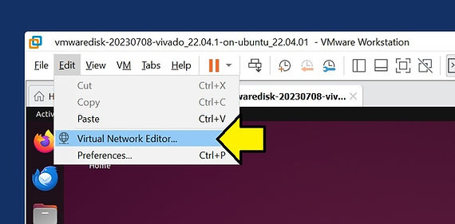
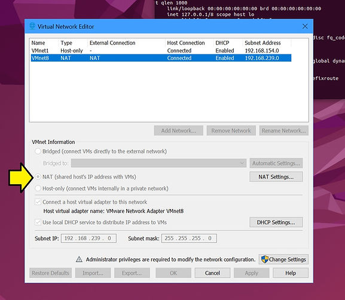

# How can I ssh into a Ubuntu VM from Windows?

This post answers, "How can I SSH into an Ubuntu VM from Windows?" It shows the steps using VMWare Workstation. One use of this is to work in Windows terminals instead of switching to the VM's GUI. This allows you to organize terminals more efficiently and cut and paste using Windows shortcuts.

## How can I ssh into a Ubuntu VM from Windows?

### Prerequisites

Before you try to SSH into a machine running Ubuntu in a VM from a Windows host, make sure you've checked these prereqs.

-   Ensure your VM network settings allow connections from your host: Use "[<u><span>Bridged Adapter"</span></u>](https://www.centennialsoftwaresolutions.com/post/what-is-a-bridged-adapter) or [<u><span>NAT with port forwarding</span></u>](https://www.centennialsoftwaresolutions.com/post/what-is-nat-mode) in your VM network adapter settings. To Check:
    

1\. In VMWare click:



2\. Check NAT



-   Firewall Settings: Ensure the firewall on the Ubuntu VM allows SSH connections.
    

​	The firewall will not be active if you use a recently installed Ubuntu 22.04.1.

```
# Check if its installed:
sudo apt list --installed | grep ufw
# [sudo] password for demouser: 
# WARNING: apt does not have a stable CLI interface. Use with caution in scripts.
# ufw/jammy-updates,jammy-updates,now 0.36.1-4ubuntu0.1 all [installed,automatic]
# If not installed, run 
sudo ufw status
# Status: inactive
sudo ufw status verbose
# Status: inactive
# To see the list of rules, you can use:
sudo ufw show added
# Check the logs
sudo less /var/log/ufw.log
# /var/log/ufw.log: No such file or directory
```

-   SSH Configuration: Check /etc/ssh/sshd\_config for configuration issues.
    

### Step-by-Step Guide

#### 1\. Set up the SSH Server on Ubuntu

**A. Install OpenSSH Server:**

bash

```
sudo apt update 
sudo apt install openssh-server
```

**Example Output**

```
Hit:1 https://dl.google.com/linux/chrome/deb stable InRelease
Get:2 http://security.ubuntu.com/ubuntu jammy-security InRelease [129 kB]      
...
  libx265-199 libxvidcore4 libzimg2 libzmq5 libzvbi-common libzvbi0
  mesa-va-drivers mesa-vdpau-drivers pocketsphinx-en-us va-driver-all
  vdpau-driver-all
Use 'sudo apt autoremove' to remove them.
0 upgraded, 0 newly installed, 0 to remove and 116 not upgraded.
```

**B. Start and Enable the SSH Service**:

bash

```
sudo systemctl start ssh 
sudo systemctl enable ssh
```

**Example Output**

```
sudo systemctl enable ssh
Synchronizing state of ssh.service with SysV service script with /lib/systemd/systemd-sysv-install.
Executing: /lib/systemd/systemd-sysv-install enable ssh
```

**C. Check the SSH Service Status**:

bash

```
sudo systemctl status ssh
```

**Example Output**

```
ssh.service - OpenBSD Secure Shell server
     Loaded: loaded (/lib/systemd/system/ssh.service; enabled; vendor preset: e&gt;
     Active: active (running) since Tue 2024-07-02 06:13:35 MDT; 3 days ago
       Docs: man:sshd(8)
             man:sshd_config(5)
   Main PID: 149044 (sshd)
      Tasks: 1 (limit: 38372)
     Memory: 1.7M
        CPU: 17ms
     CGroup: /system.slice/ssh.service
             └─149044 "sshd: /usr/sbin/sshd -D [listener] 0 of 10-100 startups"
Jul 02 06:13:35 fpgadev systemd[1]: Starting OpenBSD Secure Shell server...
Jul 02 06:13:35 fpgadev sshd[149044]: Server listening on 0.0.0.0 port 22.
Jul 02 06:13:35 fpgadev sshd[149044]: Server listening on :: port 22.
Jul 02 06:13:35 fpgadev systemd[1]: Started OpenBSD Secure Shell server.
```

**D. Get the IP Address of Your Ubuntu VM**:

bash

```
ip a
```

**Example Output**

```
1: lo: &lt;LOOPBACK,UP,LOWER_UP&gt; mtu 65536 qdisc noqueue state UNKNOWN group default qlen 1000
    link/loopback 00:00:00:00:00:00 brd 00:00:00:00:00:00
    inet 127.0.0.1/8 scope host lo
       valid_lft forever preferred_lft forever
    inet6 ::1/128 scope host 
       valid_lft forever preferred_lft forever
2: ens33: &lt;BROADCAST,MULTICAST,UP,LOWER_UP&gt; mtu 1500 qdisc fq_codel state UP group default qlen 1000
    link/ether 00:0c:29:18:7d:a9 brd ff:ff:ff:ff:ff:ff
    altname enp2s1
    inet 192.168.239.128/24 brd 192.168.239.255 scope global dynamic noprefixroute ens33
       valid_lft 924sec preferred_lft 924sec
    inet6 fe80::bb94:212f:f521:2539/64 scope link noprefixroute 
       valid_lft forever preferred_lft forever
```

**E. Note the IP address**

**192.168.239.128** from the **Example Output** above

#### 2\. Install SSH Client on Windows

-   Using Windows 10/11 Built-in SSH Client:
    
-   Open PowerShell or Command Prompt.  
    
-   Using a Third-Party SSH Client (e.g., PuTTY):
    
-   Download and install PuTTY from [PuTTY official site](https://www.putty.org/).
    

#### 3\. Connect to the Ubuntu VM from Windows

-   Using Windows Built-in SSH Client:  
    

1.  Open PowerShell or the Command Prompt (Windows + R: cmd)
    
2.  Type the following command and press Enter:  
    

```
ssh demouser@192.168.239.128
```

Note: Replace **demouser** with your Ubuntu username and **192.168.239.128** with the IP address of your Ubuntu VM from above.

-   Using PuTTY:  
    
    1.  Open PuTTY.
        
    2.  In the "Host Name (or IP address)" field, enter the IP address of your Ubuntu VM.
        
    3.  Ensure the "Port" field is set to 22 (default SSH port).
        
    4.  Select "SSH" as the connection type.
        
    5.  Click "Open".
        
    6.  When prompted, enter your Ubuntu username and password.
        

### It's not working! What can I check?

If SSH is not working, examining the /etc/ssh/sshd\_config file can help identify potential issues. Here are some key parameters and settings to look for:

-   **Port:** Ensure that the port specified here matches the port you are trying to connect to.

```
Port 22
```

-   **PermitRootLogin:** Check if root login is allowed. If it is set to no, ensure you are not trying to log in as root, or modify this setting if <u><span>necessary.</span></u>

```
PermitRootLogin no
```

-   **PasswordAuthentication:** Ensure password authentication is allowed if you use a password to log in.

```
PasswordAuthentication yes
```

-   **PubkeyAuthentication:** Ensure public key authentication is enabled if you are using SSH keys.

```
PubkeyAuthentication yes
```

-   **AllowUsers / AllowGroups:** If these directives are set, ensure that your user is listed.


```
AllowUsers yourusername 
AllowGroups sshusers
```

-   **DenyUsers / DenyGroups:** Ensure your user is not listed in these directives.
    

```
DenyUsers baduser 
DenyGroups badgroup
```

-   **ListenAddress:** Ensure the SSH daemon is listening on the correct address.

```
ListenAddress 0.0.0.0 
ListenAddress ::
```

[What does ListenAddress 0.0.0.0 & ListenAddress :: mean?](https://www.centennialsoftwaresolutions.com/post/what-does-listenaddress-0-0-0-0-listenaddress-mean)

-   **MaxAuthTries:** Check the maximum number of authentication attempts allowed.

```
MaxAuthTries 6
```

-   **PermitEmptyPasswords:** Ensure this is set to no for security reasons.

```
PermitEmptyPasswords no
```

-   **UsePAM:** Ensure that PAM (Pluggable Authentication Modules) is enabled if required.

```
UsePAM yes
```

-   **LogLevel:** Check the logging level. Setting it to DEBUG can help troubleshoot issues.

```
LogLevel INFO
```

- **Banner:** 

  If set, check the content of the file specified.

```
Banner /etc/issue.net
```

After making changes to the /etc/ssh/sshd\_config file, restart the SSH service to apply the changes:

```
<span><span>sudo systemctl restart ssh</span></span>
```

Additionally, check the SSH service status to see if there are any errors:

```
<span><span>sudo systemctl status ssh</span></span>
```

These steps should help you diagnose and fix issues with SSH not working.