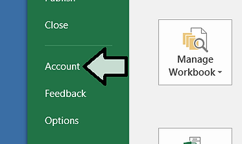

# How to Disable Animations in Excel 2016

This post describes how to disable animations in Excel 2016 on Windows 7. The instructions will also disable animations in other Office products \[3\]. It also lists steps to check which version of Excel you're using and lists the steps that don't work.

**Aug 8th 2018 Update**: This post has been superseded by: http://www.zachpfeffer.com/single-post/Disable-Microsoft-Office-Excel-Cell-Movement-Animations-and-Word-Cursor-Animations 

## How to Disable Animations in Excel 2016 \[3\]

**1.** Click **_Start_**

**2.** Click **_Control Panel_**

**3.** Click **_Ease of Access_**

**4.** Click **_Ease of Access Center_**

**5.** Click **_Make the computer easier to see_**

**6.** Click **_Turn off all unnecessary animation (when possible)_** to check the checkbox

**7.** Click **_Apply_**

## How to Check Which Version Excel You Are Using \[2\]

**1.** Click **_File_** on the menu bar

**2.** Click **_Account_**

**3.** Click **_About Excel_**

## More Info

These steps **_do not work_** to disable animations in Excel 2016

**1.** Click **_File_** on the menu bar

**2.** Click **_Options_**

**3.** Click **_Advanced_** then click the **_Disable hardware graphics acceleration_** checkmark checkbox.

## Related

-   A Way to Disable Cursor Movement Animation in Word 2016 at link.
    
-   How to find which version of Word you're using at link.
    

## Reference

1\. How to disable Animation in Excel 2013

2\. 32-bit vs. 64-bit Office – Which do I have? What’s the Difference?

3\. Turn off Office animations

4\. Excel icon downloaded from \[linklink\] as SVG and saved as a PNG using Microsoft Explorer