# Detailed Info on How to Use a Tektronix 465 Oscilloscope:

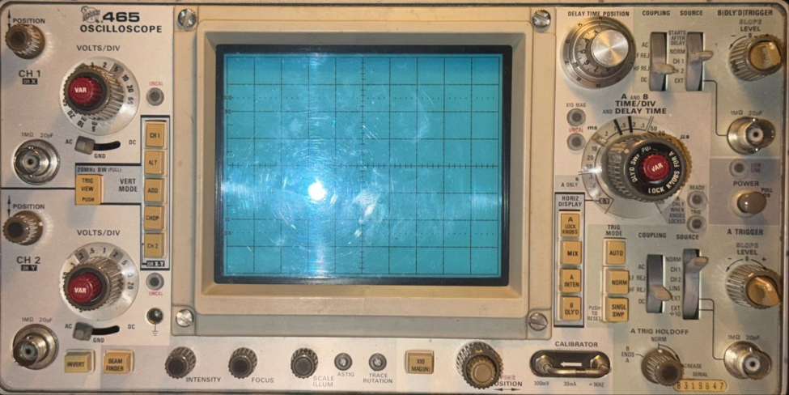

This post goes through the basic functions and measurements the Tektronix 465 Oscilloscope can perform. Through feedback and upon request, this post will be updated to include more complex functions and questions on how to use this device. If there are any questions, please refer to the sources below, and if they are not answered, please feel free to comment below the last video of our YouTube tutorial. 

<https://www.youtube.com/@centennialsoft>

<https://w140.com/tekwiki/images/3/32/070-1330-00_465Service.pdf>

This oscilloscope guide does not include the DM44 function, as shown in most manuals.

This tutorial can be used with an older function generator, but when calibrating and learning, please use a known-working function generator so the oscilloscope's base workings and offsets can clearly be visible without doubt. Once it is known that the device still works properly, accurate measurements with other devices can be obtained.

If you have trouble finding specific buttons or dials within this tutorial, please refer to the appendix. 

[TOC]

# Equipment

The equipment below is required for testing and using the oscilloscope and circuits.

- 50 ohm feedthrough adapter

- 2-3 BNC cables

- BNC tee adapter

- BNC Test adapter

- Known working multimeter

- Known working function generator

# Screen Handling and Setting Up

## Basic Controls

The Tektronix 465 oscilloscope has a few controls that help scale and move the signal to fit within the viewing window.

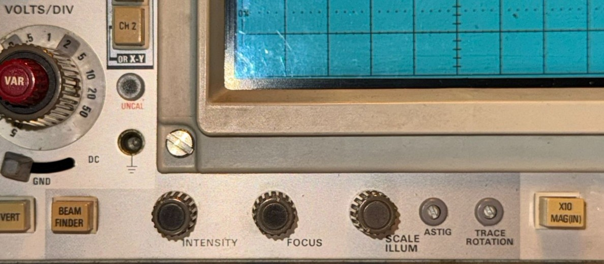

INTENSITY changes how bright the signal appears. This knob is usually kept at the same brightness, unless using A and B TIME/DIV measurements. This might have to be fiddled with according to how bright the B gate is. In general, keep the brightness at a consistent low level in order to avoid permanently burning the phosphor screen. Many of the pictures shown in this tutorial are deliberately brightened to show the waveform.

FOCUS is for focusing on the signal itself. This might have to be changed according to the signal.

SCALE ILLUM brightens the graticule brightness and the black grid lines. These turn orange when brightened. This function is really only used in dark spaces.

ASTIG permanently adjusts focus. This is usually something you may have to adjust once and never again. 

TRACE ROTATION adjusts the trace of the wave to align with your graticule lines. This is also rarely adjusted.

## Screen Units

The lines on the main oscilloscope screen represent graticule markers. These lines are used to measure your wave. Each line represents one division, or “DIV” on most buttons/dials. For instance, when using the CH 1 or CH 2 VOLTS/DIV dials, each vertical deflection will show the highlighted amount of volts PER graticule. If the oscilloscope is properly receiving 2 V into one channel and your dial is set/highlighted to 1 VOLTS/DIV, then the wave should span across 2 vertical graticules. See the peak-to-peak measurements section for more information on how to measure the full frequency of the wave.

## Channels

Channels 1 and 2 (CH 1 and CH 2) are the main inputs for measuring waves with this oscilloscope. CH 1 should be the main terminal used, and it is the main terminal used in this guide. When comparing two signals, CH 1 is often used as the main signal to be measured, and CH 2 is the steady reference signal. For the X-Y display, channel 1 or X is the horizontal deflection, and channel 2 or Y is the vertical deflection.

# Basic Use

When using the oscilloscope dials, both the VOLTS/DIV and TIME/DIV dials have an additional red dial. This dial is a calibration dial and can be used to further size the wave without a proper measurement unit. When referencing the displays and instructions below through this tutorial, most instructions will ask to keep this dial calibrated, UNCAL lamp off. This simply means to make sure the red dial is turned all the way right until it is clicked into its calibrated position. The small lamp beside the dials should be off, as the lamp visually signifies if your measurements are correctly calibrated according to the measurement shown on the dials. 

If the lamp stays on when the dial is calibrated, or does not turn on when the lamp is uncalibrated, please refer to the device's maintenance manual or further research.

## Displays

### Normal Sweep Display

<u>Vertical Section:</u>

Vert Mode: Set to channel 1

VOLTS/DIV: Adjust for input amplitude

VAR VOLTS/DIV: Calibrated, UNCAL lamp off

AC-GND-DC: AC

POSITION Vertical: Mid position

INVERT: Button Out

<u>Horizontal Section:</u>

TIME/DIV knob: locked together at 1 ms

VAR TIME/DIV: Calibrated Detent

HORIZ DISPLAY: A

X10 MAG: Off

POSITION Horizontal: Midrange

<u>Trigger:</u>

SLOPE (click dial): +

LEVEL(turn dial): 0

SOURCE: NORM

COUPLING: AC

TRIG MODE: AUTO

A TRIG HOLDHOFF: NORM

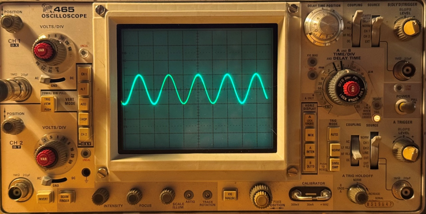

### Delayed Sweep Display

1. Obtain a normal sweep display.
2. Set the HORIZ DISPLAY switch to A INTEN and the B trigger SOURCE switch to STARTS AFTER DELAY.
3. Pull on the B TIME/DIV knob and turn clockwise until the intensified zone is the desired length. Adjust INTENSITY for desired brightness.
4. Adjust DELAY TIME POSITION control to move the intensified zone to cover the portion of the display to be displayed in delayed form.
5. Set HORIZ DISPLAY switch to B DLY’D. Delay sweep is indicated on the B TIME/DIV knob.
6. For less jitter, set the B trigger SOURCE switch to the same position as the A trigger SOURCE switch and adjust the B LEVEL control for a stable display.

### X-Y Display

The X-Y display is used to show a distinct graphical display of a relationship between two time-varying waves. This mode is used for phase relationships and comparing certain parameters, which is very useful in Audio Engineering, the Automotive Industry, and more. This display uses both channels. The steps below show the basic setup for the X-Y display.

1. Obtain a normal sweep display.
2. Set the TIME/DIV knob to X-Y and the VERT MODE button to CH 2. Apply the vertical signal to the CH 2 OR Y input connector and the horizontal signal to the CH 1 OR X input connector.
3. Use INTENSITY to find the beam. If the beam is not shown, hold down the beam finder and adjust the CH 1 or CH 2 VOLTS/DIV until the display is reduced in size. Release the beam finder and adjust the focus for a clearer picture.

The X-Y display will most likely not look exactly like below, and will be moving sporadically. If checking to make sure the display simply works, make sure the display shows a square-like wave as shown below, able to be adjusted with the VOLTS/DIV and TIME/DIV dial, and that CH 1 adjusts the X axis, and CH 2 adjusts the Y axis. 

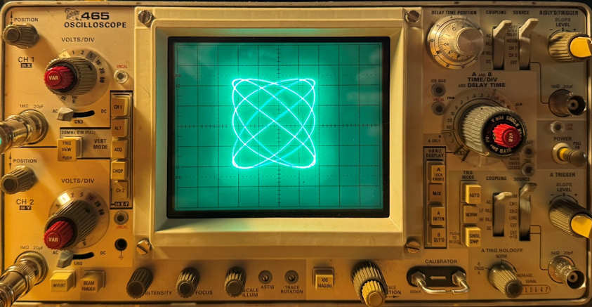

If using the X-Y display for a more advanced setup, understanding the movement of the display as affected by the frequency ratio and phase shift is paramount. If the frequency ratio increases, more "bumps" will appear on the display. Based on the specific phase shift chosen, your wave will seem to rotate to a specific position. Make sure both waves have the same trigger, or the wave will move sporadically. The determined display will mainly depend on the need for the display. 

# Checks

## Calibrating Probes

This example tests both channels independently.

The calibrator is the metal rectangle probing out at the bottom right of your oscilloscope. The first step when receiving your oscilloscope and probes is to calibrate these probes using the calibrator. One to two probes should be used for this device. Label the probes for channel 1 and channel 2, and use them accordingly.

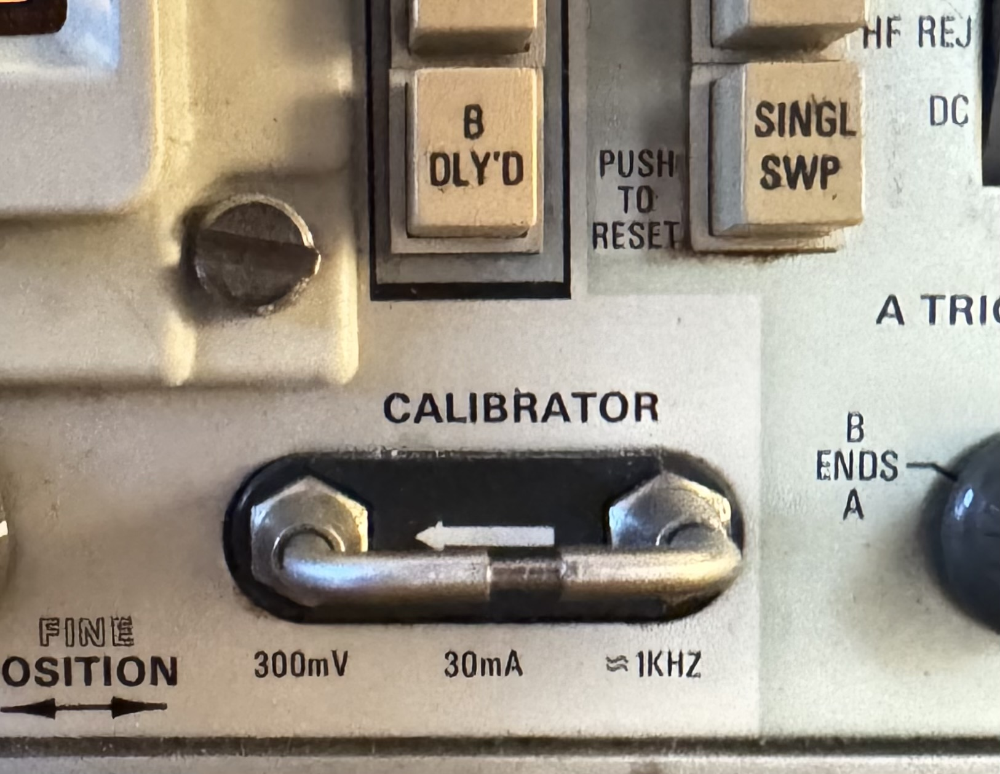

1. Connect the probe to its corresponding channel. Do this one at a time to minimize any interference and maintain optimal accuracy. Select Vert Mode on the corresponding channel you are using one at a time, and to do both, press ALT mode. Use the POSITION dial of either channel to accurately place the functions into view. Calibrating your probes one at a time will help you more accurately adjust the traces.
2. To denoise the wave, take a banana clip and attach a wire with a loop to the end of the clip to attach the grounding clip to it. Plug the banana clip into the grounding hole below the vert mode buttons. 
3. If you are new to probes, your probe may have a cap to protect the small hook at the tip. Slide down the top cover to reveal the probe, and clip your probe onto the middle of the calibrator bar. This part should be thinner than most of the bar.

Below is what your setup should look like:

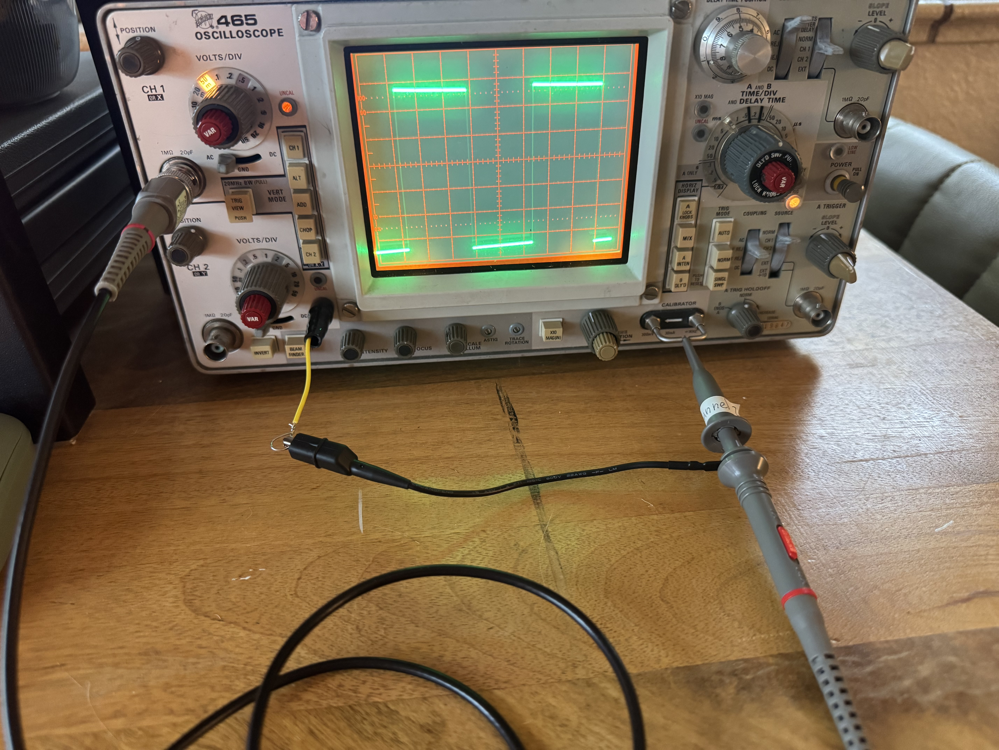

You should see a display on your screen that may or may not look as curved as the one down below. If your screen looks like either of the pictures below, you need to calibrate your probe.

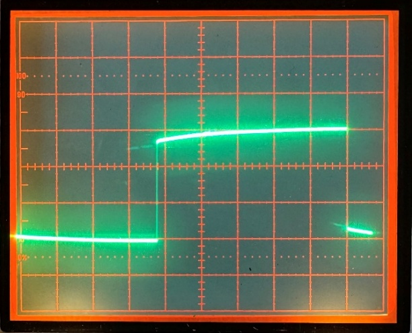 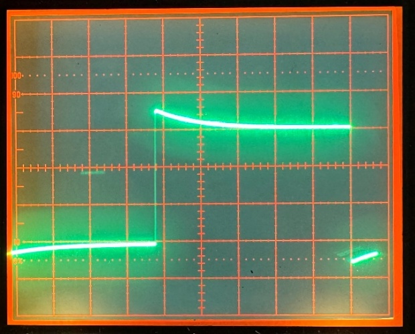

On the back of the probe should be a hole with a set screw. Turn that knob until the square waveform is as straight as it can be. It should look like the picture below.

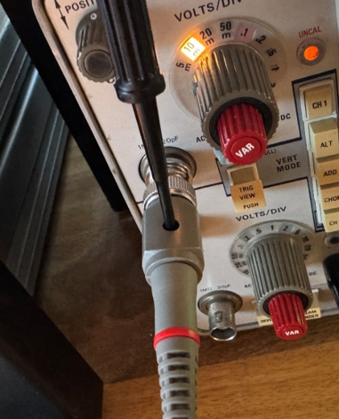 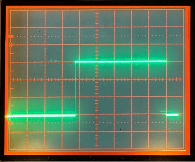

After this, do the same for channel 2 with the second probe. You have calibrated your probes! You want to keep one probe per channel as the channel input of each can be slightly different, and your probes will stay consistent. 

## Vertical and Horizontal Check

A vertical and horizontal check will ensure your device is reading waves in a precise manner. This measurement example tests both channels independently.

Vertical Check:

1. Hook up your probe to the square wave calibrator bar as seen in the previous example.

2. Set VOLTS/DIV to the 50 mV position and the input coupling switch to DC.

3. VAR VOLTS/DIV, the small red dial on the VOLTS/DIV knob, should be in the calibrated indent; the UNCAL lamp should be off. The vertical deflection should be between 5.8 and 6.2 divisions. If not, you can either fix the interior or adjust the VAR VOLTS/DIV to adjust for the proper measurement. 

Horizontal check:

1. Obtain a normal sweep display.
2. Set the A TIME/DIV knob to the 5 ms position. Set the A Trigger SOURCE switch to LINE.
3. Push the TRIG VIEW switch and hold it in. This displays a sample of the line voltage.
4. Use the A Trigger LEVEL control to vertically position the top of the display within the display area.
5. Use the horizontal position control to position the left peak to the left graticule edge. Verify the horizontal distance between the first and the fourth peaks is 9.8 to 10.2 divisions. If the fourth peak is not visible, verify the horizontal distance between the first and the third peaks is 6.53 to 6.79 divisions.

## AC, GND, and DC

AC, GND, and DC are the modes used to couple the input signal to the vertical amplifier. This basically means that, depending on which mode you use, you are sending certain parts of the vertical part of the input signal to the oscilloscope.

Alternate Coupling (AC): The fluctuation of the current

Direct Coupling (DC): Offset of the current

If there is an offset set on the input current of a function generator and the oscilloscope is set to DC, the waveform and offset will be visible. If it is only set to AC, you will only see the waveform as the device cuts off the DC coupling. Ground isolates both of these functions, and you will simply see a line. This can be useful if you want to see the 0 V offset, where the middle or 0 trace of your waveform will be. 

## ADD Mode

This measurement example uses both channels.

The ADD function of VERT MODE displays the algebraic sum of the signals applied to CH 1 and CH 2 inputs. This function is helpful for testing and analyzing waves that combine in a circuit. It is also helpful for seeing if two waves are simultaneous, contain wave delay, and if there is any visible distortion in either signal. 

Before using this function, there are a few things to keep in mind to use the function properly.

1. Do not exceed the input voltage rating of the oscilloscope. This can damage internal parts and can permanently mess up readings. To avoid this, use a lower voltage or use a probe that can divide your signal voltage by 10.
2. Do not apply signals that exceed an equivalent voltage of about 8 times the VOLTS/DIV switch setting used. For instance, if you are using a VOLTS/DIV switch setting of 0.5, the voltage applied to the channel should not exceed 4 volts. This can distort the display and possibly overload the oscilloscope. 

When using the ADD mode, inverting Channel 2 can either add up your signals or work slightly as a "subtract" function. If your signals match each other, inverting channel 2 can help you see any discrepancies within the added signals. If Channel 2 is inverted from Channel 1, the inverted button can help correct this without changing the wave.

You can also use the ADD mode to provide a DC offset for an AC signal. For example, if Channel 1 is an AC signal, use Channel 2 to apply a negative DC offset, then apply the ADD function to add this offset together. This is helpful when you can't adjust the position of a signal.

## Triggering

Triggering is meant to synchronize your waveform every time it samples. For digital oscilloscopes, there are many “automatic” triggering functions that make it very easy to automatically synchronize your waveform without much input. Analog oscilloscopes are far more manual. The oscilloscope has three trigger functions.

AUTO mode: The sweep is initiated by the applied trigger signal. If there is no trigger or if the trigger is less than 20 hertz, the sweep free runs and gives a bright reference trace of the input signal. 

NORM mode: This mode only shows the trace when an adequate trigger is found. Use for steady traces or when the trigger rate is too low for AUTO mode. 

SINGL SWP: This mode is meant to display a single sweep of the signal only when the button is pushed. This mode is mainly used to look at and photograph non-repetitive signals.

The Channel 1 and Channel 2 trigger inputs allow for external trigger signals. This measurement example uses one channel. Triggered and untriggered examples are shown below.

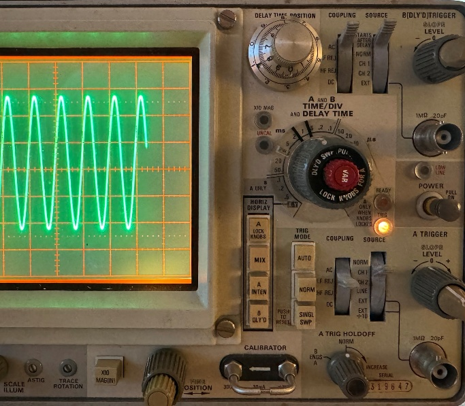 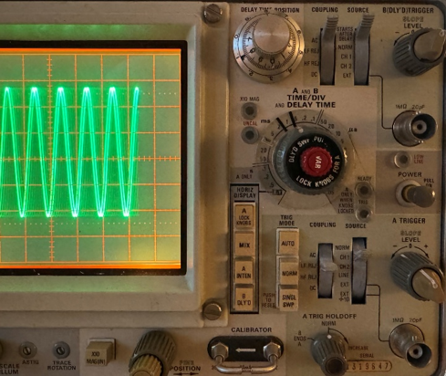

The triggering knob is labeled with a “Slope Level [- 0 +]”. This indicates the slope that the trigger signal starts on. The “Slope” part of the knob is the knob that clicks to either the negative sign or the positive sign. The “Level” part of the knob indicates by amplitude where on the wave the dial will trigger. Adjust this after the trigger level, coupling, and slope have all been adjusted. Most basic waves will trigger in the 0 position.

For the TRIG HOLDOFF dial, this forces the trigger to ignore the set trigger for a certain period of time. Most basic waves will have this dial set to NORM. If the input wave is burst or pulse-like, or simply asymmetric, the dial can be adjusted according to need.

The A sweep is the default signal to change, measure, and trigger your signals. A - B trigger and delay will be detailed more below in the A and B time delay section.

## Voltage Measurements

### Peak to Peak Voltage - AC

This measurement example uses one channel.

To measure peak-to-peak voltage, obtain a normal sweep display of a voltage of your choosing, and line the highest peak of your wave with the center vertical graticule line. Next, align the closest lower peak with a horizontal graticule line. The “vertical deflection” is the amount of graticules the vertical aspect of your wave takes up. Multiply the vertical deflection by your VOLTS/DIV setting, resulting in your peak-to-peak voltage.

In the example below, the wave has a vertical deflection of 5.5, with a VOLTS/DIV setting of 20 m. 

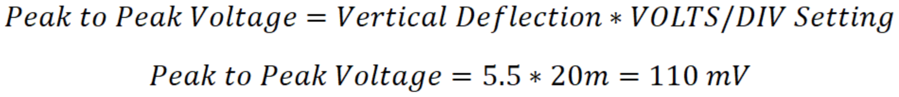

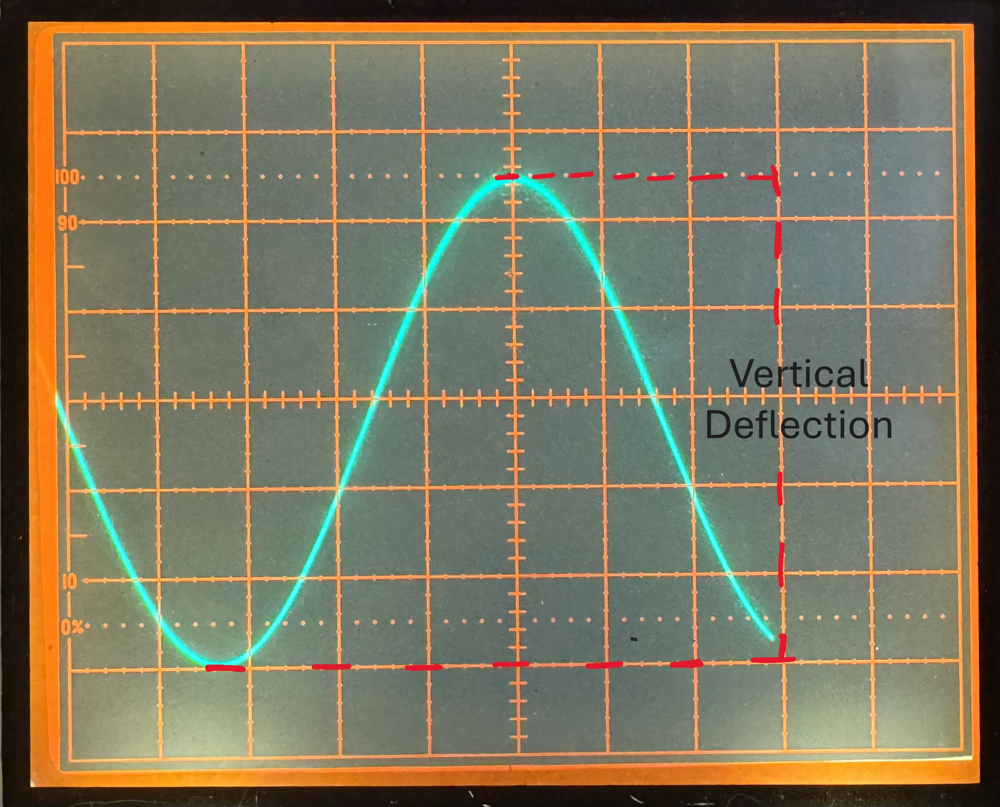

With the X10 MAG button, you can see a more accurate display of the top of your waveform. In this example, it confirms our wave is right between the markers.

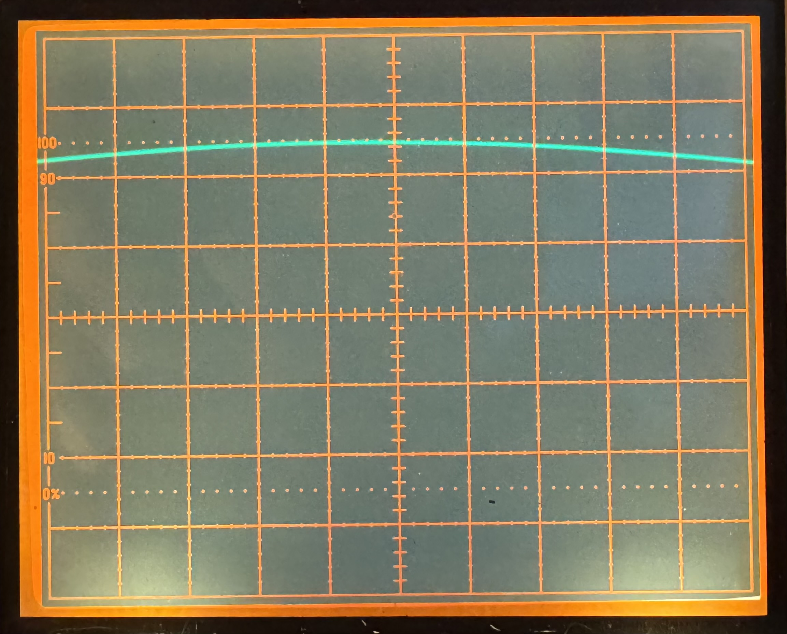

### Instantaneous Voltage Measurement - DC

To find the instantaneous voltage, start by finding the polarity. To find the polarity, obtain a normal display and set input coupling to GND. Vertically position the line to the center of the CRT display, then set the coupling to DC. If you see the point on your line move above the center line, the voltage is positive; if below the center, the voltage is negative.

To find the voltage value, first switch the input coupling to GND. If you had a positive voltage, position your line to the bottom reference graticule. If the voltage was a negative voltage, position your line to the top reference graticule. The example below shows a positive voltage, so it is positioned along the bottom reference graticule:

Next, switch your coupling switch to DC. If your voltage is positive, measure the vertical deflection, which is the divisions between the bottom of the screen and your point being measured on the wave. If your voltage is negative, the vertical deflection will be measured from the top of the screen to your reference point. IN the example below, the measurement was taken from the bottom graticule to the top reference point.

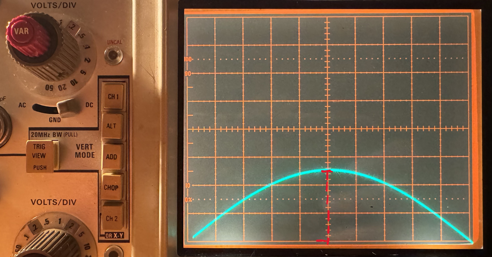

Multiply the vertical deflection by the VOLTS/DIV switch setting to achieve your instantaneous voltage. In this example, the VOLTS/DIV setting is set to 20 mV.

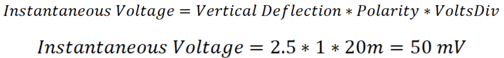

## Time Measurements

### Time Duration Measurements

This measurement example uses one channel.

To measure the time duration, obtain a normal sweep display of a voltage of your choosing. Center the wave vertically and set the time/div position to enable a single wave as wide as possible visible on the screen. Measure the horizontal distance between the two points where the wave starts and ends. It helps to center your first point of measurement on a graticule line to get a more accurate value. Multiply this measurement by the TIME/DIV knob value. If you are using the X10 button, divide the resulting value by 10.

For example, this wave measures roughly 6.6 graticule lines. The TIME/DIV knob is set to 50 µs, so the time duration is roughly 330 µs.

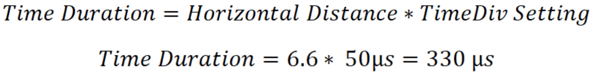

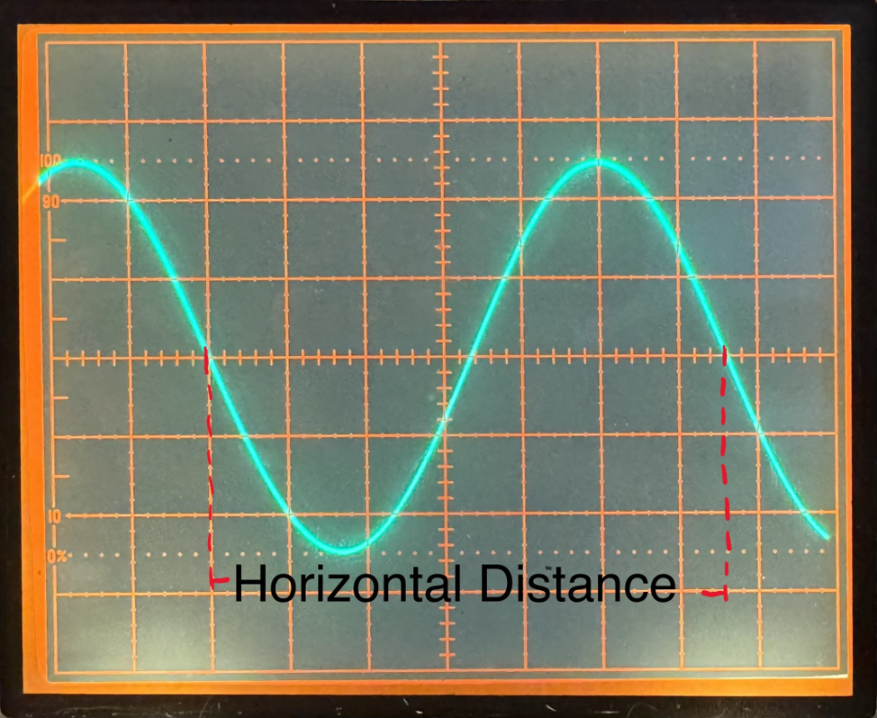

To obtain frequency measurements from a time duration, divide 1 by your result. 

The example above shows a time duration of roughly 330 µs, or 0.00033 seconds. 

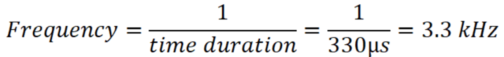

### Time Difference Between Two Pulses Measurements from Different Sources:

This method makes sure that both pulse time delays are accurate. This measurement example uses both channels.

Obtain a normal sweep display for both pulses and center them both, so they overlap. Connect the reference signal to channel 1 and the comparison signal to channel 2. Set the vert mode switch to CHOP for low-frequency signals, and use alt for higher frequency signals. Set the A trigger source to NORM, and set the A trigger SLOPE to either positive or negative, and the A trigger LEVEL to just under 0. 

If one of your waves is "running" when switching to channel 1 on the A trigger SOURCE, you can sync your trigger by connecting a BNC cable to the SYNC output on both of your function generators.

Make sure both pulses are of equal frequency and time delay. You can make your reference pulse 50% of your comparison pulses for better visualization. In the example below, both waves are of equal amplitude.

Since you are finding the time distance between two points, the time difference equation is the same equation as the time duration equation. To obtain this, measure the horizontal difference between both pulses and divide this distance by the TIME/DIV knob. 

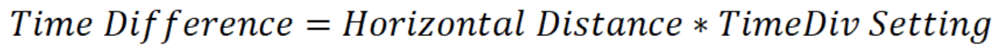

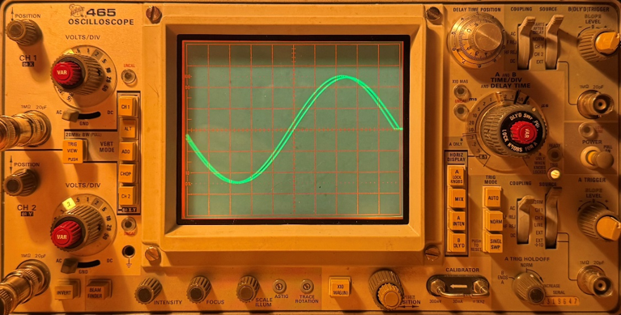

For the example below, we will be using the X10 MAG button. We measure 2.2 graticules for the horizontal distance and 50 µs for the time division. The result will be divided by 10 since the X10 button is being used. We obtain the following measurement:

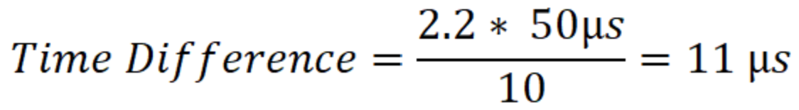

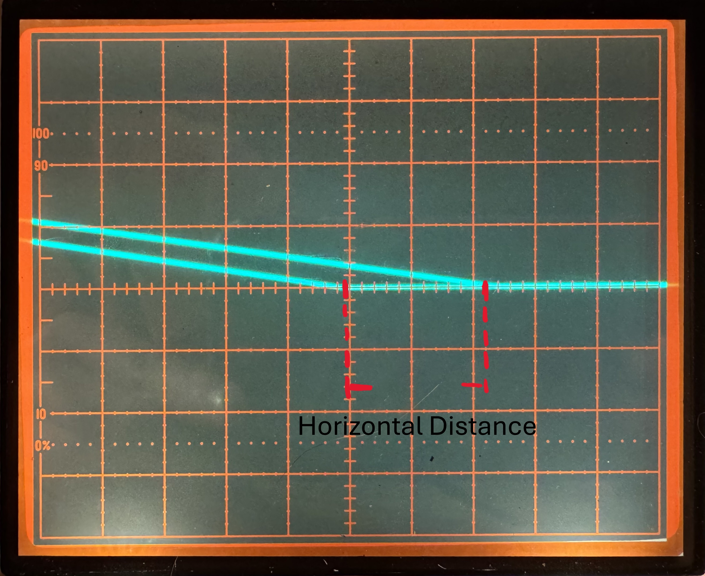

### Rise Time Measurements

Risetime measurements use the 10% and 90% graticule lines on the screen. This measurement example uses one channel.

Obtain a normal sweep display, and set the A slope to +. Set the VOLTS/DIV setting to 5 divisions, and the TIME/DIV setting to display multiple cycles so you can see the top and bottom of each cycle. Vertically position the wave so that the bottom of the entire wave touches the 0% dotted graticule line, and the top of the entire wave touches the 100% dotted graticule line.

Next, set the TIME/DIV setting to the widest setting that can be managed. The example below shows a square wave of about 9 kHz in frequency and an amplitude of 1 V. 0.05 or 0.1 µs works for the TIME/DIV setting. Measure the distance between where the wave hits the 10% and 90% graticule lines. It helps to line up one point with your center graticule line. This will give you the total risetime.

The example below is using a square wave with a frequency of 9 kHz and a voltage of 1 V. The TIME/DIV setting is set to 0.05 µs, and the X10 MAG button is used for better resolution.

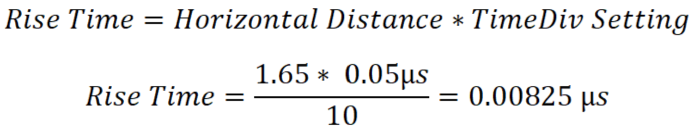

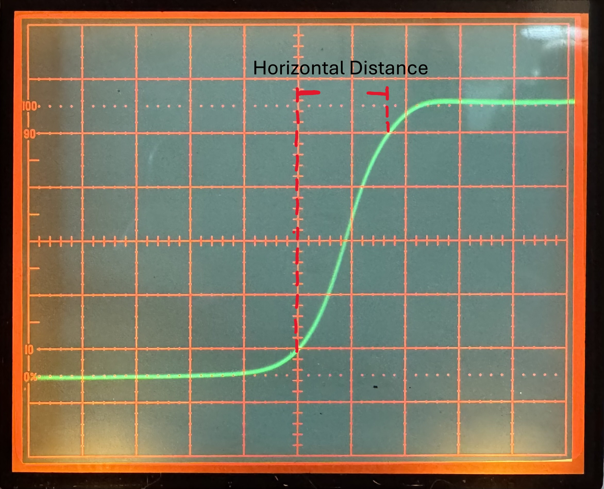

## Phase Difference

Measuring the phase difference is similar to measuring the time difference. Instead, the phase difference accounts for the phase degree based on how many graticules a full wave cycle spans. This measurement example uses both channels.

First, use CHOP or ALT mode, and set the A TRIGGER SOURCE switch to channel 1. Use coaxial cables that have equal time delay to connect the signals to the input connectors. If the signals are opposite in polarity, use the INVERT pushbutton to invert the channel 2 display. Set the channel 1 and Channel 2 VOLTS/DIV switch and the channel 1 and channel 2 VAR controls so the displays are equal in amplitude. It does not matter if either channel is properly calibrated. The horizontal measurement is the desired value, not the amplitude.

Set the TIME/DIV knob so that your wave spans about eight or ten graticules. The example below shows 1 full cycle across 8 divisions, giving a sweep rate of 45 degrees per division. This is because one cycle will span 360 degrees, and 360 divided by 8 is 45. If you are spanning your waves across ten divisions, you should calculate your answers with 35 degrees per division. Theoretically, a cycle spanning any number of divisions will work with the applied degree-per-division calculation. A measurement spanning 8-10 graticules will provide a more accurate result. 

The two points being measured below are positioned at the left edge of the negative 4th graticule and on the right edge of the positive 4th graticule. Measure the horizontal difference between two corresponding points on the waveform and multiply the distance measured (in divisions) by 45 degrees per division (sweep rate) to obtain the phase difference.

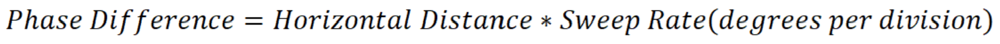

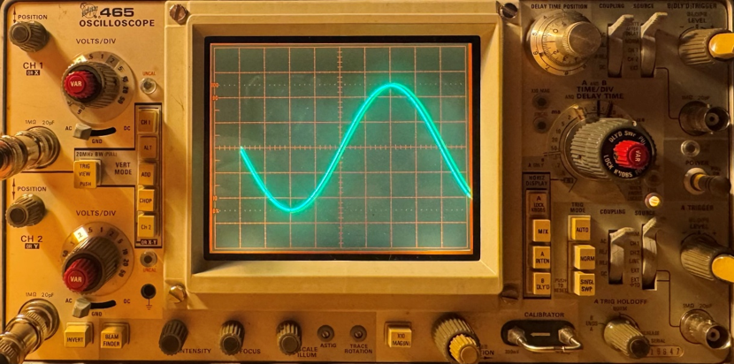

Simply observing the wave like this probably won't give you an accurate measurement, so use the X10 magnification button to get a more accurate display. If using this method, make sure to divide the resulting sweep rate by 10. 

In the example below, the cycle spans 8 divisions and has an X10 magnification measurement of 1.2 graticules. 

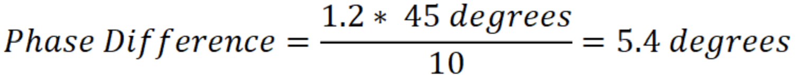

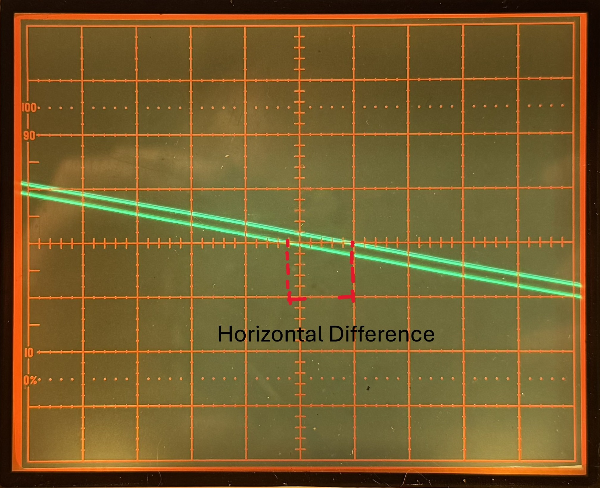

## A and B Time Delay

The A and B time-delay knob is very useful to measure your wave, create separate triggers, and view the effects of one wave on another wave. For most of your initial measurements, you have been using the A TIME/DIV delay options. The B sweep is an added function to delay your initial A sweep. Both sweeps have COUPLING, SOURCE, and TRIGGER controls. 

### Mixed Sweep Display

First, familiarize yourself with the mixed sweep display. This measurement example uses one channel.

1. Obtain a normal sweep display.
2. Pull out the B TIME/DIV knob and turn clockwise to the desired sweep rate.
3. Set the HORIZ DISPLAY switch to MIX. The display now contains two sweep rates. The first portion of the display should be set to the A sweep rate, and the second portion of the display should be set to the B sweep rate, as seen below. The start of the B sweep rate portion can be changed by adjusting the DELAY TIME POSITION control.

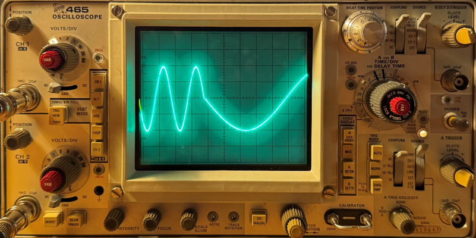

You can also use this function to use CH 2 frequency as a trigger. To do this, switch the A trigger SOURCE to channel 1, and A TRIGGER LEVEL to 0. Switch the B trigger SOURCE to CH 2 and B TRIGGER LEVEL to where you see a moving wave. 

To start, down below are the A and B time delays, the first one untriggered and the second one is triggered.

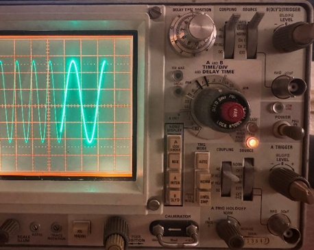 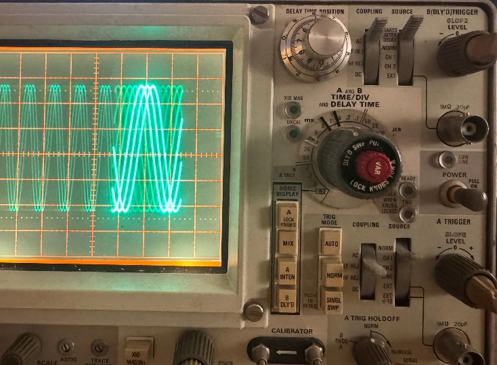

You can use this basic function and the X10 MAG button to zoom in on portions of your wave.

If you set B trigger SOURCE to NORM, you can use the DELAY TIME POSITION dial to display segments of the wave. Using the A TRIGGER LEVEL and the B TRIGGER LEVEL, you can set where your wave segment triggers. The A TRIGGER LEVEL controls the right side of the B trigger, and the B TRIGGER LEVEL controls the left side of the B trigger.

### Magnified Sweep starts after Delay

The magnified-sweep-starts-after-delay function controls the level and range of magnification on a wave more precisely than with the X10 MAG button. This function allows a portion of the input wave to be selected with the DELAY TIME position dial, using the B delay function. This measurement example uses one channel.

1. Obtain a normal sweep display.
2. Set VERT mode to whichever channel is being used, and set the VOLTS/DIV to produce a display about 4-5 divisions in amplitude.  
3. Making sure HORIZ DISPLAY is set to A LOCK, shorten the A time delay so the display shows 1-2 complete waveforms. 
4. Now, set the HORIZ DISPLAY switch to A INTEN. Switch the B trigger SOURCE to “STARTS AFTER DELAY”, and B trigger COUPLING to AC. Set the B TRIGGER SLOPE to positive and the B TRIGGER LEVEL to 0. 
5. Scroll to the right end of your wave, and the highlighted portion of the wave will be visible. Use the DELAY TIME POSITION dial to select the portion of the wave needing to be magnified. 
6. Unlock and use the B DELAY TIME, pull out on the TIME/DIV main dial, and rotate to the right. On the A INTEN HORIZ display,  the highlighted portion becomes smaller the more the TIME/DIV dial rotates to the right.
7. View the magnified wave by setting the HORIZ display to either MIX or B OLY'D. Mix allows for the main wave and the highlighted portion to be visible sequentially. The highlighted portion will be expanded according to the TIME/DIV delay selected. B DLY'D allows only shows the expanded highlighted section.
8. Time measurements can be made as listed above. Just make sure to use the correct sweep rate when calculating. Amplitude measurements are made in the same way as stated above.
9. To find the magnification rate, divide the A TIME/DIV setting by the B TIME/DIV setting. 

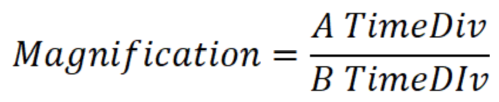

A INTEN display with 2 ms A sweep and 50 µs B sweep

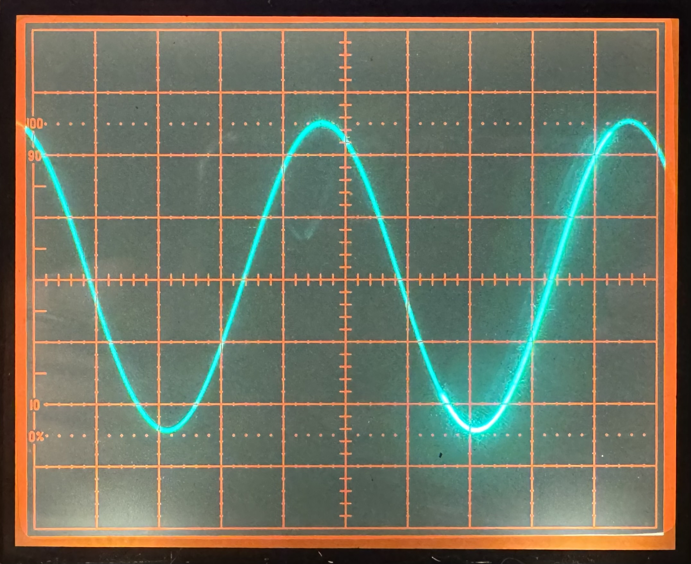

MIX Display with 2 ms A sweep and 50 µs B sweep

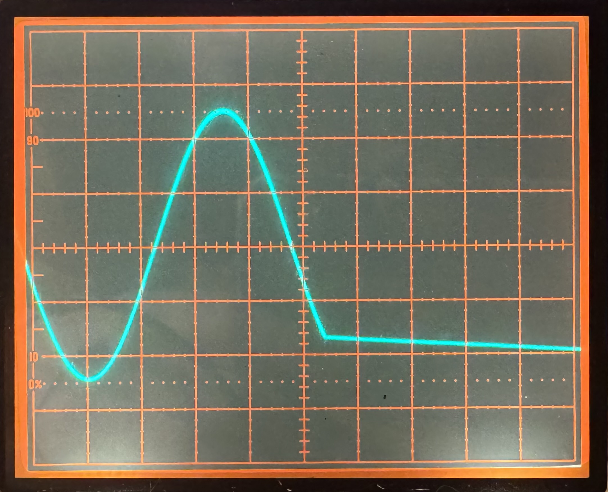

Magnification of A and B sweep in terms of seconds:

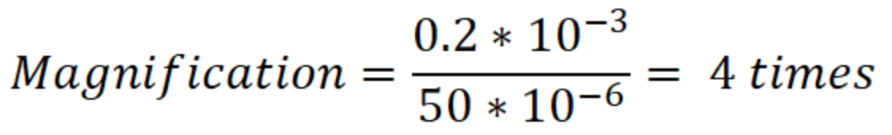

The B sweep is magnified 4 times more than the A sweep.

### Triggered delayed sweep magnification

The triggered delay sweep magnification allows for a far more stable wave to be visible, canceling out much of the jitter seen with the method above. This measurement example uses one channel.

1. Follow steps 1 through 6 in the section above.
2. Set the B trigger SOURCE to the same position as the A trigger SOURCE. 
3. Adjust the B TRIGGER LEVEL control so the intensified zone on the trace is visible or stable. If the highlighted zone is not visible, increase the amplitude or A TIME/DIV. Check that the X10 MAG button is not pushed. If these methods don't work, trigger the B sweep externally.
4. Once the correct portion is highlighted, select B DLY'D or MIX to view the selected display.

All measurements made in this mode are identical to those obtained with delayed-sweep magnification.

## Time difference between repetitive pulses

This section describes how to use the DELAY TIME POSITION dial as a form of measurement. This measurement example uses one channel.

1. Obtain a normal sweep display.
2. Set the B TIM/DIV to the fastest sweep speed that views the usable intensified zones.
3. Set the HORIZ DISPLAY to A INTEN and use the DELAY TIME POSITION dial to move the intensified zone to the first pulse. Note the position of the DELAY TIME POSITION dial. This will be your "First dial setting".
4. Set the HORIZ DISPLAY switch to B DLY'D and adjust the TIME DELAY TIME POSITION dial to move the pulse to a vertical reference line. Turn the DELAY TIME POSITION dial clockwise to move the second pulse to the same vertical reference line. Note the position of the DELAY TIME POSITION dial. This will be your "Second dial setting". Do not change the position or fine controls. If several pulses are displayed, set the HORIZ DISPLAY back to A INTEN to locate the correct pulse. 

The time difference is found using the following formula:

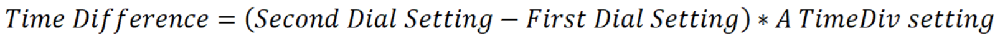

For example, below, there are two square pulses. The small, highlighted dot shown is the B time-delay section, which segments out the rise of the first pulse. Below is a view of the pulse in A INTEN mode.

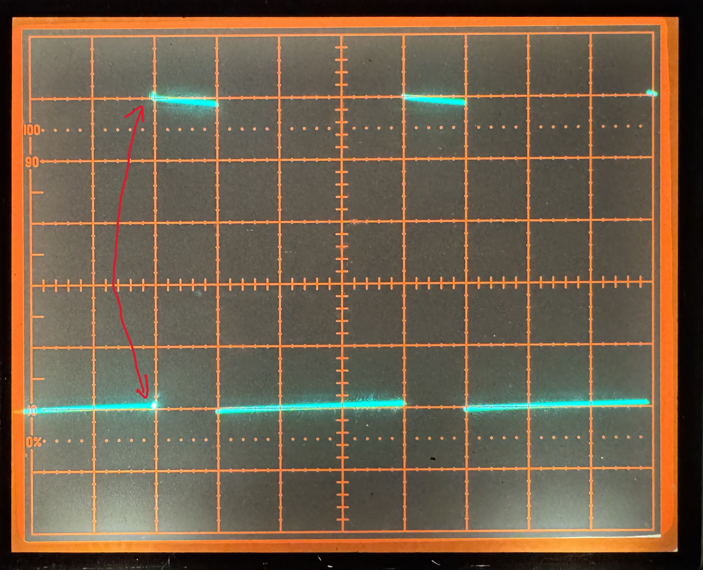

Switch the HORIZ DISPLAY of B DLY'D and align the pulse line with some vertical reference line, as shown below.

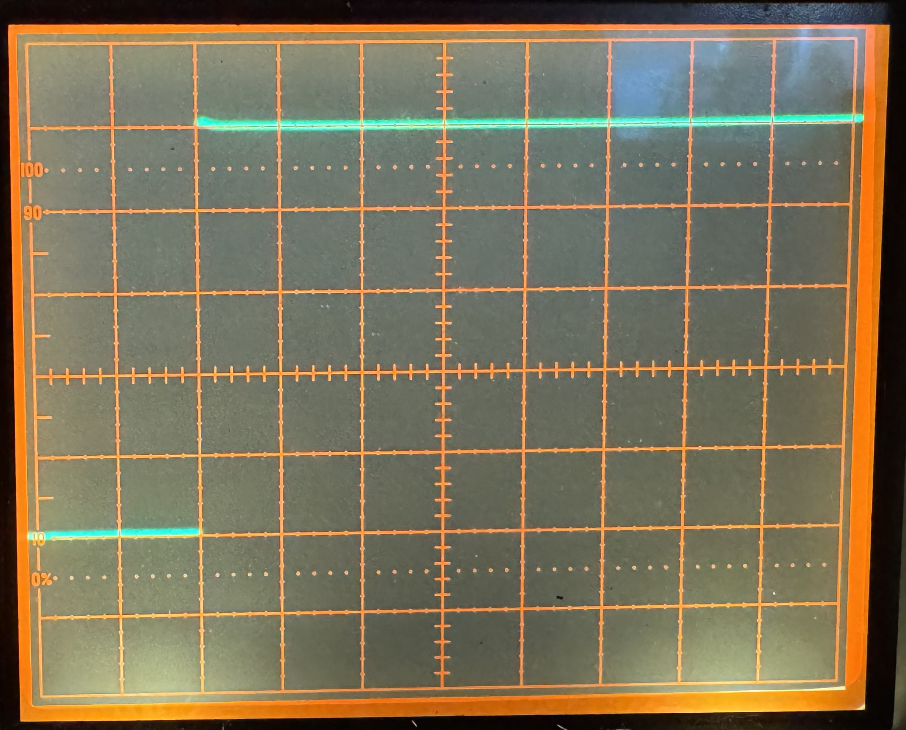

 The first delay time position dial shows 3.95. Turning the dial clockwise, using the same vertical graticule line reference for the rise of the second pulse, the DELAY TIME POSITION dial shows 7.95. With an A time delay of 0.5 ms, the time difference equation gives us the following:

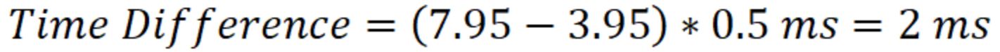

# Appendix

## Input Output connectors

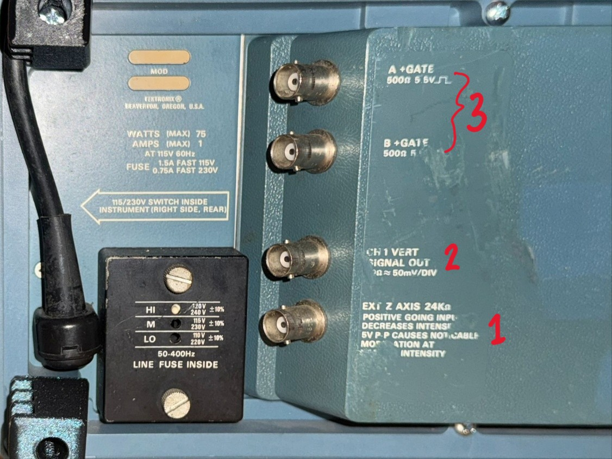

### Inputs

<u>**Front Panel:**</u>

<u>Channel 1 (CH 1) and Channel 2 (CH 2):</u>

Channel 1 and channel 2 inputs are the main input connectors for the oscilloscope. When in X-Y mode, channel 1 acts as the X connector and provides the horizontal deflection. Channel 2 acts as the Y connector and provides the vertical deflection.

<u>Channel 1 (CH 1) and Channel 2 (CH 2) Trigger</u>

These inputs allow for external trigger signals to apply to the A or B sweep, respectively. 

<u>**Rear Panel:**</u>

<u>EXT Z-Axis (1):</u>

The EXT Z-Axis input connector allows for further control and modulation of the intensity of the CRT display. Do not exceed more than 100 V plus peak for DC or 100 V peak to peak for AC, at 1 kHz. 

### Outputs

<u>**Rear Panel:**</u>

<u>Channel 1 Vert Signal Out (2)</u>

This output takes the channel 1 signal input and normalizes it to 50 mV per division. If you have a high voltage going into the scope, you can use this output to connect to another scope or circuit to guarantee a low or attenuated voltage for testing or safety purposes.

<u>A + and B+ GATE (3):</u>

This output connector provides a positive-going rectangular pulse coincident with the A sweep time and the B sweep time, respectively. 

## Controls, Connectors, and Indicators:

### Vertical

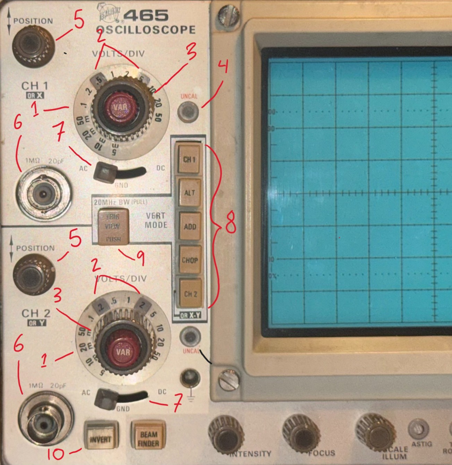

1. Ch 1  and Ch 2 VOLTS/DIV:

- Selects the vertical deflection factor in a 1-2-5 sequence (VAR control must be in the calibrated detent for the indicated deflection factor).

2. VOLTS/DIV readout:

- Two small maps for each channel. Either lamp will light up to indicate the correct deflection factor when a probe with a scale-switching connector is used. Probe without the connector lights the X1 lamp.

3. VAR:

- Provides continuously variable uncalibrated deflection factors between calibrated settings of the VOLTs/DIV switch, and extends the maximum vertical deflection to at least 12.5 volts per division.

4. UNCAL Lamp

- Indicated when the VAR VOLTS/DIV control is out of the calibrated detent and the vertical deflection factor is uncalibrated.

5. POSITION:

- Positions display vertically. In x-y mode, ch2 position control positions on the y axis, horizontal positions x.

6. Channel 1 or X and Channel 2 or Y:

- Input connectors for the application of external signals to the inputs of the vertical amplifier. In x-y mode, the signal connected to channel 1 or the X connector is horizontal, channel 2 or the Y connector is vertical.

7. AC-GND-DC

- Selects the method used to couple the signal to the input of the vertical amplifier. In the AC position, signals are capacitively coupled to the vertical amplifier, and the DC input is blocked. In the GND position, the input of the vertical amplifier is disconnected from the input connector and grounded to allow the input coupling capacitor to recharge. In the DC position, all components of the input signal are passed to the input amplifier.

8. VERT MODE:

- Selects the mode of operation for the vertical amplifier system.

  - ALT: Provides dual-trace display of the signals of both channels, for sweep rates faster than 50 µs/division.

  - ADD: Either adds or inverts the signals of both channel 1 and channel 2. This is useful for removing undesired signals.

  - CHOP: Shows the dual-trace display of the signals to both channels. Useful at sweep rates slower than 50 µs/division.

  - CH2: Must be selected in the X-Y operation.

9. 20 MHz BW/Trig view:

- Limits the vertical amplifier system's bandwidth to 20 MHz when pulled, and causes the signal applied to the A trigger generator to be displayed on the CRT when pressed.

10. INVERT:

- The channel 2 display is inverted.

### Display

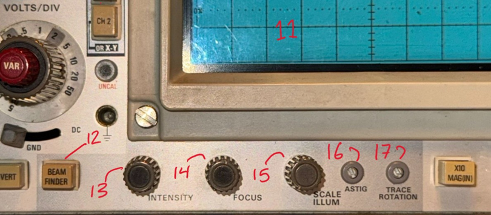

11. Internal Graticule:

- Eliminate parallax. Risetime, amplitude, and measurement point are indicated at the left-hand graticule edge.

12. BEAM FINDER:

- Compresses the display to within the graticule area independently of display position or applied signals. Visible viewing level.

13. INTENSITY: 

- Alters the brightness.

14. FOCUS:

- Adjusts display definition.

15. SCALE ILLUM:

- Controls graticule illumination.

16. ASTIG:

- Used with focus control for a better-defined display.

17. TRACE ROTATION:

- Adjust the trace to align with the horizontal grid lines. The 

### Horizontal, Calibrator, and Power

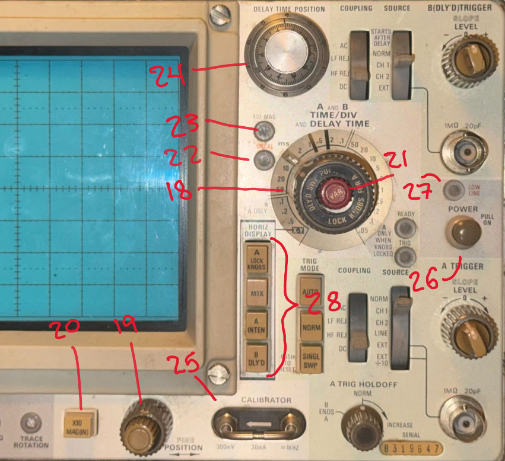

18. Controls TIME/DIV of A and B.

19. Fine/Position: 

- Positions are displayed horizontally for the A and B sweeps.

20. X10 MAG: 

- Increase the displayed sweep rate by a factor of 10. Extends the fastest sweep rate to 1 nanosecond/division. Magnified sweep is the center division of the unmagnified display.

21. Var:

- Provides continuously variable sweep rates between the calibrated setting of the A TIME/DIV knob.

22.  UNCAL lamp:

- Indicates that the A sweep rate is uncalibrated.

23. X10 MAG lamp:

- Indicates that the X10 magnification is on.

24. Delay time position:

- Provides variable sweep delay to more than 10 times the delay time indicated by the A TIME/DIV knob.

25. Calibrator:

- A combination of current loop/square wave voltage output that permits the operator to compensate voltage probes and check vertical gain, current probes, and oscilloscope operation.

26. Power

27. Low line lamp:

- Indicates the applied line voltage is below the lower limit of the regulating range selected by the regulating range selector.

28. Horizontal Display:

- Determines the mode of operation for the horizontal deflection system.

### Trigger

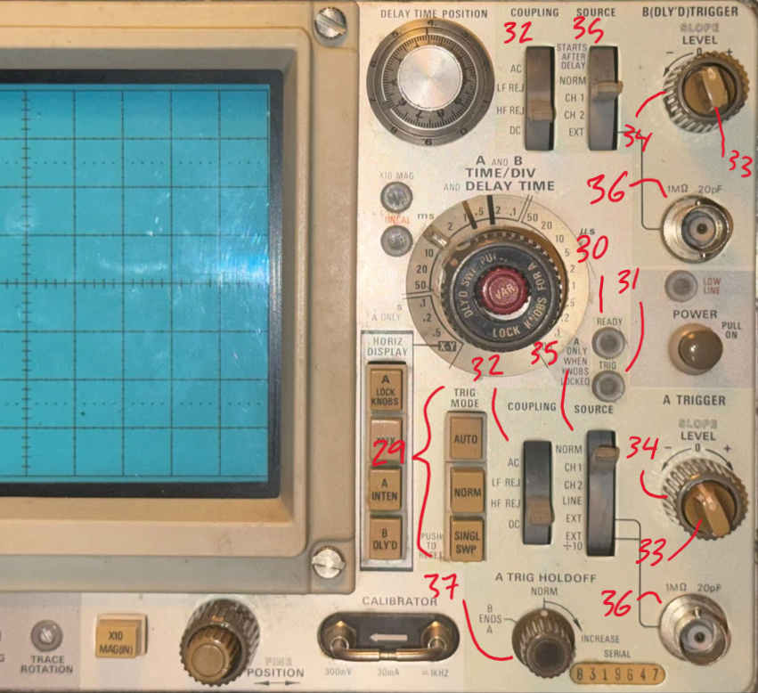

29. Trig Mode:

- Determines the mode of trigger operation for a sweep
  - Auto: Sweep is initiated by the applied trigger signal. If the trigger repetition is less than 20 hertz in the absence, sweep runs free with a bright reference trace.
  - Norm: Sweep is initiated by the applied trigger signal; in the absence of an adequate trigger, there is no trace.
  - SINGL SWP: When the pushbutton is pushed, the A sweep operates in single-sweep mode. After it is displayed, further sweeps cannot be presented.

30. READY lamp:

- Indicates A sweep is “armed” and, upon receiving an adequate trigger, will present a single-sweep display.

31. TRIG lamp: 

- Indicates that the A sweep is triggered and will produce a stable display.

32. Coupling:

- Determines the method used to couple signals to trigger the generator circuit.

  - AC: Signals are capacitively coupled to the input of the trigger circuit. DC is rejected, and signals below 50 kHz are attenuated.

  - LF REJ: Signals are capacitively coupled to the input of the trigger circuit. DC is rejected, and signals below 30 Hz and above 50 kHz are attenuated.

  - DC: All components of a trigger signal are coupled to the input of the trigger circuit.

33. Slope:

- Selects the slope of the trigger signal that starts the sweep

  - +: Sweep can be triggered from the positive-going portion of a trigger signal.

  - -: Sweep can be triggered from the negative-going portion.

- Correct slope setting is important in obtaining a display when only a portion of a cycle is being displayed.

34. Level:

- Selects the amplitude point on the trigger signal at which the sweep is triggered. It is usually adjusted for the desired display after trigger source, coupling, and slop have been selected.

35. Source:

- Determines the source of the trigger signal coupled to the input of the trigger circuit.

36. External Trigger Inputs:

- Input connectors for external trigger signals.

37. trig holdoff:

- Provides continuous control of time between sweeps, allowing triggering on aperiodic signals. A sweep is reset at the end of the B sweep to provide the fastest possible sweep repetition.
