# Detailed Info on How to Use a Hewlett-Packard 3312A Function Generator:

This post helps a user go through the basic functions of the Hewlett-Packard HP 3312A Function Generator. Through feedback and surveys, this post will be updated to include more complex functions and questions on how to use this device for an activity. 

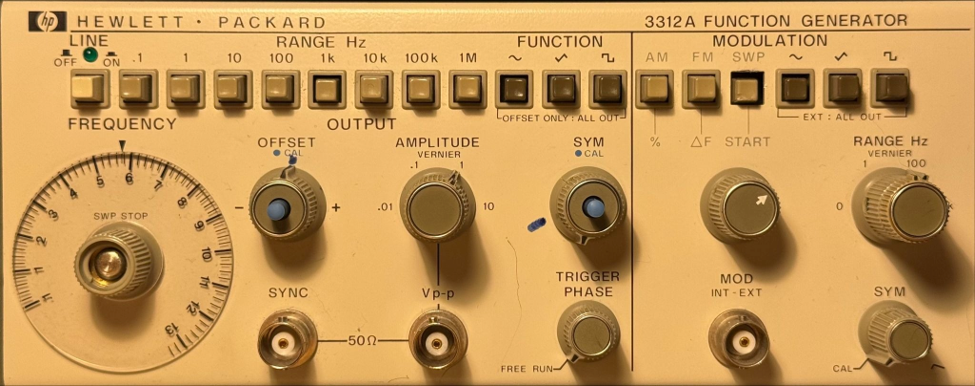

# Important Reference Links:

If there are any questions, please refer to the following sources below and if they are not answered, please feel free to comment below the last video of our YouTube tutorial.

Operation Manual Link

Service Manual

# Equipment

The equipment below is required for testing and using on circuits. With functions generators, especially with an older model like this one, it is highly recomended use an oscilloscope to ensure your measurements and outputs are correct, unless you test to maintain consistent accuracy for a prolonged period of time.  The equipment below is all that you will ever need for a function generator to use with a circuit, but is much more than what you need to test a function generator. 

50 ohm feedthrough adapter

This will be used for 

2-3 BNC cables

BNC tee adapter

BNC Test adapter

Known working multimeter

Known working oscilloscope

# Powering On

When powering on the machine, you must be very mindful on the power being received by the device. This device does not have an automatic power regulator like most devices today, but must be manually changed according to your outlet device. 

First, use a known working multimeter to measure the voltage coming out of your power outlet. Second, on the back of the HP 3312A, there are two switches. The first one is for smaller voltages, 100V and 120V. The second one has large ones of 240V and 220V. For the first switch, as shown below, has two setting. 

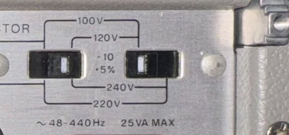

Switch it to the left hen your voltage is closer to 100 volts of 220 volts, and switch it to the left when your voltage is closer to 120 volts and 240 volts. The second switch determines the higher or lower setting, switch it to the left when your voltage is closer to 100 volts and 120 volts, and to the right when your voltage is closer to 220 volts and 240 volts. If your voltage is between these values, estimate to the closest value.

After you have confirmed that your device will not blow up, set your knobs to the positions as seen below, with all buttons set in the out position. This ensures that when you are testing your generator, you can see how each button works with a default standard.

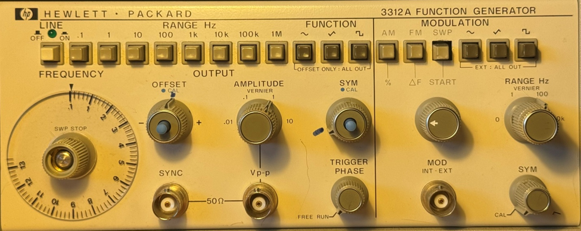

This function generator has markings to show the default position of that function. Please refer to the testing section for more information on how to calibrate your generator. 

# Functions

This function generator has 3 functions to use.  For this demonstration, I am using a DSOX1102G Keysight digital oscilloscope. The first universal step is to connect your function generator to a known working oscilloscope with a BNC cable and a 50 ohm feedthrough adapter. The 50 ohm adapter should be connected to the oscilloscope, and not the function generator. This helps with monitoring output, and even though it is not always necessary with newer models, older models usually need the converter. We will explore this later on.

## Square Waves

You want to start with your square wave because this will help you calibrate and visualize wave inaccuracies. 

### AC coupling for Square Waves

1.)  Set your coupling to AC on the oscilloscope

2.)  Press the square function button,  

3.)  Press the 1 Range Hz button 

4.)  Set AMPLITUDE to 1

5.)  Keep TRIGGER PHASE to free run. 

6.)  Set FREQUENCY from 1-6.

7.)  Use the horizontal knob to adjust visual to about 300-1.5 V/div

8.)  Use the vertical knob to adjust your visual to about 20-100 ms/div

If you see sloping such as this:

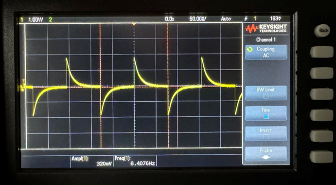

This is great! Your wave should look like this on un-scaled AC coupling output. Simply switch your coupling to DC. It should now look like this:

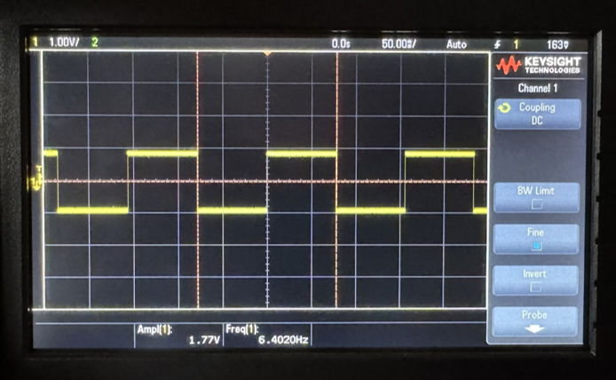

Dc should be used for very low ranges, ≥100 Hz, while AC should be used for ≤100 Hz. 

For the following examples, the frequency is set to 6. See Button Functions in the Appendix for more information on Range and Frequency.

### DC coupling for Square Waves

Next, once you are set on DC coupling, change the following buttons to the corresponding values for expected displays and range accuracy:

Press 1 range Hz, oscilloscope vertical set to 200 mV/div and horizontal to 50 ms/div:

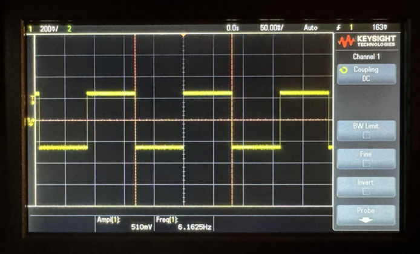

Press 100 range Hz, oscilloscope vertical set to 200 mV/div and horizontal to 500 µs/div:

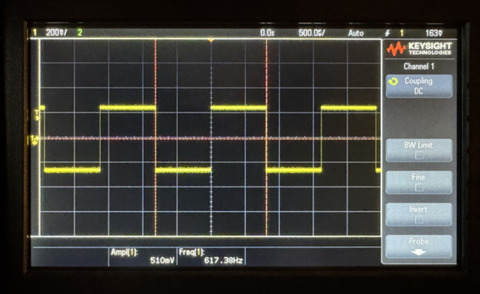

Press 100k range Hz, oscilloscope vertical set to 200 mV/div and horizontal to 500 ns/div:

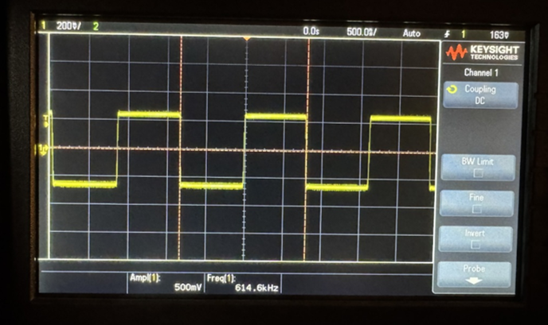

Press 100k range Hz, oscilloscope vertical set to 200 mV/div and horizontal to 500 ns/div, without the 50 ohm adapter:

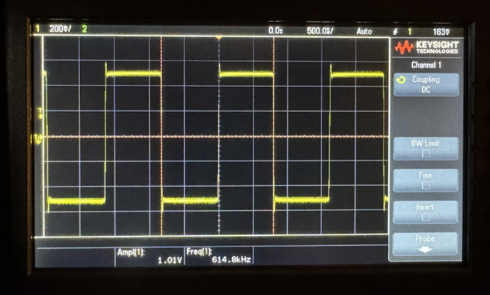

As you can see, the amplitude doubles, and due to the lack of dampening that the converter provides, a small tick in the wave is shown consistently.

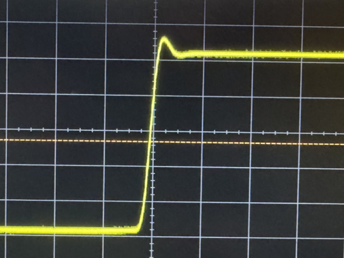

Here is a zoomed in photo of that tick, this is unwanted, so having this adapter provides a nice cushion of accuracy for your wave, to keep a clean wave within your circuit.

## Sine Waves

To set up a sine wave function on your oscilloscope, the principles are similar if not the same as the square function. 

### AC coupling for Sine Waves

1.)  Set your coupling to AC on the oscilloscope

2.)  Press the sine function button, 

3.)  Press the 1 Range Hz button 

4.)  Set AMPLITUDE to 1

5.)  Keep TRIGGER PHASE to free run. 

6.)  Set FREQUENCY from 1-6.

7.)  Use the horizontal knob to adjust visual to about 300-1.5 V/div

8.)  Use the vertical knob to adjust your visual to about 20-100 ms/div

For the following examples, the frequency is set to 6.

### DC Coupling for Sine Waves

Press 1 range Hz, oscilloscope vertical set to 200 mV/div and horizontal to 50 ms/div:

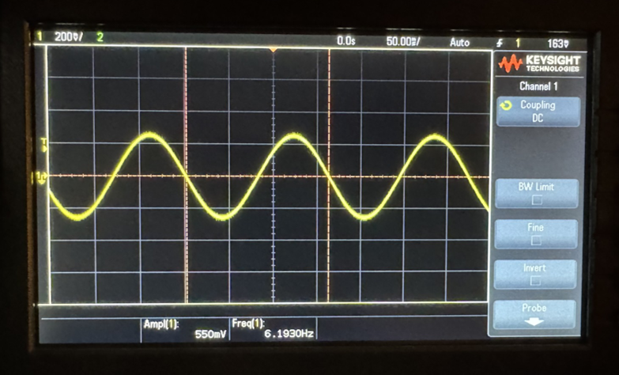

Press 100 range Hz, oscilloscope vertical set to 200 mV/div and horizontal to 500 µs/div:

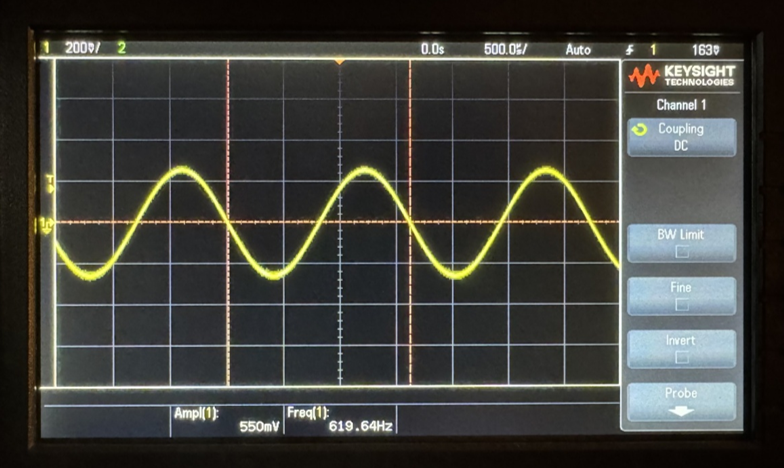

Press 100k range Hz, oscilloscope vertical set to 200 mV/div and horizontal to 500 ns/div:

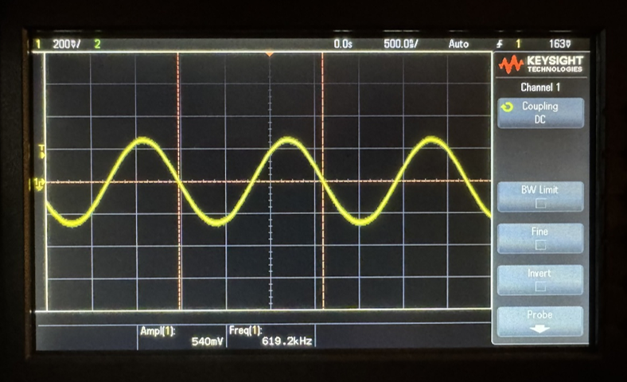

Press 100k range Hz, oscilloscope vertical set to 200 mV/div and horizontal to 500 ns/div, without the 50 ohm adapter:

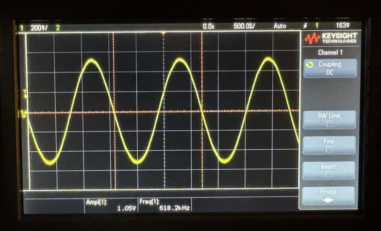

Zoomed in photo of tick, slight dip in sine wave left wave peak leading into a “squiggle”.

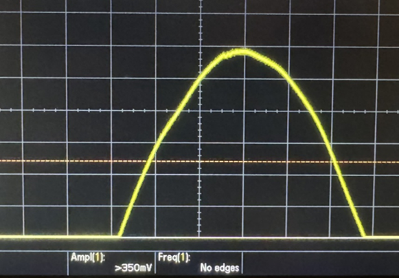

## Triangle Waves

To set up a triangle wave function on your oscilloscope, the principles are similar if not the same as the square function. 

### AC coupling for Triangle Waves

1.)  Set your coupling to AC on the oscilloscope

2.)  Press the sine function button, 

3.)  Press the 1 Range Hz button 

4.)  Set AMPLITUDE to 1

5.)  Keep TRIGGER PHASE to free run. 

6.)  Set FREQUENCY from 1-6.

7.)  Use the horizontal knob to adjust visual to about 300-1.5 V/div

8.)  Use the vertical knob to adjust your visual to about 20-100 ms/div

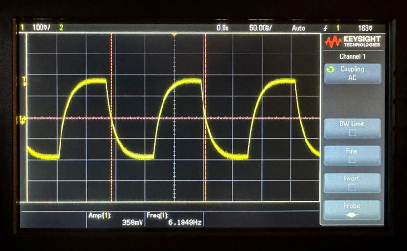

Set with at a range of 1 Hz, and a frequency of 6. 

### DC Coupling for Triangle Waves

Press 1 range Hz, oscilloscope vertical set to 200 mV/div and horizontal to 50 ms/div:

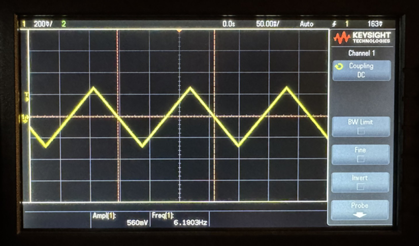

Press 100 range Hz, oscilloscope vertical set to 200 mV/div and horizontal to 500 µs/div:

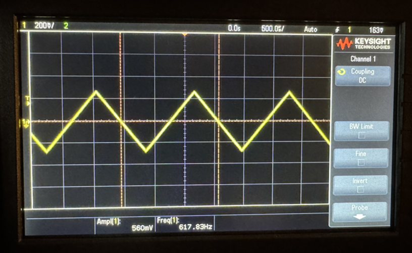

Press 100k range Hz, oscilloscope vertical set to 200 mV/div and horizontal to 500 ns/div:

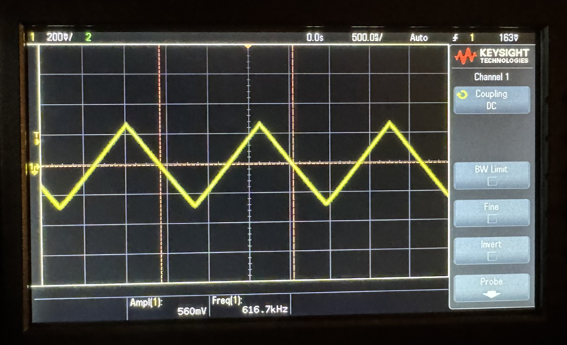

Press 100k range Hz, oscilloscope vertical set to 200 mV/div and horizontal to 500 ns/div, without the 50 ohm adapter:

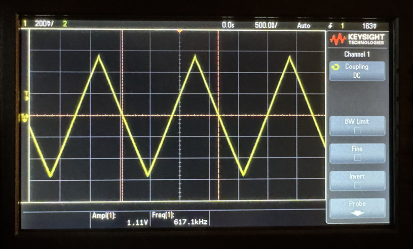

Zoomed in photo of tick. Slightly dips in the right side of the wave.

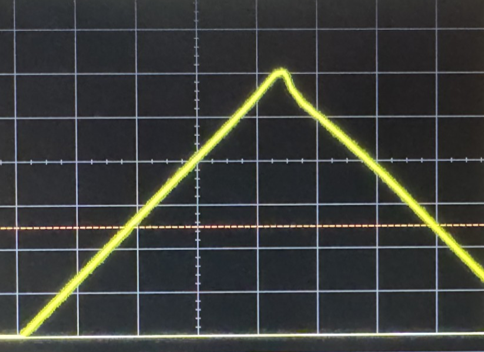

# Modulation

For modulation, you can use the modulation output to see the modulation wave that is affecting your carrier wave. This can be helpful to physically see how your wave is being affected. 

The Range Hz knob adjusts the range of the modulation function, slowing down or speeding up the overall modulation of the main function.

The Delta F START knob affects amplitude of the modulation function, affecting how far the function changes in the Y direction for AM, and the X direction for FM and Sweep.

The SYM nob affects the symmetry of the modulation wave. Dissimilar to symmetry knob interaction with the regular functions, the SYM knob for modulation only effects the second half of the modulation, and cannot affect both directions.

## AM

AM, or amplitude modulation is a signal modulation mainly used in electronic communication like in radio and audio waves. AM works by using a modulating wave to alter the magnitude of the carrier wave.

<u>AM Sine:</u>

To use the AM modulation function, start with selecting the sine function and sine modulation. Adjust Delta F START and range for desired results. SYM modulation must be in the calibrated position. Zooming out to see the overall signal should show you the best representation of this modulation, and zooming in shows how the wave itself is affected. 

Below are all possible combinations of functions with AM modulation. Compare with your own device.

Sine modulation – Sine Function:

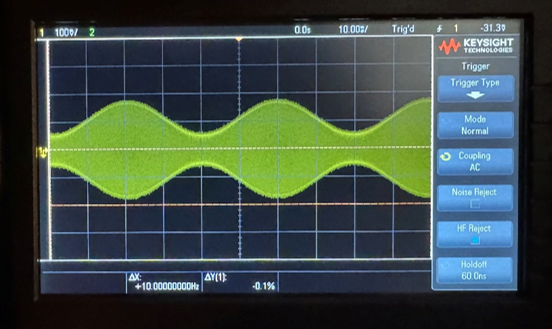

Sine modulation – Triangle Function:

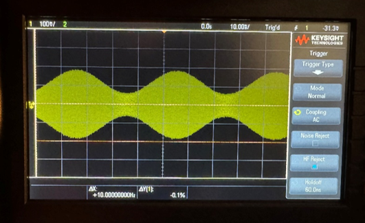

Sine modulation – Square Function:

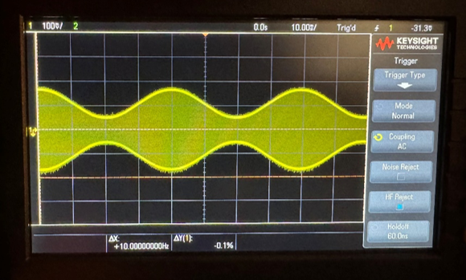

<u>AM Triangle:</u>

Triangle modulation – Sine Function:

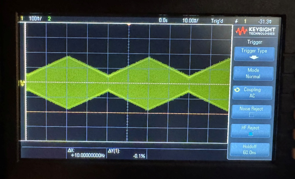

Triangle modulation – Triangle Function:

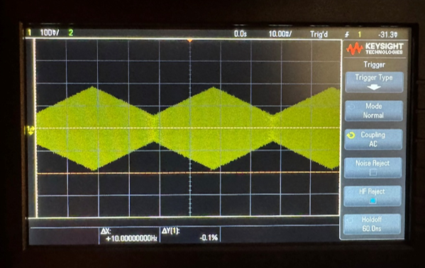

Triangle modulation – Square Function:

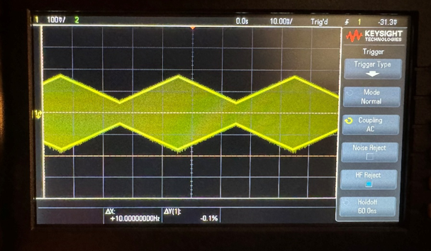

<u>AM Square:</u>

Square modulation – Sine Function:

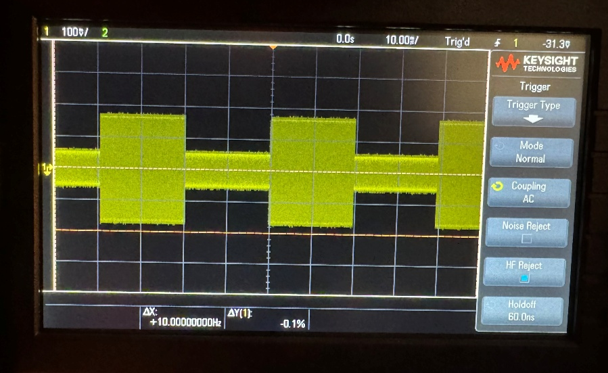

Square modulation – Triangle Function:

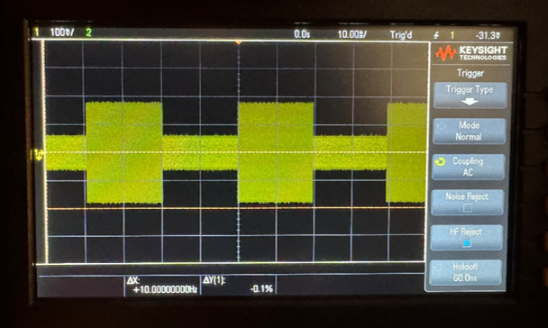

Square modulation – Square Function:

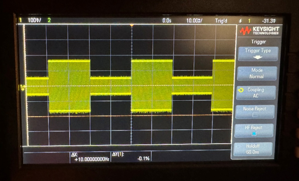

## FM

To use the FM modulation function, start with selecting the sine function and sine modulation. Adjust Delta F START and range for desired results. SYM modulation must be in the calibrated position. This modulation effects the horizontal components, so zooming out on a slower modulation will show a slight trend, although the proper way to view this modulation is at the normal viewing standard.

Compare each function modulation with your own device. Each Function is using sine modulation.

<u>FM Sine:</u>

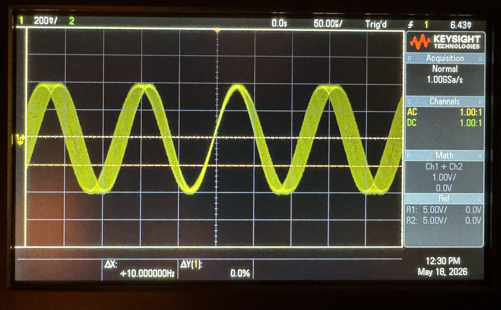

<u>FM Triangle:</u>

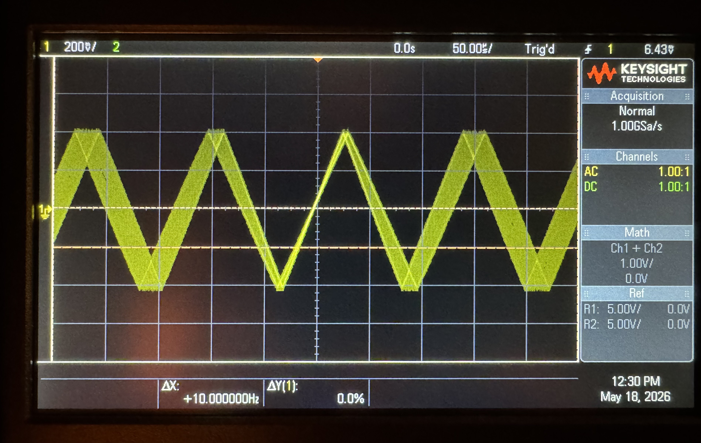

<u>FM Square:</u>

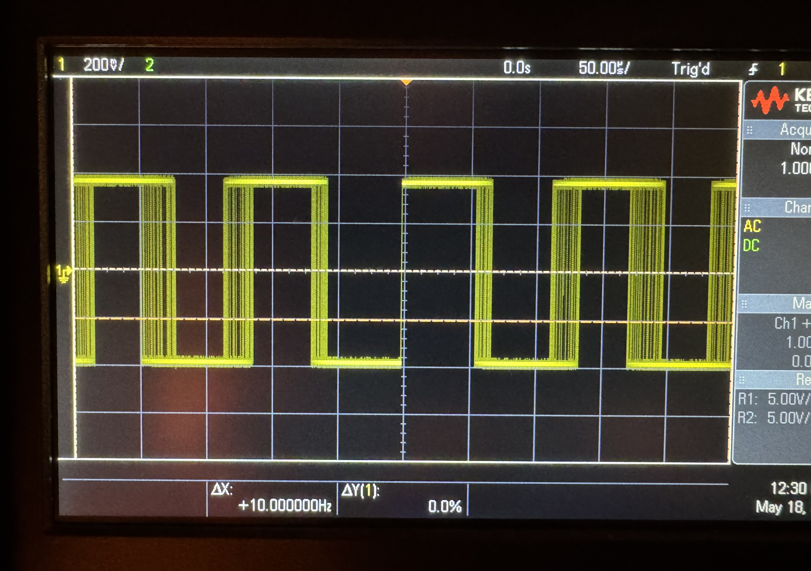

## Sweep

The Sweep modulation function is mainly used for testing a circuit and its response to rapidly changing frequency over time. To use the Sweep modulation function, start with selecting just the sine function, and making sure Delta F is set to its lowest point or 0. 

1. Set the stop frequency with the FREQUENCY dial
2. Press the SWP button
3. Set RANGE HZ to 0
4. Set the start frequency with the Delta F
5. Adjust the RANGE Hz and Vernier for repetition rate
6. Adjust the retrace line with modulation SYM dial.

Compare each function modulation with your own device. 

<u>Sweep Sine:</u>

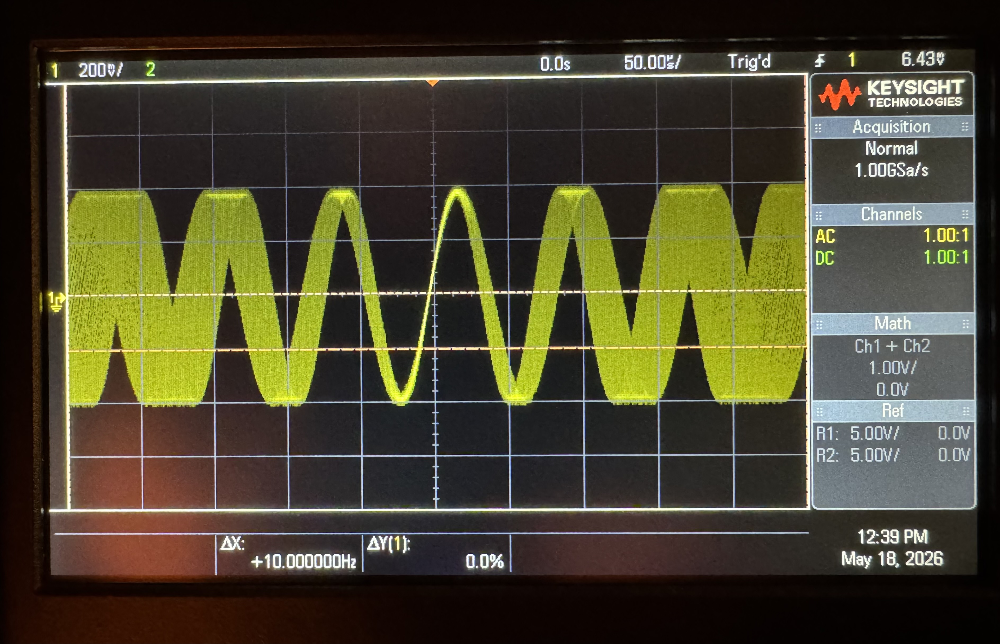

<u>Sweep Triangle:</u>

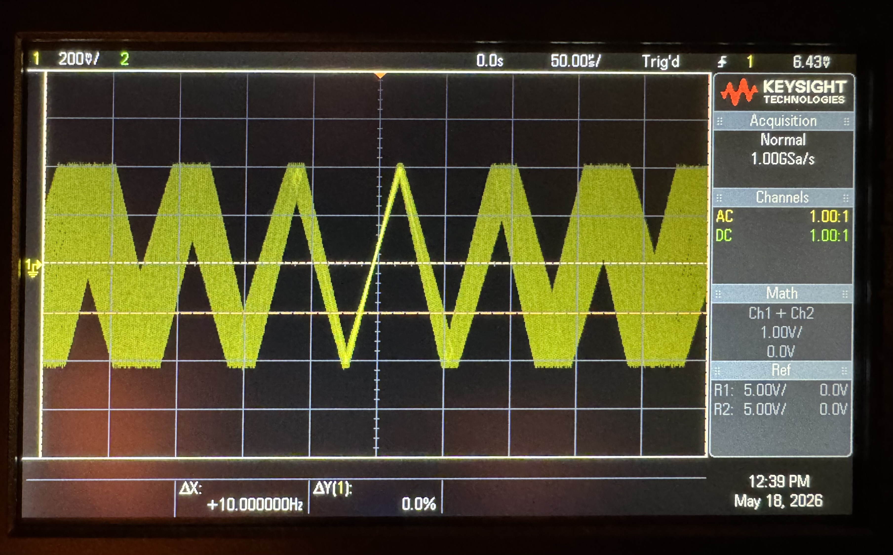

<u>Sweep Square:</u>

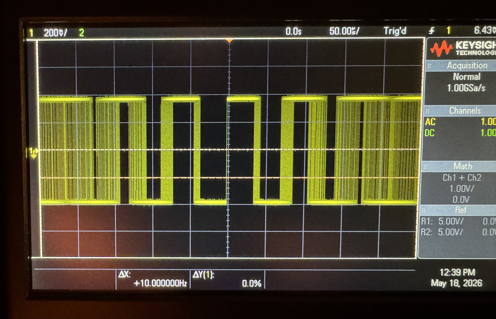

# Pulses

Pulses can be done I single burst or multiple, depending on your configured settings. To initiate pulses:

1.)  Set the rear panel bottom switch to INT

2.)  Set the rea panel top switch to either single or multiple. 

3.)  Rotate the Trigger Switch to desired phase

4.)  Using the FREQUENCY dial, set desired frequency

5.)  Using RANG HZ button on the modulation section to set desired repetition rate. 

Below are Single and Multiple Pule examples, with set buttons and dials for each example:

## Single Pulse

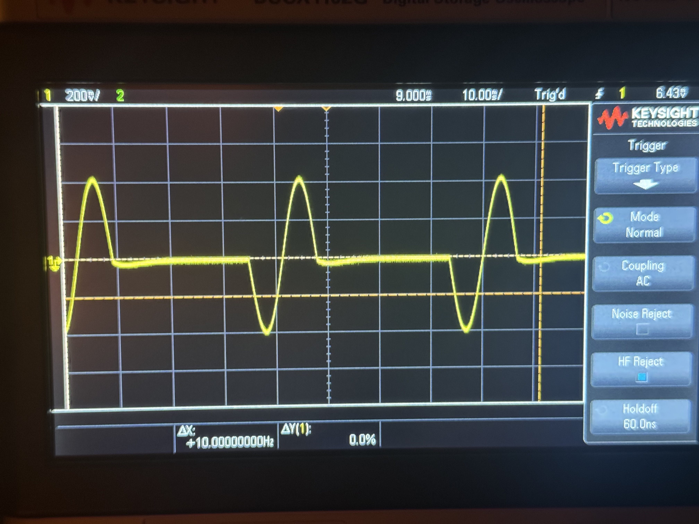

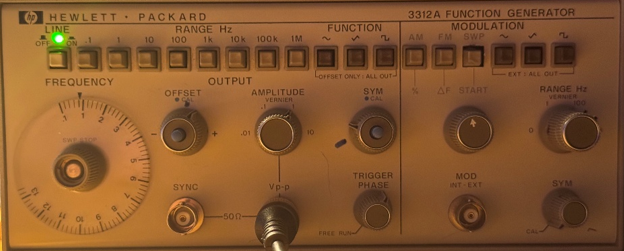

## Multiple Pulse

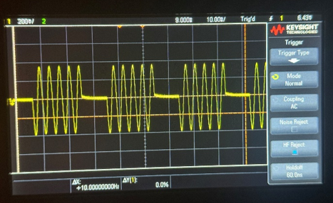

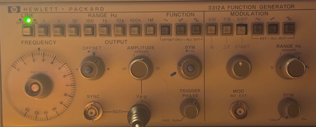

For the multiple option, the RANGE HZ button works best in the 100 mode, although don’t be shy to use other options. This was the easiest option to use for most range buttons.