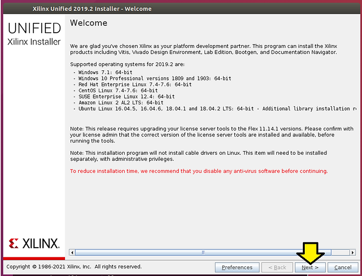
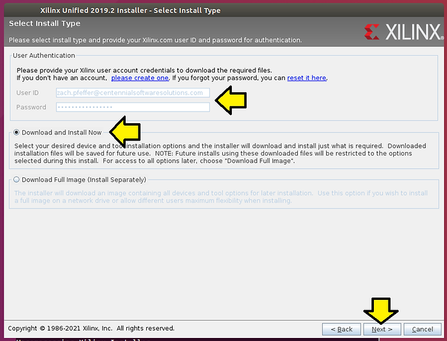
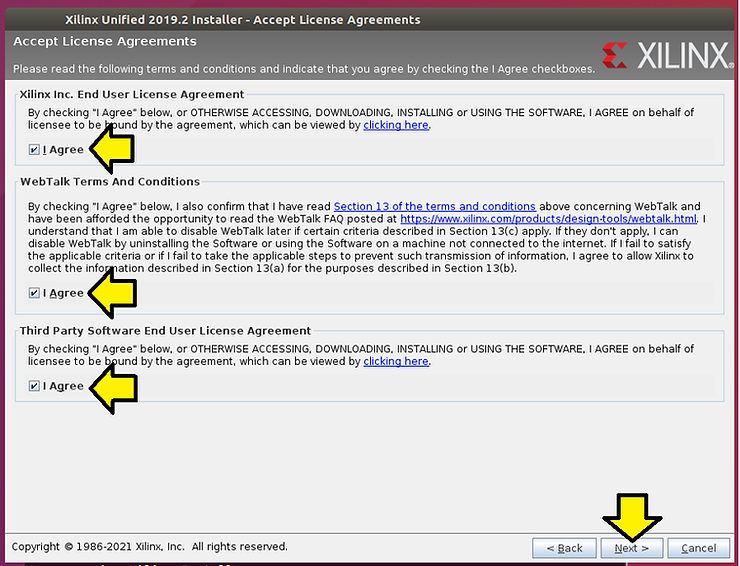
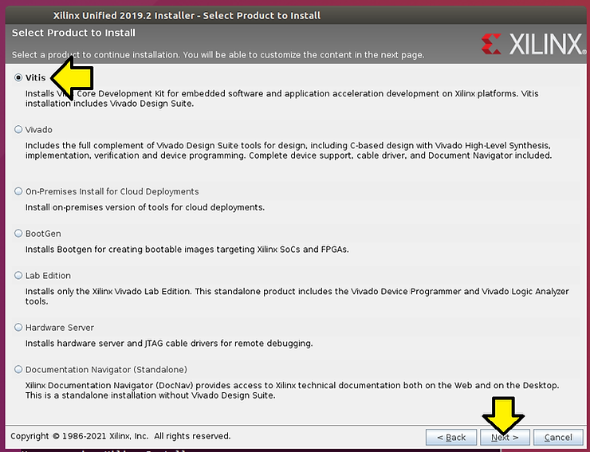
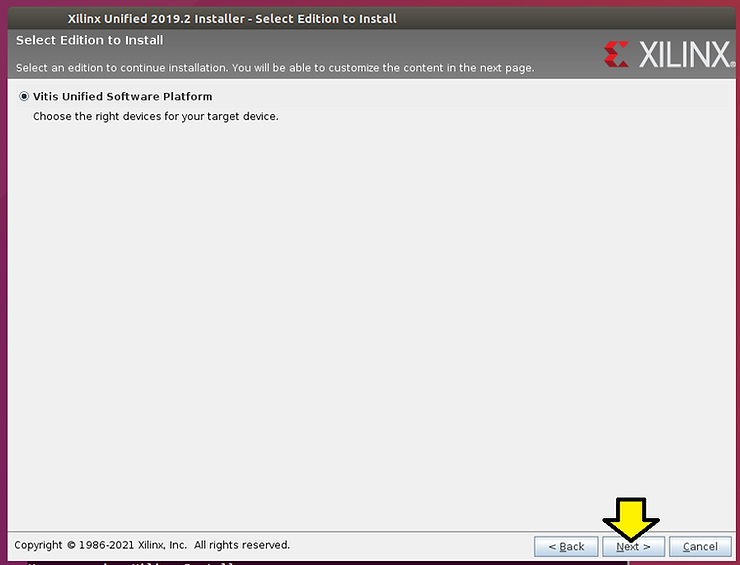
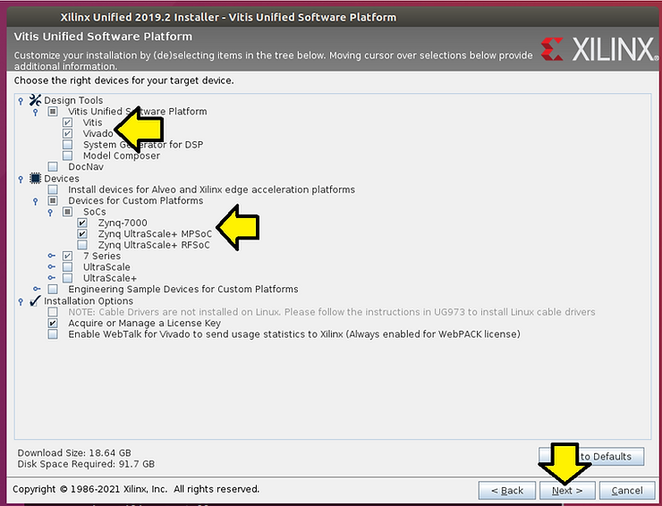
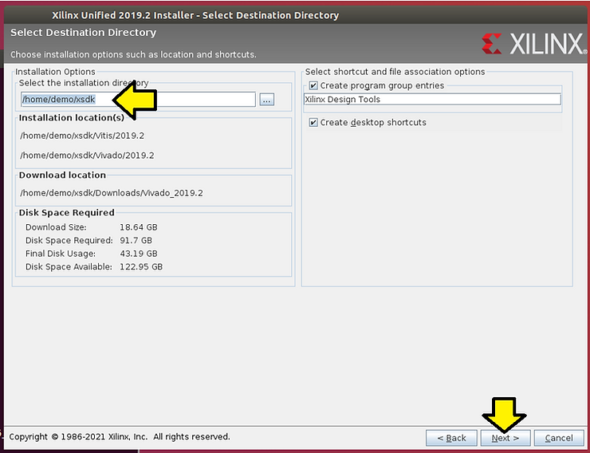
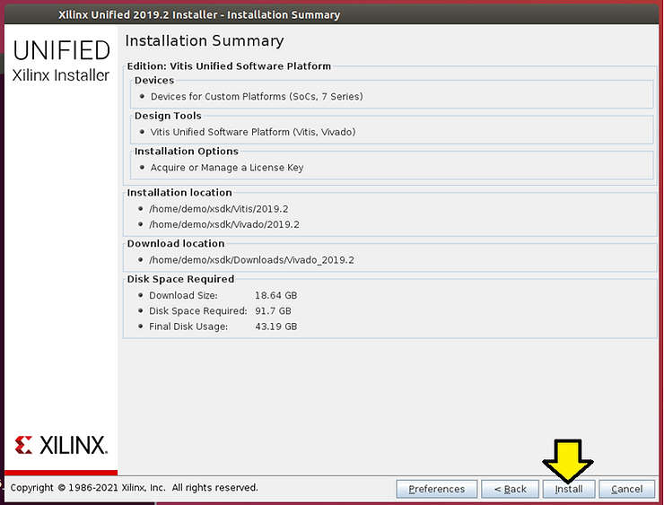
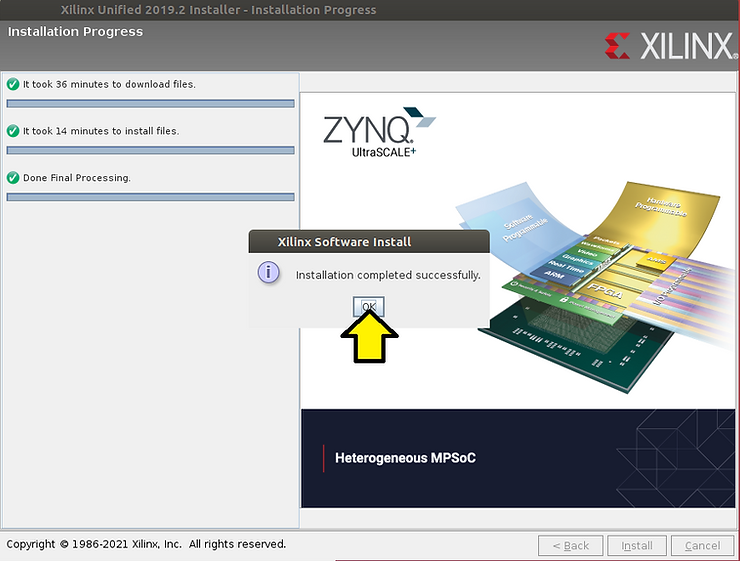
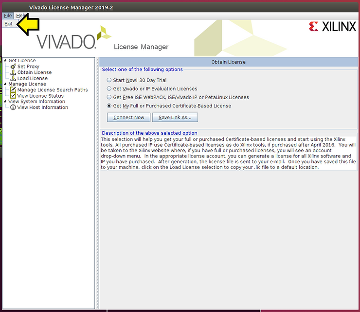

# Install 2019.2 Vitis on Ubuntu 16.04.5

This post demonstrates an install of Vitis 2019.2 on Ubuntu 16.04.5.

**<u>Steps</u>**

[#1](https://www.centennialsoftwaresolutions.com/blog/hashtags/1) Go to

https://www.xilinx.com/support/download/index.html/content/xilinx/en/downloadNav/vitis/archive-vitis.html

[#2](https://www.centennialsoftwaresolutions.com/blog/hashtags/2) Download:

Xilinx Unified Installer 2019.2: Linux Self Extracting Web Installer (BIN - 115.4 MB) @ https://www.xilinx.com/member/forms/download/xef.html?filename=Xilinx_Unified_2019.2_1106_2127_Lin64.bin 

MD5 SUM Value : b8d415a14a84241bdbae1f6a8a6e9a11

[#3](https://www.centennialsoftwaresolutions.com/blog/hashtags/3) Check install requirements:

https://www.xilinx.com/html_docs/xilinx2019_2/vitis_doc/aqm1532064088764.html 

[#4](https://www.centennialsoftwaresolutions.com/blog/hashtags/4) Run:

**cd /mnt/hgfs/shared**

**./Xilinx\_Unified\_2019.2\_1106\_2127\_Lin64.bin**

[#5](https://www.centennialsoftwaresolutions.com/blog/hashtags/5) Click **Next >** @

[#6](https://www.centennialsoftwaresolutions.com/blog/hashtags/6) Enter your **Xilinx account**, select **Download and Install Now**, and click **Next >** @

[#7](https://www.centennialsoftwaresolutions.com/blog/hashtags/7) Agree to each term and click **Next >** @

[#8](https://www.centennialsoftwaresolutions.com/blog/hashtags/8) Ensure you select **Vitis** and click **Next >** @

[#9](https://www.centennialsoftwaresolutions.com/blog/hashtags/9) Click **Next >** @

[#10](https://www.centennialsoftwaresolutions.com/blog/hashtags/10) For just doing Zynq-7000 and Zynq UltraScale+ MPSoC development select these options and click **Next >** @

[#11](https://www.centennialsoftwaresolutions.com/blog/hashtags/11) Install to **/home/demo/xsdk** and click **Next >**

[#12](https://www.centennialsoftwaresolutions.com/blog/hashtags/12) In another terminal type **df -h** to ensure you have enough room

Example:

/dev/sda1 216G 93G 113G 46% /

[#13](https://www.centennialsoftwaresolutions.com/blog/hashtags/13) Click **Install** @

[#14](https://www.centennialsoftwaresolutions.com/blog/hashtags/14) Click **OK**

[#15](https://www.centennialsoftwaresolutions.com/blog/hashtags/15) Close the Vivado License Manager 2019.1 by clicking **File > Exit**

**<u>References</u>**

Vitis 2019.2 Docs @ https://www.xilinx.com/support/documentation-navigation/design-hubs/2019-2/dh0089-vitis-embedded.html

Xilinx logo clipped from [xilinx.com](http://xilinx.com/) 