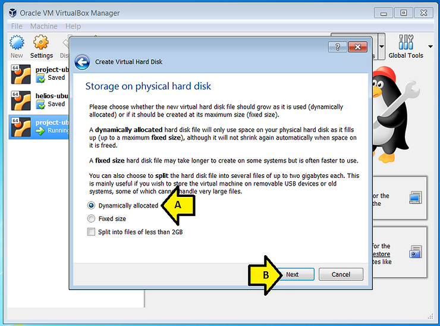
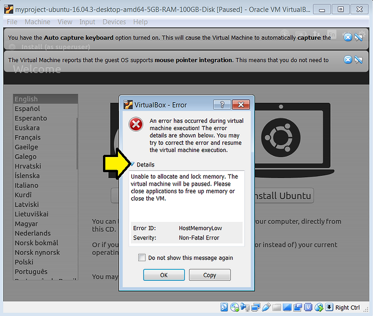

# Install 64bit Ubuntu 16.04.3 on a VirtualBox 5.2.12 Managed Virtual Machine Running on Windows 7 SP1

This post shows you how to install 64-bit Ubuntu 16.04.3 on a VirtualBox 5.2.12 managed virtual machine running on Windows 7 SP1.

Click \[[<u>here</u>](https://www.centennialsoftwaresolutions.com/blog/download-and-install-virtualbox-5-2-12-and-the-virtualbox-extension-pack-on-windows-7-pro-sp1)\] if you need to know how to download VirtualBox 5.2.12 and install it on Windows 7 SP1.

**<u>Create the Virtual Machine</u>**

**1.** Create a folder called **isos** in **C:\\**

If you need help creating a folder on Windows 7 SP1 click \[[<u>link</u>](https://www.centennialsoftwaresolutions.com/blog/create-a-folder-in-c-in-windows-7-sp1)\] for instructions.

**2.** Download Ubuntu 16.04.3 (filename: ubuntu-16.04.3-desktop-amd64.iso, size 1.47 GB) at \[[<u>link</u>](http://old-releases.ubuntu.com/releases/16.04.3/ubuntu-16.04.3-desktop-amd64.iso)\] to **C:\\isos**

**3.** Run VirtualBox

A) Click the Windows icon

B) Type **VirtualBox**

C) Click **Oracle VM VirtualBox**

**4.** Click **New**

**5.** Set **Name and operating system**

A) Set **Name:** to **myproject-ubuntu-16.04.3-desktop-amd64-5GB-RAM-100GB-Disk**

B) Set **Type:** to **Linux**

C) Set **Version: to Ubuntu (64-bit)**

**Note:** if you don't see **Ubuntu (64-bit)** you may need to enable virtualization technology in your BIOS, click \[[<u>here</u>](http://www.zachpfeffer.com/single-post/2017/02/15/Installing-the-64-bit-PC-AMD64-desktop-image-of-Ubuntu-16041-LTS-Xenial-Xerus-in-Oracle-VM-VirtualBox-5114-running-in-Windows-7-Professional-Service-Pack-1-CurrentBuild-7601-on-a-ThinkPad-T460-model-20FNCTO1WW-with-an-IntelR-CoreTM-i7-6600U-CPU)\] for instructions on a T460 that may help you enable this in the BIOS of your computer.

D) Click **Next**

**6.** Set Memory size to **5120 MB** by (A) typing **5120** into the **MB field** and (B) clicking **Next**

**7.** (A) Leave **Create a virtual hard disk now** selected and (B) click **Create**

**8.** (A) Select **VMDK (Virtual Machine Disk)** and (B) click **Next**

**Note:** VMDK files can be used on other virtual machines and products: VMware, Parallels Desktop, Sun xVM, QEMU, SUSE Studio, Norton GHOST and ILookIX and the .NET DiscUtils Open Source C# library.

**9.** (A) Leave **Dynamically allocated** selected and (B) click **Next**

**10.** (A) Set the size of the disk to **100 GB** (it won't use 100 GB right away because the disk grows dynamically) and (B) click **Create**

**<u>Install Ubuntu on the Virtual Machine</u>**

**1.** Open the virtual machine's settings window

A) Select **myproject-ubuntu-16.04.3-desktop-amd64-5GB-RAM-100GB-Disk**

B) Right-click on **myproject-ubuntu-16.04.3-desktop-amd64-5GB-RAM-100GB-Disk**

C) Select **Settings...**

**2.** Tell the virtual machine where the Ubuntu ISO is

A) Select **Storage**

B) Click **Empty**

C) Click on the disc drop down

D) Select **Choose Virtual Optical Disk File...**

**3.** Find the Ubuntu ISO

A) Select **C:\\**

B) Double-click **isos**

**4.** Select the ISO

A) Select the **ubuntu-16.04.3-desktop-amd64.iso** file

B) Click **Open**

**5.** Check the settings and click OK

A) Check under **Controller: IDE**

B) Check the **Location**

C) Click **OK**

**6.** With **myproject-ubuntu-16.04.3-desktop-amd64-5GB-RAM-100GB-Disk** Click **Start**

**Possible Error**

If you see this error (click the triangle to expand the error message):

Close some other programs to free up at least 5 GB of memory.

To check how much memory you have free

A) Press Control-Alt-Delete

B) Click **Start Task Manager**

Check available memory by (A) making sure **Available** memory is over 5 GB

Close the Task Manage by (B) selecting **File** and clicking Exit **Task Manager**

To "clear" the error and try again (A) click File then (B) click **Close...** then

(A) select **Power off the machine** and (B) click **OK**

**7.** Start the install

A) Close the Auto capture keyboard notification

B) Close the mouse pointer integration

C) Click Install Ubuntu

**8.** Click **Continue** on the **Preparing to install Ubuntu screen**

**9.** (A) Leave **Erase disk and install** Ubuntu selected and (B) click **Install Now**

**10.** Click **Continue on the Write the changes to disks?** prompt

**11.** (A) Type where you're from and (B) click **Continue**

**12.** Specify the Keyboard layout

A) Click, hold and grab the window to increase the size

B) Select your keyboard layout

C) Select your language

D) Click **Continue**

**13.** Fill in the **Who are you?** screen

A) Fill in **You name** with your name

B) Fill in **Your computer's name** with the name of the computer

C) Fill in **Pick a username** with a username you'd like to use

D) Enter a password in the **Choose a password** field

E) Enter the same password in the **Confirm your password** field

F) Ensure **Require my password to log in** is selected

G) Click **Continue**

**14.** Wait and monitor the install screens

A screen:

Another screen:

**15.** Click **Restart Now**

**16.** Press ENTER

**17.** Let the machine boot reboot to the first screen and select power off

A) Click **File**

B) Click **Close...**

**18.** Power off

A) Select **Power off the machine**

B) Select **OK**

**<u>Remove the ISO and Start the Virtual Machine</u>**

**1.** Open the virtual machine's settings window

A) Select **myproject-ubuntu-16.04.3-desktop-amd64-5GB-RAM-100GB-Disk**

B) Right-click on **myproject-ubuntu-16.04.3-desktop-amd64-5GB-RAM-100GB-Disk**

C) Select **Settings...**

**2.** Remove the disk

A) Select **Storage**

B) Select **ubuntu-16.04.3-desktop-amd64**

C) Click the CD icon drop down

D) Click **Remove Disk from Virtual Drive**

**3.** Click **OK**

**4.** With **myproject-ubuntu-16.04.3-desktop-amd64-5GB-RAM-100GB-Disk** Click **Start**

You should see:

**5.** Enter your password and press **ENTER**

After about 30 sec's you should see:

Congratulations! You've installed 64-bit Ubuntu 16.04.3 on a VirtualBox 5.2.12 managed virtual machine running on Windows 7 SP1.

**<u>Share and Like</u>**

**Share** and **like** this if you think other people would find it useful!

**<u>References</u>**

-   **VMDK** on **Wikipedia** at \[[<u>link</u>](https://en.wikipedia.org/wiki/VMDK)\]
    
-   Ubuntu logo from \[[<u>link</u>](https://assets.ubuntu.com/v1/57a889f6-ubuntu-logo112.png)\]