# Install and Test Node.js on Windows 10


## Install and Test Node.js on Windows 10

Quickly install and Test Node.js on Windows 10 using this post. Node.js v20.11.1 (LTS) Windows, x86 is used.

## Download & Install

1\. Open https://nodejs.org/en/download

2\. Select v20.11.1 (LTS), Windows, x86:

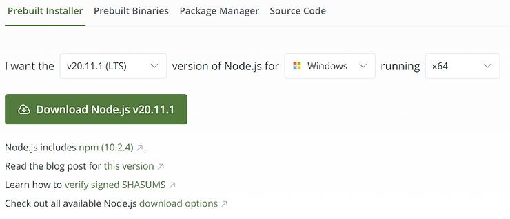

3\. Download [<u><span>node-v20.11.1-x64.msi</span></u>](https://nodejs.org/dist/v20.11.1/node-v20.11.1-x64.msi) (Windows Installer Package) to the **Downloads** folder

4\. Open **Downloads**

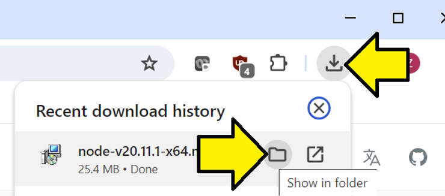

5\. Right-click and select **Install**

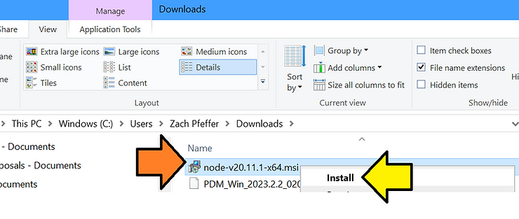

6\. On the **Node.js Setup** screen, click **Next**

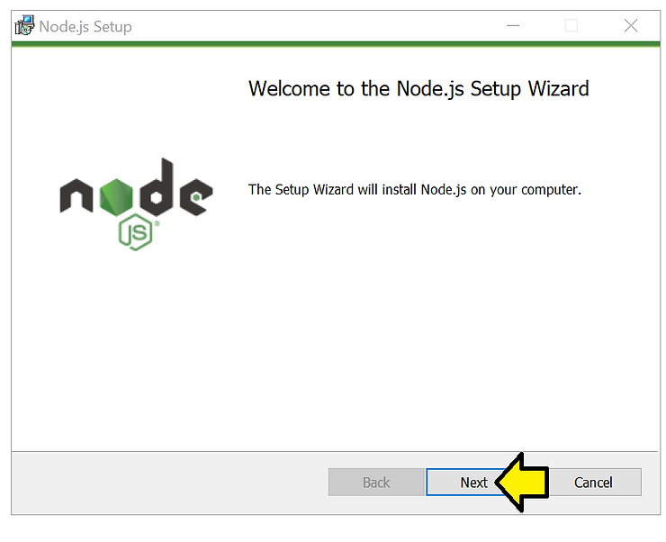

7\. Accept the [License Agreement](https://drive.google.com/file/d/1eadRw2--utEgWFNThkDm77FNNuLVCMtM/view?usp=sharing) and click Next

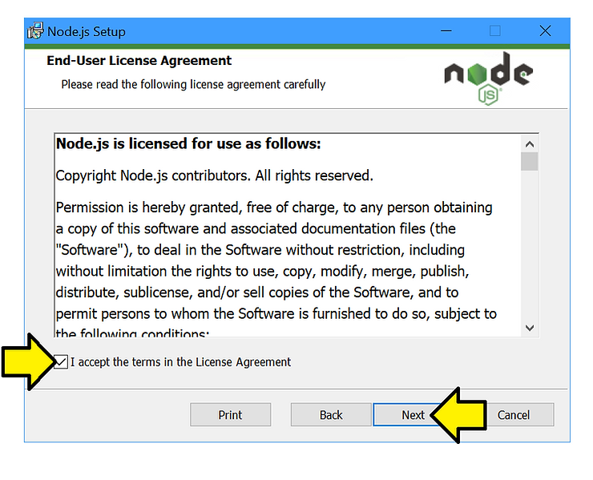

8\. Click Next to install Node.js in the default directory **C:\\Program Files\\nodejs\\**

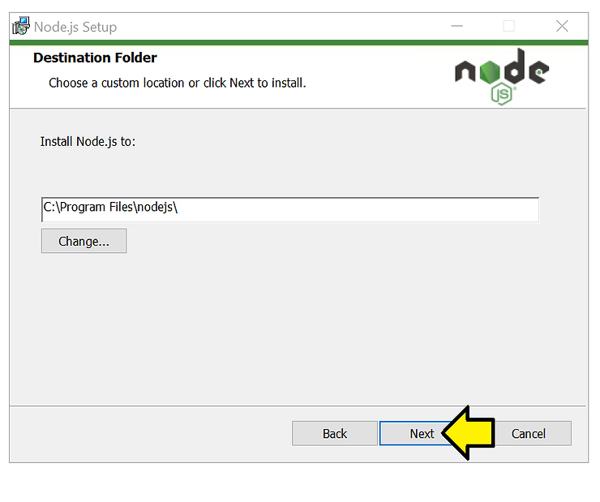

9\. Click Next to install everything:

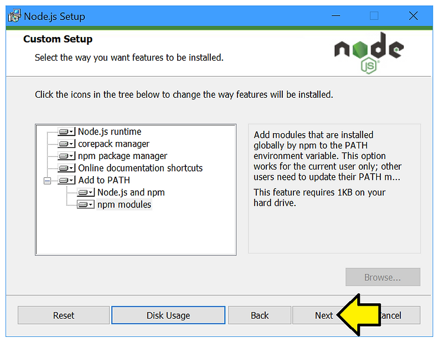

Disk Usage:

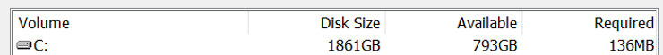

Everything:

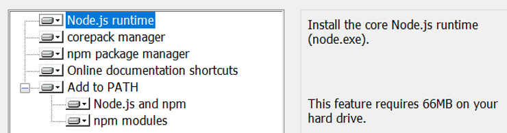

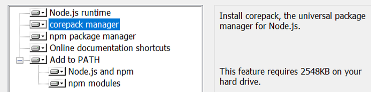

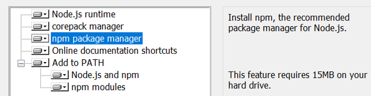

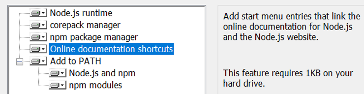

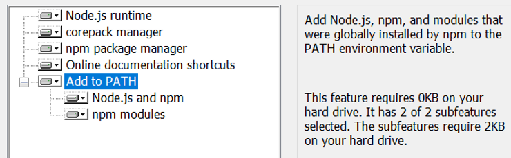


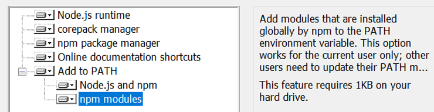

10\. Check the **Automatically install tools...** box and click **Next**

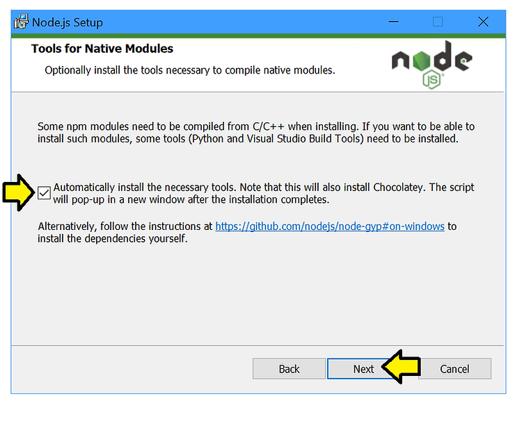

11\. Click **Install**

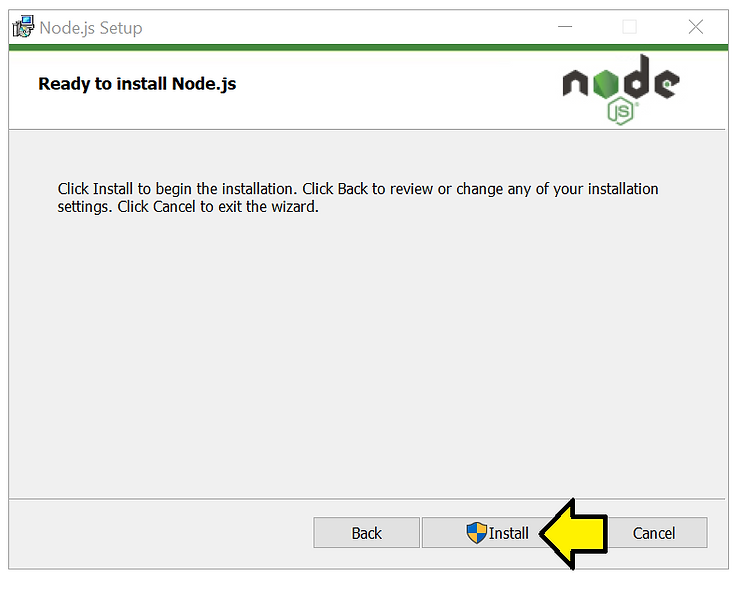

12\. After a time, click **Finish**

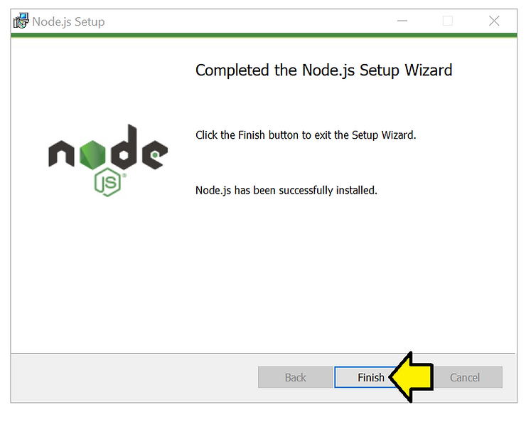

13\. To skip this, close the pop-up. To proceed, close other programs, and hit any key

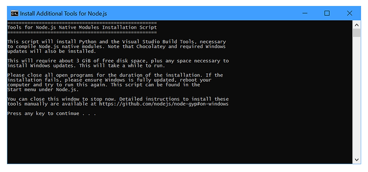

14\. You may see this Chocolatey notification, if so press any key to start the installation

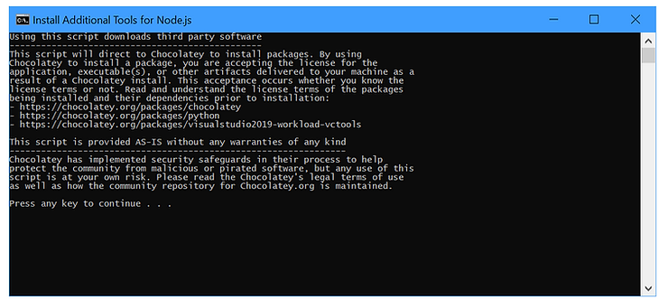

The end of the install [<u><span>log</span></u>](https://drive.google.com/file/d/1earyUI9jIZW47Kbn095M4SCsf8V9J7ec/view?usp=sharing)

```
Chocolatey upgraded 19/19 packages.
 See the log for details (C:\ProgramData\chocolatey\logs\chocolatey.log).

Upgraded:
 - chocolatey-compatibility.extension v1.0.0
 - chocolatey-core.extension v1.4.0
 - chocolatey-dotnetfx.extension v1.0.1
 - chocolatey-visualstudio.extension v1.11.1
 - chocolatey-windowsupdate.extension v1.0.5
 - dotnetfx v4.8.0.20220524
 - KB2919355 v1.0.20160915
 - KB2919442 v1.0.20160915
 - KB2999226 v1.0.20181019
 - KB3033929 v1.0.5
 - KB3035131 v1.0.3
 - python v3.12.2
 - python3 v3.12.2
 - python312 v3.12.2
 - vcredist140 v14.38.33135
 - vcredist2015 v14.0.24215.20170201
 - visualstudio2019buildtools v16.11.34
 - visualstudio2019-workload-vctools v1.0.1
 - visualstudio-installer v2.0.3

Packages requiring reboot:
 - vcredist140 (exit code 3010)

The recent package changes indicate a reboot is necessary.
 Please reboot at your earliest convenience.
Type ENTER to exit
```

The referenced C:\\ProgramData\\chocolatey\\logs\\[<u><span>chocolatey.log</span></u>](https://drive.google.com/file/d/1ewxsGI06NhKJBz4CRojKu-5RoK5Z1581/view?usp=sharing)

## Test

1\. Right-click the Windows Icon and select run

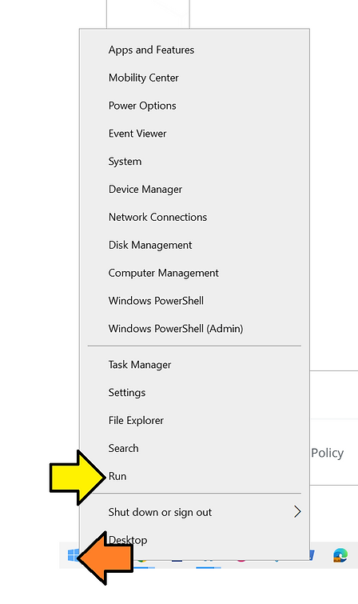

2\. Type cmd.exe

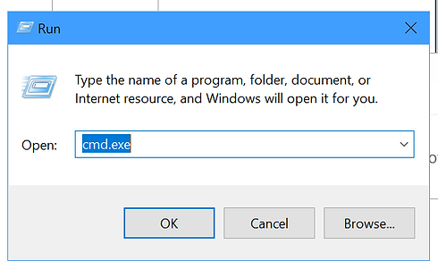

3\. Type node -v. I see v20.11.1.

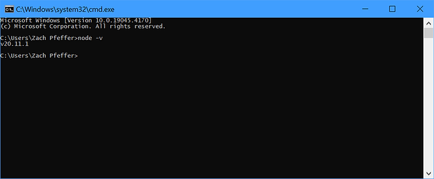

4\. Type npm -v. I see 10.2.4

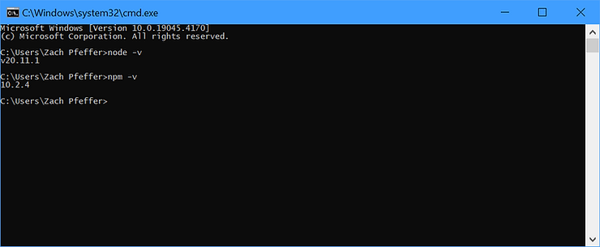

This post showed how to install and test Node.js on Windows 10 using this post.