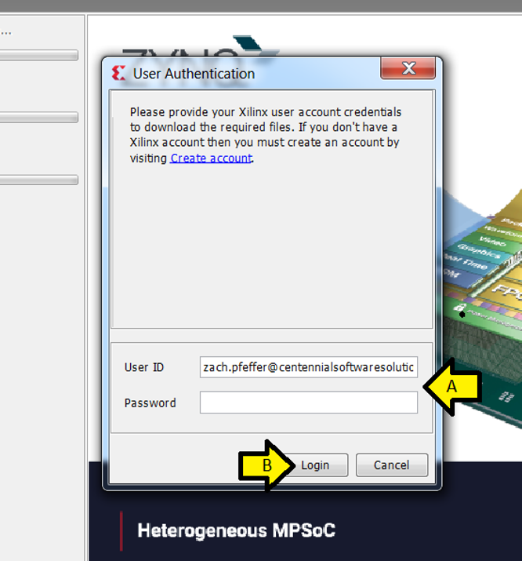
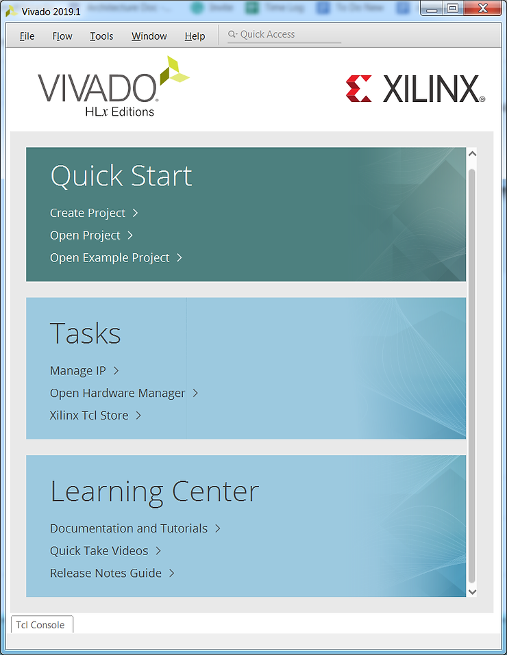

# Install the 2019.1 Vivado HL Design Edition and Xilinx SDK

This post walks through installing **Vivado HL Design Edition** with support for all Xilinx devices and installing the Xilinx **SDK** using the **Download and Install Now** option. It was written on May 6th, 2020.

**<u>Get and Start the Installer</u>**

These steps can be used regardless of how you got or started the installation.

To find and start the **Windows Self Extracting Web Installer** installer click:

-   Start Installing Xilinx's Vivado 2019.1 on Windows 7 from the Windows Self Extracting Web Install at \[[<u>link</u>](https://www.centennialsoftwaresolutions.com/post/start-installing-xilinx-s-vivado-2019-1-on-windows-7-from-the-windows-self-extracting-web-in)\]
    
-   Instructions for actually finding and downloading Xilinx's Vivado 2019.1 Windows Self Extracting Web Installer are at \[[<u>link</u>](https://www.centennialsoftwaresolutions.com/post/find-and-download-xilinx-s-vivado-2019-1)\]
    

**<u>Prerequisites</u>**

-   You have a total of **76.76 GB disk free** (16.32 GB for the download and 60.44 GB for the installation). Note: using these steps, the installer will leave only **30.14 GB** installed. You could download the full image to an external drive and then run the installer and install Vivado onto your main drive if you don't have space for the download and the disk space required during installation on your main drive.
    
-   You've downloaded and have started a Vivado 2019.1 Installer.
    
-   A Xilinx login. Get one at \[[https://login.xilinx.com/](https://login.xilinx.com/)\] (click the **Create Account** button).
    
-   A Vivado license. After getting a login, get one at [<u>[https://www.xilinx.com/getlicense</u>](https://www.xilinx.com/getlicense)\]. You should have downloaded your **Xilinx.lic** file.
    

This post assumes you're staring at this screen:

**<u>Note on Time</u>**

It took 38 min to download the files on my 6-7 MB/sec connection,

21 minutes to install files on my T460 \[[<u>link</u>](https://www.zachpfeffer.com/single-post/2017/01/28/New-T460-System-Information)\] with a memory upgraded to 32 GB \[[<u>link</u>](https://www.zachpfeffer.com/single-post/2018/09/29/ThinkPad-T460-Memory-Upgrade)\]

**<u>Steps</u>**

Step 1 (optional): Click **Preferences** to set up a **download proxy**, set the **number of cores** the installer can use, and **turn off disk optimization**

Click **OK** (or **Cancel**)

Step 2: Click **Next**

Step 3:

A) Enter your **User ID** and **Password**

B) Leave **Download and Install Now** selected

C) Click **Next**

Step 4:

A) Accept the **Xilinx Inc. End User Agreement** \[[<u>link</u>](https://docs.google.com/document/d/1KPxOyzlzL-PaFhddftpn06PzxOrUtiTOccHRuDw5848/edit?usp=sharing)\]

C) Third Party Software End User License Agreement \[[<u>link</u>](https://drive.google.com/file/d/17U0nidGGkWZ2bOQNsPyXgQnwr8ZVwKc7/view?usp=sharing)\]

D) Click **Next**

Step 5:

A) Select **Vivado HL Design Edition**

B) Click **Next**

Step 6: Use defaults and click **Next**

Note: I've shown the options expanded to show what gets installed

Step 7:

**WAIT!!!** If you're Installing as an elevated "local" user (your IT department may have you install as an elevated **local computer Windows user**) click **All users** before clicking **Next**. If you don't do this, when you run Vivado as your "normal" logged-in user it won't work and you will have to uninstall and reinstall Vivado with this option checked since you can't correct this.

If you have no idea what I'm warning against, accept the defaults (provided nothing is red) and click **Next**

Step 8: Review the **Installation Summary** and click **Install**

Step 9: A) Fill in your **User ID and Password** and B) click **Login**

Downloading files...

Installing files...

Optimizing disk usage...

Step 10: Click OK on the disconnect and install drivers pop up (missed the window).

Step 11: Click **OK** on the **Installation completed successfully.** window

Step 12: Click **Load License** on the Vivado License Manager 2019.1

Step 13: Click Copy License...

Step 14: (A) Browse to **Xilinx.lic**, (B) click on it, and (C) click **Open**

Step 15: Click **OK**

Step 16: (A) Click **File** and (B) **Exit**

C) Click **OK**

Note: Vivado 2019.1 can be found in (A) Windows > (B) Xilinx Design Tools > (C) Vivado 2019.1:

Vivado running...

**<u>Just the SDK?</u>**

In case you're just looking to only install SDK 2019.1.

The installer for SDK 2019.1 Web Install for Windows 64 can be downloaded and installed from \[[<u>link</u>](https://www.xilinx.com/member/forms/download/xef.html?filename=Xilinx_SDK_2019.1_0524_1430_Win64.exe)\].

The installer for SDK 2019.1 Web Install for Linux 64 can be downloaded and installed from \[[<u>link</u>](https://www.xilinx.com/member/forms/download/xef.html?filename=Xilinx_SDK_2019.1_0524_1430_Lin64.bin)\].

**<u>References</u>**

Xilinx logo from \[[<u>link</u>](https://twitter.com/xilinxinc)\]