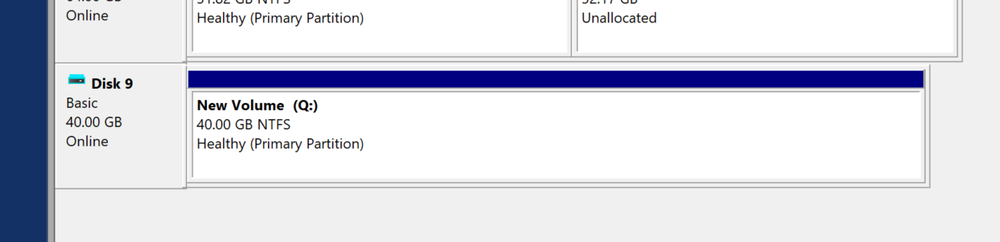

# USB Drive AMD/Xilinx Tools 30-Min Web Install

This note explains how to speed up the AMD/Xilinx web installer on Windows by using an alternate `%TEMP%` directory (to avoid disabling antivirus) and by staging the install inside a VHD before imaging it to a USB drive with. On slow USB media the installer can appear to hang or take **days** because the installer performs thousands of small read/write/verify operations and USB flash drives are often very slow for lots of tiny writes. Using a fast temporary drive (or VHD on an SSD) to perform extraction and installation, then copying the finished install to the USB, typically reduces total time to **~30 minutes** instead of many hours.

# General Approach

1. Install on a mounted VHD on a fast local drive (SSD).
2. Copy the completed installation to the USB with **Rufus**.
3. Make sure the USB drive uses the same drive letter as the original mounted VHD.

# Before Starting

* Download rufus https://github.com/pbatard/rufus/releases/download/v4.10/rufus-4.10p.exe 
* Make sure you can run **Disk Management** (`diskmgmt.msc`)

# Use Your Own TMP Directory 

> [!NOTE]
>
> This allows you to disregard the tip to 'turn off virus protection' to 'speed up' the installer. 

1. Download the installer
2. Run a PowerShell as an Administrator and run:

```
cd 'C:\Users\Zach Pfeffer\Downloads'
mkdir 'C:\FastTmp'

$oldTEMP = $env:TEMP
$oldTMP  = $env:TMP
$env:TEMP = 'C:\FastTmp'
$env:TMP  = 'C:\FastTmp'

.\FPGAs_AdaptiveSoCs_Unified_SDI_2025.1_0530_0145_Win64.exe 
```

3. Check that TMP worked. Open Task manager, find java.exe, right-click, select **Properties**. You should see it running from C:\FastTmp:  


# Create and Use an Install 'disk' 

> [!NOTE]
>
> **Why the installer seems slow:** the Xilinx installer (and many others) don’t stream files, they *check* whether each file exists, if not it copies the the file, and then *verifies* the copy worked. This takes thousands, perhaps millions of tiny filesystem operations. On USB media, since writes are much slower than on an SSD, the installer appears slow.
>
> **Fast, reliable workaround:** installing to a fast local drive first, then copying the install to the USB and switching the drive letter alleviates this. The drive-letter swap is important because the installer records and uses literal path strings (for example `X:\Xilinx`); as long as `X:\Xilinx` exists, the install will work.

> [!NOTE]
>
> Using this method on an SSD I was able to download the files in 10 minutes and install them in 3 minutes. Without this method, and trying to install to a USB drive, it took *30 hours*! 

1. Open **Disk Management** (`diskmgmt.msc`). Wait until you see your disks. You'll see **Connecting to Virtual Disk Service...** then **Loading disk configuration information...**.
2. Click **Action > Create VHD**
3. Create a VHD in C:\FastTmp nammed install_disk:


4. Make the virtual hard disk size less than the size of the USB drive (40 GB), use the other defaults and click **OK**:

> [!IMPORTANT]
>
> If you use a size that's bigger, the **Rufus** the disk writer used later, will not let you write to the USB drive.


5. **Right-click** on the new disk and click **Initialize Disk**:


6. Select the **MBR** (Master Boot Record) partition system and click **OK**:


7. Right click on the **Unallocated** space and click **New Simple Volume...**


8. Click **Next** on the Welcome to the **New Simple Volume Wizard** screen.
9. Accept defaults on the **Specify Volume Size** screen (Simple volume size in MB: 40957 in this case) and click **Next**.
10. On the **Assign Drive Letter of Path**, assign the drive letter. *Pick one you always want to use for this Xilinx* install, **Q:** for instance. and click **Next**:


11. On the Format Partition screen use the default **NTFS** and **quick format** and click **Next**.


12. Click **Finish**. You should see a new Healthy (Primary Partition):



13: Install the tools into this "drive". You may not want to select Create program group entries or shortcuts.


> [!NOTE]
>
> On my machine the download took 10 min and the install took 3 min. When I did this without switching TMP the download took an hour and installing directly to the USB drive took more than a day!

14. Detach the vhd so ZRufus can work with it:


# Use Rufus to Copy the vhd onto the USB Stick

1. Plug the USB stick in
2. Run Rufus. I used 4.10.2279 (Portable).
3. 
   1. Select the USB stick. 
   2. Select **SELECT** . 
   3. Click **SELECT**.


4. Click START:


5. Make sure its using the USB drive and click **OK**:

   

> [!NOTE]
>
>  This took about 15 min. Compare this to 1 day without this method. 

> [!NOTE]
>
> robocopy is slightly faster than opying and pasting, but it still takes hours. 

You should eventually see a complete screen.

# Switch the Drive Letter to Run

1. Back in Disk Management find the F: drive, right click, and select **Change Drive Letter and Paths...**


2. Select **F:** and click **Change...**


3. Select Q: and Click OK


4. Click OK to continue on the warning message


Now the USB drive is mapped like the virtual drive was mapped. Since everything lines up, the install will function as if you installed directly to the USB drive.

# Create a Shortcut or

Set **Target** to **Q:\Xilinx\2025.1\Vitis\bin\vitis.vbs** and **Start in** to **Q:\Xilinx\2025.1/Vitis\bin**.

# Launch From PowerShell

```
cd "Q:\Xilinx\2025.1/Vitis\bin"
$script = 'Q:\Xilinx\2025.1\Vitis\bin\vitis.vbs'
& "$env:windir\System32\cscript.exe" "//NoLogo" $script
```

# Check

1. Look at java.exe details:


2. Check Q:


# Test Eject

1. Eject the USB drive with Vitis installed.

2. Click the Shortcut you made. It should say the lnk doesn't exist.

3. Insert the USB drive with Vitis installed.

4. Make sure it get Q:.

5. Click Shortcut. Vitis should launch. 
