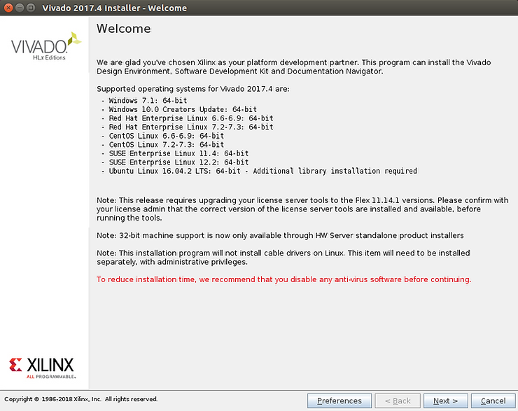
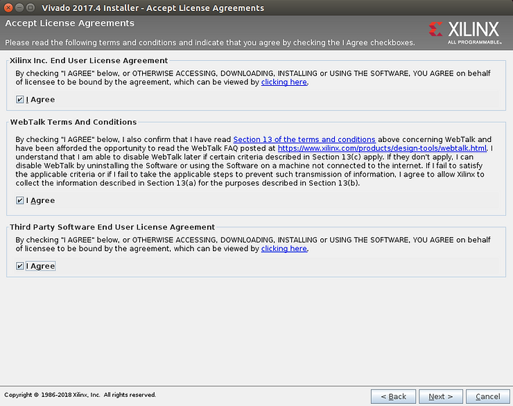
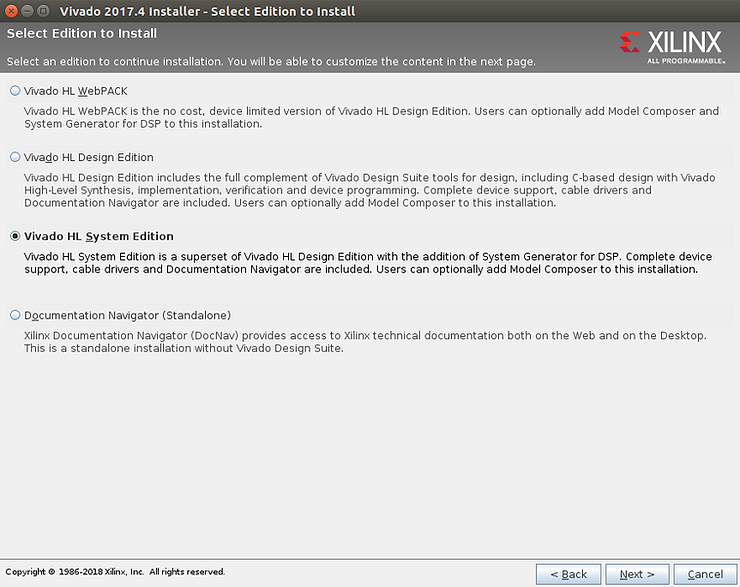
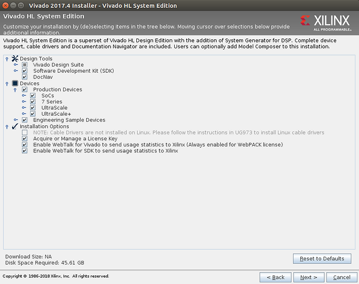
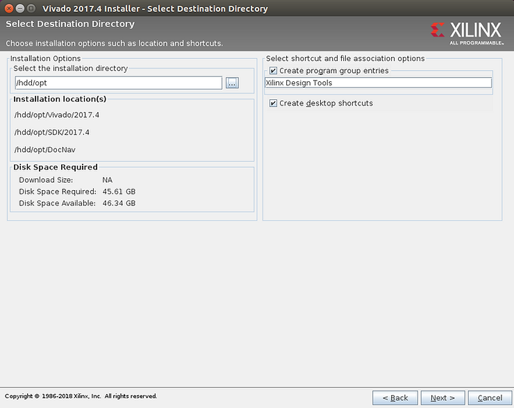
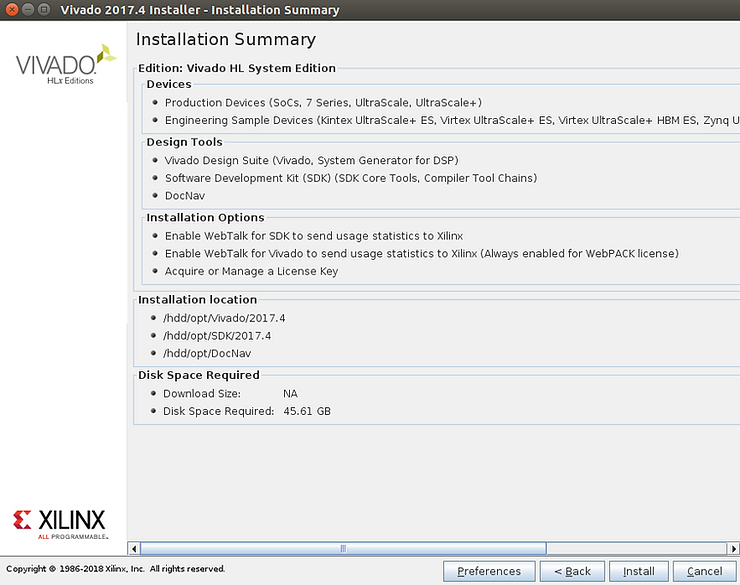
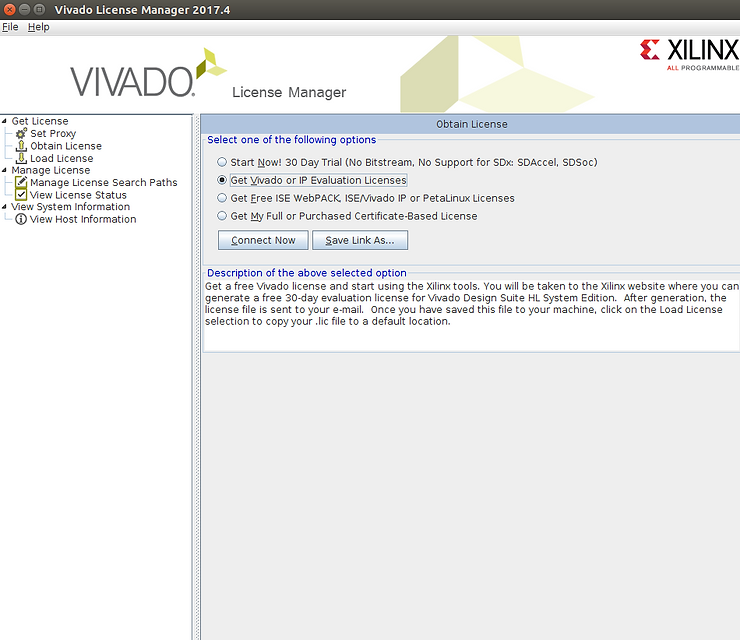
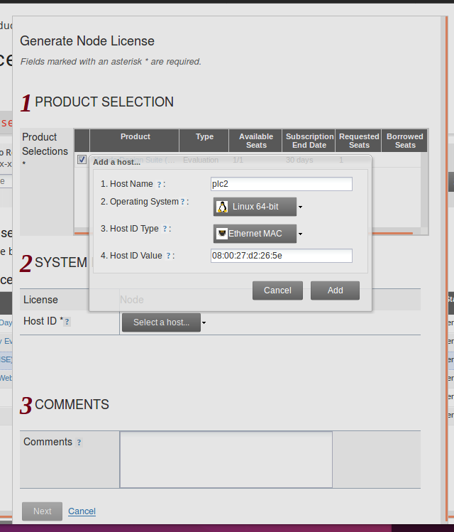
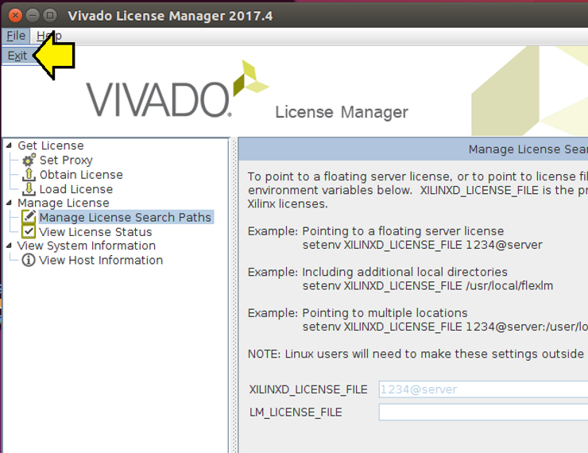
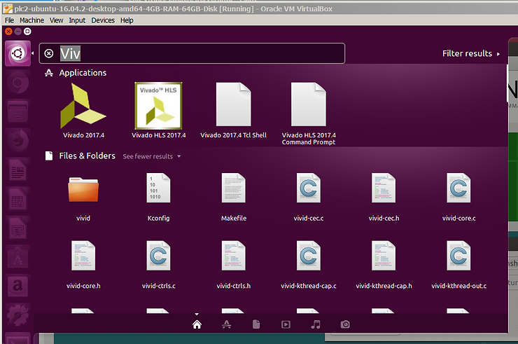

# Installing 2017.4 Vivado and SDK on Linux


This post walks through installing the 2017.4 version of Vivado and the SDK on a Linux box.

*Looking for help build software for Xilinx SoCs? Email* [*inquiries@centennialsoftwaresolutions.com*](mailto:inquiries@centennialsoftwaresolutions.com?subject=I'm+looking+for+a+30-min+consult+on+building+software+for+Xilinx+SoCs+for+$99.00) ***today\*** *to schedule a 30-min consult for $99.00*

Warning:

You will need around 80 GB of diskspace and 30 minutes to install Vivado:

17 GB for the archive +

17 GB for the expanded archive +

46 GB for the installed program = 80 GB

**1.** Download Xilinx\_Vivado\_SDK\_2017.4\_1216\_1.tar.gz from the Xilinx.com download center @ \[[link](http://www.xilinx.com/member/forms/download/xef.html?filename=Xilinx_Vivado_SDK_2017.4_1216_1.tar.gz&akdm=1)\]\*

\*Note: This link cannot be used in a wget command. You need to open the link in a web browser, login with a Xilinx account and then your download will start.

**2.** Extract the archive:

```
time tar -zxvf Xilinx_Vivado_SDK_2017.4_1216_1.tar.gz
```

Took 5 min on Ubuntu 16.04 running on VirtualBox on [T460](http://www.zachpfeffer.com/single-post/2017/01/28/New-T460-System-Information).

**3.** Remove the original install archive:

```
rm Xilinx_Vivado_SDK_2017.4_1216_1.tar.gz
```

**4.** Run xsetup

```
cd Xilinx_Vivado_SDK_2017.4_1216_1
./xsetup
```

You should see:



**5.** Click each **I Agree** checkbox and click **Next >**



**6.** Click the **Vivado HL System Edition** radio button and click **Next >**



**7.** Click the **Engineering Sample Devices** check box and click **Next >** (45.61 GB needed)



**8.** Find a directory that has enough space. Click **Next >**



If the install asks you to create the directory click okay.

**9.** Click **Install**



**10.** Select the Get Vivado or IP Evaluation Licenses radio button and click Connect Now



11\. Click on **Vivado Design Suite (No ISE): 30-Day Evaluation License** and click the **Generate Node-Locked License** button. Then enter in a Host Name, OS, Ethernet MAC and the Host ID Value. Use ifconfig to look up the Ethernet address.



**12.** Check your email. mkdir -p $HOME/.Xilinx. Save the license to $HOME/.Xilinx. You may need to:

```
mv ~/Downloads/Xilinx.lic $HOME/.Xilinx/
```

**13.** Close the Web browser (otherwise the License Manager will appear hung). Exit the License Manager.



**14.** Test that everything works by Launching Vivado. Type Viv (or SDK) in the launcher and select Vivado.



Follow UG973 to install Linux cable drivers

**Sizes**

Download

Size in bytes

```
pfefferz@plc2:/hdd/pkgs$ ls -l
total 16960100
-rwxrwxrwx 1 pfefferz pfefferz 17367136047 Mar  1 16:56 Xilinx_Vivado_SDK_2017.4_1216_1.tar.gz
```

```
pfefferz@plc2:/hdd/pkgs$ ls -lh
total 17G
-rwxrwxrwx 1 pfefferz pfefferz 17G Mar  1 16:56 Xilinx_Vivado_SDK_2017.4_1216_1.tar.gz
```

Size in human readable bytes

Expanded

Size in bytes

```
pfefferz@plc2:/hdd/pkgs$ du -s Xilinx_Vivado_SDK_2017.4_1216_1
17275572	Xilinx_Vivado_SDK_2017.4_1216_1
```

Size in human readable bytes

```
pfefferz@plc2:/hdd/pkgs$ du -sh Xilinx_Vivado_SDK_2017.4_1216_1
17G	Xilinx_Vivado_SDK_2017.4_1216_1
```

**Reference**

Logo via [https://twitter.com/xilinxinc](http://twitter.com/xilinxinc) at [link](http://pbs.twimg.com/profile_images/535545777020338176/pEWdIYq__400x400.png).