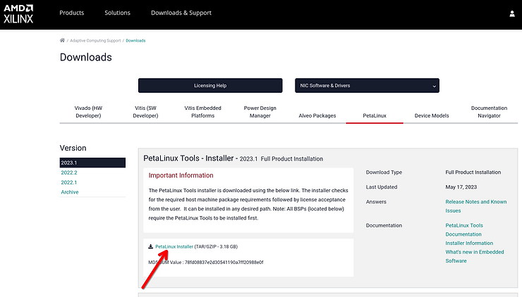

# Installing Petalinux 2023.1 in Ubuntu

## **Summary**

This guide covers the installation of Petalinux 2023.1 in Ubuntu 20.04 or 22.04. These steps have also been verified with Petalinux 2022.2. The installation process is the exact same regardless of which of these versions you use.

Petalinux 2023.1 officially supports both Ubuntu 20.04 and 22.04.

Petalinux 2022.2 and older versions only support Ubuntu 20.04.

UG1144 lists all the officially supported OSs in Chapter 2 - Installation Steps. We do not recommend using Petalinux on a non-supported OS. Unlike Vitis/Vivado, which _might_ still work even if you're using a non-supported OS, Petalinux builds tend to fail in weird ways when not using a supported OS.

If you're running a different Linux distribution on your computer, you can use LXC or Docker to containerize a supported Ubuntu version - see [<u><span>this article</span></u>](/help/set-up-lxc-for-vitis-vivado-and-petalinux-development) for details on using LXC. Otherwise, you can run Ubuntu & Petalinux in a virtual machine.

## **1) Download the Petalinux installer**

Download the Petalinux installer from [<u><span>here</span></u>](https://www.xilinx.com/support/download/index.html/content/xilinx/en/downloadNav/embedded-design-tools.html) (you can select a version in the left sidebar).



Note: The AMD/Xilinx Unified Installer (used for Vivado & Vitis) also contains the Petalinux installer. However, the Unified Installer uses different install paths / directory structures than the standalone Petalinux installer. The Unified Installer can also refuse to install Petalinux because it thinks that it's already installed (when it isn't).

## **2) Verify installer checksum**

(Change the file name if not using version 2023.1)

```
md5sum petalinux-v2023.1-05012318-installer.run
=> 78fd08837e2d30541190a7ff20988e0f  petalinux-v2023.1-05012318-installer.run
```

## **3) Environment setup**

Before running the installer, you'll need to make some changes to the Ubuntu environment and install some dependencies.

These steps are from UG1144 Chapter 2 - Installation Steps.

The list of packages to install is available in an Excel spreadsheet linked at the bottom of these KB articles: for [<u><span>2022.2</span></u>](https://support.xilinx.com/s/article/000034483?language=en_US) or [<u><span>2023.1</span></u>](https://support.xilinx.com/s/article/000035006?language=en_US). (The Ubuntu package list is the same for both versions)

```
sudo dpkg-reconfigure dash
=> Select "No"

sudo dpkg --add-architecture i386

sudo apt update

sudo apt install iproute2 gawk python3 python build-essential gcc git make net-tools libncurses5-dev tftpd zlib1g-dev libssl-dev flex bison libselinux1 gnupg wget git-core diffstat chrpath socat xterm autoconf libtool tar unzip texinfo zlib1g-dev gcc-multilib automake zlib1g:i386 screen pax gzip cpio python3-pip python3-pexpect xz-utils debianutils iputils-ping python3-git python3-jinja2 libegl1-mesa libsdl1.2-dev pylint3 libtinfo5
```

Note: The final package in the apt install command, libtinfo5, is required... but it isn't listed in the Xilinx documentation's list of packages that you need to install. Otherwise, you get this issue.

## **4) Run the installer**

```
chmod +x petalinux-v2023.1-05012318-installer.run

sudo mkdir -p /tools/Xilinx/PetaLinux
sudo chown -R $(id -u):$(id -g) /tools/Xilinx

./petalinux-v2023.1-05012318-installer.run -d /tools/Xilinx/PetaLinux/2023.1
```

Petalinux will prompt you to accept some licenses. Press <Enter> <q> <y> <Enter> <q> <y> <Enter> to accept both licenses.

Installation should take less than 5 minutes. The final installer output should look like this:

```
INFO: Checking installation environment requirements...
WARNING: This is not a supported OS
INFO: Checking free disk space
INFO: Checking installed tools
INFO: Checking installed development libraries
INFO: Checking network and other services
WARNING: No tftp server found - please refer to "UG1144  PetaLinux Tools Documentation Reference Guide" for its impact and solution
INFO: Checking installer checksum...
INFO: Extracting PetaLinux installer...

LICENSE AGREEMENTS

PetaLinux SDK contains software from a number of sources.  Please review
the following licenses and indicate your acceptance of each to continue.

You do not have to accept the licenses, however if you do not then you may
not use PetaLinux SDK.

Use PgUp/PgDn to navigate the license viewer, and press 'q' to close

Press Enter to display the license agreements
Do you accept Xilinx End User License Agreement? [y/N] > y
Do you accept Third Party End User License Agreement? [y/N] > y
INFO: Installing PetaLinux...
INFO: Checking PetaLinux installer integrity...
INFO: Installing PetaLinux SDK to "/tools/Xilinx/PetaLinux/2023.1/."
INFO: Installing buildtools in /tools/Xilinx/PetaLinux/2023.1/./components/yocto/buildtools
INFO: Installing buildtools-extended in /tools/Xilinx/PetaLinux/2023.1/./components/yocto/buildtools_extended
INFO: PetaLinux SDK has been installed to /tools/Xilinx/PetaLinux/2023.1/.
```

## **5) Verify installation**

```
source /tools/Xilinx/PetaLinux/2023.1/settings.sh
```

The output should look like this:

```
PetaLinux environment set to '/tools/Xilinx/PetaLinux/2023.1'
WARNING: This is not a supported OS
INFO: Checking free disk space
INFO: Checking installed tools
INFO: Checking installed development libraries
INFO: Checking network and other services
WARNING: No tftp server found - please refer to "UG1144 2023.1 PetaLinux Tools Documentation Reference Guide" for its impact and solution
```

There are no errors printed in the output, aside from the TFTP server warning which is normal.

Also try running a Petalinux command:

```
$ petalinux-create
=> the command help message is printed
```

## 6) Install JTAG cable drivers

```
cd /tools/Xilinx/PetaLinux/2023.1/tools/xsct/data/xicom/cable_drivers/lin64/install_script

sudo ./install_drivers
```

<u><span>References</span></u>

-   [<u><span>UG1144: PetaLinux Tools Documentation: Reference Guide</span></u>](https://docs.xilinx.com/r/en-US/ug1144-petalinux-tools-reference-guide)
    
-   Xilinx logo clipped from [<u><span>xilinx.com</span></u>](http://xilinx.com/)
