# Installing the 64-bit PC (AMD64) desktop image of Ubuntu 16.04.1 LTS (Xenial Xerus) in Oracle VM Vir

Step-by-step, verified instructions, for installing the 64-bit PC (AMD64) desktop image of Ubuntu 16.04.1 LTS (Xenial Xerus) in Oracle VM VirtualBox 5.1.14 running in Windows 7 Professional Service Pack 1 (CurrentBuild 7601) on a ThinkPad T460 model 20FNCTO1WW with an Intel(R) Core(TM) i7-6600U CPU

## Step 1: Enable Intel (R) Virtualization Technology in the T460's BIOS

1.  Power On
    
2.  Hit Enter
    
3.  Hit F1
    
4.  Right arrow key over to Security
    
5.  Down arrow key to Virtualization
    
6.  Press Enter
    
7.  Use '+' to enable Intel (R) Virtualization Technology
    
8.  Hit F10 to Save and Exit
    
9.  Select \[Yes\]
    

**Notes**

**\-** Intel (R) Virtualization Technology is not enabled out-of-the-box on the T460 model 20FNCTO1WW.

**\-** If Intel (R) Virtualization Technology is not enabled in the T460's BIOS,

This error will pop up when booting the Ubuntu image in the Oracle VM:

Failed to open a session for the virtual machine ubuntu-16.04.1-desktop-amd64-4GB.

VT-x is disabled in the BIOS for all CPU modes (VERR\_VMX\_MSR\_ALL\_VMX\_DISABLED).

Result Code: E\_FAIL (0x80004005) Component: ConsoleWrap Interface: IConsole {872da645-4a9b-1727-bee2-5585105b9eed}

(64-bit) options will not show up in Oracle VM VirtualBox:

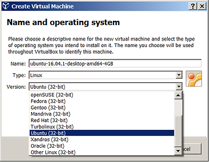

## Step 2: Start VirtualBox and Create the Virtual Machine

If you need help installing Oracle VM VirtualBox 5.1.14 on Windows 7 Professional Service Pack 1 (CurrentBuild 7601) click [here](http://www.zachpfeffer.com/single-post/2017/02/07/Installing-the-Oracle-VM-VirtualBox-5114-on-Windows-7-Professional-Service-Pack-1-CurrentBuild-7601).

**1.** Click on the Oracle VM VirtualBox desktop icon or go to Start > Oracle VM VirtualBox > Oracle VM VirtualBox or type VirtualBox into run

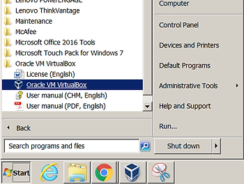

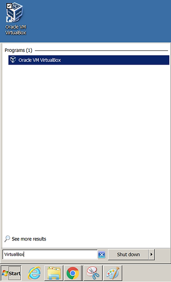

**Note**

Using cmd.exe you can:

c:\\>cd "c:\\Program Files\\Oracle\\VirtualBox"

c:\\Program Files\\Oracle\\VirtualBox>VirtualBox.exe

**2.** Click New.

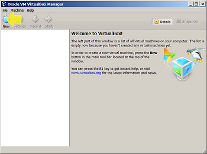

**3.** At the **Name and operating system** screen fill in:

Name: **ubuntu-16.04.1-desktop-amd64-4GB**

Type: **Linux**

Version: **Ubuntu (64-bit)**

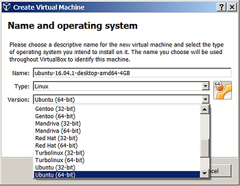

**4.** On the **Memory size** screen set the memory to **4096 MB**.

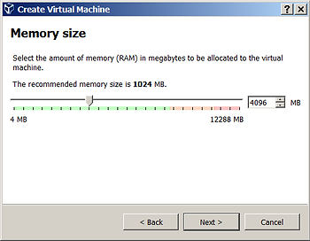

**5.** On the **Hard disk** screen select: **Create a virtual hard disk now**

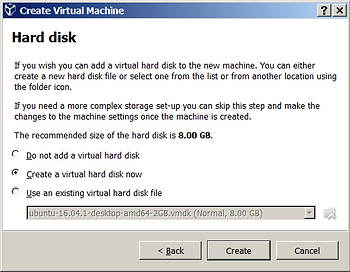

**6.** On the **Hard disk file type** screen select **VMDK (Virtual Machine Disk)**

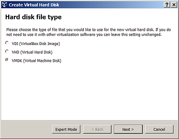

**Notes**

**\-** VMDK files can be used on other virtual machines and products: VMware, Parallels Desktop, Sun xVM, QEMU, SUSE Studio, Norton GHOST and ILookIX and the .NET DiscUtils Open Source C# library.

**-** VMDK files use an [open format](http://en.wikipedia.org/wiki/Open_format):"[Virtual Disk Format 1.1](http://www.vmware.com/app/vmdk/?src=vmdk)" (PDF) VMware.

[https://en.wikipedia.org/wiki/VMDK](http://en.wikipedia.org/wiki/VMDK)

**7.** On the **Storage on physical hard disk** screen select **Dynamically allocated**

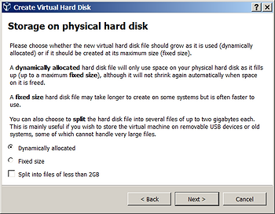

**8.** On the **File location and size** screen set the name to ubuntu-16.04.1-desktop-amd64-32GB. Change the 8.00 GB to 32.00 GB using this sequence:

1.  Click to the left of the decimal point.
    
2.  Type '3' then '2'.
    
3.  Hit the left arrow key twice so that the cursor is between the 8 and the 3.
    
4.  Hit Backspace.
    

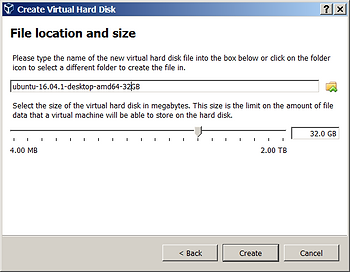

## Step 3. Get the Ubuntu 16.04.1 image (aka ISO) and run it

**1.** Type _Ubuntu 16.04_ into Google search.

**2.** Click on this result:

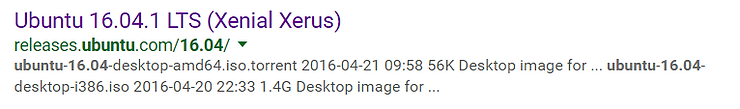

...or go to: http://releases.ubuntu.com/16.04/.

**3.** Click on the first link: [64-bit PC (AMD64) desktop image](http://releases.ubuntu.com/16.04/ubuntu-16.04.1-desktop-amd64.iso) to download the ISO image.

**Note**

**\-** Any of the images will work. This one was chosen because

_On 64-bit hosts (which typically come with hardware virtualization support), 64-bit guest operating systems are always supported regardless of settings, so you can simply install a 64-bit operating system in the guest._

http://download.virtualbox.org/virtualbox/5.1.14/UserManual.pdf, p.47

**4.** In the Oracle VM VirtualBox Manager click on: *[Optical Drive] Empty* and select the ISO.

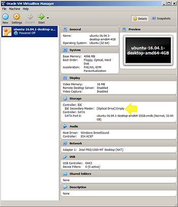

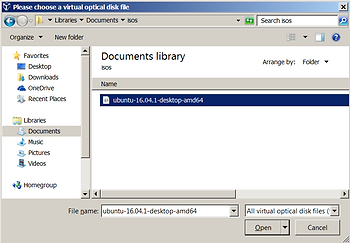

**5.** Click Start.

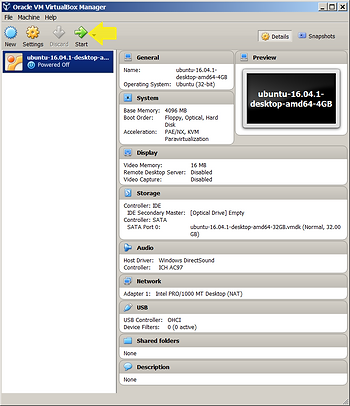

 **6.** The VM will boot and you will be able to follow the instructions to install the image in the ISO to the file ubuntu-16.04.1-desktop-amd64-32GB.vmdk that represents the disk.

## Want More?

###### Click [here](http://www.zachpfeffer.com/single-post/Add-a-disk-to-an-Ubuntu-VirtualBox-VM) to add a second disk to Ubuntu running in a VM.

## Additional Information

**1.** What does Xenial and Xerus mean? 

*What fortunate timing that our next LTS should be X, because “****xenial\****” means “****friendly relations between hosts and guests\****”, and given all the amazing work going into LXD and KVM for Ubuntu OpenStack, and beyond that the interoperability of Ubuntu OpenStack with hypervisors of all sorts, it seems like a perfect fit.*

 

*And* ***Xerus\****, the* ***African ground squirrels\****, are among the most social animals in my home country. They thrive in the desert, they live in small, agile, social groups that get along unusually well with their neighbours (for most mammals, neighbours are a source of bloody competition, for Xerus, hey, collaboration is cool). They are fast, feisty, friendly and known for their enormous… courage. That sounds just about right. With great… courage… comes great opportunity!*

 Mark Shuttleworth [blog](http://www.markshuttleworth.com/archives/1479). Referenced from [OMG Ubuntu UK](http://www.omgubuntu.co.uk/2015/10/ubuntu-16-04-name-revealed). Note the UK spellings of [*neighbours (lukemastin.com)*](http://www.lukemastin.com/testing/spelling/cgi-bin/database.cgi?action=view_category&database=spelling&category=N)

**2.** Ubuntu [16.04.1 vs. 16.04](http://insights.ubuntu.com/2016/07/28/ubuntu-version-16-04-point-1-is-out/) differences

**3.** VM Acceleration on the Intel(R) [Core(TM) i7-6600U](http://en.wikipedia.org/wiki/Skylake_(CPU)) ([Intel link](http://ark.intel.com/products/88192)): 

- VT-x with Extended Page Tages  
- Virtualization Technology for Directed I/O (VT-d) 

**4.** The text  of the 5 sections shown on http://releases.ubuntu.com/16.04/ is nearly identical. 

- The text of all the "Server install image" sections are all the same.  
- Apart from the text, "This type of image is what most people will want to use" used in the first "Desktop images" section, the first and the second "Desktop images" sections are the same. 

**5.** Links to architectures and machines listed on http://releases.ubuntu.com/16.04/: 

- [*AMD64/*](http://en.wikipedia.org/wiki/X86-64)[*EM64T*](http://en.wikipedia.org/w/index.php?title=EM64T&redirect=no) architectures.   
- *Machines that implement the AMD64/EM64T architectures:* [*Athlon64*](http://en.wikipedia.org/wiki/Athlon_64)*,* [*Opteron*](http://en.wikipedia.org/wiki/Opteron)*,* [*EM64T Xeon*](http://en.wikipedia.org/wiki/Xeon)*,* [*Core 2.*](http://en.wikipedia.org/wiki/Intel_Core_2)   
- *Links to the* [*i386 (IA-32)*](http://en.wikipedia.org/wiki/IA-32) *architecture.* 

**6.** Expanded links from each section of http://releases.ubuntu.com/16.04/: 

- Desktop image  
- [**http://releases.ubuntu.com/16.04/ubuntu-16.04.1-desktop-amd64.iso**](http://releases.ubuntu.com/16.04/ubuntu-16.04.1-desktop-amd64.iso)  
- http://releases.ubuntu.com/16.04/ubuntu-16.04.1-desktop-i386.iso    
- Server install image  
- http://releases.ubuntu.com/16.04/ubuntu-16.04.1-server-amd64.iso  
- http://releases.ubuntu.com/16.04/ubuntu-16.04.1-server-i386.iso    
- Desktop image  
- http://releases.ubuntu.com/16.04/ubuntu-16.04-desktop-amd64.iso  
- http://releases.ubuntu.com/16.04/ubuntu-16.04-desktop-i386.iso    
- Server install image  
- http://releases.ubuntu.com/16.04/ubuntu-16.04-server-amd64.iso  
- http://releases.ubuntu.com/16.04/ubuntu-16.04-server-i386.iso    
- Server install image  
- http://releases.ubuntu.com/16.04/ubuntu-16.04-server-amd64.img  
- http://releases.ubuntu.com/16.04/ubuntu-16.04-server-i386.img   

**7.** Possible kernel work

As of the 4.5 Linux Kernel, Skylake mobile products are not fully supported, missing support for some Low-Power Idle States. Because of that, long term reliability can be reduced.[37] from [Skylake_(CPU)](http://en.wikipedia.org/wiki/Skylake_(CPU)) wikipedia.

**8.** More info on what ISO images are can be found [here](http://en.wikipedia.org/wiki/ISO_image). More info on IMG images can be found [here](http://en.wikipedia.org/wiki/IMG_(file_format)).

## References

**1.** Used https://www.diffchecker.com to check the text differences.

**2.** Ubuntu xerius squirrel image from [https://insights.ubuntu.com/2016/04/29/lts-16-04-review-roundup/ ](http://insights.ubuntu.com/2016/04/29/lts-16-04-review-roundup/)

 

 

 