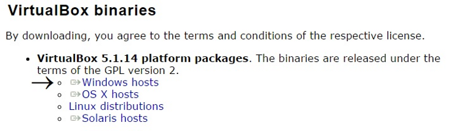
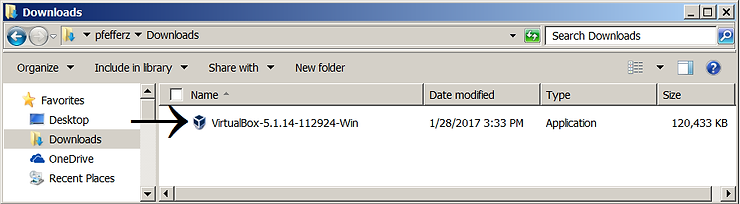
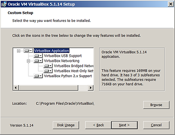
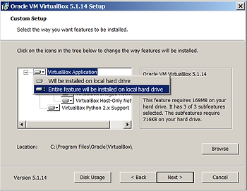
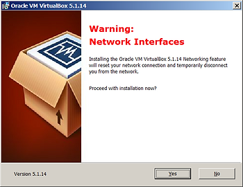
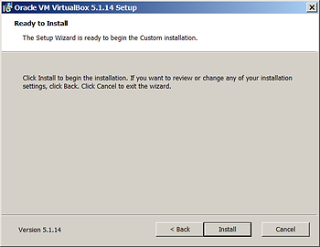
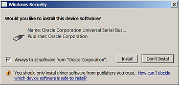
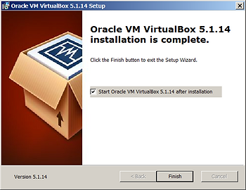
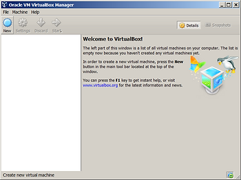
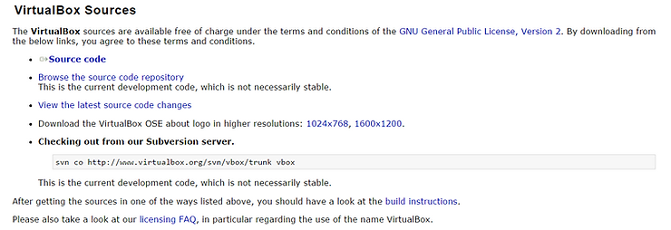

# Installing the Oracle VM VirtualBox 5.1.14 on Windows 7 Professional Service Pack 1 (CurrentBuild 76

## Install

**1.** Download the Oracle VM VirtualBox 5.1.14 for Windows hosts using this [link](http://download.virtualbox.org/virtualbox/5.1.14/VirtualBox-5.1.14-112924-Win.exe) to your Downloads folder. You can also go [here](http://www.virtualbox.org/wiki/Downloads) and click on the _Windows hosts_ link:

Notes

-   The User Manual is [here](http://download.virtualbox.org/virtualbox/UserManual.pdf).
    
-   The Technical documentation is [here](http://www.virtualbox.org/wiki/Technical_documentation).
    
-   If the version has moved on, you may find the same version at the [Old Builds](http://www.virtualbox.org/wiki/Download_Old_Builds_5_1) page.
    
-   What "released under the terms of the GPL version 2" means is described below.
    

**2.** Double left-click on the executable called VirtualBox-5.1.14-112924-Win.exe.

**3.** Left-click "Run"

**4.** You'll see the "Welcome to the Oracle VM VirtualBox 5.1.14 Setup Wizard." Left-click on the _Next >_ button.

**5.** At the next screen, the _Customer Setup_ screen left-click on the _Next >_ button.

Note

All the features will be installed by default. You can double-check by clicking on the VirtualBox Application, selecting "Entire feature will be installed on local hard drive" and noting that the text on the right hand side still says, "It has 3 of 3 subfeatures selected."

**6.** Next, you'll see a screen that allows you to instruct the installer to:

-   Create start menu entries,
    
-   A shortcut on the desktop,
    
-   A shortcut in the Quick Launch Bar and to
    
-   Register file associations.
    

All of the options should be checked. Left-click the _Next >_ button.

Notes

-   Each of these options is documented in the [2.1.5 Public properties](http://www.virtualbox.org/manual/ch02.html#idm822) section of the Oracle VM VirtualBox [User Manual](http://www.virtualbox.org/manual/UserManual.html).
    
-   The file associations associated are: .vbox, .vbox-extpack, .ovf, .ova, .vdi, .vmdk, .vhd and .vdd.
    
-   [How-to enable the Quick Launch bar in Windows 7](http://www.zachpfeffer.com/single-post/2017/02/05/Enable-and-Disable-the-Quick-Launch-Bar-in-Windows-7-Service-Pack-1-SP-1).
    

**7.** The next screen will warn you that your network will be temporarily disconnected. Left-click the _Yes_ button to proceed.

**8.** Left-click _Install_ button on the final screen.

**9.** During installation, a User Account Control Screen will check if you really intend on installing the program. Left-click yes.

**10.** Select _Always trust software from "Oracle Corporation"_ and left-click the _Install_ button to install the Oracle Corporations Universal Serial Bus driver.

**11.** Check the box to Start VirtualBox 5.1.14.

**12.** Oracle VirtualBox Version 5.1.14 is now running on Windows 7 SP1.

## Additional Details

**1.** What does released under the terms of the GPL version 2 mean?

The GNU General Public License version 2 (GPLv2), referred to above as GPL version 2, is described [here](http://www.gnu.org/licenses/old-licenses/gpl-2.0.en.html). Quoting directly:

_The licenses for most software are designed to take away your freedom to share and change it. By contrast, the GNU General Public License is intended to guarantee your freedom to share and change free software--to make sure the software is free for all its users. This General Public License applies to most of the Free Software Foundation's software and to any other program whose authors commit to using it._

The 3rd Term and Condition states:

_3\. You may copy and distribute the Program (or a work based on it, under Section 2) in object code or executable form under the terms of Sections 1 and 2 above provided that you also do one of the following:_

_a) Accompany it with the complete corresponding machine-readable source code, which must be distributed under the terms of Sections 1 and 2 above on a medium customarily used for software interchange; or,_

_b) Accompany it with a written offer, valid for at least three years, to give any third party, for a charge no more than your cost of physically performing source distribution, a complete machine-readable copy of the corresponding source code, to be distributed under the terms of Sections 1 and 2 above on a medium customarily used for software interchange; or,_

_c) Accompany it with the information you received as to the offer to distribute corresponding source code. (This alternative is allowed only for noncommercial distribution and only if you received the program in object code or executable form with such an offer, in accord with Subsection b above.)_

_The source code for a work means the preferred form of the work for making modifications to it. For an executable work, complete source code means all the source code for all modules it contains, plus any associated interface definition files, plus the scripts used to control compilation and installation of the executable. However, as a special exception, the source code distributed need not include anything that is normally distributed (in either source or binary form) with the major components (compiler, kernel, and so on) of the operating system on which the executable runs, unless that component itself accompanies the executable._

VirtualBox puts the source code for download on the same [page](http://www.virtualbox.org/wiki/Downloads) that provided the link to download the binaries:

**2.** I used the [Snipping Tool](http://support.microsoft.com/en-us/help/13776/windows-use-snipping-tool-to-capture-screenshots) to take all the screen shots. [Article ID: 13776 - Last Review: Aug 31, 2016 - Revision: 22](http://support.microsoft.com/en-us/help/13776/windows-use-snipping-tool-to-capture-screenshots) from Microsoft implies that this tool is available on Windows 10, Windows 8.1 and Windows 7. 

**3.** [How to find your build number](http://www.zachpfeffer.com/single-post/2017/02/05/Enable-and-Disable-the-Quick-Launch-Bar-in-Windows-7-Service-Pack-1-SP-1).

**4.** I used the Microsoft Paint to overlay the arrows which I got from the Symbol font on Windows. [How to use symbols on Windows](http://www.zachpfeffer.com/single-post/2017/02/05/Enable-and-Disable-the-Quick-Launch-Bar-in-Windows-7-Service-Pack-1-SP-1).

5\. Additional information

-   [Wikipedia's Hypervisor page](http://en.wikipedia.org/wiki/Hypervisor)
    
-   [VirtualBox's Chapter 10. Technical background](http://www.virtualbox.org/manual/ch10.html)
    

Favorite part:

_For guest code in ring 0, VirtualBox employs a nasty trick: it actually reconfigures the guest so that its ring-0 code is run in ring 1 instead (which is normally not used in x86 operating systems). As a result, when guest ring-0 code (actually running in ring 1) such as a guest device driver attempts to write to an I/O register or execute a privileged instruction, the VirtualBox hypervisor in "real" ring 0 can take over._

-   [Contact info for VirtualBox's creators: innotek GmbH](http://www.virtualbox.org/wiki/innotek)