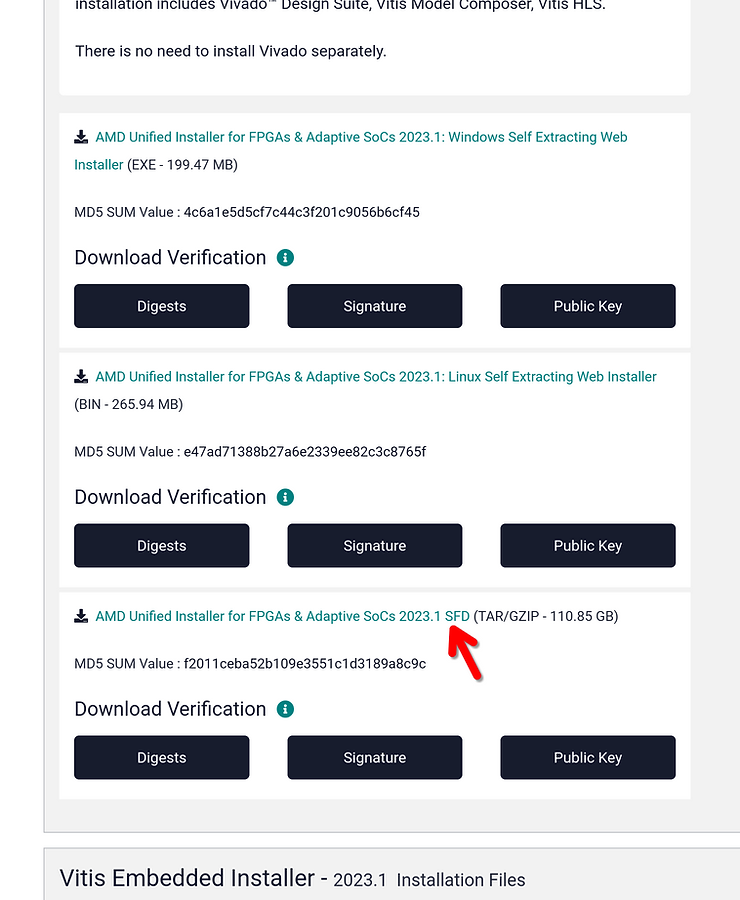
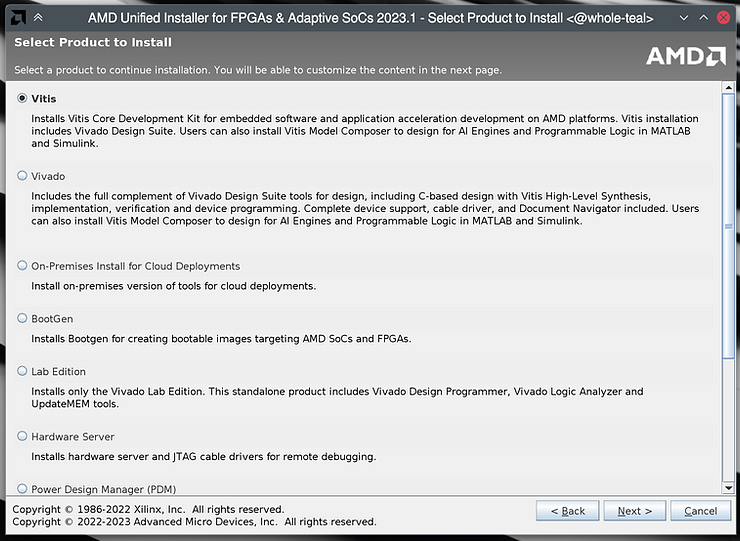
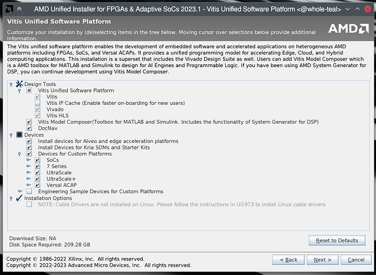
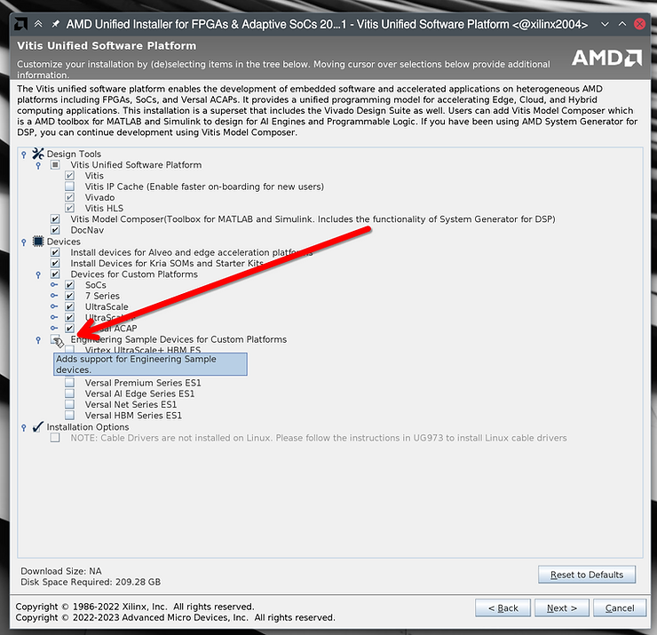
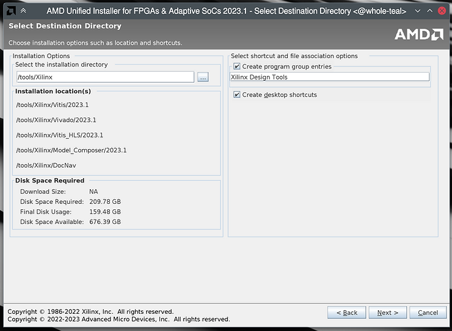
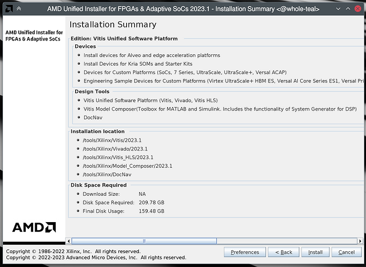
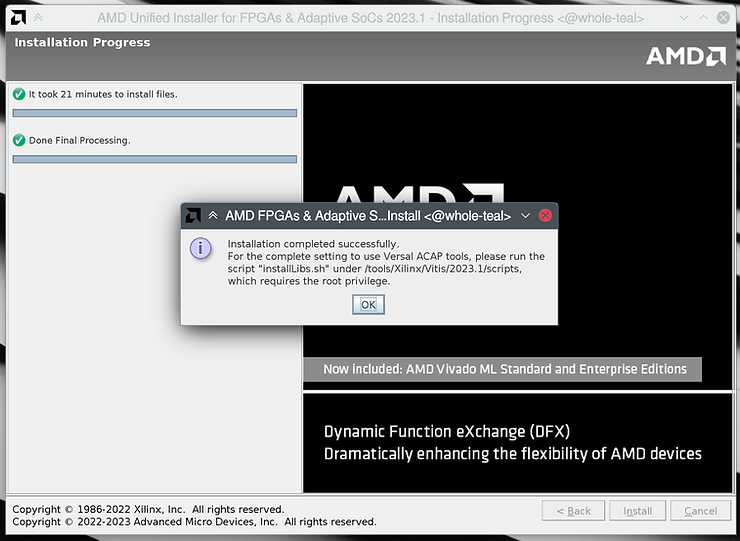

# Installing Vitis & Vivado 2023.1 in Ubuntu

## **Summary**

This guide covers the installation of Vitis versions 2021.2 thru 2023.1 (and potentially future versions) on Ubuntu 20.04 or 22.04. The process is the same regardless of which versions are being used.

The Xilinx 2023.1 toolkit officially supports both Ubuntu 20.04 and 22.02.

Xilinx version 2022.2 and older only support Ubuntu 20.04.

You can use a virtual machine to run Vitis. If you're using Linux as the native OS on your computer, you can also [<u><span>use LXC to run Vitis</span></u>](/help/set-up-lxc-for-vitis-vivado-and-petalinux-development).

## **1) Download the Xilinx Unified Installer**

Download the Xilinx Unified Installer from [<u><span>here</span></u>](https://www.xilinx.com/support/download/index.html/content/xilinx/en/downloadNav/vitis.html) (you can select a version in the left sidebar).

If you don't use version 2023.1, you'll need to change some of the filenames and paths listed later on in this guide.



## **2) Verify installer checksum**

(Change the file name if not using version 2023.1)

```
md5sum Xilinx_Unified_2023.1_0507_1903.tar.gz
=> f2011ceba52b109e3551c1d3189a8c9c  Xilinx_Unified_2023.1_0507_1903.tar.gz
```

It may take a few minutes to compute the checksum.

## **3) Extract installer .tar.gz**

```
tar -xvzf Xilinx_Unified_2023.1_0507_1903.tar.gz
```

This should take 5-20 minutes depending on your CPU.

## **4.0) Install dependencies before running the installer**

It may be helpful to install the same dependencies that PetaLinux needs before running the Vitis installer. See step 3 of the PetaLinux installation article: help/installing-petalinux-2023-1-in-ubuntu 

Without these dependncies

## **4) Run the installer**

First, make the installation folder:

```
sudo mkdir -p /tools/Xilinx
sudo chown -R $(id -u):$(id -g) /tools/Xilinx
```

You need to install a few dependencies first, otherwise the installer will hang forever at "Generating installed device list" towards the end of the installation process.

With these packages installed, the installer should progress through "Generating installed device list" in a minute or two.

```
sudo apt install libncurses5 libncurses5-dev libncursesw5 libncursesw5-dev libtinfo5
```

Now you can run the Xilinx Unified Installer. Enter the folder created from extracting the .tar.gz, and run "xsetup."

```
cd Xilinx_Unified_2023.1_0507_1903
./xsetup
```

Tip: If the installer fails to automatically detect display scaling for HiDPI displays, manually specify 2x scaling with:

```
XINSTALLER_SCALE=2 ./xsetup
```

Once the installer starts up, continue past the welcome screen. On the first page, leave "Vitis" checked (this already checked by default and will also install Vivado) and click next.



On the next page you can customize the items which will be installed. Under the "Devices" section you can deselect chips which you will not be using to save a few GB of disk space.



**NOTE:** If you will be working with Engineering Sample devices, make sure to check the box for them! If you forget to install them now, you'll need to do so later from within Vivado: launch Vivado, from the menubar select Help => Add Design Tools or Devices...



Accept all license agreements on the next page (you'll need to scroll down to see them all).


On this page you can choose the installation directory. We recommend leaving it at the default of "/tools/Xilinx."



On the next page ("Summary") click Install, and then wait some time for the installation to complete. On my computer with an 8-core 2019-era desktop Ryzen CPU, it took about 20-25 minutes total.





## **5) Install dependencies**

Some dependencies need to be installed for Vitis to work. If you forget to do this step, one symptom is that Vitis will keep loading forever when trying to create a project.

Vitis includes a script to automatically install the dependencies:

```
sudo /tools/Xilinx/Vitis/2023.1/scripts/installLibs.sh
```

## **6) Install JTAG cable drivers**

Finally, install the JTAG cable drivers

```
cd /tools/Xilinx/Vitis/2023.1/data/xicom/cable_drivers/lin64/install_script/install_drivers/
sudo ./install_drivers
```

Check for "INFO: Driver installation successful." near the end of the output:

```
INFO: Installing cable drivers. 
INFO: Script name = ./install_drivers 
INFO: HostName = whole-teal 
INFO: RDI_BINROOT= . 
INFO: Current working dir = /tools/Xilinx/Vitis/2023.1/data/xicom/cable_drivers/lin64/install_sc
ript/install_drivers 
INFO: Kernel version = 6.3.2-zen1-1-zen. 
INFO: Arch = x86_64. 
Successfully installed Digilent Cable Drivers 
--File /etc/udev/rules.d/52-xilinx-ftdi-usb.rules does not exist. 
--File version of /etc/udev/rules.d/52-xilinx-ftdi-usb.rules = 0000. 
--Updating rules file. 
--File /etc/udev/rules.d/52-xilinx-pcusb.rules does not exist. 
--File version of /etc/udev/rules.d/52-xilinx-pcusb.rules = 0000. 
--Updating rules file. 

INFO: Digilent Return code = 0 
INFO: Xilinx Return code = 0 
INFO: Xilinx FTDI Return code = 0 
INFO: Return code = 0 
INFO: Driver installation successful. 
CRITICAL WARNING: Cable(s) on the system must be unplugged then plugged back in order for the driver scripts to update the cables.
```

## **7) Verify installation**

Launch Vivado or Vitis to verify that they work:

```
/tools/Xilinx/Vitis/2023.1/bin/vitis
/tools/Xilinx/Vivado/2023.1/bin/vivado
```

<u><span>References</span></u>

-   "Generating installed device list" hang workaround found at:
    
    -   [<u><span>https://support.xilinx.com/s/question/0D52E00006hpRxQSAU/vivado-20202-installation-stuck-at-generating-installed-device-list-on-ubuntu-2004lts?language=en_US</span></u>](https://support.xilinx.com/s/question/0D52E00006hpRxQSAU/vivado-20202-installation-stuck-at-generating-installed-device-list-on-ubuntu-2004lts?language=en_US)
        
    -   [<u><span>https://support.xilinx.com/s/question/0D52E00006iHjbcSAC/vivado-20211-installation-hangs-at-generating-installed-device-list?language=en_US</span></u>](https://support.xilinx.com/s/question/0D52E00006iHjbcSAC/vivado-20211-installation-hangs-at-generating-installed-device-list?language=en_US)
    
-   Vivado-Vitis-AI image from [<u><span>https://www.xilinx.com/products/silicon-devices/acap/versal.html</span></u>](https://www.xilinx.com/products/silicon-devices/acap/versal.html)
