# Integrate a QSPI using PetaLinux Tools Part 1


This post walks through part 1 of a complete integration of a QSPI connected to a Zynq UltraScale+ MPSoC into a Linux kernel using PetaLinux Tools 2017.4.

It traces the connection from a QSPI chip to the QSPI controller on the Zynq UltraScale+ MPSoC (ZU+). Then its demonstrates checking the Linux kernel software layers to ensure the right configuration has been set up.

I posted the solution to [https://www.zachpfeffer.com/single-post/Integrate-a-QSPI-using-PetaLinux-Tools-Part-2](http://www.zachpfeffer.com/single-post/Integrate-a-QSPI-using-PetaLinux-Tools-Part-2). 

**QSPI to ZU+ Connection**

Detail

MT25QL01GBBB8E12 -0AA connected to a XCZU9EG-FFVC900

**Connections (QSPI connected to ZU+)**

D3 connected to G18

D2 connected to H17

C4 connected to E18

D4 connected to F18

C2 connected to J17

B2 connected to C18

**Figure Out Pins**

QSPI Pins

Per this figure from the MT25QL01GBBB datasheet, the package code is **12** (MT25QL01GBBB8E**12** -0AA): a **12 = 24-ball T-PBGA, 05/6 x 8mm (5 x 5 array)**

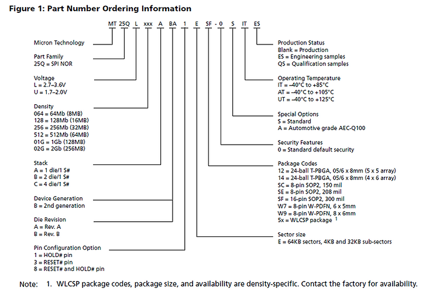

Pins

MT25QXXXXXXX8E12-XXXX Balls Down

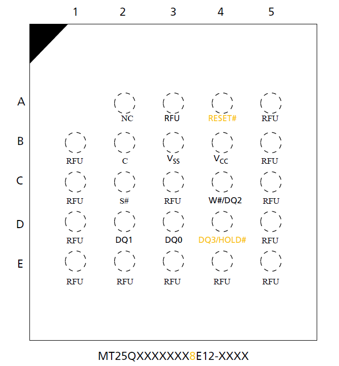

**Connections**

D3 - DQ0,

D2 - DQ1,

C4 - W#/DQ2,

D4 - DQ3/HOLD#,

C2 - S#,

B2 - C

From the QSPI data sheet:

DQ\[3:0\] (I/O)

**Serial I/O**: The bidirectional DQ signals transfer address, data, and command information.

When using legacy (x1) SPI commands in extended I/O protocol (XIO-SPI), DQ0 is an input and DQ1 is an output. DQ\[3:2\] are not used.

When using dual commands in XIO-SPI or when using DIO-SPI, DQ\[1:0\] are I/O. DQ\[3:2\] are not used.

When using quad commands in XIO-SPI or when using QIO-SPI, DQ\[3:0\] are I/O.

C (Input)

**Clock**: Provides the timing of the serial interface. Command inputs are latched on the rising edge of the clock. In STR commands or protocol, address and data inputs are latched on the rising edge of the clock, while data is output on the falling edge of the clock. In DTR commands or protocol, address and data inputs are latched on both edges of the clock, and data is output on both edges of the clock.

S#

**Chip select**: When S# is driven HIGH, the device will enter standby mode, unless an internal PROGRAM, ERASE, or WRITE STATUS REGISTER cycle is in progress. All other input pins are ignored and the output pins are tri-stated. On parts with the pin configuration offering a dedicated RESET# pin, however, the RESET# input pin remains active even when S# is HIGH.

Driving S# LOW enables the device, placing it in the active mode.

After power-up, a falling edge on S# is required prior to the start of any command.

**ZU+ Pins**

Per this figure from the XCZU9EG-FFVC900 datasheet, we're using the FFVC900 package.

G18, H17, E18, F18, J17, C18 are all in **PS Bank 500**

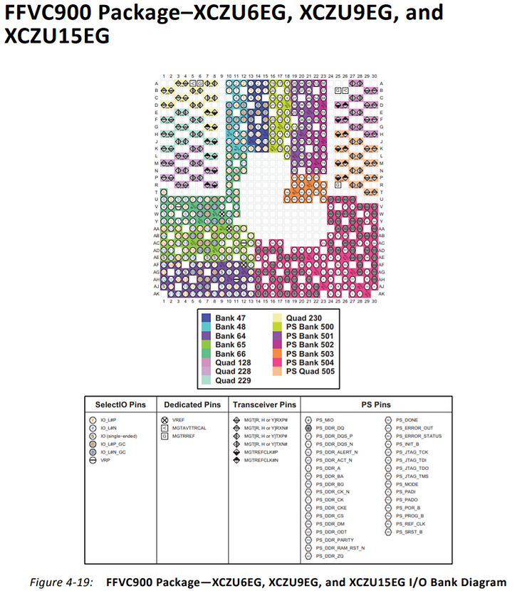

Pin Out

From: [https://www.xilinx.com/support/packagefiles/zuppackages/xczu9egffvc900pkg.txt](http://www.xilinx.com/support/packagefiles/zuppackages/xczu9egffvc900pkg.txt) 

Pin Pin Name Memory Byte Group Bank I/O Type Super Logic Region

G18 PS\_MIO4 NA 500 PSMIO NA

H17 PS\_MIO1 NA 500 PSMIO NA

E18 PS\_MIO2 NA 500 PSMIO NA

F18 PS\_MIO3 NA 500 PSMIO NA

J17 PS\_MIO5 NA 500 PSMIO NA 

C18 PS\_MIO0 NA 500 PSMIO NA

Overlayed

PS\_MIO4 - DQ0,

PS\_MIO1 - DQ1,

PS\_MIO2 - W#/DQ2,

PS\_MIO3 - DQ3/HOLD#,

PS\_MIO5 - S#,

PS\_MIO0 - C

From Table 28-3 MIO Interfaces (qspi column) of the Zynq UltraScale+ Device TRM:

PS\_MIO4 - DQ0 - **si\_mio\[0\]**

PS\_MIO1 - DQ1 - **io\[1\]**

PS\_MIO2 - W#/DQ2 - **io\[2\]**

PS\_MIO3 - DQ3/HOLD#, - **io\[3\]**

PS\_MIO5 - S# - **n\_ss\_out**

PS\_MIO0 - C - **sclk\_out**

From page 646 of the Zynq UltraScale+ Device TRM:

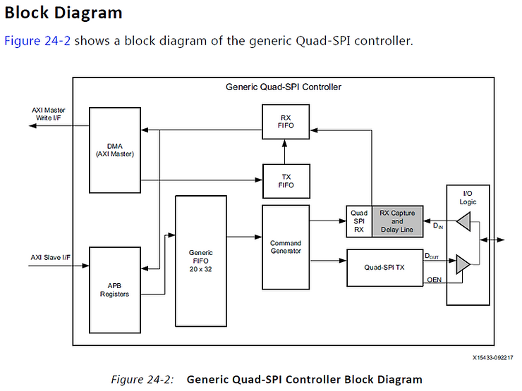

Also from page 646 of the Zynq UltraScale+ Device TRM:

The following interfaces are used by the generic Quad-SPI controller.

• The APB slave read/write interface is used to read/write the registers and also to write the TX generic FIFO data.

• The AXI master write interface is used to issue DMA write requests on the AXI interface. The data read from flash memory is written into the RXFIFO. The data from the RXFIFO is transferred into external memory (for example, DDR) using this interface. The AXI address bus is 44 bits wide and the data is 32 bits wide.

Base Address of QSPI

From Table 10-6 (p232): I/O Peripherals Register Map (LPD) **Base Address** of the QSPI controller is: 0xFF0F\_0000

**Am I Using LQSPI vs. GQSPI?**

Using GQSPI as Linux boots up. Register is unchanged.

Detail

From page 640 from the Zynq UltraScale+ Device TRM:

_At Boot_

The CSU BootROM uses the GQSPI controller for system boot. The Width Detection parameter in the boot header selects between 4- and 8-bit I/O. If the XIP FSBL is selected (FSBL length = 0 in the boot header), the BootROM switches to the LQSPI controller before handing-off the system to the FSBL code.

From page 643 from the Zynq UltraScale+ Device TRM:

Controller Selection

One controller is selected at a time using the LQSPI\_CFG \[LQ\_MODE\] bit. The generic controller is selected by setting the bit = 0 and the legacy linear controller is selected by setting the bit = 1. The active controller must be quiescent before switching from one controller to the other.

_Check the Register Spec_

Register Name LQSPI\_CFG 

Relative Address 0x000000A0 

Absolute Address 0xFF0F00A0 (QSPI) 

Width 32 

Type rw 

Reset Value 0x000002EB 

Description Configuration 

Specifically for the Linear Quad-SPI Controller

```
root@mtd_board:~# devmem
BusyBox v1.24.1 (2018-05-08 18:42:50 MDT) multi-call binary.

Usage: devmem ADDRESS [WIDTH [VALUE]]

Read/write from physical address

        ADDRESS Address to act upon
        WIDTH   Width (8/16/...)
        VALUE   Data to be written
root@mtd_board:~# devmem 0xFF0F00A0 32
0x000002EB
root@mtd_board:~# 
```

_Decode 0x000002EB_

0x000002EB (Reset value)

0b0000\_0000\_0000\_0000\_0000\_0010\_1110\_1011

LQ\_MODE: Controller Select 0: **Generic Quad-SPI**

TWO\_MEM: I/O Configuration: 0: One memory device

SEP\_BUS: I/O Configuration: 0: Single memory interface

U\_PAGE: N/A

ADDR\_32BIT: Flash Memory Address based on AXI address: 0: Lower 24 bits of AXI address on linear port are used as address to the flash.

MODE\_EN: MODE\_ON and MODE\_BITS are disabled

INST\_CODE: Fast read quad I/O

| Field Name | Bits  | Type | Reset Value | Description                                                  |
| ---------- | ----- | ---- | ----------- | ------------------------------------------------------------ |
| LQ_MODE    | 31    | rw   | 0x0         | Controller Select: 0: Generic Quad-SPI. 1: Legacy LQSPI, Linear Quad-SPI. Note: Change this value only when controller is not communicating with the memory device. |
| TWO_MEM    | 30    | rw   | 0x0         | I/O Configuration: 0: One memory device. 1: Two memory devices. Note: Change this value only when controller is not communicating with the memory device. |
| SEP_BUS    | 29    | rw   | 0x0         | I/O Configuration: 0: Single memory interface. 1: Separate memory intefaces. This bit only has meaning if [TWO_MEM] = 1. Note: Change this value only when controller is not communicating with the memory device. |
| U_PAGE     | 28    | rw   | 0x0         | Upper Page Select: 0: Lower memory page. 1: Upper memory page. This bit only has meaning if: [TWO_MEM] = 1 (two devices) [SEP_BUS] = 0 (one interface) IO mode is not supported in LQSPI; [U_PAGE] selects the lower or upper memory for configuration or read/write operations. Note: Change this value only when controller is not communicating with the memory device. |
| ADDR_32BIT | 27    | rw   | 0x0         | Flash Memory Address based on AXI address: 0: Lower 24 bits of AXI address on linear port are used as address to the flash. 1: Five zero bits & lower 27 bits of AXI address. Note: Change this value only when controller is not communicating with the memory device. |
| Reserved   | 26    | rw   | 0x0         | reserved                                                     |
| MODE_EN    | 25    | rw   | 0x0         | IO mode is not supported in LQSPI. 1: Send MODE_BITS[23:16]. Must be set = 1 for dual or quad I/O read (specified through [7:0]). Must be clear = 0 for all other read modes as they do not have mode bits. If this bit is 0, [MODE_ON, 24] and [MODE_BITS] are ignored. Relationship of bits [25], [24] and [23:16] are related: if ( [ Bit25 == 0 ] && [ Bit24 == x ] ) then [ Bits23:16 = x ] if ( [ Bit25 == 1 ] && [ Bit24 == 0 ] ) then [ Bits23:16 = ~(8'bxx10xxxx) ] if ( [ Bit25 == 1 ] && [ Bit24 == 1 ] ) then [ Bits23:16 = 8'bxx10xxxx ]. Note: Change this value only when controller is not communicating with the memory device. |
| MODE_ON    | 24    | rw   | 0x0         | IO mode is not supported in LQSPI. 0: Instruction code is sent for all read transfers. 1: Instruction code is sent only for first read transfer. This bit applies when [MODE_EN, 25] is set = 1. This bit is configured in association with [MODE_BITS]. For Winbond devices, this bit must be set = 1 if the [MODE_BITS] = 8'bxx10xxxx, else clear = 0. Note: Change this value only when the controller is not communicating with the memory device. |
| MODE_BITS  | 23:16 | rw   | 0x0         | IO mode is not supported in LQSPI. These bits apply when [MODE_EN, 25] = 1. Required for both dual I/O read and quad I/O read. See Flash memory vendor's datasheet for more information on the mode bits. For the Winbond device, the continuous read mode value is 8'bxx10xxxx to skip the instruction code for the next read transfer, else instruction code is sent for all read transfers. Bit 24 has to be configured accordingly with this value. Note: Change this value only when controller is not communicating with the memory device. |
| Reserved   | 15:11 | rw   | 0x0         | Reserved, value is undefined when read.                      |
| INST_CODE  | 7:0   | rw   | 0xEB        | Read instruction code. The known read instruction codes are: 8'h03 - Read 8'h0B - Fast read 8'h3B - Fast read dual output 8'h6B - Fast read quad output 8'hBB - Fast read dual I/O 8'hEB - Fast read quad I/O 8'h13 - Four Byte Address Read 8'h0C - Four Byte Address Fast read 8'h3C - Four Byte Address Fast read dual output 8'h6C - Four Byte Address Fast read quad output 8'hBC - Four Byte Address Fast read dual I/O 8'hEC - Four Byte Address Fast read quad I/O This is a static signal - should not be changed while controller is actively transmitting/receiving data to/from Flash device |

**Can my Kernel See the MT25QL01GBBB8E12 -0AA?**

In a PetaLinux Tools managed build the Linux kernel code is at **build/tmp/work-shared/plnx\_aarch64/kernel-source/**.

The SPI-NOR driver is at **drivers/mtd/spi-nor/spi-nor.c**

The specific spi-nor.c used in PetaLinux Tools 2017.4 is at: [https://github.com/Xilinx/linux-xlnx/blob/b450e900fdb473a53613ad014f31eedbc80b1c90/drivers/mtd/spi-nor/spi-nor.c](http://github.com/Xilinx/linux-xlnx/blob/b450e900fdb473a53613ad014f31eedbc80b1c90/drivers/mtd/spi-nor/spi-nor.c)

SPI NOR framework

```
   Before this framework, the layer is like:

                   MTD
         ------------------------
                  m25p80
         ------------------------
	       SPI bus driver
         ------------------------
	        SPI NOR chip

   After this framework, the layer is like:
                   MTD
         ------------------------
              SPI NOR framework
         ------------------------
                  m25p80
         ------------------------
	       SPI bus driver
         ------------------------
	       SPI NOR chip

  With the SPI NOR controller driver (Freescale QuadSPI), it looks like:
                   MTD
         ------------------------
              SPI NOR framework
         ------------------------
                fsl-quadSPI
         ------------------------
	       SPI NOR chip
```

Check Kconfig @ [https://github.com/Xilinx/linux-xlnx/blob/b450e900fdb473a53613ad014f31eedbc80b1c90/drivers/mtd/spi-nor/Kconfig](http://github.com/Xilinx/linux-xlnx/blob/b450e900fdb473a53613ad014f31eedbc80b1c90/drivers/mtd/spi-nor/Kconfig)

menuconfig MTD_SPI_NOR

  tristate "SPI-NOR device support"

  depends on MTD

  help

   This is the framework for the SPI NOR which can be used by the SPI

   device drivers and the SPI-NOR device driver.

Check the PetaLinux kernel config:

```
petalinux-config -c kernel
```

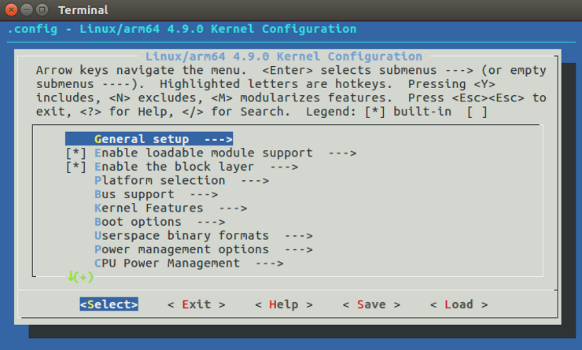

Note: this command will wipe out the kernel source in **build/tmp/work-shared/plnx\_aarch64/kernel-source**

Note 2: PetaLinux 2017.4 uses [https://github.com/Xilinx/linux-xlnx/tree/b450e900fdb473a53613ad014f31eedbc80b1c90](http://github.com/Xilinx/linux-xlnx/tree/b450e900fdb473a53613ad014f31eedbc80b1c90) See this [link](http://www.zachpfeffer.com/single-post/2018/05/10/Which-Linux-kernel-is-PetaLinux-Tools-using) to for a method to figure this out.

Type '/' to search for MTD\_SPI\_NOR

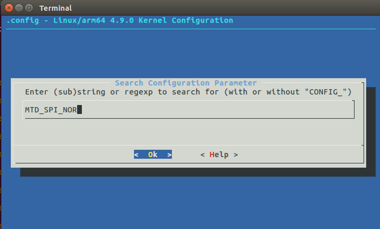

Its on:

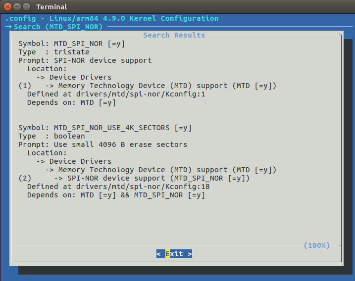

Look at dmesg

\[ 1.636157\] mtdoops: mtd device (mtddev=name/number) must be supplied

Check device tree overlay

```
vi project-spec/meta-user/recipes-bsp/device-tree/files/system-user.dtsi
```

```
                spi@ff0f0000 {
                        u-boot,dm-pre-reloc;
                        compatible = "xlnx,zynqmp-qspi-1.0";
                        status = "okay";
                        clock-names = "ref_clk", "pclk";
                        interrupts = <0x0 0xf 0x4>;
                        interrupt-parent = <0x4>;
                        num-cs = <0x1>;
                        reg = <0x0 0xff0f0000 0x0 0x1000 0x0 0xc0000000 0x0 0x8000000>;
                        #address-cells = <0x1>;
                        #size-cells = <0x0>;
                        #stream-id-cells = <0x1>;
                        iommus = <0x7 0x873>;
                        power-domains = <0x16>;
                        clocks = <0x3 0x35 0x3 0x1f>;
                        is-dual = <0x1>;

                        flash@0 {
                                compatible = "n25q00";
                                #address-cells = <0x1>;
                                #size-cells = <0x1>;
                                reg = <0x0>;
                                spi-tx-bus-width = <0x4>;
                                spi-rx-bus-width = <0x4>;
                                spi-max-frequency = <0x55d4a80>;

                                partition@qspi-fsbl-uboot {
                                        label = "qspi-fsbl-uboot";
                                        reg = <0x0 0x100000>;
                                };

                                partition@qspi-linux {
                                        label = "qspi-linux";
                                        reg = <0x100000 0x500000>;
                                };

                                partition@qspi-device-tree {
                                        label = "qspi-device-tree";
                                        reg = <0x600000 0x20000>;
                                };

                                partition@qspi-rootfs {
                                        label = "qspi-rootfs";
                                        reg = <0x620000 0x5e0000>;
                                };
                        };
                };
```

[https://github.com/Xilinx/linux-xlnx/blob/b450e900fdb473a53613ad014f31eedbc80b1c90/drivers/mtd/spi-nor/spi-nor.c](http://github.com/Xilinx/linux-xlnx/blob/b450e900fdb473a53613ad014f31eedbc80b1c90/drivers/mtd/spi-nor/spi-nor.c)

```
#ifdef CONFIG_OF
		np_spi = of_get_next_parent(np);
		if (of_property_match_string(np_spi, "compatible",
					     "xlnx,zynq-qspi-1.0") >= 0) {
			int status;

			nor->addr_width = 3;
			set_4byte(nor, info, 0);
			status = read_ear(nor, info);
			if (status < 0)
				dev_warn(dev, "failed to read ear reg\n");
			else
				nor->curbank = status & EAR_SEGMENT_MASK;
		} else {
#endif
```

**Hmmm.. this is looking for zynq-qspi-1.0, I'm passing in: zynqmp-qspi-1.0**

Check the original (non-overlay) device tree

system-top.dts pulls in all the dtsi components:

```
vi components/plnx_workspace/device-tree/device-tree-generation/system-top.dts
```

Contents:

```
/*
 * CAUTION: This file is automatically generated by Xilinx.
 * Version:  
 * Today is: Tue May  8 19:29:49 2018
 */


/dts-v1/;
/include/ "zynqmp.dtsi"
/include/ "zynqmp-clk-ccf.dtsi"
/include/ "pl.dtsi"
/include/ "pcw.dtsi"
/ {
        chosen {
                bootargs = "earlycon clk_ignore_unused";
                stdout-path = "serial0:115200n8";
        };
        aliases {
                ethernet0 = &gem1;
                serial0 = &uart0;
                serial1 = &uart1;
                spi0 = &qspi;
        };
        memory {
                device_type = "memory";
                reg = <0x0 0x0 0x0 0x80000000>;
        };
};
#include "system-user.dtsi"
```

```
                qspi: spi@ff0f0000 {
                        u-boot,dm-pre-reloc;
                        compatible = "xlnx,zynqmp-qspi-1.0";
                        status = "disabled";
                        clock-names = "ref_clk", "pclk";
                        interrupts = <0 15 4>;
                        interrupt-parent = <&gic>;
                        num-cs = <1>;
                        reg = <0x0 0xff0f0000 0x0 0x1000>,
                              <0x0 0xc0000000 0x0 0x8000000>;
                        #address-cells = <1>;
                        #size-cells = <0>;
                        #stream-id-cells = <1>;
                        iommus = <&smmu 0x873>;
                        power-domains = <&pd_qspi>;
                };
```

So **zynqmp-qspi-1.0** seems okay.

Configure flash through petalinux-config

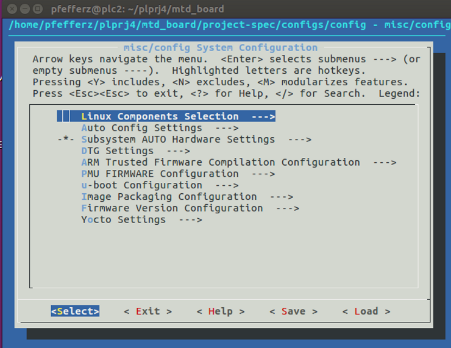

Select **Subsystem AUTO Hardware Settings**

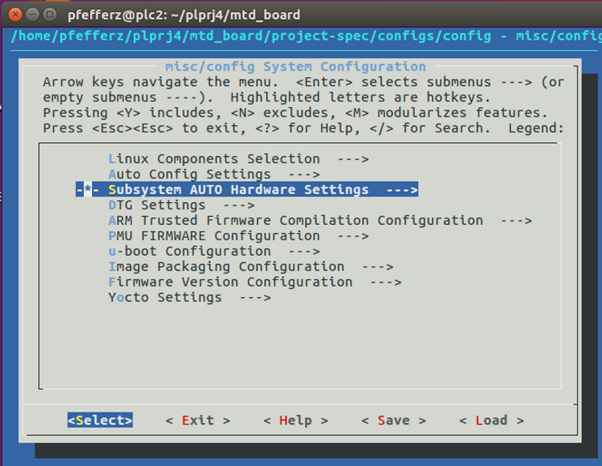

Select **Flash Settings --->**

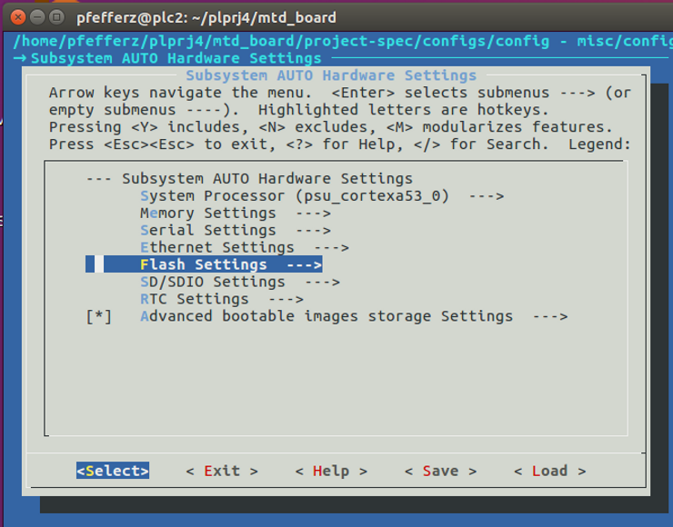

Configure

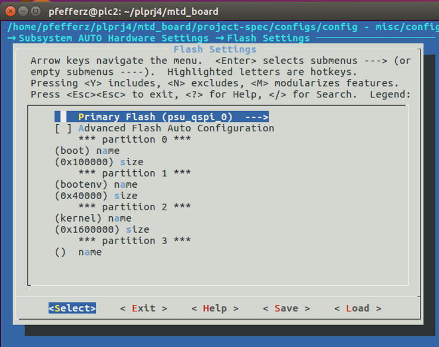

**Use some printks**

Launch devshell

petalinux-build -c kernel -x devshell

(this command is not documented anywhere - it also doesn't seem to work: it executed for 2 hours)

**cat /proc/devices**

```
Character devices:
  1 mem
  2 pty
  3 ttyp
  4 /dev/vc/0
  4 tty
  4 ttyS
  5 /dev/tty
  5 /dev/console
  5 /dev/ptmx
  7 vcs
 10 misc
 13 input
 29 fb
 81 video4linux
 89 i2c
 90 mtd
116 alsa
128 ptm
136 pts
180 usb
189 usb_device
204 ttyUL
204 ttyMAX
216 rfcomm
226 drm
245 uio
246 bsg
247 watchdog
248 iio
249 ptp
250 pps
251 media
252 rtc
253 ttyPS
254 gpiochip

Block devices:
  1 ramdisk
259 blkext
  7 loop
  8 sd
 31 mtdblock
 65 sd
 66 sd
 67 sd
 68 sd
 69 sd
 70 sd
 71 sd
128 sd
129 sd
130 sd
131 sd
132 sd
133 sd
134 sd
135 sd
179 mmc
```

**Printk Based Debug**

Go through the SPI-NOR Linux kernel doc and see if functions are getting called (via printks)

[https://www.kernel.org/doc/Documentation/mtd/spi-nor.txt](http://www.kernel.org/doc/Documentation/mtd/spi-nor.txt)

SPI NOR framework

============================================

Part I - Why do we need this framework?

\---------------------------------------

SPI bus controllers ([drivers/spi/](http://github.com/Xilinx/linux-xlnx/blob/b450e900fdb473a53613ad014f31eedbc80b1c90/drivers/spi)) only deal with streams of bytes; the bus

The Xilinx Zynq UltraScale+ MPSoC Quad-SPI (QSPI) controller driver (master mode only) is @ [link](http://github.com/Xilinx/linux-xlnx/blob/b450e900fdb473a53613ad014f31eedbc80b1c90/drivers/spi/spi-zynqmp-gqspi.c).

Which Kconfig is needed?

Look at the Makefile

```
vi build/tmp/work-shared/plnx_aarch64/kernel-source/drivers/spi/Makefile 
```

```
obj-$(CONFIG_SPI_ZYNQMP_GQSPI)          += spi-zynqmp-gqspi.o
```

Found: 

Is the Kconfig on?

Output the current .config with

```
cat build/tmp/work-shared/plnx_aarch64/kernel-build-artifacts/.config
```

```
pfefferz@plc2:~/plprj4/mtd_board$ grep "SPI_ZYNQMP_GQSPI" build/tmp/work-shared/plnx_aarch64/kernel-build-artifacts/.config
CONFIG_SPI_ZYNQMP_GQSPI=y
```

Grep it: 

Yup.

Does probe get called (and succeed)?

Add a printk and a dump\_stack():

```
pfefferz@plc2:~/plprj4/mtd_board$ vi build/tmp/work-shared/plnx_aarch64/kernel-source/drivers/spi/spi-zynqmp-gqspi.c
```

Code added:

```
        ret = spi_register_master(master);
        if (ret)
                goto clk_dis_all;

        dma_set_mask(&pdev->dev, DMA_BIT_MASK(44));

        printk(KERN_ERR ">>>> Completed %s\n", __func__);
        dump_stack();

        return 0;

clk_dis_all:
        pm_runtime_set_suspended(&pdev->dev);
        pm_runtime_disable(&pdev->dev);
        clk_disable_unprepare(xqspi->refclk);
clk_dis_pclk:
        clk_disable_unprepare(xqspi->pclk);
remove_master:
        spi_master_put(master);

        return ret;
}

<source/drivers/spi/spi-zynqmp-gqspi.c" 1349L, 41380C written 1286,14-21    96%
```

Rebuild the kernel with:

```
petalinux-build -c kernel
```

[link](http://github.com/pfefferz/build)

```
 source tools/cp_bins_for_jtag_load.sh 
 source tools/reset_to_jtag_boot.sh
 source tools/jtag_load.sh 
```

Checked kernel log. No output.

Did the kernel get rebuilt?

No:

```
-rw-r--r-- 1 pfefferz pfefferz  21985792 May 11 17:41 Image
```

Should be May 13th.

Check the reference guide. Nothing.

Check the workflow guide. Nothing.

Try petalinux-build --help. Saw:

```
Compile kernel forcefully:
  $ petalinux-build -c kernel -x compile -f
```

```
petalinux-build -c kernel -x compile -f
```

Output from command:

```
pfefferz@plc2:~/plprj4/mtd_board$ petalinux-build -c kernel -x compile -f
[INFO] building kernel
[INFO] sourcing bitbake
INFO: bitbake virtual/kernel -c compile -f
Loading cache: 100% |##################################################################################| Time: 0:00:06
Loaded 3303 entries from dependency cache.
Parsing recipes: 100% |################################################################################| Time: 0:00:14
Parsing of 2512 .bb files complete (2474 cached, 38 parsed). 3307 targets, 227 skipped, 0 masked, 0 errors.
NOTE: Resolving any missing task queue dependencies
NOTE: Tainting hash to force rebuild of task /home/pfefferz/tools/opt/pkg/petalinux/components/yocto/source/aarch64/layers/meta-xilinx/recipes-kernel/linux/linux-xlnx_4.9.bb, do_compile
WARNING: /home/pfefferz/tools/opt/pkg/petalinux/components/yocto/source/aarch64/layers/meta-xilinx/recipes-kernel/linux/linux-xlnx_4.9.bb.do_compile is tainted from a forced run
Initialising tasks: 100% |#############################################################################| Time: 0:00:19
NOTE: Executing SetScene Tasks
NOTE: Executing RunQueue Tasks
NOTE: Tasks Summary: Attempted 284 tasks of which 283 didn't need to be rerun and all succeeded.

Summary: There was 1 WARNING message shown.
INFO: Copying Images from deploy to images
NOTE: Failed to copy built images to tftp dir:  /tftpboot
[INFO] successfully built kernel
webtalk failed:PetaLinux statistics:extra lines detected:notsent_nofile!
webtalk failed:Failed to get PetaLinux usage statistics!
```

```
find . -cmin -3
```

Output:

```
./.petalinux
./.petalinux/usage_statistics_copy
./.petalinux/usage_statistics
./.petalinux/webtalk
./.petalinux/usage_statistics_token
./images/linux/u-boot.elf
./images/linux/System.map.linux
./images/linux/Image
./images/linux/bl31.bin
./images/linux/vmlinux
./images/linux/rootfs.cpio.gz.u-boot
./images/linux/pmufw.elf
./images/linux/rootfs.ext4
./images/linux/rootfs.cpio
./images/linux/rootfs.ext4.gz
./images/linux/rootfs.tar.gz
./images/linux/u-boot.bin
./images/linux/rootfs.ext3
./images/linux/zynqmp_fsbl.elf
./images/linux/rootfs.jffs2
./images/linux/bl31.elf
./images/linux/image.ub
./images/linux/system.dtb
./images/linux/rootfs.manifest
./images/linux/rootfs.cpio.gz
./build
./build/build.log.old
./build/bitbake.lock
./build/build.log
./build/tmp/work/plnx_aarch64-xilinx-linux/linux-xlnx/4.9-xilinx-v2017.4+gitAUTOINC+b450e900fd-r0/temp
./build/tmp/work/plnx_aarch64-xilinx-linux/linux-xlnx/4.9-xilinx-v2017.4+gitAUTOINC+b450e900fd-r0/temp/log.do_compile.19090
./build/tmp/work/plnx_aarch64-xilinx-linux/linux-xlnx/4.9-xilinx-v2017.4+gitAUTOINC+b450e900fd-r0/temp/run.do_compile
./build/tmp/work/plnx_aarch64-xilinx-linux/linux-xlnx/4.9-xilinx-v2017.4+gitAUTOINC+b450e900fd-r0/temp/log.task_order
./build/tmp/work/plnx_aarch64-xilinx-linux/linux-xlnx/4.9-xilinx-v2017.4+gitAUTOINC+b450e900fd-r0/temp/log.do_compile
./build/tmp/work/plnx_aarch64-xilinx-linux/linux-xlnx/4.9-xilinx-v2017.4+gitAUTOINC+b450e900fd-r0/temp/run.do_compile.19090
./build/tmp/work/plnx_aarch64-xilinx-linux/linux-xlnx/4.9-xilinx-v2017.4+gitAUTOINC+b450e900fd-r0/linux-plnx_aarch64-standard-build
./build/tmp/work/plnx_aarch64-xilinx-linux/linux-xlnx/4.9-xilinx-v2017.4+gitAUTOINC+b450e900fd-r0/linux-plnx_aarch64-standard-build/.vmlinux.cmd
./build/tmp/work/plnx_aarch64-xilinx-linux/linux-xlnx/4.9-xilinx-v2017.4+gitAUTOINC+b450e900fd-r0/linux-plnx_aarch64-standard-build/drivers
./build/tmp/work/plnx_aarch64-xilinx-linux/linux-xlnx/4.9-xilinx-v2017.4+gitAUTOINC+b450e900fd-r0/linux-plnx_aarch64-standard-build/drivers/.built-in.o.cmd
./build/tmp/work/plnx_aarch64-xilinx-linux/linux-xlnx/4.9-xilinx-v2017.4+gitAUTOINC+b450e900fd-r0/linux-plnx_aarch64-standard-build/drivers/built-in.o
./build/tmp/work/plnx_aarch64-xilinx-linux/linux-xlnx/4.9-xilinx-v2017.4+gitAUTOINC+b450e900fd-r0/linux-plnx_aarch64-standard-build/drivers/spi
./build/tmp/work/plnx_aarch64-xilinx-linux/linux-xlnx/4.9-xilinx-v2017.4+gitAUTOINC+b450e900fd-r0/linux-plnx_aarch64-standard-build/drivers/spi/.spi-zynqmp-gqspi.o.cmd
./build/tmp/work/plnx_aarch64-xilinx-linux/linux-xlnx/4.9-xilinx-v2017.4+gitAUTOINC+b450e900fd-r0/linux-plnx_aarch64-standard-build/drivers/spi/.built-in.o.cmd
./build/tmp/work/plnx_aarch64-xilinx-linux/linux-xlnx/4.9-xilinx-v2017.4+gitAUTOINC+b450e900fd-r0/linux-plnx_aarch64-standard-build/drivers/spi/built-in.o
./build/tmp/work/plnx_aarch64-xilinx-linux/linux-xlnx/4.9-xilinx-v2017.4+gitAUTOINC+b450e900fd-r0/linux-plnx_aarch64-standard-build/drivers/spi/spi-zynqmp-gqspi.o
./build/tmp/work/plnx_aarch64-xilinx-linux/linux-xlnx/4.9-xilinx-v2017.4+gitAUTOINC+b450e900fd-r0/linux-plnx_aarch64-standard-build/.tmp_kallsyms2.o
./build/tmp/work/plnx_aarch64-xilinx-linux/linux-xlnx/4.9-xilinx-v2017.4+gitAUTOINC+b450e900fd-r0/linux-plnx_aarch64-standard-build/.tmp_vmlinux2
./build/tmp/work/plnx_aarch64-xilinx-linux/linux-xlnx/4.9-xilinx-v2017.4+gitAUTOINC+b450e900fd-r0/linux-plnx_aarch64-standard-build/usr
./build/tmp/work/plnx_aarch64-xilinx-linux/linux-xlnx/4.9-xilinx-v2017.4+gitAUTOINC+b450e900fd-r0/linux-plnx_aarch64-standard-build/usr/initramfs_data.o
./build/tmp/work/plnx_aarch64-xilinx-linux/linux-xlnx/4.9-xilinx-v2017.4+gitAUTOINC+b450e900fd-r0/linux-plnx_aarch64-standard-build/usr/.initramfs_data.cpio.d
./build/tmp/work/plnx_aarch64-xilinx-linux/linux-xlnx/4.9-xilinx-v2017.4+gitAUTOINC+b450e900fd-r0/linux-plnx_aarch64-standard-build/usr/.built-in.o.cmd
./build/tmp/work/plnx_aarch64-xilinx-linux/linux-xlnx/4.9-xilinx-v2017.4+gitAUTOINC+b450e900fd-r0/linux-plnx_aarch64-standard-build/usr/.initramfs_data.o.cmd
./build/tmp/work/plnx_aarch64-xilinx-linux/linux-xlnx/4.9-xilinx-v2017.4+gitAUTOINC+b450e900fd-r0/linux-plnx_aarch64-standard-build/usr/built-in.o
./build/tmp/work/plnx_aarch64-xilinx-linux/linux-xlnx/4.9-xilinx-v2017.4+gitAUTOINC+b450e900fd-r0/linux-plnx_aarch64-standard-build/usr/initramfs_data.cpio.gz
./build/tmp/work/plnx_aarch64-xilinx-linux/linux-xlnx/4.9-xilinx-v2017.4+gitAUTOINC+b450e900fd-r0/linux-plnx_aarch64-standard-build/usr/.initramfs_data.cpio.gz.cmd
./build/tmp/work/plnx_aarch64-xilinx-linux/linux-xlnx/4.9-xilinx-v2017.4+gitAUTOINC+b450e900fd-r0/linux-plnx_aarch64-standard-build/include/config
./build/tmp/work/plnx_aarch64-xilinx-linux/linux-xlnx/4.9-xilinx-v2017.4+gitAUTOINC+b450e900fd-r0/linux-plnx_aarch64-standard-build/include/generated
./build/tmp/work/plnx_aarch64-xilinx-linux/linux-xlnx/4.9-xilinx-v2017.4+gitAUTOINC+b450e900fd-r0/linux-plnx_aarch64-standard-build/include/generated/uapi/linux
./build/tmp/work/plnx_aarch64-xilinx-linux/linux-xlnx/4.9-xilinx-v2017.4+gitAUTOINC+b450e900fd-r0/linux-plnx_aarch64-standard-build/include/generated/compile.h
./build/tmp/work/plnx_aarch64-xilinx-linux/linux-xlnx/4.9-xilinx-v2017.4+gitAUTOINC+b450e900fd-r0/linux-plnx_aarch64-standard-build/source
./build/tmp/work/plnx_aarch64-xilinx-linux/linux-xlnx/4.9-xilinx-v2017.4+gitAUTOINC+b450e900fd-r0/linux-plnx_aarch64-standard-build/.tmp_kallsyms1.o
./build/tmp/work/plnx_aarch64-xilinx-linux/linux-xlnx/4.9-xilinx-v2017.4+gitAUTOINC+b450e900fd-r0/linux-plnx_aarch64-standard-build/.tmp_kallsyms2.S
./build/tmp/work/plnx_aarch64-xilinx-linux/linux-xlnx/4.9-xilinx-v2017.4+gitAUTOINC+b450e900fd-r0/linux-plnx_aarch64-standard-build/arch/arm64/boot
./build/tmp/work/plnx_aarch64-xilinx-linux/linux-xlnx/4.9-xilinx-v2017.4+gitAUTOINC+b450e900fd-r0/linux-plnx_aarch64-standard-build/arch/arm64/boot/.Image.cmd
./build/tmp/work/plnx_aarch64-xilinx-linux/linux-xlnx/4.9-xilinx-v2017.4+gitAUTOINC+b450e900fd-r0/linux-plnx_aarch64-standard-build/arch/arm64/boot/Image
./build/tmp/work/plnx_aarch64-xilinx-linux/linux-xlnx/4.9-xilinx-v2017.4+gitAUTOINC+b450e900fd-r0/linux-plnx_aarch64-standard-build/vmlinux
./build/tmp/work/plnx_aarch64-xilinx-linux/linux-xlnx/4.9-xilinx-v2017.4+gitAUTOINC+b450e900fd-r0/linux-plnx_aarch64-standard-build/init
./build/tmp/work/plnx_aarch64-xilinx-linux/linux-xlnx/4.9-xilinx-v2017.4+gitAUTOINC+b450e900fd-r0/linux-plnx_aarch64-standard-build/init/.built-in.o.cmd
./build/tmp/work/plnx_aarch64-xilinx-linux/linux-xlnx/4.9-xilinx-v2017.4+gitAUTOINC+b450e900fd-r0/linux-plnx_aarch64-standard-build/init/.version.o.cmd
./build/tmp/work/plnx_aarch64-xilinx-linux/linux-xlnx/4.9-xilinx-v2017.4+gitAUTOINC+b450e900fd-r0/linux-plnx_aarch64-standard-build/init/built-in.o
./build/tmp/work/plnx_aarch64-xilinx-linux/linux-xlnx/4.9-xilinx-v2017.4+gitAUTOINC+b450e900fd-r0/linux-plnx_aarch64-standard-build/init/version.o
./build/tmp/work/plnx_aarch64-xilinx-linux/linux-xlnx/4.9-xilinx-v2017.4+gitAUTOINC+b450e900fd-r0/linux-plnx_aarch64-standard-build/.tmp_vmlinux1
./build/tmp/work/plnx_aarch64-xilinx-linux/linux-xlnx/4.9-xilinx-v2017.4+gitAUTOINC+b450e900fd-r0/linux-plnx_aarch64-standard-build/.tmp_kallsyms1.S
./build/tmp/work/plnx_aarch64-xilinx-linux/linux-xlnx/4.9-xilinx-v2017.4+gitAUTOINC+b450e900fd-r0/linux-plnx_aarch64-standard-build/kernel
./build/tmp/work/plnx_aarch64-xilinx-linux/linux-xlnx/4.9-xilinx-v2017.4+gitAUTOINC+b450e900fd-r0/linux-plnx_aarch64-standard-build/vmlinux.o
./build/tmp/work/plnx_aarch64-xilinx-linux/linux-xlnx/4.9-xilinx-v2017.4+gitAUTOINC+b450e900fd-r0/linux-plnx_aarch64-standard-build/System.map
./build/tmp/work/plnx_aarch64-xilinx-linux/linux-xlnx/4.9-xilinx-v2017.4+gitAUTOINC+b450e900fd-r0/linux-plnx_aarch64-standard-build/.tmp_System.map
./build/tmp/work/plnx_aarch64-xilinx-linux/linux-xlnx/4.9-xilinx-v2017.4+gitAUTOINC+b450e900fd-r0/linux-plnx_aarch64-standard-build/Makefile
./build/tmp/work/plnx_aarch64-xilinx-linux/linux-xlnx/4.9-xilinx-v2017.4+gitAUTOINC+b450e900fd-r0/linux-plnx_aarch64-standard-build/.missing-syscalls.d
./build/tmp/work/plnx_aarch64-xilinx-linux/linux-xlnx/4.9-xilinx-v2017.4+gitAUTOINC+b450e900fd-r0/linux-plnx_aarch64-standard-build/.version
./build/tmp/buildstats
./build/tmp/buildstats/20180513212913
./build/tmp/buildstats/20180513212913/build_stats
./build/tmp/buildstats/20180513212913/linux-xlnx-4.9-xilinx-v2017.4+gitAUTOINC+b450e900fd-r0
./build/tmp/buildstats/20180513212913/linux-xlnx-4.9-xilinx-v2017.4+gitAUTOINC+b450e900fd-r0/do_compile
./build/tmp/log/cooker/plnx_aarch64
./build/tmp/log/cooker/plnx_aarch64/20180513212846.log
./build/tmp/log/cooker/plnx_aarch64/console-latest.log
./build/tmp/stamps/plnx_aarch64-xilinx-linux/linux-xlnx
./build/tmp/stamps/plnx_aarch64-xilinx-linux/linux-xlnx/4.9-xilinx-v2017.4+gitAUTOINC+b450e900fd-r0.do_compile.sigdata.f41af8534109a0dd0e5cb15972af25cc
./build/tmp/stamps/plnx_aarch64-xilinx-linux/linux-xlnx/4.9-xilinx-v2017.4+gitAUTOINC+b450e900fd-r0.do_compile.taint
./build/tmp/stamps/plnx_aarch64-xilinx-linux/linux-xlnx/4.9-xilinx-v2017.4+gitAUTOINC+b450e900fd-r0.do_compile.f41af8534109a0dd0e5cb15972af25cc
./build/tmp/sstate-control/index-allarch
./build/tmp/sstate-control/index-x86_64_aarch64
./build/tmp/sstate-control/index-plnx_aarch64
./build/tmp/sstate-control/index-x86_64
./build/tmp/sstate-control/index-aarch64
./build/tmp/cache/linaro-glibc/plnx_aarch64/x86_64/bb_cache.dat.f736674305bf79334de8d3ea5f52fc9d
./build/conf
./build/conf/bblayers.conf
./build/conf/sanity_info
./build/sstate-cache/f4
./build/sstate-cache/f4/sstate:linux-xlnx:plnx_aarch64-xilinx-linux:4.9-xilinx-v2017.4+gitAUTOINC+b450e900fd:r0:plnx_aarch64:3:f41af8534109a0dd0e5cb15972af25cc_compile.tgz.siginfo
./build/cache
./build/cache/local_file_checksum_cache.dat
./build/cache/bb_codeparser.dat
./build/cache/bb_persist_data.sqlite3
```

```
pfefferz@plc2:~/plprj4/mtd_board$ find . -cmin -4 | grep "do_comp"
./build/tmp/work/plnx_aarch64-xilinx-linux/linux-xlnx/4.9-xilinx-v2017.4+gitAUTOINC+b450e900fd-r0/temp/log.do_compile.19090
./build/tmp/work/plnx_aarch64-xilinx-linux/linux-xlnx/4.9-xilinx-v2017.4+gitAUTOINC+b450e900fd-r0/temp/run.do_compile
./build/tmp/work/plnx_aarch64-xilinx-linux/linux-xlnx/4.9-xilinx-v2017.4+gitAUTOINC+b450e900fd-r0/temp/log.do_compile
./build/tmp/work/plnx_aarch64-xilinx-linux/linux-xlnx/4.9-xilinx-v2017.4+gitAUTOINC+b450e900fd-r0/temp/run.do_compile.19090
./build/tmp/buildstats/20180513212913/linux-xlnx-4.9-xilinx-v2017.4+gitAUTOINC+b450e900fd-r0/do_compile
./build/tmp/stamps/plnx_aarch64-xilinx-linux/linux-xlnx/4.9-xilinx-v2017.4+gitAUTOINC+b450e900fd-r0.do_compile.sigdata.f41af8534109a0dd0e5cb15972af25cc
./build/tmp/stamps/plnx_aarch64-xilinx-linux/linux-xlnx/4.9-xilinx-v2017.4+gitAUTOINC+b450e900fd-r0.do_compile.taint
./build/tmp/stamps/plnx_aarch64-xilinx-linux/linux-xlnx/4.9-xilinx-v2017.4+gitAUTOINC+b450e900fd-r0.do_compile.f41af8534109a0dd0e5cb15972af25cc
```

```
cat ./build/tmp/work/plnx_aarch64-xilinx-linux/linux-xlnx/4.9-xilinx-v2017.4+gitAUTOINC+b450e900fd-r0/temp/log.do_compile
```

its in there:

```
pfefferz@plc2:~/plprj4/mtd_board$ cat ./build/tmp/work/plnx_aarch64-xilinx-linux/linux-xlnx/4.9-xilinx-v2017.4+gitAUTOINC+b450e900fd-r0/temp/log.do_compile | grep spi
  CC      drivers/spi/spi-zynqmp-gqspi.o
  LD      drivers/spi/built-in.o
```

```
pfefferz@plc2:~/plprj4/mtd_board$ ls -l ./images/linux/Image
-rw-r--r-- 1 pfefferz pfefferz 21985792 May 11 17:41 ./images/linux/Image
```

Hmm,.. need to do a petalinux-build again?

```
petalinux-build
```

Hmmmm...petalinux-build is building a lot of stuff:

```
[INFO] building project
[INFO] sourcing bitbake
INFO: bitbake petalinux-user-image
Loading cache: 100% |##########################################################################################| Time: 0:00:06
Loaded 3303 entries from dependency cache.
Parsing recipes: 100% |########################################################################################| Time: 0:00:14
Parsing of 2512 .bb files complete (2474 cached, 38 parsed). 3307 targets, 227 skipped, 0 masked, 0 errors.
NOTE: Resolving any missing task queue dependencies
WARNING: /home/pfefferz/tools/opt/pkg/petalinux/components/yocto/source/aarch64/layers/meta-xilinx/recipes-kernel/linux/linux-xlnx_4.9.bb.do_compile is tainted from a forced run
Initialising tasks: 100% |#####################################################################################| Time: 0:00:26
Checking sstate mirror object availability: 100% |#############################################################| Time: 0:00:37
WARNING: The dbus:do_fetch sig is computed to be c5fdd4d2a707a744635b56da0cd052da, but the sig is locked to 7075875a701eea6b87a8bbae40be7f00 in SIGGEN_LOCKEDSIGS_t-aarch64
The dbus:do_unpack sig is computed to be 684bbfb68ec658034e88f226fc87cc2d, but the sig is locked to 562347c28a956f8ed99a3dc137ef1b50 in SIGGEN_LOCKEDSIGS_t-aarch64
The dbus:do_populate_lic sig is computed to be cdb57582075f2879c5617b29684c4f6e, but the sig is locked to ed4bca605bbd9ea821f851decebf9106 in SIGGEN_LOCKEDSIGS_t-aarch64
The qemu-native:do_configure sig is computed to be dd585ae512ae27e8b4393240d7993701, but the sig is locked to a645a77f597ff5af3b87e81397df1d22 in SIGGEN_LOCKEDSIGS_t-x86-64
NOTE: Executing SetScene Tasks
NOTE: Executing RunQueue Tasks
NOTE: Tasks Summary: Attempted 2647 tasks of which 2609 didn't need to be rerun and all succeeded.

Summary: There were 2 WARNING messages shown.
INFO: Copying Images from deploy to images
NOTE: Failed to copy built images to tftp dir:  /tftpboot
[INFO] successfully built project
webtalk failed:PetaLinux statistics:extra lines detected:notsent_nofile!
webtalk failed:Failed to get PetaLinux usage statistics!
```

```
pfefferz@plc2:~/plprj4/mtd_board$ ls -l ./images/linux/Image
-rw-r--r-- 1 pfefferz pfefferz 21985792 May 13 15:43 ./images/linux/Image
```

Comment: It is surprising that **petalinux-build -c kernel -x compile -f** didn't put an **Image** into **images/linux/Image**

Comment: It is surprising that a subsequent **petalinux-build** took another few minutes to run.

```
[    4.707145] >>>> Completed zynqmp_qspi_probe
[    4.707159] CPU: 0 PID: 1 Comm: swapper/0 Not tainted 4.9.0-xilinx-v2017.4 #4
[    4.707170] Hardware name: ZynqMP ZCU102 RevA (DT)
[    4.707181] Call trace:
[    4.707198] [<ffffff8008088138>] dump_backtrace+0x0/0x1d0
[    4.707211] [<ffffff800808831c>] show_stack+0x14/0x20
[    4.707225] [<ffffff80083e0114>] dump_stack+0x94/0xb8
[    4.707240] [<ffffff80085959ec>] zynqmp_qspi_probe+0x3bc/0x4d0
[    4.707254] [<ffffff800850c3a8>] platform_drv_probe+0x58/0xc0
[    4.707268] [<ffffff800850a504>] driver_probe_device+0x224/0x410
[    4.707281] [<ffffff800850a7ec>] __driver_attach+0xfc/0x118
[    4.707294] [<ffffff8008508184>] bus_for_each_dev+0x64/0xa0
[    4.707306] [<ffffff8008509c40>] driver_attach+0x20/0x28
[    4.707319] [<ffffff80085096a0>] bus_add_driver+0x1c8/0x290
[    4.707332] [<ffffff800850b068>] driver_register+0x60/0xf8
[    4.707344] [<ffffff800850c2e0>] __platform_driver_register+0x40/0x48
[    4.707359] [<ffffff8008cc98ac>] zynqmp_qspi_driver_init+0x18/0x20
[    4.707372] [<ffffff80080830e0>] do_one_initcall+0x38/0x128
[    4.707386] [<ffffff8008ca0ca4>] kernel_init_freeable+0x140/0x1e0
[    4.707400] [<ffffff800897a790>] kernel_init+0x10/0x100
[    4.707412] [<ffffff8008082e80>] ret_from_fork+0x10/0x50
```

Yes, probe gets called and succeeds.

controller operates agnostic of the specific device attached. However, some controllers (such as Freescale's QuadSPI controller) cannot easily handle arbitrary streams of bytes, but rather are designed specifically for SPI NOR.

In particular, Freescale's QuadSPI controller must know the NOR commands to find the right LUT sequence. Unfortunately, the SPI subsystem has no notion of opcodes, addresses, or data payloads; a SPI controller simply knows to send or receive bytes (Tx and Rx). Therefore, we must define a new layering scheme under which the controller driver is aware of the opcodes, addressing, and other details of the SPI NOR protocol.

Part II - How does the framework work? 

\--------------------------------------

This framework just adds a new layer between the MTD and the SPI bus driver. With this new layer, the SPI NOR controller driver does not depend on the m25p80 code anymore.

Before this framework, the layer is like:

MTD 

\------------------------ 

m25p80 

\------------------------ 

SPI bus driver 

\------------------------ 

SPI NOR chip

After this framework, the layer is like:

MTD 

\------------------------ 

SPI NOR framework 

\------------------------ 

m25p80 

\------------------------ 

SPI bus driver 

\------------------------ 

SPI NOR chip

With the SPI NOR controller driver (Freescale QuadSPI), it looks like:

MTD 

\------------------------ 

SPI NOR framework 

\------------------------ 

fsl-quadSPI 

\------------------------ 

SPI NOR chip

Part III - How can drivers use the framework? 

\---------------------------------------------

The main API is spi\_nor\_scan(). Before you call the hook, a driver should initialize the necessary fields for spi\_nor{}. Please see

Does spi\_nor\_scan() get called?

Look for it:

```
pfefferz@plc2:~/plprj4/mtd_board$ grep -REns "spi_nor_scan" build/tmp/work-shared/plnx_aarch64/kernel-source/
```

Output:

```
build/tmp/work-shared/plnx_aarch64/kernel-source/drivers/mtd/spi-nor/mtk-quadspi.c:402:	ret = spi_nor_scan(nor, NULL, SPI_NOR_DUAL);
build/tmp/work-shared/plnx_aarch64/kernel-source/drivers/mtd/spi-nor/spi-nor.c:1727:int spi_nor_scan(struct spi_nor *nor, const char *name, enum read_mode mode)
build/tmp/work-shared/plnx_aarch64/kernel-source/drivers/mtd/spi-nor/spi-nor.c:2060:EXPORT_SYMBOL_GPL(spi_nor_scan);
build/tmp/work-shared/plnx_aarch64/kernel-source/drivers/mtd/spi-nor/fsl-quadspi.c:741:/* We use this function to do some basic init for spi_nor_scan(). */
build/tmp/work-shared/plnx_aarch64/kernel-source/drivers/mtd/spi-nor/fsl-quadspi.c:1084:		ret = spi_nor_scan(nor, NULL, SPI_NOR_QUAD);
build/tmp/work-shared/plnx_aarch64/kernel-source/drivers/mtd/spi-nor/nxp-spifi.c:345:	 * dummy read of the id before calling spi_nor_scan().
build/tmp/work-shared/plnx_aarch64/kernel-source/drivers/mtd/spi-nor/nxp-spifi.c:354:	ret = spi_nor_scan(&spifi->nor, NULL, flash_read);
build/tmp/work-shared/plnx_aarch64/kernel-source/drivers/mtd/spi-nor/atmel-quadspi.c:682:	err = spi_nor_scan(nor, NULL, SPI_NOR_QUAD);
build/tmp/work-shared/plnx_aarch64/kernel-source/drivers/mtd/spi-nor/hisi-sfc.c:365:	ret = spi_nor_scan(nor, NULL, SPI_NOR_QUAD);
build/tmp/work-shared/plnx_aarch64/kernel-source/drivers/mtd/spi-nor/cadence-quadspi.c:1122:		ret = spi_nor_scan(nor, NULL, SPI_NOR_QUAD);
build/tmp/work-shared/plnx_aarch64/kernel-source/drivers/mtd/devices/m25p80.c:245:	ret = spi_nor_scan(nor, flash_name, mode);
build/tmp/work-shared/plnx_aarch64/kernel-source/include/linux/mtd/spi-nor.h:226: * spi_nor_scan() - scan the SPI NOR
build/tmp/work-shared/plnx_aarch64/kernel-source/include/linux/mtd/spi-nor.h:239:int spi_nor_scan(struct spi_nor *nor, const char *name, enum read_mode mode);
build/tmp/work-shared/plnx_aarch64/kernel-source/Documentation/mtd/spi-nor.txt:59:The main API is spi_nor_scan(). Before you call the hook, a driver should
```

Who calls it:

```
grep -REns " = spi_nor_scan" build/tmp/work-shared/plnx_aarch64/kernel-source/
```

Output:

```
build/tmp/work-shared/plnx_aarch64/kernel-source/drivers/mtd/spi-nor/mtk-quadspi.c:402:	ret = spi_nor_scan(nor, NULL, SPI_NOR_DUAL);
build/tmp/work-shared/plnx_aarch64/kernel-source/drivers/mtd/spi-nor/fsl-quadspi.c:1084:		ret = spi_nor_scan(nor, NULL, SPI_NOR_QUAD);
build/tmp/work-shared/plnx_aarch64/kernel-source/drivers/mtd/spi-nor/nxp-spifi.c:354:	ret = spi_nor_scan(&spifi->nor, NULL, flash_read);
build/tmp/work-shared/plnx_aarch64/kernel-source/drivers/mtd/spi-nor/atmel-quadspi.c:682:	err = spi_nor_scan(nor, NULL, SPI_NOR_QUAD);
build/tmp/work-shared/plnx_aarch64/kernel-source/drivers/mtd/spi-nor/hisi-sfc.c:365:	ret = spi_nor_scan(nor, NULL, SPI_NOR_QUAD);
build/tmp/work-shared/plnx_aarch64/kernel-source/drivers/mtd/spi-nor/cadence-quadspi.c:1122:		ret = spi_nor_scan(nor, NULL, SPI_NOR_QUAD);
build/tmp/work-shared/plnx_aarch64/kernel-source/drivers/mtd/devices/m25p80.c:245:	ret = spi_nor_scan(nor, flash_name, mode);
```

Are any of these built in?

Kconfigs?

mtk-quadspi|fsl-quadspi|nxp-spifi|atmel-quadspi|hisi-sfc|cadence-quadspi|m25p80

```
grep -REns "mtk-quadspi|fsl-quadspi|nxp-spifi|atmel-quadspi|hisi-sfc|cadence-quadspi|m25p80" build/tmp/work-shared/plnx_aarch64/kernel-source/drivers/mtd/spi-nor/Makefile 
```

```
2:obj-$(CONFIG_SPI_ATMEL_QUADSPI)	+= atmel-quadspi.o
3:obj-$(CONFIG_SPI_CADENCE_QUADSPI)	+= cadence-quadspi.o
4:obj-$(CONFIG_SPI_FSL_QUADSPI)	+= fsl-quadspi.o
5:obj-$(CONFIG_SPI_HISI_SFC)	+= hisi-sfc.o
6:obj-$(CONFIG_MTD_MT81xx_NOR)    += mtk-quadspi.o
7:obj-$(CONFIG_SPI_NXP_SPIFI)	+= nxp-spifi.o
```

```
grep -REns "SPI_ATMEL_QUADSPI|SPI_CADENCE_QUADSPI|SPI_FSL_QUADSPI|SPI_HISI_SFC|MTD_MT81xx_NOR|SPI_NXP_SPIFI" build/tmp/work-shared/plnx_aarch64/kernel-build-artifacts/.config
```

Check the .config:

Output:

```
1199:# CONFIG_MTD_MT81xx_NOR is not set
```

So nothing will call spi\_nor\_scan()

drivers/mtd/spi-nor/spi-nor.c for detail. Please also refer to fsl-quadspi.c when you want to write a new driver for a SPI NOR controller. Another API is spi\_nor\_restore(), this is used to restore the status of SPI flash chip such as addressing mode. Call it whenever detach the driver from device or reboot the system.

**Do I need a special driver / aren't all these JEDEC? drivers? Wait? I don't need a new SPI NOR controller, do I?**

```
static const struct of_device_id zynqmp_qspi_of_match[] = {
        { .compatible = "xlnx,zynqmp-qspi-1.0", },
        { /* End of table */ }
};

MODULE_DEVICE_TABLE(of, zynqmp_qspi_of_match);

static struct platform_driver zynqmp_qspi_driver = {
        .probe = zynqmp_qspi_probe,
        .remove = zynqmp_qspi_remove,
        .driver = {
                .name = "zynqmp-qspi",
                .of_match_table = zynqmp_qspi_of_match,
                .pm = &zynqmp_qspi_dev_pm_ops,
        },
};

module_platform_driver(zynqmp_qspi_driver);

MODULE_AUTHOR("Xilinx, Inc.");
MODULE_DESCRIPTION("Xilinx Zynqmp QSPI driver");
MODULE_LICENSE("GPL")
```

Look for n25q

```
grep -REns "compatible" build/tmp/work-shared/plnx_aarch64/kernel-source/ | grep n25q
```

Output:

```
build/tmp/work-shared/plnx_aarch64/kernel-source/arch/arm/boot/dts/keystone-k2l-evm.dts:106:		compatible = "Micron,n25q128a11";
build/tmp/work-shared/plnx_aarch64/kernel-source/arch/arm/boot/dts/imx6sx-sdb.dts:135:		compatible = "micron,n25q256a", "jedec,spi-nor";
build/tmp/work-shared/plnx_aarch64/kernel-source/arch/arm/boot/dts/imx6sx-sdb.dts:143:		compatible = "micron,n25q256a", "jedec,spi-nor";
build/tmp/work-shared/plnx_aarch64/kernel-source/arch/arm/boot/dts/zynq-cc108.dts:64:		compatible = "n25q128a11";
build/tmp/work-shared/plnx_aarch64/kernel-source/arch/arm/boot/dts/armada-xp-gp.dts:260:		compatible = "n25q128a13", "jedec,spi-nor";
build/tmp/work-shared/plnx_aarch64/kernel-source/arch/arm/boot/dts/at91-vinco.dts:100:					compatible = "n25q32b", "jedec,spi-nor";
build/tmp/work-shared/plnx_aarch64/kernel-source/arch/arm/boot/dts/imx6ul-14x14-evk.dts:184:		compatible = "micron,n25q256a";
build/tmp/work-shared/plnx_aarch64/kernel-source/arch/arm/boot/dts/imx6qdl-aristainetos.dtsi:112:		compatible = "micron,n25q128a11", "jedec,spi-nor";
build/tmp/work-shared/plnx_aarch64/kernel-source/arch/arm/boot/dts/keystone-k2hk-evm.dts:157:		compatible = "Micron,n25q128a11";
build/tmp/work-shared/plnx_aarch64/kernel-source/arch/arm/boot/dts/imx6qdl-aristainetos2.dtsi:144:		compatible = "micron,n25q128a11", "jedec,spi-nor";
build/tmp/work-shared/plnx_aarch64/kernel-source/arch/arm/boot/dts/zynq-zc770-xm010.dts:76:		compatible = "n25q128a11";
build/tmp/work-shared/plnx_aarch64/kernel-source/arch/arm/boot/dts/zynq-zc770-xm013.dts:74:		compatible = "n25q128a11";
build/tmp/work-shared/plnx_aarch64/kernel-source/arch/arm/boot/dts/armada-370-synology-ds213j.dts:301:		compatible = "micron,n25q064", "jedec,spi-nor";
build/tmp/work-shared/plnx_aarch64/kernel-source/arch/arm/boot/dts/armada-390-db.dts:155:		compatible = "n25q128a13",
build/tmp/work-shared/plnx_aarch64/kernel-source/arch/arm/boot/dts/armada-xp-axpwifiap.dts:177:		compatible = "n25q128a13", "jedec,spi-nor";
build/tmp/work-shared/plnx_aarch64/kernel-source/arch/arm/boot/dts/armada-375-db.dts:86:					compatible = "n25q128a13", "jedec,spi-nor";
build/tmp/work-shared/plnx_aarch64/kernel-source/arch/arm/boot/dts/armada-xp-synology-ds414.dts:316:		compatible = "micron,n25q064", "jedec,spi-nor";
build/tmp/work-shared/plnx_aarch64/kernel-source/arch/arm/boot/dts/imx6qdl-ts4900.dtsi:105:		compatible = "micron,n25q064", "jedec,spi-nor";
build/tmp/work-shared/plnx_aarch64/kernel-source/arch/arm/boot/dts/zynq-zc706.dts:324:		compatible = "n25q128a11";
build/tmp/work-shared/plnx_aarch64/kernel-source/arch/arm/boot/dts/keystone-k2e-evm.dts:133:		compatible = "Micron,n25q128a11";
build/tmp/work-shared/plnx_aarch64/kernel-source/arch/arm/boot/dts/zynq-zc702.dts:421:		compatible = "n25q128a11";
build/tmp/work-shared/plnx_aarch64/kernel-source/arch/arm/boot/dts/armada-398-db.dts:147:		compatible = "n25q128a13", "jedec,spi-nor";
build/tmp/work-shared/plnx_aarch64/kernel-source/arch/arm/boot/dts/zynq-zed.dts:68:		compatible = "n25q128a11";
build/tmp/work-shared/plnx_aarch64/kernel-source/arch/powerpc/boot/dts/fsl/t104xd4rdb.dtsi:107:				compatible = "micron,n25q512ax3", "jedec,spi-nor";
build/tmp/work-shared/plnx_aarch64/kernel-source/arch/powerpc/boot/dts/fsl/t1024rdb.dts:92:				compatible = "micron,n25q512ax3", "jedec,spi-nor";
build/tmp/work-shared/plnx_aarch64/kernel-source/arch/powerpc/boot/dts/fsl/t104xqds.dtsi:264:				compatible = "micron,n25q128a11", "jedec,spi-nor";
build/tmp/work-shared/plnx_aarch64/kernel-source/arch/powerpc/boot/dts/fsl/t208xrdb.dtsi:116:				compatible = "micron,n25q512ax3", "jedec,spi-nor";
build/tmp/work-shared/plnx_aarch64/kernel-source/arch/powerpc/boot/dts/fsl/t208xqds.dtsi:115:				compatible = "micron,n25q128a11", "jedec,spi-nor"; /* 16MB */
build/tmp/work-shared/plnx_aarch64/kernel-source/arch/powerpc/boot/dts/fsl/t1024qds.dts:90:				compatible = "micron,n25q128a11", "jedec,spi-nor";  /* 16MB */
build/tmp/work-shared/plnx_aarch64/kernel-source/arch/powerpc/boot/dts/fsl/t104xrdb.dtsi:112:				compatible = "micron,n25q512ax3", "jedec,spi-nor";
build/tmp/work-shared/plnx_aarch64/kernel-source/arch/arm64/boot/dts/xilinx/zynqmp-zcu100-revA.dts:345:		compatible = "n25q128a13", "jedec,spi-nor";
build/tmp/work-shared/plnx_aarch64/kernel-source/arch/arm64/boot/dts/xilinx/zynqmp-zcu104-revA.dts:386:		compatible = "m25p80"; /* n25q512a 128MiB */
build/tmp/work-shared/plnx_aarch64/kernel-source/arch/arm64/boot/dts/freescale/fsl-ls1043a-rdb.dts:129:		compatible = "n25q128a13", "jedec,spi-nor";  /* 16MB */
```

jedec,spi-nor

```
pfefferz@plc2:~/plprj4/mtd_board$ grep -REns "jedec,spi-nor" build/tmp/work-shared/plnx_aarch64/kernel-source/ | grep ".c:"
build/tmp/work-shared/plnx_aarch64/kernel-source/drivers/mtd/devices/m25p80.c:269: * against a generic string here (e.g., "jedec,spi-nor").
build/tmp/work-shared/plnx_aarch64/kernel-source/drivers/mtd/devices/m25p80.c:289:	 * Entries that were used in DTs without "jedec,spi-nor" fallback and
build/tmp/work-shared/plnx_aarch64/kernel-source/drivers/mtd/devices/m25p80.c:319:	{ .compatible = "jedec,spi-nor" },
```

```
vi build/tmp/work-shared/plnx_aarch64/kernel-source/drivers/mtd/devices/m25p80.c
```

It looks like we should just use the string "jedec,spi-nor" from this:

```
/*
 * Do NOT add to this array without reading the following:
 *
 * Historically, many flash devices are bound to this driver by their name. But
 * since most of these flash are compatible to some extent, and their
 * differences can often be differentiated by the JEDEC read-ID command, we
 * encourage new users to add support to the spi-nor library, and simply bind
 * against a generic string here (e.g., "jedec,spi-nor").
 *
 * Many flash names are kept here in this list (as well as in spi-nor.c) to
 * keep them available as module aliases for existing platforms.
 */
```

Kconfig for m25p80:

Open:

```
build/tmp/work-shared/plnx_aarch64/kernel-source/drivers/mtd/devices/Makefile
```

Find:

```
obj-$(CONFIG_MTD_M25P80)        += m25p80.o
```

Check if CONFIG\_MTD\_M25P80 is in our .config, Yes!

```
pfefferz@plc2:~/plprj4/mtd_board$ grep -REns "M25P80" build/tmp/work-shared/plnx_aarch64/kernel-build-artifacts/.config1161:CONFIG_MTD_M25P80=y
```

Find it:

```
pfefferz@plc2:~/plprj4/mtd_board$ find . -name "system-user.dtsi"
./project-spec/meta-user/recipes-bsp/device-tree/files/system-user.dtsi
```

Edit:

```
vi ./project-spec/meta-user/recipes-bsp/device-tree/files/system-user.dtsi
```

Change to:

```
                        power-domains = <0x16>;
                        clocks = <0x3 0x35 0x3 0x1f>;
                        is-dual = <0x1>;

                        flash@0 {
                                compatible = "jedec,spi-nor";
                                #address-cells = <0x1>;
                                #size-cells = <0x1>;
                                reg = <0x0>;
```

```
petalinux-build
```

Some output:

```
Currently  1 running tasks (2571 of 2647)  97% |#########################################################################################################    |
0: device-tree-generation-xilinx+gitAUTOINC+3c7407f6f8-r0 do_configure - 1s (pid 16508)
```

Check if system.dtb got updated:

```
pfefferz@plc2:~/plprj4/mtd_board$ ls -l ./images/linux/system.dtb 
-rw-r--r-- 1 pfefferz pfefferz 34983 May 13 17:24 ./images/linux/system.dtb
```

Got it!

Now I see the following in the dmesg log:

```
[    4.702088] brd: module loaded
[    4.705552] loop: module loaded
[    4.705945] mtdoops: mtd device (mtddev=name/number) must be supplied
[    4.706309] Write failed gate address:1000f02
[    4.707721] m25p80 spi0.0: n25q00 (262144 Kbytes)
[    4.707761] 7 ofpart partitions found on MTD device spi0.0
[    4.707772] Creating 7 MTD partitions on "spi0.0":
[    4.707786] 0x000000000000-0x000000100000 : "boot"
[    4.708290] 0x000000100000-0x000000140000 : "bootenv"
[    4.708844] 0x000000140000-0x000001740000 : "kernel"
[    4.709363] 0x000000000000-0x000000100000 : "qspi-fsbl-uboot"
[    4.709936] 0x000000100000-0x000000600000 : "qspi-linux"
[    4.710461] 0x000000600000-0x000000620000 : "qspi-device-tree"
[    4.711009] 0x000000620000-0x000000c00000 : "qspi-rootfs"
[    4.711682] >>>> Completed zynqmp_qspi_probe
```

Partitions?

I don't think I need the following, since it simply finds? the actual partitions:

```
                        flash@0 {
                                compatible = "jedec,spi-nor";
                                #address-cells = <0x1>;
                                #size-cells = <0x1>;
                                reg = <0x0>;
                                spi-tx-bus-width = <0x4>;
                                spi-rx-bus-width = <0x4>;
                                spi-max-frequency = <0x55d4a80>;

                                partition@qspi-fsbl-uboot {
                                        label = "qspi-fsbl-uboot";
                                        reg = <0x0 0x100000>;
                                };

                                partition@qspi-linux {
                                        label = "qspi-linux";
                                        reg = <0x100000 0x500000>;
                                };

                                partition@qspi-device-tree {
                                        label = "qspi-device-tree";
                                        reg = <0x600000 0x20000>;
                                };

                                partition@qspi-rootfs {
                                        label = "qspi-rootfs";
                                        reg = <0x620000 0x5e0000>;
                                };
                        };
```

Check in doc at

[https://www.kernel.org/doc/Documentation/devicetree/bindings/mtd/jedec%2Cspi-nor.txt](http://www.kernel.org/doc/Documentation/devicetree/bindings/mtd/jedec%2Cspi-nor.txt)

I don't see anything about partitions. Try without:

Check that the dtb was updated:

```
pfefferz@plc2:~/plprj4/mtd_board$ ls -l ./images/linux/system.dtb 
-rw-r--r-- 1 pfefferz pfefferz 34659 May 13 17:43 ./images/linux/system.dtb
```

Boot the unit.

Examine log:

```
[    4.706277] Write failed gate address:1000f02
[    4.707860] m25p80 spi0.0: n25q00 (262144 Kbytes)
[    4.707893] 3 ofpart partitions found on MTD device spi0.0
[    4.707905] Creating 3 MTD partitions on "spi0.0":
[    4.707919] 0x000000000000-0x000000100000 : "boot"
[    4.708458] 0x000000100000-0x000000140000 : "bootenv"
[    4.708981] 0x000000140000-0x000001740000 : "kernel"
[    4.709531] >>>> Completed zynqmp_qspi_probe
```

Without the specific partitions, it seems to have found up just the partitions on the device.

Does it find the partitions or are the partitions picked up in another dts?

Look at docs again. Partitions are documented at [link](http://www.kernel.org/doc/Documentation/devicetree/bindings/mtd/partition.txt).

Look in our directory:

```
root@mtd_board:~# ls /sys/firmware/devicetree/base/amba/spi@ff0f0000/flash@0
#address-cells        partition@0x00000000  spi-max-frequency
#size-cells           partition@0x00100000  spi-rx-bus-width
compatible            partition@0x00140000  spi-tx-bus-width
name                  reg
```

Look for "partitions" in "dt\*" files:

```
time find . -name '*.dt*' -print0 | xargs --null grep -Hi 'partition'
```

Found a few:

partition@0x00000000

```
pfefferz@plc2:~/plprj4/mtd_board$ time find . -name '*.dt*' -print0 | xargs --null grep -Hi 'partition@0x0000000'
./components/plnx_workspace/device-tree/device-tree-generation/plnx_aarch64-system.dts:			partition@0x00000000 {
./components/plnx_workspace/device-tree/device-tree-generation/system-conf.dtsi:		partition@0x00000000 {
Binary file ./components/plnx_workspace/device-tree/device-tree-generation/plnx_aarch64-system.dtb matches
Binary file ./images/linux/system.dtb matches
./build/tmp/deploy/images/plnx_aarch64/plnx_aarch64-system.dts:				partition@0x00000000 {
Binary file ./build/tmp/deploy/images/plnx_aarch64/plnx_aarch64-system.dtb matches
Binary file ./build/tmp/sysroots/x86_64-linux/usr/share/qemu/petalogix-ml605.dtb matches

real	0m0.836s
user	0m0.266s
sys	0m0.357s
```

```
pfefferz@plc2:~/plprj4/mtd_board$ time find . -name '*.dt*' -print0 | xargs --null grep -Hi 'partition@0x0010000'
./components/plnx_workspace/device-tree/device-tree-generation/plnx_aarch64-system.dts:			partition@0x00100000 {
./components/plnx_workspace/device-tree/device-tree-generation/system-conf.dtsi:		partition@0x00100000 {
Binary file ./components/plnx_workspace/device-tree/device-tree-generation/plnx_aarch64-system.dtb matches
Binary file ./images/linux/system.dtb matches
./build/tmp/deploy/images/plnx_aarch64/plnx_aarch64-system.dts:				partition@0x00100000 {
Binary file ./build/tmp/deploy/images/plnx_aarch64/plnx_aarch64-system.dtb matches
Binary file ./build/tmp/sysroots/x86_64-linux/usr/share/qemu/petalogix-ml605.dtb matches

real	0m0.858s
user	0m0.232s
sys	0m0.412s
```

```
pfefferz@plc2:~/plprj4/mtd_board$ time find . -name '*.dt*' -print0 | xargs --null grep -Hi 'partition@0x0014000'
./components/plnx_workspace/device-tree/device-tree-generation/plnx_aarch64-system.dts:			partition@0x00140000 {
./components/plnx_workspace/device-tree/device-tree-generation/system-conf.dtsi:		partition@0x00140000 {
Binary file ./components/plnx_workspace/device-tree/device-tree-generation/plnx_aarch64-system.dtb matches
Binary file ./images/linux/system.dtb matches
./build/tmp/deploy/images/plnx_aarch64/plnx_aarch64-system.dts:				partition@0x00140000 {
Binary file ./build/tmp/deploy/images/plnx_aarch64/plnx_aarch64-system.dtb matches
Binary file ./build/tmp/sysroots/x86_64-linux/usr/share/qemu/petalogix-ml605.dtb matches

real	0m0.940s
user	0m0.312s
sys	0m0.397s
```

How are all the dtsi's composed?

system-top.dts pulls in all the dtsi components:

```
vi components/plnx_workspace/device-tree/device-tree-generation/system-top.dts
```

Contents:

```
/*
 * CAUTION: This file is automatically generated by Xilinx.
 * Version:  
 * Today is: Tue May  8 19:29:49 2018
 */


/dts-v1/;
/include/ "zynqmp.dtsi"
/include/ "zynqmp-clk-ccf.dtsi"
/include/ "pl.dtsi"
/include/ "pcw.dtsi"
/ {
        chosen {
                bootargs = "earlycon clk_ignore_unused";
                stdout-path = "serial0:115200n8";
        };
        aliases {
                ethernet0 = &gem1;
                serial0 = &uart0;
                serial1 = &uart1;
                spi0 = &qspi;
        };
        memory {
                device_type = "memory";
                reg = <0x0 0x0 0x0 0x80000000>;
        };
};
#include "system-user.dtsi"
```

zynqmp.dtsi

./components/plnx\_workspace/device-tree/device-tree-generation/zynqmp.dtsi ./build/tmp/work-shared/plnx\_aarch64/kernel-source/arch/arm64/boot/dts/xilinx/zynqmp.dtsi

These ^^^^ differ, e.g. iommus are commented out in ./build. Which one is used?

zynqmp-clk-ccf.dtsi

./components/plnx\_workspace/device-tree/device-tree-generation/zynqmp.dtsi

./build/tmp/work-shared/plnx\_aarch64/kernel-source/arch/arm64/boot/dts/xilinx/zynqmp.dtsi

These ^^^^ differ, e.g. iommus are commented out in ./build. Which one is used?

pl.dtsi

./components/plnx\_workspace/device-tree/device-tree-generation/pl.dtsi

pcw.dtsi

./components/plnx\_workspace/device-tree/device-tree-generation/pcw.dtsi

system-user.dtsi

./project-spec/meta-user/recipes-bsp/device-tree/files/system-user.dtsi

[link](http://stackoverflow.com/questions/21825393/how-to-use-pipe-within-exec-in-find?utm_medium=organic&utm_source=google_rich_qa&utm_campaign=google_rich_qa)

```
for file in $(find /sys/firmware/devicetree -type f); do echo 
${file}; cat $file; echo '' | head -1; done
```

Look at the flattened device tree (PETALINUX is your install dir)

Find dtc

```
pfefferz@plc2:~/plprj4/mtd_board$ find $PETALINUX -name "dtc"
/home/pfefferz/tools/opt/pkg/petalinux/tools/linux-i386/petalinux/bin/dtc
```

Print dtb

```
/home/pfefferz/tools/opt/pkg/petalinux/tools/linux-i386/petalinux/bin/dtc -I dtb images/linux/system.dtb
```

Hmmm... it looks like my dtb changes were not picked up:

```
		spi@ff0f0000 {
			u-boot,dm-pre-reloc;
			compatible = "xlnx,zynqmp-qspi-1.0";
			status = "okay";
			clock-names = "ref_clk", "pclk";
			interrupts = <0x0 0xf 0x4>;
			interrupt-parent = <0x4>;
			num-cs = <0x1>;
			reg = <0x0 0xff0f0000 0x0 0x1000 0x0 0xc0000000 0x0 0x8000000>;
			#address-cells = <0x1>;
			#size-cells = <0x0>;
			#stream-id-cells = <0x1>;
			iommus = <0x7 0x873>;
			power-domains = <0x16>;
			clocks = <0x3 0x35 0x3 0x1f>;
			is-dual = <0x1>;
			spi-rx-bus-width = <0x4>;
			spi-tx-bus-width = <0x4>;

			flash@0 {
				compatible = "jedec,spi-nor";
				reg = <0x0>;
				#address-cells = <0x1>;
				#size-cells = <0x1>;
				spi-max-frequency = <0x55d4a80>;
				spi-tx-bus-width = <0x4>;
				spi-rx-bus-width = <0x4>;

				partition@0x00000000 {
					label = "boot";
					reg = <0x0 0x100000>;
				};

				partition@0x00100000 {
					label = "bootenv";
					reg = <0x100000 0x40000>;
				};

				partition@0x00140000 {
					label = "kernel";
					reg = <0x140000 0x1600000>;
				};
			};
		};
```

Complete:

```
pfefferz@plc2:~/plprj4/mtd_board$ /home/pfefferz/tools/opt/pkg/petalinux/tools/linux-i386/petalinux/bin/dtc -I dtb images/linux/system.dtb 
Warning (reg_format): "reg" property in /dsa@0/switch@0/port@5/fixed-link has invalid length (4 bytes) (#address-cells == 2, #size-cells == 1)
Warning (avoid_default_addr_size): Relying on default #address-cells value for /dsa@0/switch@0/port@5/fixed-link
Warning (avoid_default_addr_size): Relying on default #size-cells value for /dsa@0/switch@0/port@5/fixed-link
/dts-v1/;

/ {
	compatible = "xlnx,zynqmp-zcu102", "xlnx,zynqmp";
	#address-cells = <0x2>;
	#size-cells = <0x2>;
	model = "ZynqMP ZCU102 RevA";

	cpus {
		#address-cells = <0x1>;
		#size-cells = <0x0>;

		cpu@0 {
			compatible = "arm,cortex-a53", "arm,armv8";
			device_type = "cpu";
			enable-method = "psci";
			operating-points-v2 = <0x1>;
			reg = <0x0>;
			cpu-idle-states = <0x2>;
			clocks = <0x3 0xa>;
		};

		cpu@1 {
			compatible = "arm,cortex-a53", "arm,armv8";
			device_type = "cpu";
			enable-method = "psci";
			reg = <0x1>;
			operating-points-v2 = <0x1>;
			cpu-idle-states = <0x2>;
		};

		cpu@2 {
			compatible = "arm,cortex-a53", "arm,armv8";
			device_type = "cpu";
			enable-method = "psci";
			reg = <0x2>;
			operating-points-v2 = <0x1>;
			cpu-idle-states = <0x2>;
		};

		cpu@3 {
			compatible = "arm,cortex-a53", "arm,armv8";
			device_type = "cpu";
			enable-method = "psci";
			reg = <0x3>;
			operating-points-v2 = <0x1>;
			cpu-idle-states = <0x2>;
		};

		idle-states {
			entry-method = "arm,psci";

			cpu-sleep-0 {
				compatible = "arm,idle-state";
				arm,psci-suspend-param = <0x40000000>;
				local-timer-stop;
				entry-latency-us = <0x12c>;
				exit-latency-us = <0x258>;
				min-residency-us = <0x186a0>;
				linux,phandle = <0x2>;
				phandle = <0x2>;
			};
		};
	};

	cpu_opp_table {
		compatible = "operating-points-v2";
		opp-shared;
		linux,phandle = <0x1>;
		phandle = <0x1>;

		opp00 {
			opp-hz = <0x0 0x47868bf4>;
			opp-microvolt = <0xf4240>;
			clock-latency-ns = <0x7a120>;
		};

		opp01 {
			opp-hz = <0x0 0x23c345fa>;
			opp-microvolt = <0xf4240>;
			clock-latency-ns = <0x7a120>;
		};

		opp02 {
			opp-hz = <0x0 0x17d783fc>;
			opp-microvolt = <0xf4240>;
			clock-latency-ns = <0x7a120>;
		};

		opp03 {
			opp-hz = <0x0 0x11e1a2fd>;
			opp-microvolt = <0xf4240>;
			clock-latency-ns = <0x7a120>;
		};
	};

	dcc {
		compatible = "arm,dcc";
		status = "disabled";
		u-boot,dm-pre-reloc;
	};

	power-domains {
		compatible = "xlnx,zynqmp-genpd";

		pd-usb0 {
			#power-domain-cells = <0x0>;
			pd-id = <0x16>;
			linux,phandle = <0x24>;
			phandle = <0x24>;
		};

		pd-usb1 {
			#power-domain-cells = <0x0>;
			pd-id = <0x17>;
			linux,phandle = <0x25>;
			phandle = <0x25>;
		};

		pd-sata {
			#power-domain-cells = <0x0>;
			pd-id = <0x1c>;
			linux,phandle = <0x19>;
			phandle = <0x19>;
		};

		pd-spi0 {
			#power-domain-cells = <0x0>;
			pd-id = <0x23>;
			linux,phandle = <0x1c>;
			phandle = <0x1c>;
		};

		pd-spi1 {
			#power-domain-cells = <0x0>;
			pd-id = <0x24>;
			linux,phandle = <0x1d>;
			phandle = <0x1d>;
		};

		pd-uart0 {
			#power-domain-cells = <0x0>;
			pd-id = <0x21>;
			linux,phandle = <0x22>;
			phandle = <0x22>;
		};

		pd-uart1 {
			#power-domain-cells = <0x0>;
			pd-id = <0x22>;
			linux,phandle = <0x23>;
			phandle = <0x23>;
		};

		pd-eth0 {
			#power-domain-cells = <0x0>;
			pd-id = <0x1d>;
			linux,phandle = <0xc>;
			phandle = <0xc>;
		};

		pd-eth1 {
			#power-domain-cells = <0x0>;
			pd-id = <0x1e>;
			linux,phandle = <0xd>;
			phandle = <0xd>;
		};

		pd-eth2 {
			#power-domain-cells = <0x0>;
			pd-id = <0x1f>;
			linux,phandle = <0xe>;
			phandle = <0xe>;
		};

		pd-eth3 {
			#power-domain-cells = <0x0>;
			pd-id = <0x20>;
			linux,phandle = <0xf>;
			phandle = <0xf>;
		};

		pd-i2c0 {
			#power-domain-cells = <0x0>;
			pd-id = <0x25>;
			linux,phandle = <0x11>;
			phandle = <0x11>;
		};

		pd-i2c1 {
			#power-domain-cells = <0x0>;
			pd-id = <0x26>;
			linux,phandle = <0x12>;
			phandle = <0x12>;
		};

		pd-dp {
			#power-domain-cells = <0x0>;
			pd-id = <0x29>;
			linux,phandle = <0x29>;
			phandle = <0x29>;
		};

		pd-gdma {
			#power-domain-cells = <0x0>;
			pd-id = <0x2a>;
			linux,phandle = <0x8>;
			phandle = <0x8>;
		};

		pd-adma {
			#power-domain-cells = <0x0>;
			pd-id = <0x2b>;
			linux,phandle = <0xa>;
			phandle = <0xa>;
		};

		pd-ttc0 {
			#power-domain-cells = <0x0>;
			pd-id = <0x18>;
			linux,phandle = <0x1e>;
			phandle = <0x1e>;
		};

		pd-ttc1 {
			#power-domain-cells = <0x0>;
			pd-id = <0x19>;
			linux,phandle = <0x1f>;
			phandle = <0x1f>;
		};

		pd-ttc2 {
			#power-domain-cells = <0x0>;
			pd-id = <0x1a>;
			linux,phandle = <0x20>;
			phandle = <0x20>;
		};

		pd-ttc3 {
			#power-domain-cells = <0x0>;
			pd-id = <0x1b>;
			linux,phandle = <0x21>;
			phandle = <0x21>;
		};

		pd-sd0 {
			#power-domain-cells = <0x0>;
			pd-id = <0x27>;
			linux,phandle = <0x1a>;
			phandle = <0x1a>;
		};

		pd-sd1 {
			#power-domain-cells = <0x0>;
			pd-id = <0x28>;
			linux,phandle = <0x1b>;
			phandle = <0x1b>;
		};

		pd-nand {
			#power-domain-cells = <0x0>;
			pd-id = <0x2c>;
			linux,phandle = <0xb>;
			phandle = <0xb>;
		};

		pd-qspi {
			#power-domain-cells = <0x0>;
			pd-id = <0x2d>;
			linux,phandle = <0x16>;
			phandle = <0x16>;
		};

		pd-gpio {
			#power-domain-cells = <0x0>;
			pd-id = <0x2e>;
			linux,phandle = <0x10>;
			phandle = <0x10>;
		};

		pd-can0 {
			#power-domain-cells = <0x0>;
			pd-id = <0x2f>;
			linux,phandle = <0x5>;
			phandle = <0x5>;
		};

		pd-can1 {
			#power-domain-cells = <0x0>;
			pd-id = <0x30>;
			linux,phandle = <0x6>;
			phandle = <0x6>;
		};

		pd-pcie {
			#power-domain-cells = <0x0>;
			pd-id = <0x3b>;
			linux,phandle = <0x15>;
			phandle = <0x15>;
		};

		pd-gpu {
			#power-domain-cells = <0x0>;
			pd-id = <0x3a 0x14 0x15>;
			linux,phandle = <0x9>;
			phandle = <0x9>;
		};
	};

	pmu {
		compatible = "arm,armv8-pmuv3";
		interrupt-parent = <0x4>;
		interrupts = <0x0 0x8f 0x4 0x0 0x90 0x4 0x0 0x91 0x4 0x0 0x92 0x4>;
	};

	psci {
		compatible = "arm,psci-0.2";
		method = "smc";
	};

	firmware {
		compatible = "xlnx,zynqmp-pm";
		method = "smc";
		interrupt-parent = <0x4>;
		interrupts = <0x0 0x23 0x4>;
	};

	timer {
		compatible = "arm,armv8-timer";
		interrupt-parent = <0x4>;
		interrupts = <0x1 0xd 0xf08 0x1 0xe 0xf08 0x1 0xb 0xf08 0x1 0xa 0xf08>;
	};

	edac {
		compatible = "arm,cortex-a53-edac";
	};

	fpga-full {
		compatible = "fpga-region";
		fpga-mgr = <0x36>;
		#address-cells = <0x2>;
		#size-cells = <0x2>;
	};

	nvmem_firmware {
		compatible = "xlnx,zynqmp-nvmem-fw";
		#address-cells = <0x1>;
		#size-cells = <0x1>;

		soc_revision@0 {
			reg = <0x0 0x4>;
			linux,phandle = <0x17>;
			phandle = <0x17>;
		};
	};

	pcap {
		compatible = "xlnx,zynqmp-pcap-fpga";
		linux,phandle = <0x36>;
		phandle = <0x36>;
	};

	reset-controller {
		compatible = "xlnx,zynqmp-reset";
		#reset-cells = <0x1>;
		linux,phandle = <0x18>;
		phandle = <0x18>;
	};

	zynqmp_rsa {
		compatible = "xlnx,zynqmp-rsa";
	};

	sha384 {
		compatible = "xlnx,zynqmp-keccak-384";
	};

	dp_snd_card {
		compatible = "xlnx,dp-snd-card";
		status = "disabled";
		xlnx,dp-snd-pcm = <0x37 0x38>;
		xlnx,dp-snd-codec = <0x39>;
	};

	dp_snd_codec0 {
		compatible = "xlnx,dp-snd-codec";
		status = "disabled";
		clock-names = "aud_clk";
		clocks = <0x3 0x11>;
		linux,phandle = <0x39>;
		phandle = <0x39>;
	};

	dp_snd_pcm0 {
		compatible = "xlnx,dp-snd-pcm";
		status = "disabled";
		dmas = <0x28 0x4>;
		dma-names = "tx";
		linux,phandle = <0x37>;
		phandle = <0x37>;
	};

	dp_snd_pcm1 {
		compatible = "xlnx,dp-snd-pcm";
		status = "disabled";
		dmas = <0x28 0x5>;
		dma-names = "tx";
		linux,phandle = <0x38>;
		phandle = <0x38>;
	};

	xilinx_drm {
		compatible = "xlnx,drm";
		status = "disabled";
		xlnx,encoder-slave = <0x26>;
		xlnx,connector-type = "DisplayPort";
		xlnx,dp-sub = <0x27>;
		clocks = <0x3 0x10>;

		planes {
			xlnx,pixel-format = "rgb565";

			plane0 {
				dmas = <0x28 0x3>;
				dma-names = "dma0";
			};

			plane1 {
				dmas = <0x28 0x0 0x28 0x1 0x28 0x2>;
				dma-names = "dma0", "dma1", "dma2";
			};
		};
	};

	amba_apu@0 {
		compatible = "simple-bus";
		#address-cells = <0x2>;
		#size-cells = <0x1>;
		ranges = <0x0 0x0 0x0 0x0 0xffffffff>;

		interrupt-controller@f9010000 {
			compatible = "arm,gic-400", "arm,cortex-a15-gic";
			#interrupt-cells = <0x3>;
			reg = <0x0 0xf9010000 0x10000 0x0 0xf9020000 0x20000 0x0 0xf9040000 0x20000 0x0 0xf9060000 0x20000>;
			interrupt-controller;
			interrupt-parent = <0x4>;
			interrupts = <0x1 0x9 0xf04>;
			linux,phandle = <0x4>;
			phandle = <0x4>;
		};
	};

	amba {
		compatible = "simple-bus";
		u-boot,dm-pre-reloc;
		#address-cells = <0x2>;
		#size-cells = <0x2>;
		ranges;

		can@ff060000 {
			compatible = "xlnx,zynq-can-1.0";
			status = "disabled";
			clock-names = "can_clk", "pclk";
			reg = <0x0 0xff060000 0x0 0x1000>;
			interrupts = <0x0 0x17 0x4>;
			interrupt-parent = <0x4>;
			tx-fifo-depth = <0x40>;
			rx-fifo-depth = <0x40>;
			power-domains = <0x5>;
			clocks = <0x3 0x3f 0x3 0x1f>;
		};

		can@ff070000 {
			compatible = "xlnx,zynq-can-1.0";
			status = "disabled";
			clock-names = "can_clk", "pclk";
			reg = <0x0 0xff070000 0x0 0x1000>;
			interrupts = <0x0 0x18 0x4>;
			interrupt-parent = <0x4>;
			tx-fifo-depth = <0x40>;
			rx-fifo-depth = <0x40>;
			power-domains = <0x6>;
			clocks = <0x3 0x40 0x3 0x1f>;
		};

		cci@fd6e0000 {
			compatible = "arm,cci-400";
			reg = <0x0 0xfd6e0000 0x0 0x9000>;
			ranges = <0x0 0x0 0xfd6e0000 0x10000>;
			#address-cells = <0x1>;
			#size-cells = <0x1>;

			pmu@9000 {
				compatible = "arm,cci-400-pmu,r1";
				reg = <0x9000 0x5000>;
				interrupt-parent = <0x4>;
				interrupts = <0x0 0x7b 0x4 0x0 0x7b 0x4 0x0 0x7b 0x4 0x0 0x7b 0x4 0x0 0x7b 0x4>;
			};
		};

		dma@fd500000 {
			status = "disabled";
			compatible = "xlnx,zynqmp-dma-1.0";
			reg = <0x0 0xfd500000 0x0 0x1000>;
			interrupt-parent = <0x4>;
			interrupts = <0x0 0x7c 0x4>;
			clock-names = "clk_main", "clk_apb";
			xlnx,bus-width = <0x80>;
			#stream-id-cells = <0x1>;
			iommus = <0x7 0x14e8>;
			power-domains = <0x8>;
			clocks = <0x3 0x13 0x3 0x1f>;
		};

		dma@fd510000 {
			status = "disabled";
			compatible = "xlnx,zynqmp-dma-1.0";
			reg = <0x0 0xfd510000 0x0 0x1000>;
			interrupt-parent = <0x4>;
			interrupts = <0x0 0x7d 0x4>;
			clock-names = "clk_main", "clk_apb";
			xlnx,bus-width = <0x80>;
			#stream-id-cells = <0x1>;
			iommus = <0x7 0x14e9>;
			power-domains = <0x8>;
			clocks = <0x3 0x13 0x3 0x1f>;
		};

		dma@fd520000 {
			status = "disabled";
			compatible = "xlnx,zynqmp-dma-1.0";
			reg = <0x0 0xfd520000 0x0 0x1000>;
			interrupt-parent = <0x4>;
			interrupts = <0x0 0x7e 0x4>;
			clock-names = "clk_main", "clk_apb";
			xlnx,bus-width = <0x80>;
			#stream-id-cells = <0x1>;
			iommus = <0x7 0x14ea>;
			power-domains = <0x8>;
			clocks = <0x3 0x13 0x3 0x1f>;
		};

		dma@fd530000 {
			status = "disabled";
			compatible = "xlnx,zynqmp-dma-1.0";
			reg = <0x0 0xfd530000 0x0 0x1000>;
			interrupt-parent = <0x4>;
			interrupts = <0x0 0x7f 0x4>;
			clock-names = "clk_main", "clk_apb";
			xlnx,bus-width = <0x80>;
			#stream-id-cells = <0x1>;
			iommus = <0x7 0x14eb>;
			power-domains = <0x8>;
			clocks = <0x3 0x13 0x3 0x1f>;
		};

		dma@fd540000 {
			status = "disabled";
			compatible = "xlnx,zynqmp-dma-1.0";
			reg = <0x0 0xfd540000 0x0 0x1000>;
			interrupt-parent = <0x4>;
			interrupts = <0x0 0x80 0x4>;
			clock-names = "clk_main", "clk_apb";
			xlnx,bus-width = <0x80>;
			#stream-id-cells = <0x1>;
			iommus = <0x7 0x14ec>;
			power-domains = <0x8>;
			clocks = <0x3 0x13 0x3 0x1f>;
		};

		dma@fd550000 {
			status = "disabled";
			compatible = "xlnx,zynqmp-dma-1.0";
			reg = <0x0 0xfd550000 0x0 0x1000>;
			interrupt-parent = <0x4>;
			interrupts = <0x0 0x81 0x4>;
			clock-names = "clk_main", "clk_apb";
			xlnx,bus-width = <0x80>;
			#stream-id-cells = <0x1>;
			iommus = <0x7 0x14ed>;
			power-domains = <0x8>;
			clocks = <0x3 0x13 0x3 0x1f>;
		};

		dma@fd560000 {
			status = "disabled";
			compatible = "xlnx,zynqmp-dma-1.0";
			reg = <0x0 0xfd560000 0x0 0x1000>;
			interrupt-parent = <0x4>;
			interrupts = <0x0 0x82 0x4>;
			clock-names = "clk_main", "clk_apb";
			xlnx,bus-width = <0x80>;
			#stream-id-cells = <0x1>;
			iommus = <0x7 0x14ee>;
			power-domains = <0x8>;
			clocks = <0x3 0x13 0x3 0x1f>;
		};

		dma@fd570000 {
			status = "disabled";
			compatible = "xlnx,zynqmp-dma-1.0";
			reg = <0x0 0xfd570000 0x0 0x1000>;
			interrupt-parent = <0x4>;
			interrupts = <0x0 0x83 0x4>;
			clock-names = "clk_main", "clk_apb";
			xlnx,bus-width = <0x80>;
			#stream-id-cells = <0x1>;
			iommus = <0x7 0x14ef>;
			power-domains = <0x8>;
			clocks = <0x3 0x13 0x3 0x1f>;
		};

		gpu@fd4b0000 {
			status = "disabled";
			compatible = "arm,mali-400", "arm,mali-utgard";
			reg = <0x0 0xfd4b0000 0x0 0x30000>;
			interrupt-parent = <0x4>;
			interrupts = <0x0 0x84 0x4 0x0 0x84 0x4 0x0 0x84 0x4 0x0 0x84 0x4 0x0 0x84 0x4 0x0 0x84 0x4>;
			interrupt-names = "IRQGP", "IRQGPMMU", "IRQPP0", "IRQPPMMU0", "IRQPP1", "IRQPPMMU1";
			clock-names = "gpu", "gpu_pp0", "gpu_pp1";
			power-domains = <0x9>;
			clocks = <0x3 0x18 0x3 0x19 0x3 0x1a>;
		};

		dma@ffa80000 {
			status = "disabled";
			compatible = "xlnx,zynqmp-dma-1.0";
			clock-names = "clk_main", "clk_apb";
			reg = <0x0 0xffa80000 0x0 0x1000>;
			interrupt-parent = <0x4>;
			interrupts = <0x0 0x4d 0x4>;
			xlnx,bus-width = <0x40>;
			#stream-id-cells = <0x1>;
			power-domains = <0xa>;
			clocks = <0x3 0x44 0x3 0x1f>;
			iommus = <0x7 0x868>;
		};

		dma@ffa90000 {
			status = "disabled";
			compatible = "xlnx,zynqmp-dma-1.0";
			clock-names = "clk_main", "clk_apb";
			reg = <0x0 0xffa90000 0x0 0x1000>;
			interrupt-parent = <0x4>;
			interrupts = <0x0 0x4e 0x4>;
			xlnx,bus-width = <0x40>;
			#stream-id-cells = <0x1>;
			power-domains = <0xa>;
			clocks = <0x3 0x44 0x3 0x1f>;
			iommus = <0x7 0x869>;
		};

		dma@ffaa0000 {
			status = "disabled";
			compatible = "xlnx,zynqmp-dma-1.0";
			clock-names = "clk_main", "clk_apb";
			reg = <0x0 0xffaa0000 0x0 0x1000>;
			interrupt-parent = <0x4>;
			interrupts = <0x0 0x4f 0x4>;
			xlnx,bus-width = <0x40>;
			#stream-id-cells = <0x1>;
			power-domains = <0xa>;
			clocks = <0x3 0x44 0x3 0x1f>;
			iommus = <0x7 0x86a>;
		};

		dma@ffab0000 {
			status = "disabled";
			compatible = "xlnx,zynqmp-dma-1.0";
			clock-names = "clk_main", "clk_apb";
			reg = <0x0 0xffab0000 0x0 0x1000>;
			interrupt-parent = <0x4>;
			interrupts = <0x0 0x50 0x4>;
			xlnx,bus-width = <0x40>;
			#stream-id-cells = <0x1>;
			power-domains = <0xa>;
			clocks = <0x3 0x44 0x3 0x1f>;
			iommus = <0x7 0x86b>;
		};

		dma@ffac0000 {
			status = "disabled";
			compatible = "xlnx,zynqmp-dma-1.0";
			clock-names = "clk_main", "clk_apb";
			reg = <0x0 0xffac0000 0x0 0x1000>;
			interrupt-parent = <0x4>;
			interrupts = <0x0 0x51 0x4>;
			xlnx,bus-width = <0x40>;
			#stream-id-cells = <0x1>;
			power-domains = <0xa>;
			clocks = <0x3 0x44 0x3 0x1f>;
			iommus = <0x7 0x86c>;
		};

		dma@ffad0000 {
			status = "disabled";
			compatible = "xlnx,zynqmp-dma-1.0";
			clock-names = "clk_main", "clk_apb";
			reg = <0x0 0xffad0000 0x0 0x1000>;
			interrupt-parent = <0x4>;
			interrupts = <0x0 0x52 0x4>;
			xlnx,bus-width = <0x40>;
			#stream-id-cells = <0x1>;
			power-domains = <0xa>;
			clocks = <0x3 0x44 0x3 0x1f>;
			iommus = <0x7 0x86d>;
		};

		dma@ffae0000 {
			status = "disabled";
			compatible = "xlnx,zynqmp-dma-1.0";
			clock-names = "clk_main", "clk_apb";
			reg = <0x0 0xffae0000 0x0 0x1000>;
			interrupt-parent = <0x4>;
			interrupts = <0x0 0x53 0x4>;
			xlnx,bus-width = <0x40>;
			#stream-id-cells = <0x1>;
			power-domains = <0xa>;
			clocks = <0x3 0x44 0x3 0x1f>;
			iommus = <0x7 0x86e>;
		};

		dma@ffaf0000 {
			status = "disabled";
			compatible = "xlnx,zynqmp-dma-1.0";
			clock-names = "clk_main", "clk_apb";
			reg = <0x0 0xffaf0000 0x0 0x1000>;
			interrupt-parent = <0x4>;
			interrupts = <0x0 0x54 0x4>;
			xlnx,bus-width = <0x40>;
			#stream-id-cells = <0x1>;
			power-domains = <0xa>;
			clocks = <0x3 0x44 0x3 0x1f>;
			iommus = <0x7 0x86f>;
		};

		memory-controller@fd070000 {
			compatible = "xlnx,zynqmp-ddrc-2.40a";
			reg = <0x0 0xfd070000 0x0 0x30000>;
			interrupt-parent = <0x4>;
			interrupts = <0x0 0x70 0x4>;
		};

		nand@ff100000 {
			compatible = "arasan,nfc-v3p10";
			status = "disabled";
			reg = <0x0 0xff100000 0x0 0x1000>;
			clock-names = "clk_sys", "clk_flash";
			interrupt-parent = <0x4>;
			interrupts = <0x0 0xe 0x4>;
			#address-cells = <0x1>;
			#size-cells = <0x0>;
			#stream-id-cells = <0x1>;
			iommus = <0x7 0x872>;
			power-domains = <0xb>;
			clocks = <0x3 0x3c 0x3 0x1f>;
		};

		ethernet@ff0b0000 {
			compatible = "cdns,zynqmp-gem";
			status = "disabled";
			interrupt-parent = <0x4>;
			interrupts = <0x0 0x39 0x4 0x0 0x39 0x4>;
			reg = <0x0 0xff0b0000 0x0 0x1000>;
			clock-names = "pclk", "tx_clk", "hclk";
			#address-cells = <0x1>;
			#size-cells = <0x0>;
			#stream-id-cells = <0x1>;
			iommus = <0x7 0x874>;
			power-domains = <0xc>;
			clocks = <0x3 0x2d 0x3 0x2d 0x3 0x31>;
			tsu-clk = <0xee6b280>;
			local-mac-address = [8c 33 44 55 66 f2];

			fixed-link {
				speed = <0x64>;
				reg = <0x0>;
				full-duplex;
			};
		};

		ethernet@ff0c0000 {
			compatible = "cdns,zynqmp-gem";
			status = "okay";
			interrupt-parent = <0x4>;
			interrupts = <0x0 0x3b 0x4 0x0 0x3b 0x4>;
			reg = <0x0 0xff0c0000 0x0 0x1000>;
			clock-names = "pclk", "tx_clk", "hclk";
			#address-cells = <0x1>;
			#size-cells = <0x0>;
			#stream-id-cells = <0x1>;
			iommus = <0x7 0x875>;
			power-domains = <0xd>;
			clocks = <0x3 0x2e 0x3 0x2e 0x3 0x32>;
			phy-mode = "rgmii-id";
			xlnx,ptp-enet-clock = <0x0>;
			local-mac-address = [8c 33 44 55 66 f0];
			tsu-clk = <0xee6b280>;
			linux,phandle = <0x33>;
			phandle = <0x33>;

			fixed-link {
				speed = <0x3e8>;
				reg = <0x15>;
				full-duplex;
			};

			mdio {
				#address-cells = <0x1>;
				#size-cells = <0x0>;
				linux,phandle = <0x34>;
				phandle = <0x34>;
			};
		};

		ethernet@ff0d0000 {
			compatible = "cdns,zynqmp-gem";
			status = "disabled";
			interrupt-parent = <0x4>;
			interrupts = <0x0 0x3d 0x4 0x0 0x3d 0x4>;
			reg = <0x0 0xff0d0000 0x0 0x1000>;
			clock-names = "pclk", "tx_clk", "hclk";
			#address-cells = <0x1>;
			#size-cells = <0x0>;
			#stream-id-cells = <0x1>;
			iommus = <0x7 0x876>;
			power-domains = <0xe>;
			clocks = <0x3 0x2f 0x3 0x2f 0x3 0x33>;
		};

		ethernet@ff0e0000 {
			compatible = "cdns,zynqmp-gem";
			status = "disabled";
			interrupt-parent = <0x4>;
			interrupts = <0x0 0x3f 0x4 0x0 0x3f 0x4>;
			reg = <0x0 0xff0e0000 0x0 0x1000>;
			clock-names = "pclk", "hclk", "tx_clk", "rx_clk";
			#address-cells = <0x1>;
			#size-cells = <0x0>;
			#stream-id-cells = <0x1>;
			iommus = <0x7 0x877>;
			power-domains = <0xf>;
			clocks = <0x3 0x1f 0x3 0x34 0x3 0x30 0x3 0x34>;
		};

		gpio@ff0a0000 {
			compatible = "xlnx,zynqmp-gpio-1.0";
			status = "disabled";
			#gpio-cells = <0x2>;
			interrupt-parent = <0x4>;
			interrupts = <0x0 0x10 0x4>;
			interrupt-controller;
			#interrupt-cells = <0x2>;
			reg = <0x0 0xff0a0000 0x0 0x1000>;
			gpio-controller;
			power-domains = <0x10>;
			clocks = <0x3 0x1f>;
			emio-gpio-width = <0x20>;
			gpio-mask-high = <0x0>;
			gpio-mask-low = <0x5600>;
		};

		i2c@ff020000 {
			compatible = "cdns,i2c-r1p14", "cdns,i2c-r1p10";
			status = "disabled";
			interrupt-parent = <0x4>;
			interrupts = <0x0 0x11 0x4>;
			reg = <0x0 0xff020000 0x0 0x1000>;
			#address-cells = <0x1>;
			#size-cells = <0x0>;
			power-domains = <0x11>;
			clocks = <0x3 0x3d>;
			clock-frequency = <0x61a80>;
		};

		i2c@ff030000 {
			compatible = "cdns,i2c-r1p14", "cdns,i2c-r1p10";
			status = "disabled";
			interrupt-parent = <0x4>;
			interrupts = <0x0 0x12 0x4>;
			reg = <0x0 0xff030000 0x0 0x1000>;
			#address-cells = <0x1>;
			#size-cells = <0x0>;
			power-domains = <0x12>;
			clocks = <0x3 0x3e>;
		};

		memory-controller@ff960000 {
			compatible = "xlnx,zynqmp-ocmc-1.0";
			reg = <0x0 0xff960000 0x0 0x1000>;
			interrupt-parent = <0x4>;
			interrupts = <0x0 0xa 0x4>;
		};

		pcie@fd0e0000 {
			compatible = "xlnx,nwl-pcie-2.11";
			status = "disabled";
			#address-cells = <0x3>;
			#size-cells = <0x2>;
			#interrupt-cells = <0x1>;
			msi-controller;
			device_type = "pci";
			interrupt-parent = <0x4>;
			interrupts = <0x0 0x76 0x4 0x0 0x75 0x4 0x0 0x74 0x4 0x0 0x73 0x4 0x0 0x72 0x4>;
			interrupt-names = "misc", "dummy", "intx", "msi1", "msi0";
			msi-parent = <0x13>;
			reg = <0x0 0xfd0e0000 0x0 0x1000 0x0 0xfd480000 0x0 0x1000 0x80 0x0 0x0 0x1000000>;
			reg-names = "breg", "pcireg", "cfg";
			ranges = <0x2000000 0x0 0xe0000000 0x0 0xe0000000 0x0 0x10000000 0x43000000 0x6 0x0 0x6 0x0 0x2 0x0>;
			interrupt-map-mask = <0x0 0x0 0x0 0x7>;
			bus-range = <0x0 0xff>;
			interrupt-map = <0x0 0x0 0x0 0x1 0x14 0x1 0x0 0x0 0x0 0x2 0x14 0x2 0x0 0x0 0x0 0x3 0x14 0x3 0x0 0x0 0x0 0x4 0x14 0x4>;
			power-domains = <0x15>;
			clocks = <0x3 0x17>;
			linux,phandle = <0x13>;
			phandle = <0x13>;

			legacy-interrupt-controller {
				interrupt-controller;
				#address-cells = <0x0>;
				#interrupt-cells = <0x1>;
				linux,phandle = <0x14>;
				phandle = <0x14>;
			};
		};

		spi@ff0f0000 {
			u-boot,dm-pre-reloc;
			compatible = "xlnx,zynqmp-qspi-1.0";
			status = "okay";
			clock-names = "ref_clk", "pclk";
			interrupts = <0x0 0xf 0x4>;
			interrupt-parent = <0x4>;
			num-cs = <0x1>;
			reg = <0x0 0xff0f0000 0x0 0x1000 0x0 0xc0000000 0x0 0x8000000>;
			#address-cells = <0x1>;
			#size-cells = <0x0>;
			#stream-id-cells = <0x1>;
			iommus = <0x7 0x873>;
			power-domains = <0x16>;
			clocks = <0x3 0x35 0x3 0x1f>;
			is-dual = <0x1>;
			spi-rx-bus-width = <0x4>;
			spi-tx-bus-width = <0x4>;

			flash@0 {
				compatible = "jedec,spi-nor";
				reg = <0x0>;
				#address-cells = <0x1>;
				#size-cells = <0x1>;
				spi-max-frequency = <0x55d4a80>;
				spi-tx-bus-width = <0x4>;
				spi-rx-bus-width = <0x4>;

				partition@0x00000000 {
					label = "boot";
					reg = <0x0 0x100000>;
				};

				partition@0x00100000 {
					label = "bootenv";
					reg = <0x100000 0x40000>;
				};

				partition@0x00140000 {
					label = "kernel";
					reg = <0x140000 0x1600000>;
				};
			};
		};

		rtc@ffa60000 {
			compatible = "xlnx,zynqmp-rtc";
			status = "okay";
			reg = <0x0 0xffa60000 0x0 0x100>;
			interrupt-parent = <0x4>;
			interrupts = <0x0 0x1a 0x4 0x0 0x1b 0x4>;
			interrupt-names = "alarm", "sec";
			calibration = <0x8000>;
		};

		zynqmp_phy@fd400000 {
			compatible = "xlnx,zynqmp-psgtr";
			status = "disabled";
			reg = <0x0 0xfd400000 0x0 0x40000 0x0 0xfd3d0000 0x0 0x1000 0x0 0xff5e0000 0x0 0x1000>;
			reg-names = "serdes", "siou", "lpd";
			nvmem-cells = <0x17>;
			nvmem-cell-names = "soc_revision";
			resets = <0x18 0x10 0x18 0x3b 0x18 0x3c 0x18 0x3d 0x18 0x3e 0x18 0x3f 0x18 0x40 0x18 0x3 0x18 0x1d 0x18 0x1e 0x18 0x1f 0x18 0x20>;
			reset-names = "sata_rst", "usb0_crst", "usb1_crst", "usb0_hibrst", "usb1_hibrst", "usb0_apbrst", "usb1_apbrst", "dp_rst", "gem0_rst", "gem1_rst", "gem2_rst", "gem3_rst";

			lane0 {
				#phy-cells = <0x4>;
			};

			lane1 {
				#phy-cells = <0x4>;
			};

			lane2 {
				#phy-cells = <0x4>;
			};

			lane3 {
				#phy-cells = <0x4>;
			};
		};

		ahci@fd0c0000 {
			compatible = "ceva,ahci-1v84";
			status = "disabled";
			reg = <0x0 0xfd0c0000 0x0 0x2000>;
			interrupt-parent = <0x4>;
			interrupts = <0x0 0x85 0x4>;
			power-domains = <0x19>;
			#stream-id-cells = <0x4>;
			iommus = <0x7 0x4c0 0x7 0x4c1 0x7 0x4c2 0x7 0x4c3>;
			clocks = <0x3 0x16>;
		};

		sdhci@ff160000 {
			u-boot,dm-pre-reloc;
			compatible = "xlnx,zynqmp-8.9a", "arasan,sdhci-8.9a";
			status = "okay";
			interrupt-parent = <0x4>;
			interrupts = <0x0 0x30 0x4>;
			reg = <0x0 0xff160000 0x0 0x1000>;
			clock-names = "clk_xin", "clk_ahb";
			xlnx,device_id = <0x0>;
			#stream-id-cells = <0x1>;
			iommus = <0x7 0x870>;
			power-domains = <0x1a>;
			clocks = <0x3 0x36 0x3 0x1f>;
			clock-frequency = <0xa98a580>;
			xlnx,mio_bank = <0x1>;
		};

		sdhci@ff170000 {
			u-boot,dm-pre-reloc;
			compatible = "xlnx,zynqmp-8.9a", "arasan,sdhci-8.9a";
			status = "disabled";
			interrupt-parent = <0x4>;
			interrupts = <0x0 0x31 0x4>;
			reg = <0x0 0xff170000 0x0 0x1000>;
			clock-names = "clk_xin", "clk_ahb";
			xlnx,device_id = <0x1>;
			#stream-id-cells = <0x1>;
			iommus = <0x7 0x871>;
			power-domains = <0x1b>;
			clocks = <0x3 0x37 0x3 0x1f>;
		};

		pinctrl@ff180000 {
			compatible = "xlnx,pinctrl-zynqmp";
			status = "disabled";
			reg = <0x0 0xff180000 0x0 0x1000>;
		};

		smmu@fd800000 {
			compatible = "arm,mmu-500";
			reg = <0x0 0xfd800000 0x0 0x20000>;
			#iommu-cells = <0x1>;
			status = "okay";
			#global-interrupts = <0x1>;
			interrupt-parent = <0x4>;
			interrupts = <0x0 0x9b 0x4 0x0 0x9b 0x4 0x0 0x9b 0x4 0x0 0x9b 0x4 0x0 0x9b 0x4 0x0 0x9b 0x4 0x0 0x9b 0x4 0x0 0x9b 0x4 0x0 0x9b 0x4 0x0 0x9b 0x4 0x0 0x9b 0x4 0x0 0x9b 0x4 0x0 0x9b 0x4 0x0 0x9b 0x4 0x0 0x9b 0x4 0x0 0x9b 0x4 0x0 0x9b 0x4>;
			linux,phandle = <0x7>;
			phandle = <0x7>;
		};

		spi@ff040000 {
			compatible = "cdns,spi-r1p6";
			status = "disabled";
			interrupt-parent = <0x4>;
			interrupts = <0x0 0x13 0x4>;
			reg = <0x0 0xff040000 0x0 0x1000>;
			clock-names = "ref_clk", "pclk";
			#address-cells = <0x1>;
			#size-cells = <0x0>;
			power-domains = <0x1c>;
			clocks = <0x3 0x3a 0x3 0x1f>;
		};

		spi@ff050000 {
			compatible = "cdns,spi-r1p6";
			status = "disabled";
			interrupt-parent = <0x4>;
			interrupts = <0x0 0x14 0x4>;
			reg = <0x0 0xff050000 0x0 0x1000>;
			clock-names = "ref_clk", "pclk";
			#address-cells = <0x1>;
			#size-cells = <0x0>;
			power-domains = <0x1d>;
			clocks = <0x3 0x3b 0x3 0x1f>;
		};

		timer@ff110000 {
			compatible = "cdns,ttc";
			status = "disabled";
			interrupt-parent = <0x4>;
			interrupts = <0x0 0x24 0x4 0x0 0x25 0x4 0x0 0x26 0x4>;
			reg = <0x0 0xff110000 0x0 0x1000>;
			timer-width = <0x20>;
			power-domains = <0x1e>;
		};

		timer@ff120000 {
			compatible = "cdns,ttc";
			status = "disabled";
			interrupt-parent = <0x4>;
			interrupts = <0x0 0x27 0x4 0x0 0x28 0x4 0x0 0x29 0x4>;
			reg = <0x0 0xff120000 0x0 0x1000>;
			timer-width = <0x20>;
			power-domains = <0x1f>;
		};

		timer@ff130000 {
			compatible = "cdns,ttc";
			status = "disabled";
			interrupt-parent = <0x4>;
			interrupts = <0x0 0x2a 0x4 0x0 0x2b 0x4 0x0 0x2c 0x4>;
			reg = <0x0 0xff130000 0x0 0x1000>;
			timer-width = <0x20>;
			power-domains = <0x20>;
		};

		timer@ff140000 {
			compatible = "cdns,ttc";
			status = "disabled";
			interrupt-parent = <0x4>;
			interrupts = <0x0 0x2d 0x4 0x0 0x2e 0x4 0x0 0x2f 0x4>;
			reg = <0x0 0xff140000 0x0 0x1000>;
			timer-width = <0x20>;
			power-domains = <0x21>;
		};

		serial@ff000000 {
			u-boot,dm-pre-reloc;
			compatible = "cdns,uart-r1p12", "xlnx,xuartps";
			status = "okay";
			interrupt-parent = <0x4>;
			interrupts = <0x0 0x15 0x4>;
			reg = <0x0 0xff000000 0x0 0x1000>;
			clock-names = "uart_clk", "pclk";
			power-domains = <0x22>;
			clocks = <0x3 0x38 0x3 0x1f>;
			device_type = "serial";
			port-number = <0x0>;
		};

		serial@ff010000 {
			u-boot,dm-pre-reloc;
			compatible = "cdns,uart-r1p12", "xlnx,xuartps";
			status = "okay";
			interrupt-parent = <0x4>;
			interrupts = <0x0 0x16 0x4>;
			reg = <0x0 0xff010000 0x0 0x1000>;
			clock-names = "uart_clk", "pclk";
			power-domains = <0x23>;
			clocks = <0x3 0x39 0x3 0x1f>;
			device_type = "serial";
			port-number = <0x1>;
		};

		usb0@ff9d0000 {
			#address-cells = <0x2>;
			#size-cells = <0x2>;
			status = "disabled";
			compatible = "xlnx,zynqmp-dwc3";
			reg = <0x0 0xff9d0000 0x0 0x100>;
			clock-names = "bus_clk", "ref_clk";
			power-domains = <0x24>;
			ranges;
			nvmem-cells = <0x17>;
			nvmem-cell-names = "soc_revision";
			clocks = <0x3 0x20 0x3 0x22>;

			dwc3@fe200000 {
				compatible = "snps,dwc3";
				status = "disabled";
				reg = <0x0 0xfe200000 0x0 0x40000>;
				interrupt-parent = <0x4>;
				interrupts = <0x0 0x41 0x4 0x0 0x45 0x4>;
				#stream-id-cells = <0x1>;
				iommus = <0x7 0x860>;
				snps,quirk-frame-length-adjustment = <0x20>;
				snps,refclk_fladj;
				snps,enable_guctl1_resume_quirk;
				snps,enable_guctl1_ipd_quirk;
				snps,xhci-stream-quirk;
			};
		};

		usb1@ff9e0000 {
			#address-cells = <0x2>;
			#size-cells = <0x2>;
			status = "disabled";
			compatible = "xlnx,zynqmp-dwc3";
			reg = <0x0 0xff9e0000 0x0 0x100>;
			clock-names = "bus_clk", "ref_clk";
			power-domains = <0x25>;
			ranges;
			nvmem-cells = <0x17>;
			nvmem-cell-names = "soc_revision";
			clocks = <0x3 0x21 0x3 0x22>;

			dwc3@fe300000 {
				compatible = "snps,dwc3";
				status = "disabled";
				reg = <0x0 0xfe300000 0x0 0x40000>;
				interrupt-parent = <0x4>;
				interrupts = <0x0 0x46 0x4 0x0 0x4a 0x4>;
				#stream-id-cells = <0x1>;
				iommus = <0x7 0x861>;
				snps,quirk-frame-length-adjustment = <0x20>;
				snps,refclk_fladj;
				snps,enable_guctl1_resume_quirk;
				snps,enable_guctl1_ipd_quirk;
				snps,xhci-stream-quirk;
			};
		};

		watchdog@fd4d0000 {
			compatible = "cdns,wdt-r1p2";
			status = "disabled";
			interrupt-parent = <0x4>;
			interrupts = <0x0 0x71 0x1>;
			reg = <0x0 0xfd4d0000 0x0 0x1000>;
			timeout-sec = <0xa>;
			clocks = <0x3 0x4b>;
		};

		ams@ffa50000 {
			compatible = "xlnx,zynqmp-ams";
			status = "disabled";
			interrupt-parent = <0x4>;
			interrupts = <0x0 0x38 0x4>;
			interrupt-names = "ams-irq";
			reg = <0x0 0xffa50000 0x0 0x800>;
			reg-names = "ams-base";
			#address-cells = <0x2>;
			#size-cells = <0x2>;
			#io-channel-cells = <0x1>;
			ranges;
			clocks = <0x3 0x46>;

			ams_ps@ffa50800 {
				compatible = "xlnx,zynqmp-ams-ps";
				status = "disabled";
				reg = <0x0 0xffa50800 0x0 0x400>;
			};

			ams_pl@ffa50c00 {
				compatible = "xlnx,zynqmp-ams-pl";
				status = "disabled";
				reg = <0x0 0xffa50c00 0x0 0x400>;
			};
		};

		dp@fd4a0000 {
			compatible = "xlnx,v-dp";
			status = "disabled";
			reg = <0x0 0xfd4a0000 0x0 0x1000>;
			interrupts = <0x0 0x77 0x4>;
			interrupt-parent = <0x4>;
			clock-names = "aclk", "aud_clk";
			power-domains = <0x29>;
			xlnx,dp-version = "v1.2";
			xlnx,max-lanes = <0x2>;
			xlnx,max-link-rate = <0x83d60>;
			xlnx,max-bpc = <0x10>;
			xlnx,enable-ycrcb;
			xlnx,colormetry = "rgb";
			xlnx,bpc = <0x8>;
			xlnx,audio-chan = <0x2>;
			xlnx,dp-sub = <0x27>;
			xlnx,max-pclock-frequency = <0x493e0>;
			clocks = <0x2a 0x3 0x11>;
			linux,phandle = <0x26>;
			phandle = <0x26>;
		};

		dp_sub@fd4aa000 {
			compatible = "xlnx,dp-sub";
			status = "disabled";
			reg = <0x0 0xfd4aa000 0x0 0x1000 0x0 0xfd4ab000 0x0 0x1000 0x0 0xfd4ac000 0x0 0x1000>;
			reg-names = "blend", "av_buf", "aud";
			xlnx,output-fmt = "rgb";
			xlnx,vid-fmt = "yuyv";
			xlnx,gfx-fmt = "rgb565";
			power-domains = <0x29>;
			linux,phandle = <0x27>;
			phandle = <0x27>;
		};

		dma@fd4c0000 {
			compatible = "xlnx,dpdma";
			status = "disabled";
			reg = <0x0 0xfd4c0000 0x0 0x1000>;
			interrupts = <0x0 0x7a 0x4>;
			interrupt-parent = <0x4>;
			clock-names = "axi_clk";
			power-domains = <0x29>;
			dma-channels = <0x6>;
			#dma-cells = <0x1>;
			clocks = <0x3 0x14>;
			linux,phandle = <0x28>;
			phandle = <0x28>;

			dma-video0channel {
				compatible = "xlnx,video0";
			};

			dma-video1channel {
				compatible = "xlnx,video1";
			};

			dma-video2channel {
				compatible = "xlnx,video2";
			};

			dma-graphicschannel {
				compatible = "xlnx,graphics";
			};

			dma-audio0channel {
				compatible = "xlnx,audio0";
			};

			dma-audio1channel {
				compatible = "xlnx,audio1";
			};
		};

		usb0 {
			#address-cells = <0x2>;
			#size-cells = <0x2>;
			status = "disabled";
			compatible = "xlnx,zynqmp-dwc3";
			reg = <0x0 0xff9d0000 0x0 0x100>;
			clock-names = "bus_clk", "ref_clk";
			#stream-id-cells = <0x1>;
			iommus = <0x7 0x860>;
			power-domains = <0x24>;
			ranges;
			nvmem-cells = <0x17>;
			nvmem-cell-names = "soc_revision";
			clocks = <0x3 0x20 0x3 0x22>;

			dwc3@fe200000 {
				compatible = "snps,dwc3";
				status = "disabled";
				reg = <0x0 0xfe200000 0x0 0x40000>;
				interrupt-parent = <0x4>;
				interrupts = <0x0 0x41 0x4 0x0 0x45 0x4>;
				snps,quirk-frame-length-adjustment = <0x20>;
				snps,refclk_fladj;
			};
		};

		usb1 {
			#address-cells = <0x2>;
			#size-cells = <0x2>;
			status = "disabled";
			compatible = "xlnx,zynqmp-dwc3";
			reg = <0x0 0xff9e0000 0x0 0x100>;
			clock-names = "bus_clk", "ref_clk";
			#stream-id-cells = <0x1>;
			iommus = <0x7 0x861>;
			power-domains = <0x25>;
			ranges;
			nvmem-cells = <0x17>;
			nvmem-cell-names = "soc_revision";
			clocks = <0x3 0x21 0x3 0x22>;

			dwc3@fe300000 {
				compatible = "snps,dwc3";
				status = "disabled";
				reg = <0x0 0xfe300000 0x0 0x40000>;
				interrupt-parent = <0x4>;
				interrupts = <0x0 0x46 0x4 0x0 0x4a 0x4>;
				snps,quirk-frame-length-adjustment = <0x20>;
				snps,refclk_fladj;
			};
		};

		xilinx_drm {
			compatible = "xlnx,drm";
			status = "disabled";
			xlnx,encoder-slave = <0x26>;
			xlnx,connector-type = "DisplayPort";
			xlnx,dp-sub = <0x27>;
			clocks = <0x3 0x10>;

			planes {
				xlnx,pixel-format = "rgb565";

				plane0 {
					dmas = <0x28 0x3>;
					dma-names = "dma0";
				};

				plane1 {
					dmas = <0x28 0x0 0x28 0x1 0x28 0x2>;
					dma-names = "dma0", "dma1", "dma2";
				};
			};
		};

		dp_snd_card {
			compatible = "xlnx,dp-snd-card";
			status = "disabled";
			xlnx,dp-snd-pcm = <0x2b 0x2c>;
			xlnx,dp-snd-codec = <0x2d>;
		};

		dp_snd_codec0 {
			compatible = "xlnx,dp-snd-codec";
			status = "disabled";
			clock-names = "aud_clk";
			clocks = <0x3 0x11>;
			linux,phandle = <0x2d>;
			phandle = <0x2d>;
		};

		dp_snd_pcm0 {
			compatible = "xlnx,dp-snd-pcm";
			status = "disabled";
			dmas = <0x28 0x4>;
			dma-names = "tx";
			linux,phandle = <0x2b>;
			phandle = <0x2b>;
		};

		dp_snd_pcm1 {
			compatible = "xlnx,dp-snd-pcm";
			status = "disabled";
			dmas = <0x28 0x5>;
			dma-names = "tx";
			linux,phandle = <0x2c>;
			phandle = <0x2c>;
		};
	};

	fclk0 {
		status = "disabled";
		compatible = "xlnx,fclk";
		clocks = <0x3 0x47>;
	};

	fclk1 {
		status = "disabled";
		compatible = "xlnx,fclk";
		clocks = <0x3 0x48>;
	};

	fclk2 {
		status = "disabled";
		compatible = "xlnx,fclk";
		clocks = <0x3 0x49>;
	};

	fclk3 {
		status = "disabled";
		compatible = "xlnx,fclk";
		clocks = <0x3 0x4a>;
	};

	pss_ref_clk {
		u-boot,dm-pre-reloc;
		compatible = "fixed-clock";
		#clock-cells = <0x0>;
		clock-frequency = <0x1fca055>;
		linux,phandle = <0x2e>;
		phandle = <0x2e>;
	};

	video_clk {
		u-boot,dm-pre-reloc;
		compatible = "fixed-clock";
		#clock-cells = <0x0>;
		clock-frequency = <0x19bfcc0>;
		linux,phandle = <0x2f>;
		phandle = <0x2f>;
	};

	pss_alt_ref_clk {
		u-boot,dm-pre-reloc;
		compatible = "fixed-clock";
		#clock-cells = <0x0>;
		clock-frequency = <0x0>;
		linux,phandle = <0x30>;
		phandle = <0x30>;
	};

	gt_crx_ref_clk {
		u-boot,dm-pre-reloc;
		compatible = "fixed-clock";
		#clock-cells = <0x0>;
		clock-frequency = <0x66ff300>;
		linux,phandle = <0x32>;
		phandle = <0x32>;
	};

	aux_ref_clk {
		u-boot,dm-pre-reloc;
		compatible = "fixed-clock";
		#clock-cells = <0x0>;
		clock-frequency = <0x19bfcc0>;
		linux,phandle = <0x31>;
		phandle = <0x31>;
	};

	clkc {
		u-boot,dm-pre-reloc;
		#clock-cells = <0x1>;
		compatible = "xlnx,zynqmp-clkc";
		clocks = <0x2e 0x2f 0x30 0x31 0x32>;
		clock-names = "pss_ref_clk", "video_clk", "pss_alt_ref_clk", "aux_ref_clk", "gt_crx_ref_clk";
		clock-output-names = "iopll", "rpll", "apll", "dpll", "vpll", "iopll_to_fpd", "rpll_to_fpd", "apll_to_lpd", "dpll_to_lpd", "vpll_to_lpd", "acpu", "acpu_half", "dbf_fpd", "dbf_lpd", "dbg_trace", "dbg_tstmp", "dp_video_ref", "dp_audio_ref", "dp_stc_ref", "gdma_ref", "dpdma_ref", "ddr_ref", "sata_ref", "pcie_ref", "gpu_ref", "gpu_pp0_ref", "gpu_pp1_ref", "topsw_main", "topsw_lsbus", "gtgref0_ref", "lpd_switch", "lpd_lsbus", "usb0_bus_ref", "usb1_bus_ref", "usb3_dual_ref", "usb0", "usb1", "cpu_r5", "cpu_r5_core", "csu_spb", "csu_pll", "pcap", "iou_switch", "gem_tsu_ref", "gem_tsu", "gem0_ref", "gem1_ref", "gem2_ref", "gem3_ref", "gem0_tx", "gem1_tx", "gem2_tx", "gem3_tx", "qspi_ref", "sdio0_ref", "sdio1_ref", "uart0_ref", "uart1_ref", "spi0_ref", "spi1_ref", "nand_ref", "i2c0_ref", "i2c1_ref", "can0_ref", "can1_ref", "can0", "can1", "dll_ref", "adma_ref", "timestamp_ref", "ams_ref", "pl0", "pl1", "pl2", "pl3", "wdt";
		linux,phandle = <0x3>;
		phandle = <0x3>;
	};

	dp_aclk {
		compatible = "fixed-clock";
		#clock-cells = <0x0>;
		clock-frequency = <0x5f5e100>;
		clock-accuracy = <0x64>;
	};

	amba_pl@0 {
		#address-cells = <0x2>;
		#size-cells = <0x2>;
		compatible = "simple-bus";
		ranges;

		PERIPHERAL@ff380000 {
			compatible = "xlnx,PERIPHERAL-1.0";
			reg = <0x0 0xff380000 0x0 0x80000>;
		};

		PERIPHERAL@ff990000 {
			compatible = "xlnx,PERIPHERAL-1.0";
			reg = <0x0 0xff990000 0x0 0x10000>;
		};
	};

	chosen {
		bootargs = "earlycon dyndbg=\"file spi-nor.c +flmpt\"";
		stdout-path = "serial0:115200n8";
	};

	aliases {
		ethernet0 = "/amba/ethernet@ff0c0000";
		serial0 = "/amba/serial@ff000000";
		serial1 = "/amba/serial@ff010000";
		spi0 = "/amba/spi@ff0f0000";
		gpio0 = "/amba/gpio@ff0a0000";
		i2c0 = "/amba/i2c@ff020000";
		i2c1 = "/amba/i2c@ff030000";
		mmc0 = "/amba/sdhci@ff170000";
		serial2 = "/dcc";
		usb0 = "/amba/usb0";
	};

	memory {
		device_type = "memory";
		reg = <0x0 0x0 0x0 0x80000000>;
	};

	clock0 {
		compatible = "fixed-clock";
		#clock-cells = <0x0>;
		clock-frequency = <0x5f5e100>;
		clock-accuracy = <0x64>;
		linux,phandle = <0x2a>;
		phandle = <0x2a>;
	};

	memory@0 {
		device_type = "memory";
		reg = <0x0 0x0 0x0 0x80000000>;
	};

	dsa@0 {
		compatible = "marvell,dsa";
		#address-cells = <0x2>;
		#size-cells = <0x0>;
		interrupts = <0xa>;
		dsa,ethernet = <0x33>;
		dsa,mii-bus = <0x34>;

		switch@0 {
			compatible = "marvell,mv88e6321";
			#address-cells = <0x1>;
			#size-cells = <0x0>;
			reg = <0x0 0x0>;

			port@0 {
				reg = <0x0>;
				label = "lan0";
				phy-mode = "rgmii-id";
				cpu = <0x35>;

				fixed-link {
					speed = <0x3e8>;
					full-duplex;
				};
			};

			port@1 {
				reg = <0x1>;
				label = "lan1";
				phy-mode = "rgmii-id";
				cpu = <0x35>;
			};

			port@2 {
				reg = <0x2>;
				label = "lan2";
				phy-mode = "rgmii-id";
				cpu = <0x35>;
			};

			port@3 {
				reg = <0x3>;
				label = "lan3";
				phy-mode = "rgmii-id";
				cpu = <0x35>;
			};

			port@4 {
				reg = <0x4>;
				label = "lan4";
				phy-mode = "rgmii-id";
				cpu = <0x35>;
			};

			port@5 {
				compatible = "xlnx,phy-type";
				reg = <0x5>;
				label = "cpu";
				phy-mode = "rgmii-id";
				linux,phandle = <0x35>;
				phandle = <0x35>;

				fixed-link {
					speed = <0x3e8>;
					reg = <0x15>;
					full-duplex;
				};
			};
		};
	};
};
```

Try "petalinux-build" again

Didn't work (should be May 14th):

```
pfefferz@plc2:~/plprj4/mtd_board$ ls -l images/linux/system.dtb 
-rw-r--r-- 1 pfefferz pfefferz 34659 May 13 17:43 images/linux/system.dtb
```

```
pfefferz@plc2:~/plprj4/mtd_board$ petalinux-build -c device-tree -x compile -f
[INFO] building device-tree
[INFO] sourcing bitbake
INFO: bitbake virtual/dtb -c compile -f
Loading cache: 100% |##########################################################################################################| Time: 0:00:05
Loaded 3303 entries from dependency cache.
Parsing recipes: 100% |########################################################################################################| Time: 0:00:15
Parsing of 2512 .bb files complete (2474 cached, 38 parsed). 3307 targets, 227 skipped, 0 masked, 0 errors.
NOTE: Resolving any missing task queue dependencies
NOTE: Tainting hash to force rebuild of task /home/pfefferz/tools/opt/pkg/petalinux/components/yocto/source/aarch64/layers/meta-xilinx-tools/recipes-bsp/device-tree/device-tree-generation_git.bb, do_compile
WARNING: /home/pfefferz/tools/opt/pkg/petalinux/components/yocto/source/aarch64/layers/meta-xilinx-tools/recipes-bsp/device-tree/device-tree-generation_git.bb.do_compile is tainted from a forced run
Initialising tasks: 100% |#####################################################################################################| Time: 0:00:21
NOTE: Executing SetScene Tasks
NOTE: Executing RunQueue Tasks
Currently  1 running tasks (388 of 389)  99% |############################################################################################## |
0: device-tree-generation-xilinx+gitAUTOINC+3c7407f6f8-r0 do_configure - 12s (pid 14544)
```

```
pfefferz@plc2:~/plprj4/mtd_board$ ls -l images/linux/system.dtb 
-rw-r--r-- 1 pfefferz pfefferz 34659 May 13 17:43 images/linux/system.dtb
```

```
pfefferz@plc2:~/plprj4/mtd_board$ ls -l ./components/plnx_workspace/device-tree/device-tree-generation/plnx_aarch64-system.dtb
-rw-r--r-- 1 pfefferz pfefferz 34659 May 14 10:50 ./components/plnx_workspace/device-tree/device-tree-generation/plnx_aarch64-system.dtb
```

Hack to try it out:

```
cp ./components/plnx_workspace/device-tree/device-tree-generation/plnx_aarch64-system.dtb images/linux/system.dtb
```

Hmmm, still present.

How does it get in?

Its not in the top level of any of these:

```
pfefferz@plc2:~/plprj4/mtd_board$ cat ./build/tmp/work-shared/plnx_aarch64/kernel-source/arch/arm64/boot/dts/xilinx/zynqmp.dtsi | grep part
pfefferz@plc2:~/plprj4/mtd_board$ cat ./build/tmp/work-shared/plnx_aarch64/kernel-source/arch/arm64/boot/dts/xilinx/zynqmp.dtsi| grep part
pfefferz@plc2:~/plprj4/mtd_board$ cat ./components/plnx_workspace/device-tree/device-tree-generation/pl.dtsi | grep part
pfefferz@plc2:~/plprj4/mtd_board$ cat ./components/plnx_workspace/device-tree/device-tree-generation/pcw.dtsi | grep part
pfefferz@plc2:~/plprj4/mtd_board$ cat ./project-spec/meta-user/recipes-bsp/device-tree/files/system-user.dtsi | grep part
```

Found here among other places:

```
build/tmp/deploy/images/plnx_aarch64/plnx_aarch64-system.dts:955:				partition@0x00000000 {
components/plnx_workspace/device-tree/device-tree-generation/plnx_aarch64-system.dts:955:				partition@0x00000000 {
components/plnx_workspace/device-tree/device-tree-generation/system-conf.dtsi:27:		partition@0x00000000 {
```

```
pfefferz@plc2:~/plprj4/mtd_board$ cat ./components/plnx_workspace/device-tree/device-tree-generation/system-top.dts | grep include
/include/ "zynqmp.dtsi"
/include/ "zynqmp-clk-ccf.dtsi"
/include/ "pl.dtsi"
/include/ "pcw.dtsi"
#include "system-user.dtsi"
```

```
pfefferz@plc2:~/plprj4/mtd_board$ cat ./build/tmp/work-shared/plnx_aarch64/kernel-source/arch/arm64/boot/dts/xilinx/zynqmp.dtsi | grep include
pfefferz@plc2:~/plprj4/mtd_board$ cat ./build/tmp/work-shared/plnx_aarch64/kernel-source/arch/arm64/boot/dts/xilinx/zynqmp.dtsi | grep include
pfefferz@plc2:~/plprj4/mtd_board$ cat ./components/plnx_workspace/device-tree/device-tree-generation/pl.dtsi | grep include
pfefferz@plc2:~/plprj4/mtd_board$ cat ./components/plnx_workspace/device-tree/device-tree-generation/pcw.dtsi | grep include
pfefferz@plc2:~/plprj4/mtd_board$ cat ./project-spec/meta-user/recipes-bsp/device-tree/files/system-user.dtsi | grep include
/include/ "system-conf.dtsi"
```

```
pfefferz@plc2:~/plprj4/mtd_board$ find . -name "system-conf.dtsi"
./components/plnx_workspace/device-tree/device-tree-generation/system-conf.dtsi
```

File contents:

```
/*
 * CAUTION: This file is automatically generated by PetaLinux SDK.
 * DO NOT modify this file
 */


/ {
        chosen {
                bootargs = "earlycon clk_ignore_unused";
                stdout-path = "serial0:115200n8";
        };
};

&gem1 {
        local-mac-address = [00 0a 35 00 22 01];
};

&qspi {
        #address-cells = <1>;
        #size-cells = <0>;
        flash0: flash@0 {
                compatible = "n25q512a","micron,m25p80";
                reg = <0x0>;
                #address-cells = <1>;
                #size-cells = <1>;
                spi-max-frequency = <108000000>;
                partition@0x00000000 {
                        label = "boot";
                        reg = <0x00000000 0x00100000>;
                };
                partition@0x00100000 {
                        label = "bootenv";
                        reg = <0x00100000 0x00040000>;
                };
                partition@0x00140000 {
                        label = "kernel";
                        reg = <0x00140000 0x01600000>;
                };
        };
};


&sata {


};
```

This file gets included at the top of ./project-spec/meta-user/recipes-bsp/device-tree/files/system-user.dtsi:

```
/include/ "system-conf.dtsi"
/ {
        compatible = "xlnx,zynqmp-zcu102", "xlnx,zynqmp";
        #address-cells = <0x2>;
        #size-cells = <0x2>;
        model = "ZynqMP ZCU102 RevA";

        cpus {
                #address-cells = <0x1>;
                #size-cells = <0x0>;

                cpu@0 {
                        compatible = "arm,cortex-a53", "arm,armv8";
```

Look at device-tree.bb

```
cat /home/pfefferz/tools/opt/pkg/petalinux/components/yocto/source/aarch64/layers/meta-xilinx/recipes-bsp/device-tree/device-tree.bb
```

Remove via petalinux-config

petalinux-config

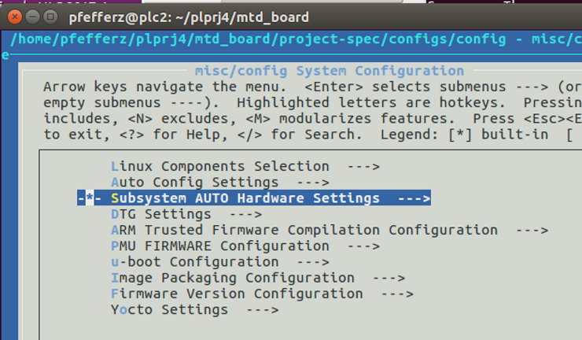

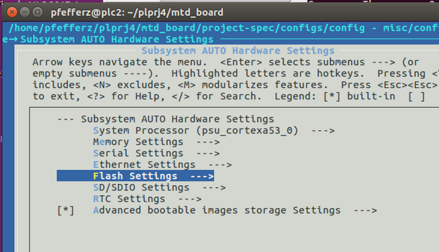

Change the name to "boot\_me" to test how this flows through:

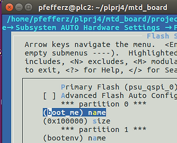

Examine it:

```
/home/pfefferz/tools/opt/pkg/petalinux/tools/linux-i386/petalinux/bin/dtc -I dtb images/linux/system.dtb
```

Saw "boot\_me"

```
			flash@0 {
				compatible = "jedec,spi-nor";
				reg = <0x0>;
				#address-cells = <0x1>;
				#size-cells = <0x1>;
				spi-max-frequency = <0x55d4a80>;
				spi-tx-bus-width = <0x4>;
				spi-rx-bus-width = <0x4>;

				partition@0x00000000 {
					label = "boot_me";
					reg = <0x0 0x100000>;
				};
```

So I "can" and "should" use petalinux-config to specify the partitions.

How do I figure out the name's and sizes of the partitions from the BOOT.bin or bootimage.bif?

bootimage.bif:

```
pfefferz@plc2:~/build$ cat out/bootimage.bif 
image : {
        [bootloader,destination_cpu=a53-0]/home/pfefferz/build/out/zynqmp_fsbl.elf
        [pmufw_image]/home/pfefferz/build/out/pmufw.elf
        [destination_cpu=a53-0, exception_level=el-3, trustzone] /home/pfefferz/build/out/bl31.elf
        [destination_cpu=a53-0, exception_level=el-2] /home/pfefferz/build/out/u-boot.elf
        [load=0x03000000]/home/pfefferz/build/out/uImage.bin
        [load=0x1407f000]/home/pfefferz/build/out/system.dtb
        [load=0x01000000]/home/pfefferz/build/out/uramdisk.image.gz
}
```

Can I look in the BOOT.bin?

I could match the first bytes of each image. No,

I can get all the partitions by passing **\-log trace** to bootgen:

```
$PATH_TO_XSCT/bootgen -log trace -arch zynqmp -image $PETALINUX_BUILD_OUT/bootimage.bif -w -o $PETALINUX_BUILD_OUT/BOOT.bin
```

```
~/build/out ~/build
/hdd/opt/Xilinx/SDK/2017.4/bin//bootgen -log trace -arch zynqmp -image /home/pfefferz/build/out/bootimage.bif -w -o /home/pfefferz/build/out/BOOT.bin
[TRACE]  : Command Line parsing started
[TRACE]  : Command: -log trace -arch zynqmp -image /home/pfefferz/build/out/bootimage.bif -w -o /home/pfefferz/build/out/BOOT.bin
[INFO]   : Command line parsing completed successfully
[INFO]   : Bootgen Version - 2017.4, Nov 23, 2017
[TRACE]  : BIF File: /home/pfefferz/build/out/bootimage.bif
[TRACE]  : BIF file parsing started
[TRACE]  : Creating ZYNQ MP Factory
[INFO]   : Filename: /home/pfefferz/build/out/zynqmp_fsbl.elf
[INFO]   : Parsing Partition Data
[INFO]   : Filename: /home/pfefferz/build/out/pmufw.elf
[INFO]   : Filename: /home/pfefferz/build/out/bl31.elf
[INFO]   : Parsing Partition Data
[INFO]   : Filename: /home/pfefferz/build/out/u-boot.elf
[INFO]   : Parsing Partition Data
[INFO]   : Filename: /home/pfefferz/build/out/uImage.bin
[INFO]   :  Load: 3000000
[INFO]   : Parsing Partition Data
[INFO]   : Filename: /home/pfefferz/build/out/system.dtb
[INFO]   :  Load: 1407f000
[INFO]   : Parsing Partition Data
[INFO]   : Filename: /home/pfefferz/build/out/uramdisk.image.gz
[INFO]   :  Load: 1000000
[INFO]   : Parsing Partition Data
[INFO]   : BIF file parsing completed successfully
[INFO]   : Building image - image
[TRACE]  : Setting Core as 2
[INFO]   : Building the Partition Header Table
[TRACE]  : Creating ZYNQ MP Factory
[INFO]   : After build 
           -- Dump of Binary Image ----
           00000000 Len: 000008b8 Res: 00000000 "BootHeader"
           00000000 Len: 00000040 Res: 00000000 "ImageHeaderTable"
           00000000 Len: 00000024 Res: 00000000 "ImageHeader zynqmp_fsbl.elf"
           00000000 Len: 00000020 Res: 00000000 "ImageHeader bl31.elf"
           00000000 Len: 00000020 Res: 00000000 "ImageHeader u-boot.elf"
           00000000 Len: 00000020 Res: 00000000 "ImageHeader uImage.bin"
           00000000 Len: 00000020 Res: 00000000 "ImageHeader system.dtb"
           00000000 Len: 00000028 Res: 000006c0 "ImageHeader uramdisk.image.gz"
           00000000 Len: 00000040 Res: 00000000 "PartitionHeader zynqmp_fsbl.elf.0"
           00000000 Len: 00000040 Res: 00000000 "PartitionHeader bl31.elf.0"
           00000000 Len: 00000040 Res: 00000000 "PartitionHeader bl31.elf.1"
           00000000 Len: 00000040 Res: 00000000 "PartitionHeader u-boot.elf.0"
           00000000 Len: 00000040 Res: 00000000 "PartitionHeader uImage.bin.0"
           00000000 Len: 00000040 Res: 00000000 "PartitionHeader system.dtb.0"
           00000000 Len: 00000040 Res: 00000000 "PartitionHeader uramdisk.image.gz.0"
           00000000 Len: 00000040 Res: 00001540 "PartitionHeader Null"
           00000000 Len: 00036de8 Res: 00000000 "zynqmp_fsbl.elf.0"
           00000000 Len: 00006000 Res: 00000000 "bl31.elf.0"
           00000000 Len: 00000020 Res: 00000000 "bl31.elf.1"
           00000000 Len: 00093e70 Res: 00000000 "u-boot.elf.0"
           00000000 Len: 00cc2a40 Res: 00000000 "uImage.bin.0"
           00000000 Len: 00008764 Res: 00000000 "system.dtb.0"
           00000000 Len: 0079bbcc Res: 00000000 "uramdisk.image.gz.0"
           -- End of Dump
[INFO]   : After align 
           -- Dump of Binary Image ----
           00000000 Len: 000008b8 Res: 00000000 "BootHeader"
           000008c0 Len: 00000040 Res: 00000000 "ImageHeaderTable"
           00000900 Len: 00000024 Res: 00000000 "ImageHeader zynqmp_fsbl.elf"
           00000940 Len: 00000020 Res: 00000000 "ImageHeader bl31.elf"
           00000980 Len: 00000020 Res: 00000000 "ImageHeader u-boot.elf"
           000009c0 Len: 00000020 Res: 00000000 "ImageHeader uImage.bin"
           00000a00 Len: 00000020 Res: 00000000 "ImageHeader system.dtb"
           00000a40 Len: 00000028 Res: 000006c0 "ImageHeader uramdisk.image.gz"
           00001100 Len: 00000040 Res: 00000000 "PartitionHeader zynqmp_fsbl.elf.0"
           00001140 Len: 00000040 Res: 00000000 "PartitionHeader bl31.elf.0"
           00001180 Len: 00000040 Res: 00000000 "PartitionHeader bl31.elf.1"
           000011c0 Len: 00000040 Res: 00000000 "PartitionHeader u-boot.elf.0"
           00001200 Len: 00000040 Res: 00000000 "PartitionHeader uImage.bin.0"
           00001240 Len: 00000040 Res: 00000000 "PartitionHeader system.dtb.0"
           00001280 Len: 00000040 Res: 00000000 "PartitionHeader uramdisk.image.gz.0"
           000012c0 Len: 00000040 Res: 00001540 "PartitionHeader Null"
           00002800 Len: 00036de8 Res: 00000000 "zynqmp_fsbl.elf.0"
           00039600 Len: 00006000 Res: 00000000 "bl31.elf.0"
           0003f600 Len: 00000020 Res: 00000000 "bl31.elf.1"
           0003f640 Len: 00093e70 Res: 00000000 "u-boot.elf.0"
           000d34c0 Len: 00cc2a40 Res: 00000000 "uImage.bin.0"
           00d95f00 Len: 00008764 Res: 00000000 "system.dtb.0"
           00d9e680 Len: 0079bbcc Res: 00000000 "uramdisk.image.gz.0"
           -- End of Dump
[INFO]   : Partition Information: 
[INFO]   : Image: zynqmp_fsbl.elf
[INFO]   :      1. Partition: zynqmp_fsbl.elf.0,  Size: 224744
[INFO]   : Image: bl31.elf
[INFO]   :      2. Partition: bl31.elf.0,  Size: 24576
[INFO]   :      3. Partition: bl31.elf.1,  Size: 32
[INFO]   : Image: u-boot.elf
[INFO]   :      4. Partition: u-boot.elf.0,  Size: 605808
[INFO]   : Image: uImage.bin
[INFO]   :      5. Partition: uImage.bin.0,  Size: 13380160
[INFO]   : Image: system.dtb
[INFO]   :      6. Partition: system.dtb.0,  Size: 34659
[INFO]   : Image: uramdisk.image.gz
[INFO]   :      7. Partition: uramdisk.image.gz.0,  Size: 7977929
[INFO]   : After Link 
           -- Dump of Binary Image ----
           00000000 Len: 000008b8 Res: 00000000 "BootHeader"
           000008c0 Len: 00000040 Res: 00000000 "ImageHeaderTable"
           00000900 Len: 00000024 Res: 00000000 "ImageHeader zynqmp_fsbl.elf"
           00000940 Len: 00000020 Res: 00000000 "ImageHeader bl31.elf"
           00000980 Len: 00000020 Res: 00000000 "ImageHeader u-boot.elf"
           000009c0 Len: 00000020 Res: 00000000 "ImageHeader uImage.bin"
           00000a00 Len: 00000020 Res: 00000000 "ImageHeader system.dtb"
           00000a40 Len: 00000028 Res: 000006c0 "ImageHeader uramdisk.image.gz"
           00001100 Len: 00000040 Res: 00000000 "PartitionHeader zynqmp_fsbl.elf.0"
           00001140 Len: 00000040 Res: 00000000 "PartitionHeader bl31.elf.0"
           00001180 Len: 00000040 Res: 00000000 "PartitionHeader bl31.elf.1"
           000011c0 Len: 00000040 Res: 00000000 "PartitionHeader u-boot.elf.0"
           00001200 Len: 00000040 Res: 00000000 "PartitionHeader uImage.bin.0"
           00001240 Len: 00000040 Res: 00000000 "PartitionHeader system.dtb.0"
           00001280 Len: 00000040 Res: 00000000 "PartitionHeader uramdisk.image.gz.0"
           000012c0 Len: 00000040 Res: 00001540 "PartitionHeader Null"
           00002800 Len: 00036de8 Res: 00000000 "zynqmp_fsbl.elf.0"
           00039600 Len: 00006000 Res: 00000000 "bl31.elf.0"
           0003f600 Len: 00000020 Res: 00000000 "bl31.elf.1"
           0003f640 Len: 00093e70 Res: 00000000 "u-boot.elf.0"
           000d34c0 Len: 00cc2a40 Res: 00000000 "uImage.bin.0"
           00d95f00 Len: 00008764 Res: 00000000 "system.dtb.0"
           00d9e680 Len: 0079bbcc Res: 00000000 "uramdisk.image.gz.0"
           -- End of Dump
~/build
```

```
ERROR: Partition "bootenv" for image "bootenv" is not in flash partition table in the subsystem configuration file.
ERROR: Please select "manual" if your flash partition of your image is outside the flash partition table set in the subsystem configuration file.
ERROR: Failed to generate kernel configuration files
ERROR: Failed to config project.
webtalk failed:PetaLinux statistics:extra lines detected:notsent_nofile!
webtalk failed:Failed to get PetaLinux usage statistics!
```

How can I get rid of PetaLinux managed partitions?

Select Manual:


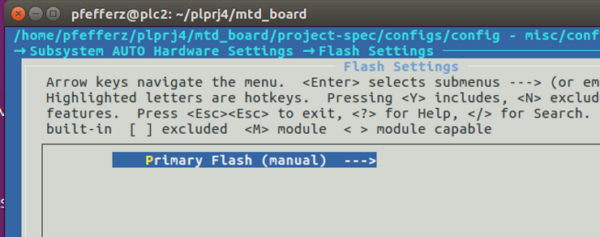

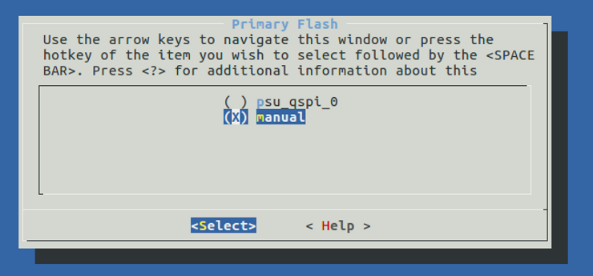

Run: petalinux-build

Check with:

```
/home/pfefferz/tools/opt/pkg/petalinux/tools/linux-i386/petalinux/bin/dtc -I dtb images/linux/system.dtb | grep flash -C40
```

Output:

```
		spi@ff0f0000 {
			u-boot,dm-pre-reloc;
			compatible = "xlnx,zynqmp-qspi-1.0";
			status = "okay";
			clock-names = "ref_clk", "pclk";
			interrupts = <0x0 0xf 0x4>;
			interrupt-parent = <0x4>;
			num-cs = <0x1>;
			reg = <0x0 0xff0f0000 0x0 0x1000 0x0 0xc0000000 0x0 0x8000000>;
			#address-cells = <0x1>;
			#size-cells = <0x0>;
			#stream-id-cells = <0x1>;
			iommus = <0x7 0x873>;
			power-domains = <0x16>;
			clocks = <0x3 0x35 0x3 0x1f>;
			is-dual = <0x1>;
			spi-rx-bus-width = <0x4>;
			spi-tx-bus-width = <0x4>;

			flash@0 {
				compatible = "jedec,spi-nor";
				#address-cells = <0x1>;
				#size-cells = <0x1>;
				reg = <0x0>;
				spi-tx-bus-width = <0x4>;
				spi-rx-bus-width = <0x4>;
				spi-max-frequency = <0x55d4a80>;
			};
		};
```

Partitions are gone!

My kernel now fails to boot!

Its hung at:

```
Virtual kernel memory layout:
    modules : 0xffffff8000000000 - 0xffffff8008000000   (   128 MB)
    vmalloc : 0xffffff8008000000 - 0xffffffbebfff0000   (   250 GB)
      .text : 0xffffff8008080000 - 0xffffff80083c0000   (  3328 KB)
    .rodata : 0xffffff80083c0000 - 0xffffff8008480000   (   768 KB)
      .init : 0xffffff8008480000 - 0xffffff80084c0000   (   256 KB)
      .data : 0xffffff80084c0000 - 0xffffff80084f7200   (   221 KB)
       .bss : 0xffffff80084f7200 - 0xffffff8008545e14   (   316 KB)
    fixed   : 0xffffffbefe7fd000 - 0xffffffbefec00000   (  4108 KB)
    PCI I/O : 0xffffffbefee00000 - 0xffffffbeffe00000   (    16 MB)
    vmemmap : 0xffffffbf00000000 - 0xffffffc000000000   (     4 GB maximum)
              0xffffffbf00000000 - 0xffffffbf02000000   (    32 MB actual)
    memory  : 0xffffffc000000000 - 0xffffffc080000000   (  2048 MB)
SLUB: HWalign=64, Order=0-3, MinObjects=0, CPUs=4, Nodes=1
Hierarchical RCU implementation.
        Build-time adjustment of leaf fanout to 64.
        RCU restricting CPUs from NR_CPUS=64 to nr_cpu_ids=4.
RCU: Adjusting geometry for rcu_fanout_leaf=64, nr_cpu_ids=4
NR_IRQS:64 nr_irqs:64 0
GIC: Adjusting CPU interface base to 0x00000000f902f000
GIC: Using split EOI/Deactivate mode
arm_arch_timer: Architected cp15 timer(s) running at 33.33MHz (phys).
clocksource: arch_sys_counter: mask: 0xffffffffffffff max_cycles: 0x7b0074340, max_idl
e_ns: 440795202884 ns
sched_clock: 56 bits at 33MHz, resolution 30ns, wraps every 2199023255543ns
Console: colour dummy device 80x25
console [tty0] enabled
bootconsole [cdns0] disabled
```

Add the following:

```
                        flash@0 {
                                compatible = "jedec,spi-nor";
                                #address-cells = <0x1>;
                                #size-cells = <0x1>;
                                reg = <0x0>;
                                spi-tx-bus-width = <0x4>;
                                spi-rx-bus-width = <0x4>;
                                spi-max-frequency = <0x55d4a80>;

                                partition@0x00000000 {
                                        label = "boot";
                                        reg = <0x0 0x200000>;
                                };
                        };
```

To: ./project-spec/meta-user/recipes-bsp/device-tree/files/system-user.dtsi

Force build the device-tree:

```
petalinux-build -c device-tree -x compile -f
```

Run petalinux-build again so that the system.dtb gets updated:

```
petalinux-build
```

Check

```
/home/pfefferz/tools/opt/pkg/petalinux/tools/linux-i386/petalinux/bin/dtc -I dtb images/linux/system.dtb | grep flash -A40
```

Boot

Still hung.

Try turning partitions back on. Maybe bootenv needs to be defined?

After using:

```
		spi@ff0f0000 {
			u-boot,dm-pre-reloc;
			compatible = "xlnx,zynqmp-qspi-1.0";
			status = "okay";
			clock-names = "ref_clk", "pclk";
			interrupts = <0x0 0xf 0x4>;
			interrupt-parent = <0x4>;
			num-cs = <0x1>;
			reg = <0x0 0xff0f0000 0x0 0x1000 0x0 0xc0000000 0x0 0x8000000>;
			#address-cells = <0x1>;
			#size-cells = <0x0>;
			#stream-id-cells = <0x1>;
			iommus = <0x7 0x873>;
			power-domains = <0x16>;
			clocks = <0x3 0x35 0x3 0x1f>;
			is-dual = <0x1>;
			spi-rx-bus-width = <0x4>;
			spi-tx-bus-width = <0x4>;

			flash@0 {
				compatible = "jedec,spi-nor";
				reg = <0x0>;
				#address-cells = <0x1>;
				#size-cells = <0x1>;
				spi-max-frequency = <0x55d4a80>;
				spi-tx-bus-width = <0x4>;
				spi-rx-bus-width = <0x4>;

				partition@0x00000000 {
					label = "boot";
					reg = <0x0 0x40000>;
				};

				partition@0x00040000 {
					label = "bootenv";
					reg = <0x40000 0x20000>;
				};

				partition@0x00060000 {
					label = "kernel";
					reg = <0x60000 0x600000>;
				};
			};
		};
```

The kernel boots again. Why?

We see:

```
root@mtd_board:~# mtdinfo
Count of MTD devices:           3
Present MTD devices:            mtd0, mtd1, mtd2
Sysfs interface supported:      yes
```

General flash / mtd debug:

```
root@mtd_board:~# mtd_debug info mtd1
mtd_debug: error!: open()
root@mtd_board:~# mtd_debug info mtd 
mtd_debug: error!: open()
root@mtd_board:~# mtd_debug info mtd2
mtd_debug: error!: open()
root@mtd_board:~# mtd_debug info mtd3
mtd_debug: error!: open()

root@mtd_board:~# flash_unlock /dev/mtd0
[ 2239.275663] m25p80 spi0.0: flash operation timed out
flash_unlock: error!: could not unlock device: /dev/mtd0

              error 110 (Connection timed out)
root@mtd_board:~# flash_unlock /dev/mtd1
[ 2284.879622] m25p80 spi0.0: flash operation timed out
flash_unlock: error!: could not unlock device: /dev/mtd1

              error 110 (Connection timed out)
```

Leaving things here.

**References**

-   Zynq UltraScale+ MPSoC Register Reference UG1087 (v1.5) December 21, 2017 @ [link](http://www.xilinx.com/html_docs/registers/ug1087/ug1087-zynq-ultrascale-registers.html)
    
-   Zynq UltraScale+ MPSoC Technical Reference Manual @ [link](http://www.xilinx.com/support/documentation/user_guides/ug1085-zynq-ultrascale-trm.pdf)
    
-   Zynq UltraScale+ Device Packaging and Pinouts Product Specification User Guide @ [link](http://www.xilinx.com/support/documentation/user_guides/ug1075-zynq-ultrascale-pkg-pinout.pdf)
    
-   Zynq UltraScale+ MPSoC Package Device Pinout Files @ [link](http://www.xilinx.com/support/package-pinout-files/zynq-ultrascale-plus-pkgs.html)
    
-   Micron's MT25QL01GBBB datasheet @ [link](http://www.micron.com/~/media/documents/products/data-sheet/nor-flash/serial-nor/mt25q/die-rev-b/mt25q_qlkt_l_01g_bbb_0.pdf)
    
-   MTD SPI NOR framework Linux kernel documentation @ [link](http://www.kernel.org/doc/Documentation/mtd/)
    
-   MTD device tree bindings @ [link](http://www.kernel.org/doc/Documentation/devicetree/bindings/mtd/)
    
-   Xilinx logo from [https://twitter.com/xilinxinc](http://twitter.com/xilinxinc) at [link](http://pbs.twimg.com/profile_images/535545777020338176/pEWdIYq__400x400.png)
    
-   printk-formats @ [link](http://www.kernel.org/doc/Documentation/printk-formats.txt)
    
-   [Free Online HTML Escape / Unescape Tool - FreeFormatter.com](http://www.freeformatter.com/html-escape.html)