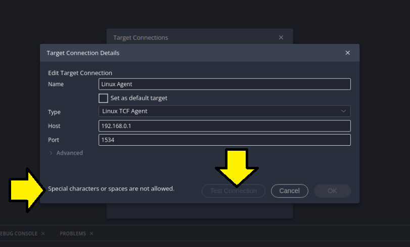
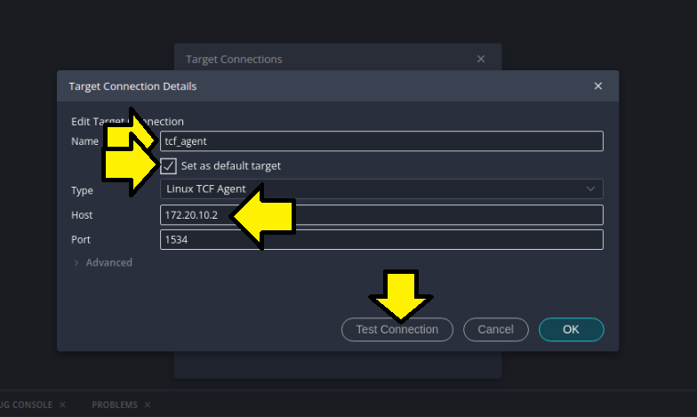
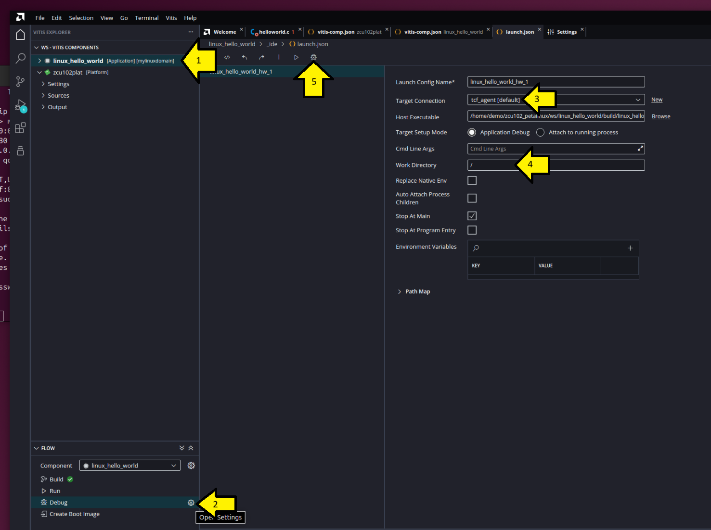
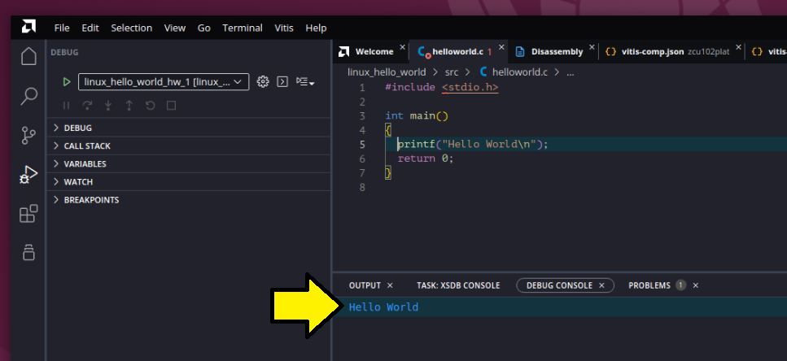

# Debugging Applications with Vitis Embedded Software 2025.1 on Zynq UltraScale+ MPSoC Using a PetaLinux JTAG-Booted Image

Provides a verified sequence of steps for using a PetaLinux Tools–built Linux image and debugging with Vitis 2025.1. It also fills gaps in the official *PetaLinux Tools Documentation: Reference Guide (UG1144)*: *Preparing the Build System for Debugging* and related sections, noting that the target must be running the **tcf-agent**.

# What You'll Need To Follow Exactly

- A [ZCU102](https://www.amd.com/en/products/adaptive-socs-and-fpgas/evaluation-boards/ek-u1-zcu102-g.html) Evaluation Kit
- **Vitis Embedded Software 2025.1** and **PetaLinux Tools 2025.1** from the [Unified Installer](https://www.xilinx.com/member/forms/download/xef.html?filename=FPGAs_AdaptiveSoCs_Unified_SDI_2025.1_0530_0145.tar)
- [SmartLynq](https://www.amd.com/en/products/adaptive-socs-and-fpgas/board-accessories/smartlynq-data-cable.html)
- Ethernet cable USB Type A to Type Micro-B connector for the UART-to-USB
- Run [Install PetaLinux 2025.1, build the ZCU102 SDK, and run it](../install-petalinux-2025-1-and-boot-zcu102/) to create Linux kernel, FSBL, TZ, and root filesystem images.

# 1. Create a Workspace Directory and Start Vitis

```
mkdir -p ~/zcu102_petalinux/ws/
cd ~/zcu102_petalinux/ws
source /home/demo/amd/v20251/2025.1/Vitis/settings64.sh 
vitis -w 
```

> [!TIP]
>
> Always launch Vitis with `-w` 

> [!TIP]
>
> See [Launch Vitis 2025.1 with Debugging](../vitis-2025-1-linux-debug) to launch Vitis with full debug.  
>
> 

# 2. Create a Linux Platform

1. Click **File > New Component > Platform** in Vitis

2. Set **Component name** to **hello_linux_zcu102_plat**. Click **Next**.

3. Leave **Hardware Design** selected, browse to **/home/demo/zcu102_petalinux/xilinx-zcu102-xsct-2025.1/project-spec/hw-description/system.xsa**. Click **Next**. 

   Under **Advanced Options** leave all entries blank. 

   > [!NOTE]
   >
   > Under Advanced Options you can select an **SDT Source Repo**, a **Board DTSI**, a **User DTSI**, whether to create a **DT ZOCL**. These can be left blank because Vitis creates what it needs from an XSA.  

   > [!NOTE]
   >
   > The UI will **pause** to create an **SDT** (system device tree) if one doesn't exist. You can view the SDT in a directory created under /tmp, for example: **/tmp/rigel_lopper_temp_platformdemo2345467373333033421/system/hw/sdt/system-top.dts**. This is an excellent way to look at physical addresses. See example below.

   > [!NOTE]
   >
   > You can see the commands Vitis is executing in a log like **/home/demo/.Xilinx/Vitis/2025.1/logs/vitis_pid_4743.log**.

4. Set the Operating system to **linux**,  leave other fields at their defaults, and click **Next**:

   - Processor: **psu_cortexa53** 

   - **[ x ]** Generate Boot artifacts

   - Generate Device Tree Blob (DTB) **[ x ]**

     - Custom Linux DTSI: **blank**

   - **[    ]** DT Overlay **unselected**. 

5. Click **Finish** on the **Summary** page:

   > Summary
   > The following new Platform component will be created.
   >
   > Name: zcu102plat
   > Workspace: /home/demo/zcu102_petalinux/ws
   > Component directory: /home/demo/zcu102_petalinux/ws/zcu102plat
   > Operating system: linux
   > Processor: psu_cortexa53
   > Boot artifacts: Generates FSBL for processor psu_cortexa53_0
   >
   > Note: A domain with selected operating system and processor will be added to the platform. The platform can be modified later to add new domains or change settings.

6. The UI will restart, and a blue line will show Vitis processing. **Let this finish.**   

# 3. Create Linux Hello World in Vitis

1. File > New Example > Linux Hello World

2. In the Linux Hello World tab, click **Create Application Component from Template**.

3. On the **Name and Location** screen, verify that the **Component name** is '**linux_hello_world**' and the **Component location** is **/home/demo/zcu102_petalinux/ws**. Click **Next**.

4. On the **Select Platform** screen, click on **zcu102plat** to highlight it. Click **Next**.

5. On the **Select Domain** screen, set **Name** to **mylinuxdomain**, **Display Name** to **mylinuxdomain**. Leave **OS** set to **linux** and **Processor** set to **psu_cortexa53**. Click **Next**.

6. On the Sysroot screen

   1. Enter the Sysroot location: **/home/demo/zcu102_petalinux/sdk/sysroots/cortexa72-cortexa53-amd-linux** 
   2. Select **[x] Use sysroot toolchain for the application build** and use directory **/home/demo/zcu102_petalinux/sdk/sysroots/x86_64-petalinux-linux/usr/bin/aarch64-amd-linux**.
   3. Select **[x] Update Workspace Preference**. 
   4. Click **Next**.

7. Check the Summary screen and click Finish

   > Summary
   > The following new application component will be created:
   > Name		                 linux_hello_world
   > Workspace                        /home/demo/zcu102_petalinux/ws
   > Component directory      /home/demo/zcu102_petalinux/ws/linux_hello_world
   > Platform                            zcu102plat
   > Domain                             mylinuxdomain (OS:linux, Processor:psu_cortexa53)

# 4. Extract Sysroot

```
cd /home/demo/zcu102_petalinux/xilinx-zcu102-xsct-2025.1/images/linux/
./sdk.sh -d /home/demo/zcu102_petalinux/sdk -y
```

You should see output like:

```
PetaLinux SDK installer version 2025.1
======================================
You are about to install the SDK to "/home/demo/zcu102_petalinux/sdk". Proceed [Y/n]? Y
Extracting SDK.....................................................................................................................done
Setting it up...done
SDK has been successfully set up and is ready to be used.
Each time you wish to use the SDK in a new shell session, you need to source the environment setup script e.g.
 $ . /home/demo/zcu102_petalinux/sdk/environment-setup-cortexa72-cortexa53-amd-linux
```

# 5. Boot Linux Via SmartLynq

1. Connect the ZCU102's Ethernet and UART-to-USB to a Host.

2. Run `minicom` to get a serial port. See [Configure minicom for a USB-to-Serial Converter](../configure-minicom-for-a-usb-to-serial-converter).

3. JTAG Boot with:

   ```
   cd ~/zcu102_petalinux/xilinx-zcu102-xsct-2025.1
   source /home/demo/petalinux_2025.1/2025.1/PetaLinux/tool/settings.sh
   petalinux-boot jtag --kernel --rootfs images/linux/rootfs.cpio.gz.u-boot --hw_server-url TCP:10.0.0.2:3121
   ```

   > [!IMPORTANT]
   >
   > If you don't see `xilinx-zcu102-xsct-20251 login:` after booting, you may not have specified a rootfs. If you run `petalinux-boot jtag --kernel --hw_server-url TCP:10.0.0.2:3121` you'll boot `images/linux/ramdisk.cpio.gz.u-boot` that does not include **tcf-agent**.
   >
   > Without **tcf-agent** included and running, Vitis will not be able to connect to the target. 

4. Give the Ubuntu host 172.20.10.1:

   ```
   ip link show # to get enx000ec6df71ef
   sudo ip addr add 172.20.10.1/16 dev enx000ec6df71ef
   ```

5. Give the target 172.20.10.2:

   ```
   ip link show # to get end0
   sudo ip addr add 172.20.10.2/16 dev end0
   ```

6. Test that the Ubuntu host can ping the target:

   ```
   ping 172.20.10.2
   ```

# 6. Workaround TCF Agent Issue

## Issue

You can't test the **TCF Agent** because the default Name, **Linux Agent**, has a space in it.  You'll see:

 

## Workaround

1. Click Cancel

2. Click + in the Target Connections pop-up.

C:\csswebsite\help\linux-vitis-hello-world-2025-1

3. Use a Name like, **tcf_agent**, that does not have spaces in it. Select **[x] Set as default target**, use **172.20.10.20** as the **Host**. Click **Test Connection**.

   

   You should see a pop-up named **Connection Successful** with text **Successfully established connection to 'Linux TCF Agent' on the host 172.20.10.2**. Click OK. 

# 7. Debug the Linux Hello, World Application from Vitis

1. Restart vitis if you closed it:

   ```
   mkdir -p ~/zcu102_petalinux/ws/
   cd ~/zcu102_petalinux/ws
   source /home/demo/amd/v20251/2025.1/Vitis/settings64.sh 
   vitis -w .
   ```

2. In **VITIS EXPLORER** select **linux_hello_world**.

   - Select only build application (manually build platform if needed). Click **Save as Workspace Preferences** if you see a pop-up.

3. In **FLOW** select the **gear** next to **Debug** to **Open Settings** and set them like this:

    

You should see:



# References

- [Creating a Hello World Application for Linux in the Vitis IDE](https://docs.amd.com/r/en-US/ug1165-zynq-embedded-design-tutorial/Example-5-Creating-a-Hello-World-Application-for-Linux-in-the-Vitis-IDE)

- Automatically Created System Device Tree

  This is the system device tree automatically created when creating a platform in Vitis: 

  ```
  demo@demo:~/zcu102_petalinux/ws$ cat /tmp/rigel_lopper_temp_platformdemo2345467373333033421/system/hw/sdt/system-top.dts
  /dts-v1/;
  #include "zynqmp.dtsi"
  #include "zynqmp-u-boot.dtsi"
  #include "zynqmp-clk-ccf.dtsi"
  #include "pl.dtsi"
  #include "pcw.dtsi"
  / {
  	board = "zcu102";
  	compatible = "xlnx,zcu102";
  	device_id = "xczu9eg";
  	slrcount = <1>;
  	family = "ZynqMP";
  	speed_grade = "2";
  	psu_ocm_ram_0_memory: memory@FFFC0000 {
  		compatible = "xlnx,psu-ocm-ram-0-1.0" , "mmio-sram";
  		xlnx,ip-name = "psu_ocm_ram_0";
  		device_type = "memory";
  		memory_type = "memory";
  		reg = <0x0 0xFFFC0000 0x0 0x40000>;
  	};
  	psu_r5_ddr_0_memory: memory@100000 {
  		compatible = "xlnx,psu-ddr-1.0";
  		xlnx,ip-name = "psu_ddr";
  		device_type = "memory";
  		memory_type = "memory";
  		reg = <0x0 0x100000 0x0 0x7FEFFFFF>;
  	};
  	psu_ddr_0_memory: memory@0 {
  		compatible = "xlnx,psu-ddr-1.0";
  		xlnx,ip-name = "psu_ddr";
  		device_type = "memory";
  		memory_type = "memory";
  		reg = <0x0 0x0 0x0 0x7FF00000>, <0x0 0x7FF00000 0x0 0x100000>;
  	};
  	psu_ddr_1_memory: memory@800000000 {
  		compatible = "xlnx,psu-ddr-1.0";
  		xlnx,ip-name = "psu_ddr";
  		device_type = "memory";
  		memory_type = "memory";
  		reg = <0x00000008 0x00000000 0x0 0x80000000>;
  	};
  	psu_qspi_linear_0_memory: memory@c0000000 {
  		compatible = "xlnx,psu-qspi-linear-1.0-memory";
  		xlnx,ip-name = "psu_qspi_linear";
  		device_type = "memory";
  		memory_type = "linear_flash";
  		reg = <0x0 0xc0000000 0x0 0x20000000>;
  	};
  	chosen {
  		bootargs = "earlycon console=ttyPS0,115200 clk_ignore_unused init_fatal_sh=1";
  		stdout-path = "serial0:115200n8";
  	};
  	aliases {
  		serial0 = &uart0;
  		spi0 = &qspi;
  		serial1 = &uart1;
  		serial2 = &coresight_0;
  		i2c0 = &i2c1;
  		i2c1 = &i2c0;
  		ethernet0 = &gem3;
  	};
  	cpus_a53: cpus-a53@0 {
  		compatible = "cpus,cluster";
  		address-map = <0x0 0xf0000000 &amba 0x0 0xf0000000 0x0 0x10000000>, 
  			      <0x0 0xf9000000 &amba_apu 0x0 0xf9000000 0x0 0x80000>, 
  			      <0x0 0x0 &zynqmp_reset 0x0 0x0 0x0 0x0>, 
  			      <0x0 0x0 &pinctrl0 0x0 0x0 0x0 0x0>, 
  			      <0x0 0xffa50800 &ams_ps 0x0 0xffa50800 0x0 0x400>, 
  			      <0x0 0xffa50c00 &ams_pl 0x0 0xffa50c00 0x0 0x400>, 
  			      <0x0 0xFFFC0000 &psu_ocm_ram_0_memory 0x0 0xFFFC0000 0x0 0x40000>, 
  			      <0x0 0xff300000 &ipi0 0x0 0xff300000 0x0 0x10000>, 
  			      <0x0 0xff340000 &ipi7 0x0 0xff340000 0x0 0x10000>, 
  			      <0x0 0xff350000 &ipi8 0x0 0xff350000 0x0 0x10000>, 
  			      <0x0 0x0 &psu_ddr_0_memory 0x0 0x0 0x0 0x7FF00000>, 
  			      <0x00000008 0x00000000 &psu_ddr_1_memory 0x00000008 0x00000000 0x0 0x80000000>, 
  			      <0x0 0x80020000 &axi_intc_0 0x0 0x80020000 0x0 0x1000>, 
  			      <0x0 0xf9010000 &gic_a53 0x0 0xf9010000 0x0 0x70000>, 
  			      <0x0 0xffa80000 &lpd_dma_chan1 0x0 0xffa80000 0x0 0x10000>, 
  			      <0x0 0xffa90000 &lpd_dma_chan2 0x0 0xffa90000 0x0 0x10000>, 
  			      <0x0 0xffaa0000 &lpd_dma_chan3 0x0 0xffaa0000 0x0 0x10000>, 
  			      <0x0 0xffab0000 &lpd_dma_chan4 0x0 0xffab0000 0x0 0x10000>, 
  			      <0x0 0xffac0000 &lpd_dma_chan5 0x0 0xffac0000 0x0 0x10000>, 
  			      <0x0 0xffad0000 &lpd_dma_chan6 0x0 0xffad0000 0x0 0x10000>, 
  			      <0x0 0xffae0000 &lpd_dma_chan7 0x0 0xffae0000 0x0 0x10000>, 
  			      <0x0 0xffaf0000 &lpd_dma_chan8 0x0 0xffaf0000 0x0 0x10000>, 
  			      <0x0 0xfd360000 &psu_afi_0 0x0 0xfd360000 0x0 0x10000>, 
  			      <0x0 0xfd370000 &psu_afi_1 0x0 0xfd370000 0x0 0x10000>, 
  			      <0x0 0xfd380000 &psu_afi_2 0x0 0xfd380000 0x0 0x10000>, 
  			      <0x0 0xfd390000 &psu_afi_3 0x0 0xfd390000 0x0 0x10000>, 
  			      <0x0 0xfd3a0000 &psu_afi_4 0x0 0xfd3a0000 0x0 0x10000>, 
  			      <0x0 0xfd3b0000 &psu_afi_5 0x0 0xfd3b0000 0x0 0x10000>, 
  			      <0x0 0xff9b0000 &psu_afi_6 0x0 0xff9b0000 0x0 0x10000>, 
  			      <0x0 0xffa50000 &xilinx_ams 0x0 0xffa50000 0x0 0x10000>, 
  			      <0x0 0xfd0b0000 &perf_monitor_ddr 0x0 0xfd0b0000 0x0 0x10000>, 
  			      <0x0 0xffa00000 &perf_monitor_ocm 0x0 0xffa00000 0x0 0x10000>, 
  			      <0x0 0xffa10000 &perf_monitor_lpd 0x0 0xffa10000 0x0 0x10000>, 
  			      <0x0 0xfd490000 &perf_monitor_cci 0x0 0xfd490000 0x0 0x10000>, 
  			      <0x0 0xfd5c0000 &psu_apu 0x0 0xfd5c0000 0x0 0x10000>, 
  			      <0x0 0xff070000 &can1 0x0 0xff070000 0x0 0x10000>, 
  			      <0x0 0xfd6e0000 &psu_cci_gpv 0x0 0xfd6e0000 0x0 0x10000>, 
  			      <0x0 0xfd5e0000 &psu_cci_reg 0x0 0xfd5e0000 0x0 0x10000>, 
  			      <0x0 0xfe800000 &coresight_0 0x0 0xfe800000 0x0 0x800000>, 
  			      <0x0 0xfd1a0000 &psu_crf_apb 0x0 0xfd1a0000 0x0 0x140000>, 
  			      <0x0 0xff5e0000 &psu_crl_apb 0x0 0xff5e0000 0x0 0x280000>, 
  			      <0x0 0xffca0000 &psu_csu_0 0x0 0xffca0000 0x0 0x10000>, 
  			      <0x0 0xffc80000 &csudma_0 0x0 0xffc80000 0x0 0x20000>, 
  			      <0x0 0xff380000 &psu_ctrl_ipi 0x0 0xff380000 0x0 0x80000>, 
  			      <0x0 0xfd080000 &psu_ddr_phy 0x0 0xfd080000 0x0 0x10000>, 
  			      <0x0 0xfd090000 &psu_ddr_qos_ctrl 0x0 0xfd090000 0x0 0x10000>, 
  			      <0x0 0xfd000000 &psu_ddr_xmpu0_cfg 0x0 0xfd000000 0x0 0x10000>, 
  			      <0x0 0xfd010000 &psu_ddr_xmpu1_cfg 0x0 0xfd010000 0x0 0x10000>, 
  			      <0x0 0xfd020000 &psu_ddr_xmpu2_cfg 0x0 0xfd020000 0x0 0x10000>, 
  			      <0x0 0xfd030000 &psu_ddr_xmpu3_cfg 0x0 0xfd030000 0x0 0x10000>, 
  			      <0x0 0xfd040000 &psu_ddr_xmpu4_cfg 0x0 0xfd040000 0x0 0x10000>, 
  			      <0x0 0xfd050000 &psu_ddr_xmpu5_cfg 0x0 0xfd050000 0x0 0x10000>, 
  			      <0x0 0xfd070000 &mc 0x0 0xfd070000 0x0 0x1000>, 
  			      <0x0 0xfd4a0000 &zynqmp_dpsub 0x0 0xfd4a0000 0x0 0x10000>, 
  			      <0x0 0xfd4c0000 &zynqmp_dpdma 0x0 0xfd4c0000 0x0 0x10000>, 
  			      <0x0 0xffcc0000 &psu_efuse 0x0 0xffcc0000 0x0 0x10000>, 
  			      <0x0 0xff0e0000 &gem3 0x0 0xff0e0000 0x0 0x10000>, 
  			      <0x0 0xfd700000 &psu_fpd_gpv 0x0 0xfd700000 0x0 0x100000>, 
  			      <0x0 0xfd610000 &psu_fpd_slcr 0x0 0xfd610000 0x0 0x80000>, 
  			      <0x0 0xfd690000 &psu_fpd_slcr_secure 0x0 0xfd690000 0x0 0x40000>, 
  			      <0x0 0xfd5d0000 &psu_fpd_xmpu_cfg 0x0 0xfd5d0000 0x0 0x10000>, 
  			      <0x0 0xfd4f0000 &psu_fpd_xmpu_sink 0x0 0xfd4f0000 0x0 0x10000>, 
  			      <0x0 0xfd500000 &fpd_dma_chan1 0x0 0xfd500000 0x0 0x10000>, 
  			      <0x0 0xfd510000 &fpd_dma_chan2 0x0 0xfd510000 0x0 0x10000>, 
  			      <0x0 0xfd520000 &fpd_dma_chan3 0x0 0xfd520000 0x0 0x10000>, 
  			      <0x0 0xfd530000 &fpd_dma_chan4 0x0 0xfd530000 0x0 0x10000>, 
  			      <0x0 0xfd540000 &fpd_dma_chan5 0x0 0xfd540000 0x0 0x10000>, 
  			      <0x0 0xfd550000 &fpd_dma_chan6 0x0 0xfd550000 0x0 0x10000>, 
  			      <0x0 0xfd560000 &fpd_dma_chan7 0x0 0xfd560000 0x0 0x10000>, 
  			      <0x0 0xfd570000 &fpd_dma_chan8 0x0 0xfd570000 0x0 0x10000>, 
  			      <0x0 0xff0a0000 &gpio 0x0 0xff0a0000 0x0 0x10000>, 
  			      <0x0 0xfd4b0000 &gpu 0x0 0xfd4b0000 0x0 0x10000>, 
  			      <0x0 0xff020000 &i2c0 0x0 0xff020000 0x0 0x10000>, 
  			      <0x0 0xff030000 &i2c1 0x0 0xff030000 0x0 0x10000>, 
  			      <0x0 0xff250000 &psu_iou_scntr 0x0 0xff250000 0x0 0x10000>, 
  			      <0x0 0xff260000 &psu_iou_scntrs 0x0 0xff260000 0x0 0x10000>, 
  			      <0x0 0xff240000 &psu_iousecure_slcr 0x0 0xff240000 0x0 0x10000>, 
  			      <0x0 0xff180000 &psu_iouslcr_0 0x0 0xff180000 0x0 0xc0000>, 
  			      <0x0 0xff410000 &psu_lpd_slcr 0x0 0xff410000 0x0 0xa0000>, 
  			      <0x0 0xff4b0000 &psu_lpd_slcr_secure 0x0 0xff4b0000 0x0 0x30000>, 
  			      <0x0 0xff980000 &lpd_xppu 0x0 0xff980000 0x0 0x10000>, 
  			      <0x0 0xff9c0000 &psu_lpd_xppu_sink 0x0 0xff9c0000 0x0 0x10000>, 
  			      <0x0 0xffcf0000 &psu_mbistjtag 0x0 0xffcf0000 0x0 0x10000>, 
  			      <0x0 0xff990000 &psu_message_buffers 0x0 0xff990000 0x0 0x10000>, 
  			      <0x0 0xff960000 &ocm 0x0 0xff960000 0x0 0x10000>, 
  			      <0x0 0xffa70000 &psu_ocm_xmpu_cfg 0x0 0xffa70000 0x0 0x10000>, 
  			      <0x0 0xfd0e0000 &pcie 0x0 0xfd0e0000 0x0 0x10000>, 
  			      <0x0 0xfd480000 &psu_pcie_attrib_0 0x0 0xfd480000 0x0 0x10000>, 
  			      <0x0 0xfd0f0000 &psu_pcie_dma 0x0 0xfd0f0000 0x0 0x10000>, 
  			      <0x00000006 0x00000000 &psu_pcie_high1 0x00000006 0x00000000 0x00000002 0x00000000>, 
  			      <0x00000080 0x00000000 &psu_pcie_high2 0x00000080 0x00000000 0x00000040 0x00000000>, 
  			      <0x0 0xe0000000 &psu_pcie_low 0x0 0xe0000000 0x0 0x10000000>, 
  			      <0x0 0xffd80000 &psu_pmu_global_0 0x0 0xffd80000 0x0 0x40000>, 
  			      <0x0 0xff0f0000 &qspi 0x0 0xff0f0000 0x0 0x10000>, 
  			      <0x0 0xc0000000 &psu_qspi_linear_0_memory 0x0 0xc0000000 0x0 0x20000000>, 
  			      <0x0 0xffe00000 &psu_r5_0_atcm_global 0x0 0xffe00000 0x0 0x10000>, 
  			      <0x0 0xffe20000 &psu_r5_0_btcm_global 0x0 0xffe20000 0x0 0x10000>, 
  			      <0x0 0xffe90000 &psu_r5_1_atcm_global 0x0 0xffe90000 0x0 0x10000>, 
  			      <0x0 0xffeb0000 &psu_r5_1_btcm_global 0x0 0xffeb0000 0x0 0x10000>, 
  			      <0x0 0xffe00000 &psu_r5_tcm_ram_global 0x0 0xffe00000 0x0 0x40000>, 
  			      <0x0 0xff9a0000 &psu_rpu 0x0 0xff9a0000 0x0 0x10000>, 
  			      <0x0 0xffce0000 &psu_rsa 0x0 0xffce0000 0x0 0x10000>, 
  			      <0x0 0xffa60000 &rtc 0x0 0xffa60000 0x0 0x10000>, 
  			      <0x0 0xfd0c0000 &sata 0x0 0xfd0c0000 0x0 0x10000>, 
  			      <0x0 0xff170000 &sdhci1 0x0 0xff170000 0x0 0x10000>, 
  			      <0x0 0xfd400000 &psgtr 0x0 0xfd400000 0x0 0x80000>, 
  			      <0x0 0xfd3d0000 &psu_siou 0x0 0xfd3d0000 0x0 0x10000>, 
  			      <0x0 0xfd800000 &smmu 0x0 0xfd800000 0x0 0x800000>, 
  			      <0x0 0xfd5f0000 &psu_smmu_reg 0x0 0xfd5f0000 0x0 0x10000>, 
  			      <0x0 0xff110000 &ttc0 0x0 0xff110000 0x0 0x10000>, 
  			      <0x0 0xff120000 &ttc1 0x0 0xff120000 0x0 0x10000>, 
  			      <0x0 0xff130000 &ttc2 0x0 0xff130000 0x0 0x10000>, 
  			      <0x0 0xff140000 &ttc3 0x0 0xff140000 0x0 0x10000>, 
  			      <0x0 0xff000000 &uart0 0x0 0xff000000 0x0 0x10000>, 
  			      <0x0 0xff010000 &uart1 0x0 0xff010000 0x0 0x10000>, 
  			      <0x0 0xff9d0000 &usb0 0x0 0xff9d0000 0x0 0x10000>, 
  			      <0x0 0xfe200000 &dwc3_0 0x0 0xfe200000 0x0 0x100000>, 
  			      <0x0 0xff150000 &lpd_watchdog 0x0 0xff150000 0x0 0x10000>, 
  			      <0x0 0xfd4d0000 &watchdog0 0x0 0xfd4d0000 0x0 0x10000>;
  		#ranges-address-cells = <0x2>;
  		#ranges-size-cells = <0x2>;
  	};
  	cpus_r5_0: cpus-r5@0 {
  		compatible = "cpus,cluster";
  		address-map = <0xf0000000 &amba 0xf0000000 0x10000000>, 
  			      <0xf9000000 &amba_rpu 0xf9000000 0x3000>, 
  			      <0x0 &zynqmp_reset 0x0 0x0>, 
  			      <0xFFFC0000 &psu_ocm_ram_0_memory 0xFFFC0000 0x40000>, 
  			      <0xff310000 &ipi1 0xff310000 0x10000>, 
  			      <0x100000 &psu_r5_ddr_0_memory 0x100000 0x7FEFFFFF>, 
  			      <0x80020000 &axi_intc_0 0x80020000 0x1000>, 
  			      <0xffa80000 &lpd_dma_chan1 0xffa80000 0x10000>, 
  			      <0xffa90000 &lpd_dma_chan2 0xffa90000 0x10000>, 
  			      <0xffaa0000 &lpd_dma_chan3 0xffaa0000 0x10000>, 
  			      <0xffab0000 &lpd_dma_chan4 0xffab0000 0x10000>, 
  			      <0xffac0000 &lpd_dma_chan5 0xffac0000 0x10000>, 
  			      <0xffad0000 &lpd_dma_chan6 0xffad0000 0x10000>, 
  			      <0xffae0000 &lpd_dma_chan7 0xffae0000 0x10000>, 
  			      <0xffaf0000 &lpd_dma_chan8 0xffaf0000 0x10000>, 
  			      <0xfd360000 &psu_afi_0 0xfd360000 0x10000>, 
  			      <0xfd370000 &psu_afi_1 0xfd370000 0x10000>, 
  			      <0xfd380000 &psu_afi_2 0xfd380000 0x10000>, 
  			      <0xfd390000 &psu_afi_3 0xfd390000 0x10000>, 
  			      <0xfd3a0000 &psu_afi_4 0xfd3a0000 0x10000>, 
  			      <0xfd3b0000 &psu_afi_5 0xfd3b0000 0x10000>, 
  			      <0xff9b0000 &psu_afi_6 0xff9b0000 0x10000>, 
  			      <0xffa50000 &xilinx_ams 0xffa50000 0x10000>, 
  			      <0xfd0b0000 &perf_monitor_ddr 0xfd0b0000 0x10000>, 
  			      <0xffa00000 &perf_monitor_ocm 0xffa00000 0x10000>, 
  			      <0xffa10000 &perf_monitor_lpd 0xffa10000 0x10000>, 
  			      <0xfd490000 &perf_monitor_cci 0xfd490000 0x10000>, 
  			      <0xfd5c0000 &psu_apu 0xfd5c0000 0x10000>, 
  			      <0xff070000 &can1 0xff070000 0x10000>, 
  			      <0xfd6e0000 &psu_cci_gpv 0xfd6e0000 0x10000>, 
  			      <0xfd5e0000 &psu_cci_reg 0xfd5e0000 0x10000>, 
  			      <0xfe800000 &coresight_0 0xfe800000 0x800000>, 
  			      <0xfd1a0000 &psu_crf_apb 0xfd1a0000 0x140000>, 
  			      <0xff5e0000 &psu_crl_apb 0xff5e0000 0x280000>, 
  			      <0xffca0000 &psu_csu_0 0xffca0000 0x10000>, 
  			      <0xffc80000 &csudma_0 0xffc80000 0x20000>, 
  			      <0xff380000 &psu_ctrl_ipi 0xff380000 0x80000>, 
  			      <0xfd080000 &psu_ddr_phy 0xfd080000 0x10000>, 
  			      <0xfd090000 &psu_ddr_qos_ctrl 0xfd090000 0x10000>, 
  			      <0xfd000000 &psu_ddr_xmpu0_cfg 0xfd000000 0x10000>, 
  			      <0xfd010000 &psu_ddr_xmpu1_cfg 0xfd010000 0x10000>, 
  			      <0xfd020000 &psu_ddr_xmpu2_cfg 0xfd020000 0x10000>, 
  			      <0xfd030000 &psu_ddr_xmpu3_cfg 0xfd030000 0x10000>, 
  			      <0xfd040000 &psu_ddr_xmpu4_cfg 0xfd040000 0x10000>, 
  			      <0xfd050000 &psu_ddr_xmpu5_cfg 0xfd050000 0x10000>, 
  			      <0xfd070000 &mc 0xfd070000 0x1000>, 
  			      <0xfd4a0000 &zynqmp_dpsub 0xfd4a0000 0x10000>, 
  			      <0xfd4c0000 &zynqmp_dpdma 0xfd4c0000 0x10000>, 
  			      <0xffcc0000 &psu_efuse 0xffcc0000 0x10000>, 
  			      <0xff0e0000 &gem3 0xff0e0000 0x10000>, 
  			      <0xfd700000 &psu_fpd_gpv 0xfd700000 0x100000>, 
  			      <0xfd610000 &psu_fpd_slcr 0xfd610000 0x80000>, 
  			      <0xfd690000 &psu_fpd_slcr_secure 0xfd690000 0x40000>, 
  			      <0xfd5d0000 &psu_fpd_xmpu_cfg 0xfd5d0000 0x10000>, 
  			      <0xfd4f0000 &psu_fpd_xmpu_sink 0xfd4f0000 0x10000>, 
  			      <0xfd500000 &fpd_dma_chan1 0xfd500000 0x10000>, 
  			      <0xfd510000 &fpd_dma_chan2 0xfd510000 0x10000>, 
  			      <0xfd520000 &fpd_dma_chan3 0xfd520000 0x10000>, 
  			      <0xfd530000 &fpd_dma_chan4 0xfd530000 0x10000>, 
  			      <0xfd540000 &fpd_dma_chan5 0xfd540000 0x10000>, 
  			      <0xfd550000 &fpd_dma_chan6 0xfd550000 0x10000>, 
  			      <0xfd560000 &fpd_dma_chan7 0xfd560000 0x10000>, 
  			      <0xfd570000 &fpd_dma_chan8 0xfd570000 0x10000>, 
  			      <0xff0a0000 &gpio 0xff0a0000 0x10000>, 
  			      <0xfd4b0000 &gpu 0xfd4b0000 0x10000>, 
  			      <0xff020000 &i2c0 0xff020000 0x10000>, 
  			      <0xff030000 &i2c1 0xff030000 0x10000>, 
  			      <0xff250000 &psu_iou_scntr 0xff250000 0x10000>, 
  			      <0xff260000 &psu_iou_scntrs 0xff260000 0x10000>, 
  			      <0xff240000 &psu_iousecure_slcr 0xff240000 0x10000>, 
  			      <0xff180000 &psu_iouslcr_0 0xff180000 0xc0000>, 
  			      <0xff410000 &psu_lpd_slcr 0xff410000 0xa0000>, 
  			      <0xff4b0000 &psu_lpd_slcr_secure 0xff4b0000 0x30000>, 
  			      <0xff980000 &lpd_xppu 0xff980000 0x10000>, 
  			      <0xff9c0000 &psu_lpd_xppu_sink 0xff9c0000 0x10000>, 
  			      <0xffcf0000 &psu_mbistjtag 0xffcf0000 0x10000>, 
  			      <0xff990000 &psu_message_buffers 0xff990000 0x10000>, 
  			      <0xff960000 &ocm 0xff960000 0x10000>, 
  			      <0xffa70000 &psu_ocm_xmpu_cfg 0xffa70000 0x10000>, 
  			      <0xfd0e0000 &pcie 0xfd0e0000 0x10000>, 
  			      <0xfd480000 &psu_pcie_attrib_0 0xfd480000 0x10000>, 
  			      <0xfd0f0000 &psu_pcie_dma 0xfd0f0000 0x10000>, 
  			      <0xe0000000 &psu_pcie_low 0xe0000000 0x10000000>, 
  			      <0xffd80000 &psu_pmu_global_0 0xffd80000 0x40000>, 
  			      <0xff0f0000 &qspi 0xff0f0000 0x10000>, 
  			      <0xc0000000 &psu_qspi_linear_0_memory 0xc0000000 0x20000000>, 
  			      <0xff9a0000 &psu_rpu 0xff9a0000 0x10000>, 
  			      <0xffce0000 &psu_rsa 0xffce0000 0x10000>, 
  			      <0xffa60000 &rtc 0xffa60000 0x10000>, 
  			      <0xfd0c0000 &sata 0xfd0c0000 0x10000>, 
  			      <0xff170000 &sdhci1 0xff170000 0x10000>, 
  			      <0xfd400000 &psgtr 0xfd400000 0x80000>, 
  			      <0xfd3d0000 &psu_siou 0xfd3d0000 0x10000>, 
  			      <0xfd800000 &smmu 0xfd800000 0x800000>, 
  			      <0xfd5f0000 &psu_smmu_reg 0xfd5f0000 0x10000>, 
  			      <0xff110000 &ttc0 0xff110000 0x10000>, 
  			      <0xff120000 &ttc1 0xff120000 0x10000>, 
  			      <0xff130000 &ttc2 0xff130000 0x10000>, 
  			      <0xff140000 &ttc3 0xff140000 0x10000>, 
  			      <0xff000000 &uart0 0xff000000 0x10000>, 
  			      <0xff010000 &uart1 0xff010000 0x10000>, 
  			      <0xff9d0000 &usb0 0xff9d0000 0x10000>, 
  			      <0xfe200000 &dwc3_0 0xfe200000 0x100000>, 
  			      <0xff150000 &lpd_watchdog 0xff150000 0x10000>, 
  			      <0xfd4d0000 &watchdog0 0xfd4d0000 0x10000>, 
  			      <0xffcb0000 &csuwdt_0 0xffcb0000 0x10000>, 
  			      <0x0 &psu_r5_0_atcm 0x0 0x10000>, 
  			      <0x20000 &psu_r5_0_btcm 0x20000 0x10000>, 
  			      <0x0 &psu_r5_tcm_ram_0 0x0 0x40000>, 
  			      <0xf9000000 &gic_r5 0xf9000000 0x10000>;
  		#ranges-address-cells = <0x1>;
  		#ranges-size-cells = <0x1>;
  	};
  	cpus_r5_1: cpus-r5@1 {
  		compatible = "cpus,cluster";
  		address-map = <0xf0000000 &amba 0xf0000000 0x10000000>, 
  			      <0xf9000000 &amba_rpu 0xf9000000 0x3000>, 
  			      <0x0 &zynqmp_reset 0x0 0x0>, 
  			      <0xFFFC0000 &psu_ocm_ram_0_memory 0xFFFC0000 0x40000>, 
  			      <0xff320000 &ipi2 0xff320000 0x10000>, 
  			      <0x100000 &psu_r5_ddr_0_memory 0x100000 0x7FEFFFFF>, 
  			      <0x80020000 &axi_intc_0 0x80020000 0x1000>, 
  			      <0xffa80000 &lpd_dma_chan1 0xffa80000 0x10000>, 
  			      <0xffa90000 &lpd_dma_chan2 0xffa90000 0x10000>, 
  			      <0xffaa0000 &lpd_dma_chan3 0xffaa0000 0x10000>, 
  			      <0xffab0000 &lpd_dma_chan4 0xffab0000 0x10000>, 
  			      <0xffac0000 &lpd_dma_chan5 0xffac0000 0x10000>, 
  			      <0xffad0000 &lpd_dma_chan6 0xffad0000 0x10000>, 
  			      <0xffae0000 &lpd_dma_chan7 0xffae0000 0x10000>, 
  			      <0xffaf0000 &lpd_dma_chan8 0xffaf0000 0x10000>, 
  			      <0xfd360000 &psu_afi_0 0xfd360000 0x10000>, 
  			      <0xfd370000 &psu_afi_1 0xfd370000 0x10000>, 
  			      <0xfd380000 &psu_afi_2 0xfd380000 0x10000>, 
  			      <0xfd390000 &psu_afi_3 0xfd390000 0x10000>, 
  			      <0xfd3a0000 &psu_afi_4 0xfd3a0000 0x10000>, 
  			      <0xfd3b0000 &psu_afi_5 0xfd3b0000 0x10000>, 
  			      <0xff9b0000 &psu_afi_6 0xff9b0000 0x10000>, 
  			      <0xffa50000 &xilinx_ams 0xffa50000 0x10000>, 
  			      <0xfd0b0000 &perf_monitor_ddr 0xfd0b0000 0x10000>, 
  			      <0xffa00000 &perf_monitor_ocm 0xffa00000 0x10000>, 
  			      <0xffa10000 &perf_monitor_lpd 0xffa10000 0x10000>, 
  			      <0xfd490000 &perf_monitor_cci 0xfd490000 0x10000>, 
  			      <0xfd5c0000 &psu_apu 0xfd5c0000 0x10000>, 
  			      <0xff070000 &can1 0xff070000 0x10000>, 
  			      <0xfd6e0000 &psu_cci_gpv 0xfd6e0000 0x10000>, 
  			      <0xfd5e0000 &psu_cci_reg 0xfd5e0000 0x10000>, 
  			      <0xfe800000 &coresight_0 0xfe800000 0x800000>, 
  			      <0xfd1a0000 &psu_crf_apb 0xfd1a0000 0x140000>, 
  			      <0xff5e0000 &psu_crl_apb 0xff5e0000 0x280000>, 
  			      <0xffca0000 &psu_csu_0 0xffca0000 0x10000>, 
  			      <0xffc80000 &csudma_0 0xffc80000 0x20000>, 
  			      <0xff380000 &psu_ctrl_ipi 0xff380000 0x80000>, 
  			      <0xfd080000 &psu_ddr_phy 0xfd080000 0x10000>, 
  			      <0xfd090000 &psu_ddr_qos_ctrl 0xfd090000 0x10000>, 
  			      <0xfd000000 &psu_ddr_xmpu0_cfg 0xfd000000 0x10000>, 
  			      <0xfd010000 &psu_ddr_xmpu1_cfg 0xfd010000 0x10000>, 
  			      <0xfd020000 &psu_ddr_xmpu2_cfg 0xfd020000 0x10000>, 
  			      <0xfd030000 &psu_ddr_xmpu3_cfg 0xfd030000 0x10000>, 
  			      <0xfd040000 &psu_ddr_xmpu4_cfg 0xfd040000 0x10000>, 
  			      <0xfd050000 &psu_ddr_xmpu5_cfg 0xfd050000 0x10000>, 
  			      <0xfd070000 &mc 0xfd070000 0x1000>, 
  			      <0xfd4a0000 &zynqmp_dpsub 0xfd4a0000 0x10000>, 
  			      <0xfd4c0000 &zynqmp_dpdma 0xfd4c0000 0x10000>, 
  			      <0xffcc0000 &psu_efuse 0xffcc0000 0x10000>, 
  			      <0xff0e0000 &gem3 0xff0e0000 0x10000>, 
  			      <0xfd700000 &psu_fpd_gpv 0xfd700000 0x100000>, 
  			      <0xfd610000 &psu_fpd_slcr 0xfd610000 0x80000>, 
  			      <0xfd690000 &psu_fpd_slcr_secure 0xfd690000 0x40000>, 
  			      <0xfd5d0000 &psu_fpd_xmpu_cfg 0xfd5d0000 0x10000>, 
  			      <0xfd4f0000 &psu_fpd_xmpu_sink 0xfd4f0000 0x10000>, 
  			      <0xfd500000 &fpd_dma_chan1 0xfd500000 0x10000>, 
  			      <0xfd510000 &fpd_dma_chan2 0xfd510000 0x10000>, 
  			      <0xfd520000 &fpd_dma_chan3 0xfd520000 0x10000>, 
  			      <0xfd530000 &fpd_dma_chan4 0xfd530000 0x10000>, 
  			      <0xfd540000 &fpd_dma_chan5 0xfd540000 0x10000>, 
  			      <0xfd550000 &fpd_dma_chan6 0xfd550000 0x10000>, 
  			      <0xfd560000 &fpd_dma_chan7 0xfd560000 0x10000>, 
  			      <0xfd570000 &fpd_dma_chan8 0xfd570000 0x10000>, 
  			      <0xff0a0000 &gpio 0xff0a0000 0x10000>, 
  			      <0xfd4b0000 &gpu 0xfd4b0000 0x10000>, 
  			      <0xff020000 &i2c0 0xff020000 0x10000>, 
  			      <0xff030000 &i2c1 0xff030000 0x10000>, 
  			      <0xff250000 &psu_iou_scntr 0xff250000 0x10000>, 
  			      <0xff260000 &psu_iou_scntrs 0xff260000 0x10000>, 
  			      <0xff240000 &psu_iousecure_slcr 0xff240000 0x10000>, 
  			      <0xff180000 &psu_iouslcr_0 0xff180000 0xc0000>, 
  			      <0xff410000 &psu_lpd_slcr 0xff410000 0xa0000>, 
  			      <0xff4b0000 &psu_lpd_slcr_secure 0xff4b0000 0x30000>, 
  			      <0xff980000 &lpd_xppu 0xff980000 0x10000>, 
  			      <0xff9c0000 &psu_lpd_xppu_sink 0xff9c0000 0x10000>, 
  			      <0xffcf0000 &psu_mbistjtag 0xffcf0000 0x10000>, 
  			      <0xff990000 &psu_message_buffers 0xff990000 0x10000>, 
  			      <0xff960000 &ocm 0xff960000 0x10000>, 
  			      <0xffa70000 &psu_ocm_xmpu_cfg 0xffa70000 0x10000>, 
  			      <0xfd0e0000 &pcie 0xfd0e0000 0x10000>, 
  			      <0xfd480000 &psu_pcie_attrib_0 0xfd480000 0x10000>, 
  			      <0xfd0f0000 &psu_pcie_dma 0xfd0f0000 0x10000>, 
  			      <0xe0000000 &psu_pcie_low 0xe0000000 0x10000000>, 
  			      <0xffd80000 &psu_pmu_global_0 0xffd80000 0x40000>, 
  			      <0xff0f0000 &qspi 0xff0f0000 0x10000>, 
  			      <0xc0000000 &psu_qspi_linear_0_memory 0xc0000000 0x20000000>, 
  			      <0xff9a0000 &psu_rpu 0xff9a0000 0x10000>, 
  			      <0xffce0000 &psu_rsa 0xffce0000 0x10000>, 
  			      <0xffa60000 &rtc 0xffa60000 0x10000>, 
  			      <0xfd0c0000 &sata 0xfd0c0000 0x10000>, 
  			      <0xff170000 &sdhci1 0xff170000 0x10000>, 
  			      <0xfd400000 &psgtr 0xfd400000 0x80000>, 
  			      <0xfd3d0000 &psu_siou 0xfd3d0000 0x10000>, 
  			      <0xfd800000 &smmu 0xfd800000 0x800000>, 
  			      <0xfd5f0000 &psu_smmu_reg 0xfd5f0000 0x10000>, 
  			      <0xff110000 &ttc0 0xff110000 0x10000>, 
  			      <0xff120000 &ttc1 0xff120000 0x10000>, 
  			      <0xff130000 &ttc2 0xff130000 0x10000>, 
  			      <0xff140000 &ttc3 0xff140000 0x10000>, 
  			      <0xff000000 &uart0 0xff000000 0x10000>, 
  			      <0xff010000 &uart1 0xff010000 0x10000>, 
  			      <0xff9d0000 &usb0 0xff9d0000 0x10000>, 
  			      <0xfe200000 &dwc3_0 0xfe200000 0x100000>, 
  			      <0xff150000 &lpd_watchdog 0xff150000 0x10000>, 
  			      <0xfd4d0000 &watchdog0 0xfd4d0000 0x10000>, 
  			      <0xffcb0000 &csuwdt_0 0xffcb0000 0x10000>, 
  			      <0xf9000000 &gic_r5 0xf9000000 0x10000>, 
  			      <0x0 &psu_r5_1_atcm 0x0 0x10000>, 
  			      <0x20000 &psu_r5_1_btcm 0x20000 0x10000>;
  		#ranges-address-cells = <0x1>;
  		#ranges-size-cells = <0x1>;
  	};
  	cpus_microblaze_0: cpus_microblaze@0 {
  		compatible = "cpus,cluster";
  		address-map = <0xf0000000 &amba 0xf0000000 0x10000000>, 
  			      <0x0 &zynqmp_reset 0x0 0x0>, 
  			      <0xFFFC0000 &psu_ocm_ram_0_memory 0xFFFC0000 0x40000>, 
  			      <0xff330000 &ipi3 0xff330000 0x1000>, 
  			      <0xff331000 &ipi4 0xff331000 0x1000>, 
  			      <0xff332000 &ipi5 0xff332000 0x1000>, 
  			      <0xff333000 &ipi6 0xff333000 0x1000>, 
  			      <0x0 &psu_ddr_0_memory 0x0 0x7FF00000>, 
  			      <0x7FF00000 &psu_ddr_0_memory 0x7FF00000 0x100000>, 
  			      <0x80020000 &axi_intc_0 0x80020000 0x1000>, 
  			      <0xffa80000 &lpd_dma_chan1 0xffa80000 0x10000>, 
  			      <0xffa90000 &lpd_dma_chan2 0xffa90000 0x10000>, 
  			      <0xffaa0000 &lpd_dma_chan3 0xffaa0000 0x10000>, 
  			      <0xffab0000 &lpd_dma_chan4 0xffab0000 0x10000>, 
  			      <0xffac0000 &lpd_dma_chan5 0xffac0000 0x10000>, 
  			      <0xffad0000 &lpd_dma_chan6 0xffad0000 0x10000>, 
  			      <0xffae0000 &lpd_dma_chan7 0xffae0000 0x10000>, 
  			      <0xffaf0000 &lpd_dma_chan8 0xffaf0000 0x10000>, 
  			      <0xfd360000 &psu_afi_0 0xfd360000 0x10000>, 
  			      <0xfd370000 &psu_afi_1 0xfd370000 0x10000>, 
  			      <0xfd380000 &psu_afi_2 0xfd380000 0x10000>, 
  			      <0xfd390000 &psu_afi_3 0xfd390000 0x10000>, 
  			      <0xfd3a0000 &psu_afi_4 0xfd3a0000 0x10000>, 
  			      <0xfd3b0000 &psu_afi_5 0xfd3b0000 0x10000>, 
  			      <0xff9b0000 &psu_afi_6 0xff9b0000 0x10000>, 
  			      <0xffa50000 &xilinx_ams 0xffa50000 0x10000>, 
  			      <0xfd0b0000 &perf_monitor_ddr 0xfd0b0000 0x10000>, 
  			      <0xffa00000 &perf_monitor_ocm 0xffa00000 0x10000>, 
  			      <0xffa10000 &perf_monitor_lpd 0xffa10000 0x10000>, 
  			      <0xfd490000 &perf_monitor_cci 0xfd490000 0x10000>, 
  			      <0xfd5c0000 &psu_apu 0xfd5c0000 0x10000>, 
  			      <0xff070000 &can1 0xff070000 0x10000>, 
  			      <0xfd6e0000 &psu_cci_gpv 0xfd6e0000 0x10000>, 
  			      <0xfd5e0000 &psu_cci_reg 0xfd5e0000 0x10000>, 
  			      <0xfd1a0000 &psu_crf_apb 0xfd1a0000 0x140000>, 
  			      <0xff5e0000 &psu_crl_apb 0xff5e0000 0x280000>, 
  			      <0xffca0000 &psu_csu_0 0xffca0000 0x10000>, 
  			      <0xffc80000 &csudma_0 0xffc80000 0x20000>, 
  			      <0xff380000 &psu_ctrl_ipi 0xff380000 0x80000>, 
  			      <0xfd080000 &psu_ddr_phy 0xfd080000 0x10000>, 
  			      <0xfd090000 &psu_ddr_qos_ctrl 0xfd090000 0x10000>, 
  			      <0xfd000000 &psu_ddr_xmpu0_cfg 0xfd000000 0x10000>, 
  			      <0xfd010000 &psu_ddr_xmpu1_cfg 0xfd010000 0x10000>, 
  			      <0xfd020000 &psu_ddr_xmpu2_cfg 0xfd020000 0x10000>, 
  			      <0xfd030000 &psu_ddr_xmpu3_cfg 0xfd030000 0x10000>, 
  			      <0xfd040000 &psu_ddr_xmpu4_cfg 0xfd040000 0x10000>, 
  			      <0xfd050000 &psu_ddr_xmpu5_cfg 0xfd050000 0x10000>, 
  			      <0xfd070000 &mc 0xfd070000 0x1000>, 
  			      <0xfd4a0000 &zynqmp_dpsub 0xfd4a0000 0x10000>, 
  			      <0xfd4c0000 &zynqmp_dpdma 0xfd4c0000 0x10000>, 
  			      <0xffcc0000 &psu_efuse 0xffcc0000 0x10000>, 
  			      <0xff0e0000 &gem3 0xff0e0000 0x10000>, 
  			      <0xfd700000 &psu_fpd_gpv 0xfd700000 0x100000>, 
  			      <0xfd610000 &psu_fpd_slcr 0xfd610000 0x80000>, 
  			      <0xfd690000 &psu_fpd_slcr_secure 0xfd690000 0x40000>, 
  			      <0xfd5d0000 &psu_fpd_xmpu_cfg 0xfd5d0000 0x10000>, 
  			      <0xfd4f0000 &psu_fpd_xmpu_sink 0xfd4f0000 0x10000>, 
  			      <0xfd500000 &fpd_dma_chan1 0xfd500000 0x10000>, 
  			      <0xfd510000 &fpd_dma_chan2 0xfd510000 0x10000>, 
  			      <0xfd520000 &fpd_dma_chan3 0xfd520000 0x10000>, 
  			      <0xfd530000 &fpd_dma_chan4 0xfd530000 0x10000>, 
  			      <0xfd540000 &fpd_dma_chan5 0xfd540000 0x10000>, 
  			      <0xfd550000 &fpd_dma_chan6 0xfd550000 0x10000>, 
  			      <0xfd560000 &fpd_dma_chan7 0xfd560000 0x10000>, 
  			      <0xfd570000 &fpd_dma_chan8 0xfd570000 0x10000>, 
  			      <0xff0a0000 &gpio 0xff0a0000 0x10000>, 
  			      <0xfd4b0000 &gpu 0xfd4b0000 0x10000>, 
  			      <0xff020000 &i2c0 0xff020000 0x10000>, 
  			      <0xff030000 &i2c1 0xff030000 0x10000>, 
  			      <0xff250000 &psu_iou_scntr 0xff250000 0x10000>, 
  			      <0xff260000 &psu_iou_scntrs 0xff260000 0x10000>, 
  			      <0xff240000 &psu_iousecure_slcr 0xff240000 0x10000>, 
  			      <0xff180000 &psu_iouslcr_0 0xff180000 0xc0000>, 
  			      <0xff410000 &psu_lpd_slcr 0xff410000 0xa0000>, 
  			      <0xff4b0000 &psu_lpd_slcr_secure 0xff4b0000 0x30000>, 
  			      <0xff980000 &lpd_xppu 0xff980000 0x10000>, 
  			      <0xff9c0000 &psu_lpd_xppu_sink 0xff9c0000 0x10000>, 
  			      <0xffcf0000 &psu_mbistjtag 0xffcf0000 0x10000>, 
  			      <0xff990000 &psu_message_buffers 0xff990000 0x10000>, 
  			      <0xff960000 &ocm 0xff960000 0x10000>, 
  			      <0xffa70000 &psu_ocm_xmpu_cfg 0xffa70000 0x10000>, 
  			      <0xfd0e0000 &pcie 0xfd0e0000 0x10000>, 
  			      <0xfd480000 &psu_pcie_attrib_0 0xfd480000 0x10000>, 
  			      <0xfd0f0000 &psu_pcie_dma 0xfd0f0000 0x10000>, 
  			      <0xe0000000 &psu_pcie_low 0xe0000000 0x10000000>, 
  			      <0xffd80000 &psu_pmu_global_0 0xffd80000 0x40000>, 
  			      <0xff0f0000 &qspi 0xff0f0000 0x10000>, 
  			      <0xc0000000 &psu_qspi_linear_0_memory 0xc0000000 0x20000000>, 
  			      <0xffe00000 &psu_r5_0_atcm_global 0xffe00000 0x10000>, 
  			      <0xffe20000 &psu_r5_0_btcm_global 0xffe20000 0x10000>, 
  			      <0xffe90000 &psu_r5_1_atcm_global 0xffe90000 0x10000>, 
  			      <0xffeb0000 &psu_r5_1_btcm_global 0xffeb0000 0x10000>, 
  			      <0xffe00000 &psu_r5_tcm_ram_global 0xffe00000 0x40000>, 
  			      <0xff9a0000 &psu_rpu 0xff9a0000 0x10000>, 
  			      <0xffce0000 &psu_rsa 0xffce0000 0x10000>, 
  			      <0xffa60000 &rtc 0xffa60000 0x10000>, 
  			      <0xfd0c0000 &sata 0xfd0c0000 0x10000>, 
  			      <0xff170000 &sdhci1 0xff170000 0x10000>, 
  			      <0xfd400000 &psgtr 0xfd400000 0x80000>, 
  			      <0xfd3d0000 &psu_siou 0xfd3d0000 0x10000>, 
  			      <0xfd800000 &smmu 0xfd800000 0x800000>, 
  			      <0xfd5f0000 &psu_smmu_reg 0xfd5f0000 0x10000>, 
  			      <0xff110000 &ttc0 0xff110000 0x10000>, 
  			      <0xff120000 &ttc1 0xff120000 0x10000>, 
  			      <0xff130000 &ttc2 0xff130000 0x10000>, 
  			      <0xff140000 &ttc3 0xff140000 0x10000>, 
  			      <0xff000000 &uart0 0xff000000 0x10000>, 
  			      <0xff010000 &uart1 0xff010000 0x10000>, 
  			      <0xff9d0000 &usb0 0xff9d0000 0x10000>, 
  			      <0xfe200000 &dwc3_0 0xfe200000 0x100000>, 
  			      <0xff150000 &lpd_watchdog 0xff150000 0x10000>, 
  			      <0xfd4d0000 &watchdog0 0xfd4d0000 0x10000>, 
  			      <0xffcb0000 &csuwdt_0 0xffcb0000 0x10000>, 
  			      <0xffcd0000 &psu_bbram_0 0xffcd0000 0x10000>, 
  			      <0xffd40000 &psu_pmu_iomodule 0xffd40000 0x20000>, 
  			      <0xffdc0000 &psu_pmu_ram 0xffdc0000 0x20000>;
  		#ranges-address-cells = <0x1>;
  		#ranges-size-cells = <0x1>;
  	};
  };
  ```

