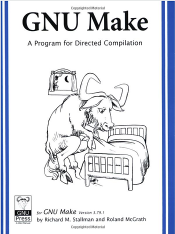

# make -p and make-ing helloworld without a Makefile



## Overview

This page discusses make's internal database. This database is useful because it allows users to leverage "implicit" rules to create easy to maintain makefiles or even to build code without a makefile, using make!

## Example

Create a file called helloworld.c and enter:

```
#include <stdio.h>

int main(int argc, char *argv[])
{
	printf("Hello, World\n");
}
```

Then type:

```
pfefferz@pfefferz-VirtualBox:~/helloworld$ make helloworld
cc     helloworld.c   -o helloworld
pfefferz@pfefferz-VirtualBox:~/helloworld$ ./helloworld 
Hello, World
```

## How Does make helloworld Work?

The --trace and -B make command line options give hints:

```
pfefferz@pfefferz-VirtualBox:~/helloworld$ make -B --trace helloworld
: update target 'helloworld' due to: helloworld.c
cc     helloworld.c   -o helloworld
```

make --help lists:

\--trace

Prints tracing information.

\-B, --always-make

Unconditionally make all targets.

Add --debug=v

```
pfefferz@pfefferz-VirtualBox:~/helloworld$ make -B --trace --debug=v helloworld
GNU Make 4.1
Built for x86_64-pc-linux-gnu
Copyright (C) 1988-2014 Free Software Foundation, Inc.
License GPLv3+: GNU GPL version 3 or later 
This is free software: you are free to change and redistribute it.
There is NO WARRANTY, to the extent permitted by law.
Reading makefiles...
Updating goal targets....
Considering target file 'helloworld'.
  Considering target file 'helloworld.c'.
   Finished prerequisites of target file 'helloworld.c'.
  No need to remake target 'helloworld.c'.
 Finished prerequisites of target file 'helloworld'.
 Prerequisite 'helloworld.c' is older than target 'helloworld'.
Making 'helloworld' due to always-make flag.
Must remake target 'helloworld'.
: update target 'helloworld' due to: helloworld.c
cc     helloworld.c   -o helloworld
Successfully remade target file 'helloworld'.
```

man make gives what the v flag means to the --debug argument: **more** verbose basic debugging.

   --debug[=FLAGS]


​      Print debugging information in addition to normal processing.  If


​      the FLAGS are omitted, then the behavior is the same as if -d was


​      specified. FLAGS may be a for all debugging output (same as using


​      -d), b for basic debugging, v for more verbose basic debugging, i


​      for showing implicit rules, j for details on invocation of com‐


​      mands, and m for debugging while remaking makefiles. Use n to


​      disable all previous debugging flags.

## Make's Internal Database

Make has an internal database of rules and variables that users can leverage to write Makefiles or build a program sans Makefile. _make helloworld_ leverages this database.

## Printing Make's Internal Database

To print make's internal database type: make -p **or** make --print-data-base

## Beginning of the Database

Here's the beginning of a listing with explanations

```
# GNU Make 4.1
# Built for x86_64-pc-linux-gnu
# Copyright (C) 1988-2014 Free Software Foundation, Inc.
# License GPLv3+: GNU GPL version 3 or later <http://gnu.org/licenses/gpl.html>
# This is free software: you are free to change and redistribute it.
# There is NO WARRANTY, to the extent permitted by law.

# Make data base, printed on Sat Apr  8 11:26:50 2017

# Variables

# automatic
<D = $(patsubst %/,%,$(dir $<))
```

## Some Internal Make Database Statistics

1306 lines in total

```
pfefferz@pfefferz-VirtualBox:~/helloworld$ make -p | wc -l
make: *** No targets specified and no makefile found.  Stop.
1306
```

453 non-white space lines

```
pfefferz@pfefferz-VirtualBox:~/helloworld$ make -p | grep -v '^$' | grep -v '^#' | wc -l
make: *** No targets specified and no makefile found.  Stop.
453
```

325 lines that don't start with a white space character

```
pfefferz@pfefferz-VirtualBox:~/helloworld$ make -p | grep -v '^$' | grep -v '^#' | grep -v '^\s' | wc -l
make: *** No targets specified and no makefile found.  Stop.
325
```

167 rules

```
pfefferz@pfefferz-VirtualBox:~/helloworld$ make -p | grep -v '^$' | grep -v '^#' | grep -v '^\s' | grep -v '=' | wc -l
make: *** No targets specified and no makefile found.  Stop.
167
```

158 variables

```
pfefferz@pfefferz-VirtualBox:~/helloworld$ make -p | grep -v '^$' | grep -v '^#' | grep -v '^\s' | grep '=' | wc -l
make: *** No targets specified and no makefile found.  Stop.
158
```

## Which Rule is Being Used?

To figure out which internal database rule is being used we can print the database to a file, use that file as our Makefile and leverage the "SHELL hack."

The "SHELL hack"

10 years ago (2007) [John Graham-Cumming](http://www.jgc.org/) published the SHELL hack in a Dr Dobbs article titled ["Debugging Makefiles."](http://www.drdobbs.com/tools/debugging-makefiles/197003338?pgno=3) 

To use the SHELL hack to figure out what rule is being used redirect the output of _make -p_ to a file:

```
make -p > Makefile.db
```

Next edit Makefile.db and change

```
SHELL := /bin/sh
```

to

```
OLD_SHELL := /bin/sh
SHELL = $(warning [$@ ($^) ($?)])$(OLD_SHELL) -x
```

Now run make with a few more flags:

```
make -rRB -f Makefile.db helloworld > Makefile.db.out
```

You should see something like:

Makefile.db:362: \[helloworld (helloworld.c) (helloworld.c)\] 

\+ cc helloworld.c -o helloworld

@ 362 in my Makefile.db is this:

```
%: %.c
#  recipe to execute (built-in):
        $(LINK.c) $^ $(LOADLIBES) $(LDLIBS) -o $@
```

This is a pattern rule. for make helloworld it expands into:

```
helloworld: helloworld.c
#  recipe to execute (built-in):
        $(LINK.c) $^ $(LOADLIBES) $(LDLIBS) -o $@
```

grepping the Makefile.db shows:

grep 'LINK.c' Makefile.db

shows

LINK.c = $(CC) $(CFLAGS) $(CPPFLAGS) $(LDFLAGS) $(TARGET\_ARCH)

grep 'LOADLIBES' Makefile.db and grep 'LDLIBS' Makefile.db show both variables used but not defined.

$^ is an automatic variable that is the names of all the prerequisites, with spaces between them.

$@ is an automatic variable that is the file name of the target

grep 'CC =' Makefile.db

shows

CC = cc

grep 'CFLAGS' Makefile.db and grep 'CPPFLAGS' Makefile.db and grep 'LDFLAGS' Makefile.db and grep 'TARGET\_ARCH' Makefile.db

shows that these are all used but not defined. With this the final expansion yields:

```
helloworld: helloworld.c
#  recipe to execute (built-in):
        cc helloworld.c -o helloworld
```

## Reference

**1.** make --version

GNU Make 4.1 

Built for x86\_64-pc-linux-gnu 

Copyright (C) 1988-2014 Free Software Foundation, Inc. 

License GPLv3+: GNU GPL version 3 or later <http://gnu.org/licenses/gpl.html>

This is free software: you are free to change and redistribute it. 

There is NO WARRANTY, to the extent permitted by law.

**2.** [Free Online HTML Escape](http://www.freeformatter.com/html-escape.html)

**3.** [Everything You Need to Know About HTML’s ‘pre’ Element](http://www.sitepoint.com/everything-need-know-html-pre-element/)

**4.** GNU make: a program for directed recompilation: GNU make version 3.79.1

Richard Stallman - Roland McGrath - Paul D.Smith - GNU Press - 2004

ISBN 1-882114-81-7

[[Amazon](http://www.amazon.com/GNU-Make-Program-Directed-Compilation/dp/1882114825)]

**5.** [Delete all lines beginning with a # from a file](http://stackoverflow.com/questions/8206280/delete-all-lines-beginning-with-a-from-a-file)

[**6.**](http://stackoverflow.com/questions/8206280/delete-all-lines-beginning-with-a-from-a-file)[ ](http://stackoverflow.com/questions/8206280/delete-all-lines-beginning-with-a-from-a-file)[Using Implicit Rules](http://ftp.gnu.org/old-gnu/Manuals/make-3.79.1/html_chapter/make_10.html)

**7.** [Debugging Makefiles](http://www.drdobbs.com/tools/debugging-makefiles/197003338?pgno=1)