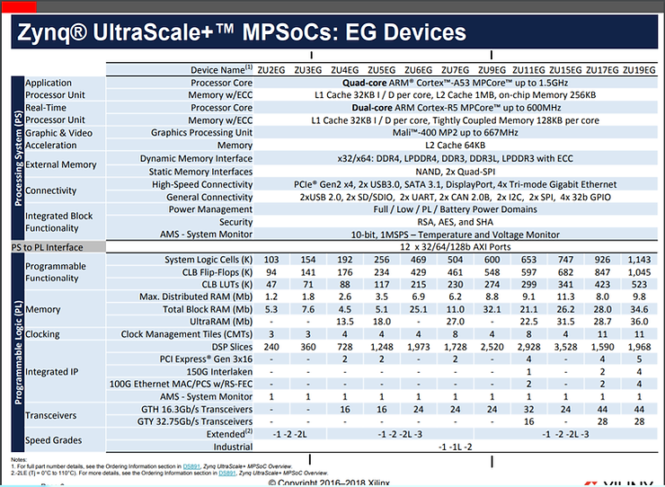
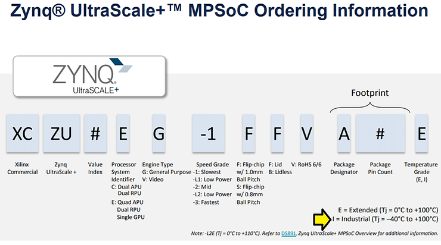

# Price and Part Difference Between the Ultra96-V2 and the ZCU102

This post lists the difference in price between the ZCU102 and the Ultra96, which parts are used on the Ultra96-V2 and the ZCU102, the table from the selection guide, and the costs of each chip. It also lists an ordering guide for reference as of May 5th 2020.

**<u>Price</u>**

ZCU102 Price: **$2,495** (nothing else needed, all materials in the box) \[[<u>link</u>](https://www.xilinx.com/products/boards-and-kits/ek-u1-zcu102-g.html)\]

Ultra96-V2 (similarly configured): **$313.25**

**Savings: $2,181.75**

**<u>Chip Differences</u>**

ZCU102 Zynq: XC**ZU9EG**\-2FFVB1156 (chip price (E): **$3,831.25** \[[<u>link</u>](https://www.avnet.com/shop/us/products/xilinx/xczu9eg-2ffvb1156e-3074457345632182846/)\])

Ultra96-V2 Zynq: XC**ZU3EG**\-1SBVA484E (chip price: **$408.30** \[[<u>link</u>](https://www.avnet.com/shop/us/products/xilinx/xczu3eg-1sbva484e-3074457345632182811/)\])

**<u>MPSoC Ordering </u>** **<u>Reference</u>**

From [[link](https://www.xilinx.com/support/documentation/selection-guides/zynq-ultrascale-plus-product-selection-guide.pdf)]

**<u>Reference</u>**

Xilinx logo from https://twitter.com/xilinxinc