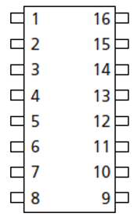

# QSPI24, 24-bit addressing, 3-byte addressing QSPI32, 32-bit addressing, 4-byte **addressing**

This page discusses what the terms QSPI24 and QSPI32 probably mean, their likely origins and the terms relationship to the terms: 24-bit addressing, 32-bit addressing, 3-byte address mode and 4-byte address mode. I created it because I couldn't find this information from a few Google searches.

**TL;DR**

QSPI24 means 24-bit addressing which also means 3-byte address mode and that QSPI32 means 32-bit addressing which also means 4-byte address mode

**QSPI24, 24-bit addressing, 3-byte addressing QSPI32, 32-bit addressing, 4-byte addressing**

3-byte and 4-byte address modes

Micron lists "3-byte and 4-byte address modes" in at least their:

Micron Serial NOR Flash Memory 1.8V, Multiple I/O, 64KB Sector Erase MT25QU01GBBB datasheet @ [link](http://www.micron.com/~/media/documents/products/data-sheet/nor-flash/serial-nor/mt25q/die-rev-b/mt25q_qlkt_u_01g_bbb_0.pdf).

QSPI24 and QSPI32 / 24-bit and 32-bit addressing

A Google search for QSI24 and a Google search for QSI32 only return Xilinx originated content. For this reason, I am concluding that these terms came from Xilinx.

In the [AR# 65463](http://www.xilinx.com/support/answers/65463.html) Xilinx also lists: 

-   QSPI24: 24-bit addressing
    
-   QSPI32: 32-bit addressing
    

Conclusion

Based on this evidence I'm concluding the QSPI24 and QSPI32 are terms Xilinx invented. At least Micron uses the terms "3-byte and 4-byte address modes." I'm also concluding that QSPI24 means 24-bit addressing which also means 3-byte address mode and that QSPI32 means 32-bit addressing which also means 4-byte address mode.

**Table of Supported Devices**

[AR# 65463 - Zynq UltraScale+ MPSoC - What devices are supported for configuration?](http://www.xilinx.com/support/answers/65463.html) lists the following table. I've added links to the relevant parts:

| QSPI Flash Family | Part  | Flash Device | Part Catalog/Data Sheet                                      | Mode                                           | Vendor   | Flash Density | Voltage | Support Category | Vivado/SDK Flash Programmer | U-Boot | Notes                                                        |
| ----------------- | ----- | ------------ | ------------------------------------------------------------ | ---------------------------------------------- | -------- | ------------- | ------- | ---------------- | --------------------------- | ------ | ------------------------------------------------------------ |
|                   | MT25Q |              | [link](https://www.micron.com/products/nor-flash/serial-nor-flash/mt25q#/) |                                                |          |               |         |                  |                             |        |                                                              |
| MT25              |       | MT25QU64     |                                                              | Quad Mode - Single - Dual Parallel and Stacked | Micron   | 64 Mb         | 1.8V    | Xilinx Supported | See UG908.                  | 2017.1 |                                                              |
| MT25              |       | MT25QL64     |                                                              |                                                |          |               | 3.3V    |                  |                             |        |                                                              |
| MT25              |       | MT25QU128    |                                                              | Quad Mode - Single - Dual Parallel and Stacked | Micron   | 128 Mb        | 1.8V    | Xilinx Supported | See UG908.                  | 2017.1 |                                                              |
| MT25              |       | MT25QL128    |                                                              |                                                |          |               | 3.3V    |                  |                             |        |                                                              |
| MT25              |       | MT25QU256    |                                                              | Quad Mode - Single - Dual Parallel and Stacked | Micron   | 256 Mb        | 1.8V    | Xilinx Supported | See UG908.                  | 2017.1 |                                                              |
| MT25              |       | MT25QL256    |                                                              |                                                |          |               | 3.3V    |                  |                             |        |                                                              |
| MT25              |       | MT25QU512A   |                                                              | Quad Mode - Single - Dual Parallel and Stacked | Micron   | 512 Mb        | 1.8V    | Xilinx Supported | See UG908.                  | 2016.4 |                                                              |
| MT25              |       | MT25QL512A   |                                                              |                                                |          |               | 3.3V    |                  |                             |        |                                                              |
| MT25              |       | MT25QU01G    |                                                              | Quad Mode - Single - Dual Parallel and Stacked | Micron   | 1024 Mb       | 1.8V    | Xilinx Supported | See UG908.                  | 2016.3 |                                                              |
| MT25              |       | MT25QL01G    |                                                              |                                                |          |               | 3.3V    |                  |                             |        |                                                              |
| MT25              |       | MT25QU02G    |                                                              | Quad Mode - Single - Dual Parallel and Stacked | Micron   | 2048 Mb       | 1.8V    | Xilinx Supported | See UG908.                  | 2016.4 |                                                              |
| MT25              |       | MT25QL02G    |                                                              |                                                |          |               | 3.3V    |                  |                             |        |                                                              |
|                   | N25Q  |              | [link](https://www.micron.com/products/nor-flash/serial-nor-flash/serial-nor-flash-obsolete#/) |                                                |          |               |         |                  |                             |        |                                                              |
| N25Q              |       | N25Q64       |                                                              | Quad Mode - Single - Dual Parallel and Stacked | Micron   | 64 Mb         |         | Xilinx Supported | See UG908.                  | 2016.4 |                                                              |
| N25Q              |       | N25Q128A     |                                                              | Quad Mode - Single - Dual Parallel             | Micron   | 128 Mb        | 1.8V    | Xilinx Supported | See UG908.                  | 2016.1 |                                                              |
| N25Q              |       | N25Q256      |                                                              | Quad Mode - Single - Dual Parallel and Stacked | Micron   | 256 Mb        |         | Xilinx Supported | See UG908.                  | 2016.4 |                                                              |
| N25Q              |       | N25Q512      |                                                              | Quad Mode - Single - Dual Parallel             | Micron   | 512 Mb        | 1.8V    | Xilinx Supported | See UG908.                  | 2016.1 |                                                              |
| N25Q              |       | N25Q00       |                                                              | Quad Mode - Single - Dual Parallel and Stacked | Micron   | 1024 Mb       |         | Xilinx Supported | See UG908.                  | 2016.3 |                                                              |
|                   |       |              |                                                              |                                                |          |               |         |                  |                             |        |                                                              |
| S25FL             |       | S25FL128S    | [link](http://www.cypress.com/node/309386")                  | Quad Mode - Single - Dual Parallel and Stacked | Spansion | 128 Mb        |         | Xilinx Supported | See UG908.                  | 2016.4 |                                                              |
| S25FL             |       | S25FL256S    | [link](http://www.cypress.com/node/309386")                  | Quad Mode - Single - Dual Parallel             | Spansion | 256 Mb        | 3.3V    | Xilinx Supported | See UG908.                  | 2016.1 |                                                              |
| S25FL             |       | S25FL512S    |                                                              | Quad Mode - Single - Dual Parallel and Stacked | Spansion | 512 Mb        |         | Xilinx Supported | See UG908.                  | 2016.3 |                                                              |
| S70FL             |       | S70FL01GS    | [link](http://www.cypress.com/node/433606)                   | Quad Mode - Stacked                            | Spansion | 1024 Mb       |         | Xilinx Supported | See UG908.                  | 2016.3 | This part is two 512 Mb dies in a single package (Dual Stacked Only). |
| S70FL             |       | S70FS01GS    | [link](http://www.cypress.com/node/404766")                  | Quad Mode - Single - Dual Parallel and Stacked | Spansion | 1024 Mb       |         | Unverified Flash |                             |        |                                                              |
|                   |       | S25FS128S    |                                                              | Quad Mode - Single - Dual Parallel and Stacked | Spansion | 128 Mb        |         | Incompatible     |                             |        | The Spansion S25FS family does not support Dual Out (0x3B) and Quad Out (0x6B) read commands. |
| MX66              |       | MX66L1G45G   | [link](http://www.macronix.com/Lists/Datasheet/Attachments/6758/MX66L1G45G, 3V, 1Gb, v1.3.pdf") | Quad Mode - Single - Dual Parallel and Stacked | Macronix | 1024 Mb       | 3.3V    | Xilinx Supported | See UG908.                  | 2016.4 |                                                              |
| MX25              |       | MX25L25635F  | [link](http://www.macronix.com/Lists/Datasheet/Attachments/6729/MX25L25635F, 3V, 256Mb, v1.5.pdf") | Quad Mode - Single - Dual Parallel             | Macronix | 256 Mb        |         | Xilinx Supported | See UG908.                  | 2016.1 |                                                              |
| MX25              |       | MX25L25645G  | [link](http://www.macronix.com/Lists/Datasheet/Attachments/6779/MX25L25645G, 3V, 256Mb, v1.6.pdf") | Quad Mode - Single - Dual Parallel             | Macronix | 256 Mb        |         | Known to Work    |                             | 2017.1 |                                                              |
| MX25              |       | MX25L51245G  | [link](http://www.macronix.com/Lists/Datasheet/Attachments/6756/MX25L51245G, 3V, 512Mb, v1.6.pdf) | Quad Mode - Single - Dual Parallel             | Macronix | 512 Mb        |         | Known to Work    |                             | 2017.1 |                                                              |
| W25Q              |       | W25Q64FV     | [link](http://www.winbond.com/hq/product/code-storage-flash-memory/serial-nor-flash/?__locale=en&partNo=W25Q64FV) | Quad Mode - Single - Dual Parallel             | Winbond  | 64 Mb         | 3.3V    | Xilinx Supported |                             | 2016.1 | Stacked still "Unverified Flash".                            |

**References**

1\. Paste-in an Excel table and generate an HTML table with [link](http://tableizer.journalistopia.com/tableizer.php).

2\. Tip to reformat an HTML file in Vim found at [link](http://stackoverflow.com/questions/815548/how-do-i-tidy-up-an-html-files-indentation-in-vi):

Set the following option:

:filetype indent on 

:set filetype=html # abbrev - :set ft=html 

:set smartindent # abbrev - :set si

Then move the cursor to the top of the file and indent to the end **gg =G** or select the desired text to indent and hit = to indent it.

3\. [AR# 65463 - Zynq UltraScale+ MPSoC - What devices are supported for configuration?](http://www.xilinx.com/support/answers/65463.html) contained the table data

 