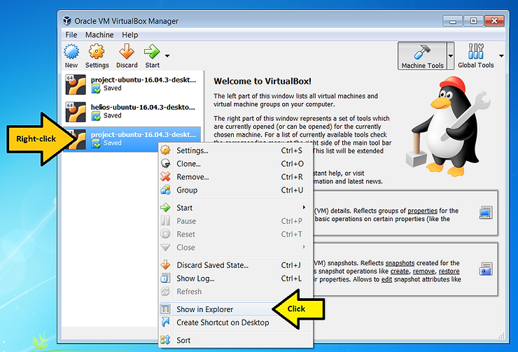
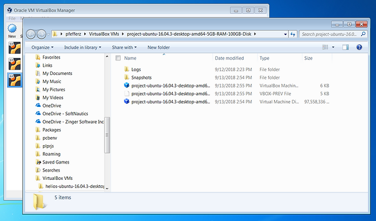

# Right-Click to Locate a VM

This post offers a quick tip to find a virtual machine managed by VirtualBox.

**<u>Steps</u>**

1\. Right-click and click **Show in Explorer**

2\. The location will pop up:

**<u>Versions Used</u>**

-   VirtualBox Version 5.2.12 r122591 (Qt5.6.2) available at \[[<u>link</u>](https://download.virtualbox.org/virtualbox/5.2.12/VirtualBox-5.2.12-122591-Win.exe)\]
    
-   Windows 7 Professional SP1
    

**<u>References</u>**

The VirtualBox logo is from [<u>https://www.virtualbox.org/</u>](https://www.virtualbox.org/)