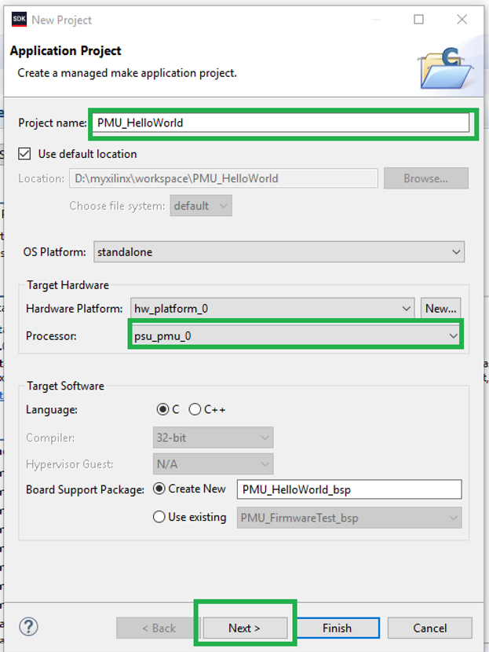
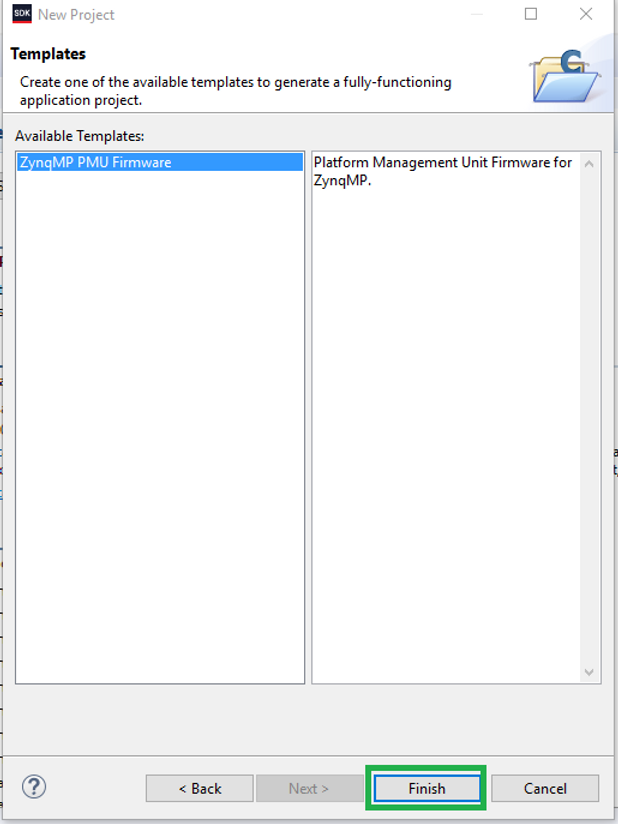
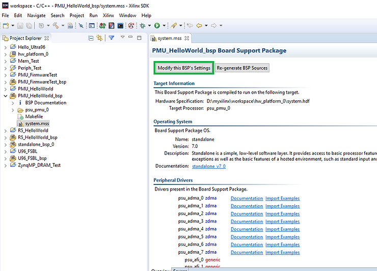
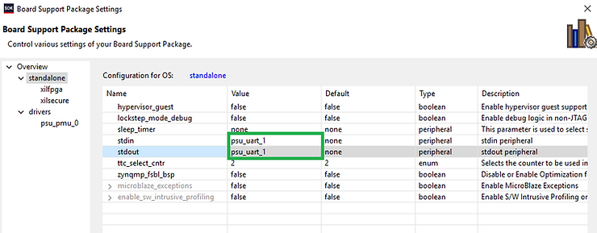
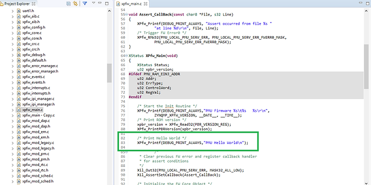
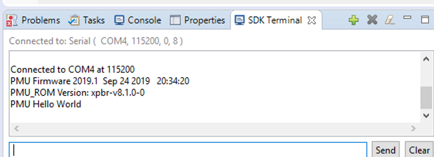

# Running "Hello World" on the Ultra96-V2's PMU

Before performing these steps, its required that the following tutorials have been followed and completed.  

 Runnng Barebones Apps on the Ultra96-V2 Cortex A53 processor

 https://www.centennialsoftwaresolutions.com/post/runnng-barebones-apps-on-the-ultra96-v2-cortex-a53-processor?gclid=EAIaIQobChMIt-mNg_Ta5AIV_hitBh0QBQk0EAAYASAAEgI-MvD_BwE 

 Running Hello World on an R5 Processor

 https://www.centennialsoftwaresolutions.com/post/running-hello-world-on-an-r5-processor?gclid=EAIaIQobChMIt-mNg_Ta5AIV_hitBh0QBQk0EAAYASAAEgI-MvD_BwE 

This blog entry outlines the steps required do do a simple Hello World Program on the PMU processor.

1.) Create a new Application Project

**File->New->Application Project**

2.) Select a Project Name and the PMU processor. Note that a new BSP will need to be created if one hasnt been created for the PMU. Select Next to continue.

3.) Select the "ZynqMP PMU Firmware" template and select Finish to continue.

4.) Open the R5 BSP just created and double click on the system.mss file to open it and select "Modify this BSP's Settings"

5.) Click on standalone and change the STDIN and STDOUT ports to "psu\_uart\_1".

6.) The BSP should be rebuilt which can be seen in the "SDK Log Window"

7.) Edit the C source file xpfw\_main.c by adding the following lines

8.) Add your PC COM Port to the SDK Terminal Window.

9.) Select your PMU\_HelloWorld Application Project and then Right Click->Run As->Launch On Hardware (System Debugger).

10.) Verify Serial Port Output.

11.) Congrats!

**<u>References</u>**

-   Xilinx logo clipped from [<u>xilinx.com</u>](http://xilinx.com/)