# SD Card Access from Ubuntu 16.04.3 on VirtualBox on Windows 7

This post shows how to access an SD card via a USB reader from Ubuntu 16.04.3 running in a virtual machine hosted by VirtualBox version 5.2.12 r122591 (Qt5.6.2) running on Windows 7 SP1. It also covers accessing the SD card from a terminal, ejecting the card and unmounting the SD card reader.

**<u>Prerequisites</u>**

-   Install VirtualBox on Windows \[[<u>instructions</u>](http://www.zachpfeffer.com/single-post/2017/02/15/Installing-the-64-bit-PC-AMD64-desktop-image-of-Ubuntu-16041-LTS-Xenial-Xerus-in-Oracle-VM-VirtualBox-5114-running-in-Windows-7-Professional-Service-Pack-1-CurrentBuild-7601-on-a-ThinkPad-T460-model-20FNCTO1WW-with-an-IntelR-CoreTM-i7-6600U-CPU)\] (closely matches versions)
    
-   A USB SD card reader, like an IOGEAR GUH287 at \[[<u>link</u>](https://www.amazon.com/IOGEAR-USB-Card-Reader-GUH287/dp/B00330OVIG)\]
    
-   Ubuntu is running in the virtual machine
    

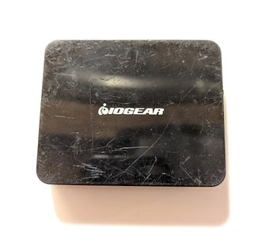

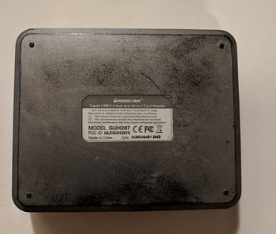

**<u>Install the SD Card Reader and the SD Card</u>**

1\. In the VirtualBox window running Ubuntu (A) click **Devices**, (B) click **USB** and note the devices.

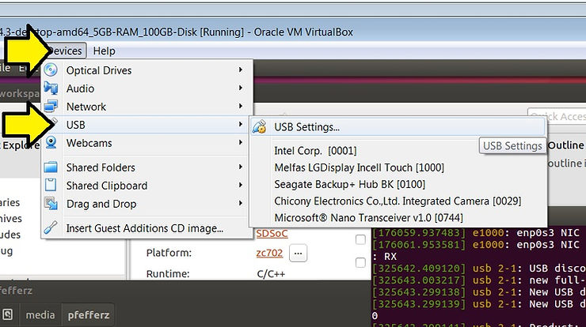

2\. Plug the SD card reader into the computer

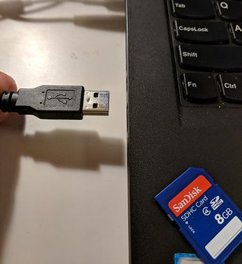

3\. In the VirtualBox window running Ubuntu (A) click **Devices**, (B) click **USB** and (C) click **Genesys USB Reader** or whatever new device came up. This captures the USB card reader. You'll **hear** Windows eject the device (with a da dum) and then **hear** Windows enumerate the VirtualBox driver (da da!) if this is the first time you've plugged this device in.

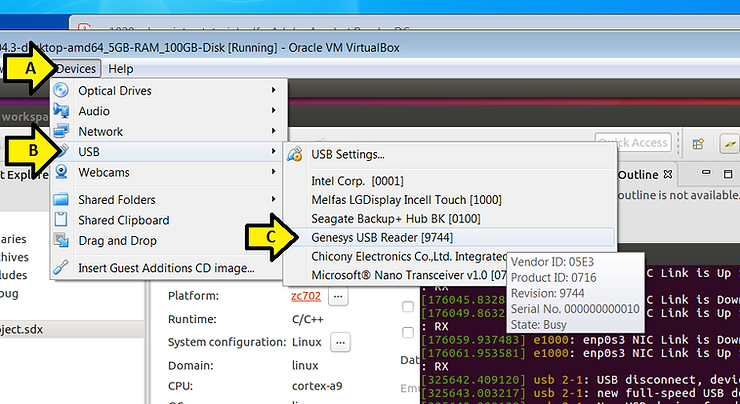

You should see a **checkmark** next to the reader after (A) clicking **Devices** and (B) clicking **USB**:

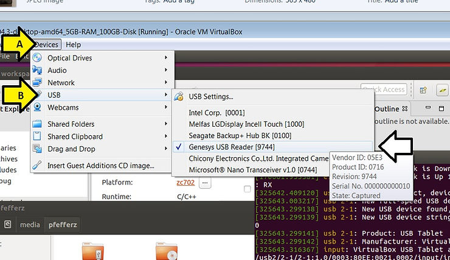

4\. Insert an SD card into the reader.

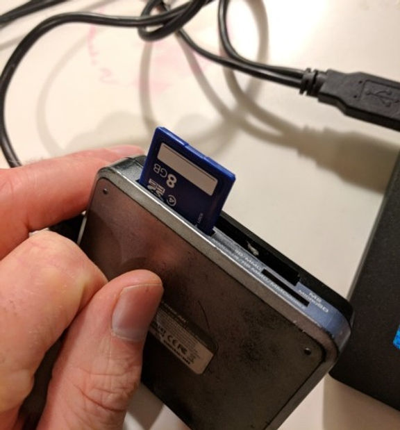

5\. A window will pop up if the SD card has been formatted so that Ubuntu can read it. Note the name of the window.

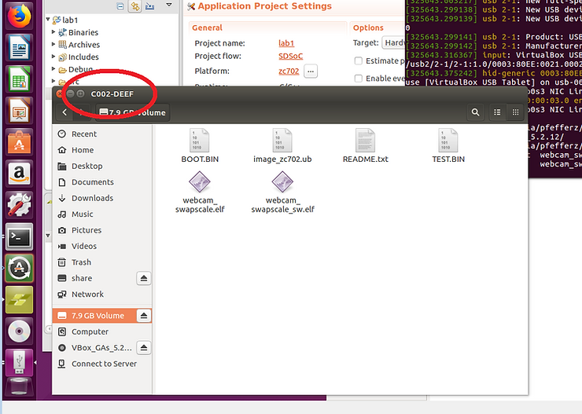

**<u>Access the SD Card from a Terminal</u>**

1\. (A) Right-click on the Ubuntu desktop and (B) click **<u>Open Terminal</u>**

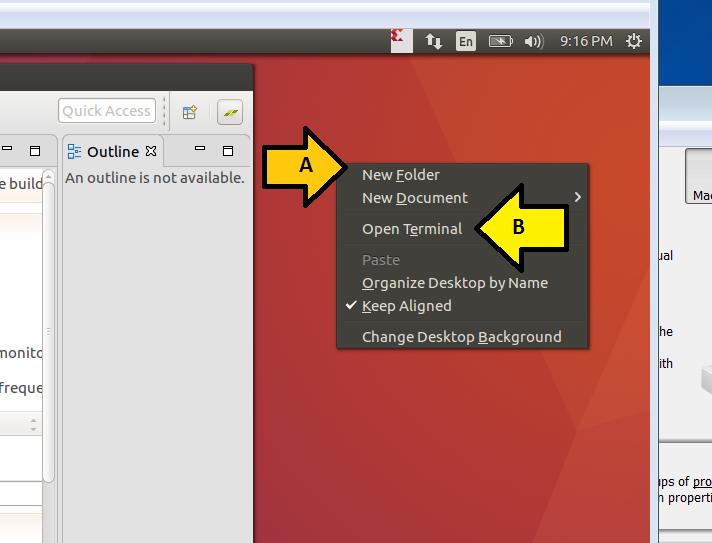

2\. In the terminal type **ls /media/pfefferz/C002-DEEF/**

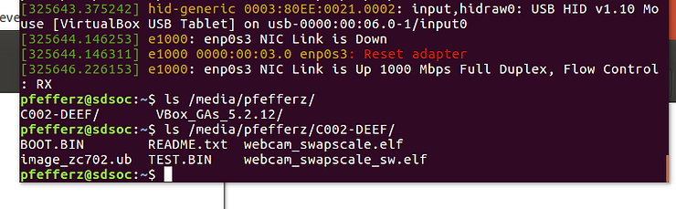

Now you can dd, cp, etc...

**<u>Eject the SD Card</u>**

Click here to eject the SD card:

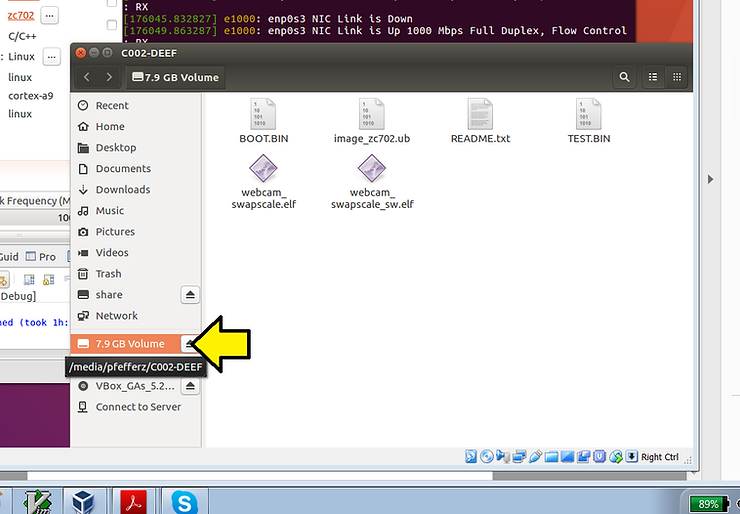

**<u>Unmount the SD Card Reader</u>**

To unmount the SD card reader (A) click **Devices**, (B) **USB** and (C) **Genesys USB Reader \[9744\]**.

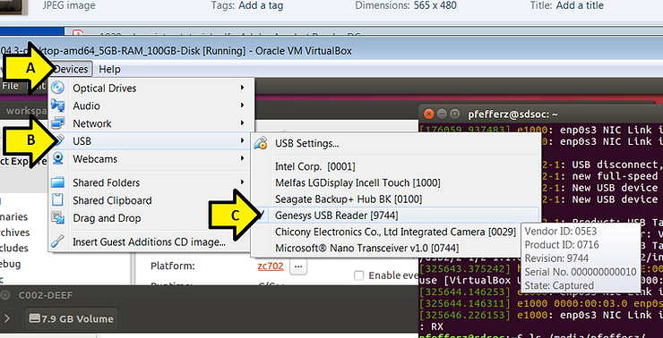

**<u>Reference</u>**

VirtualBox logo from \[[<u>link</u>](https://linux.systeminside.net/como-instalar-y-configurar-virtualbox/)\]