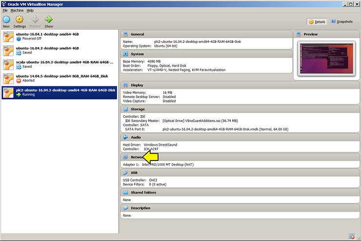
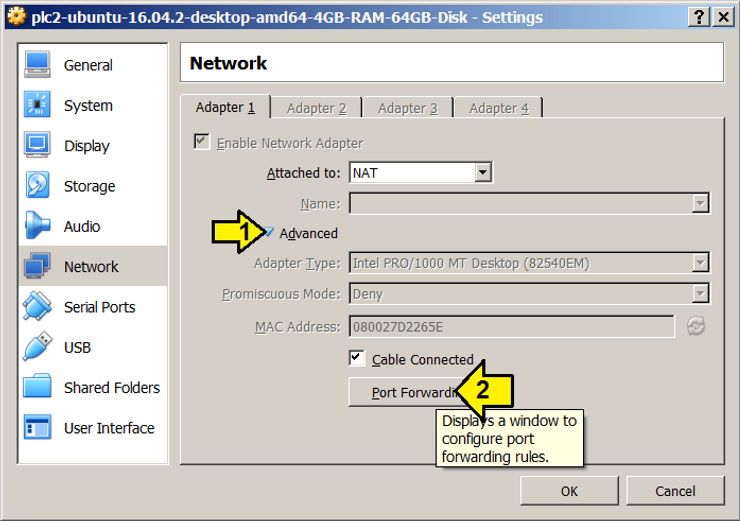
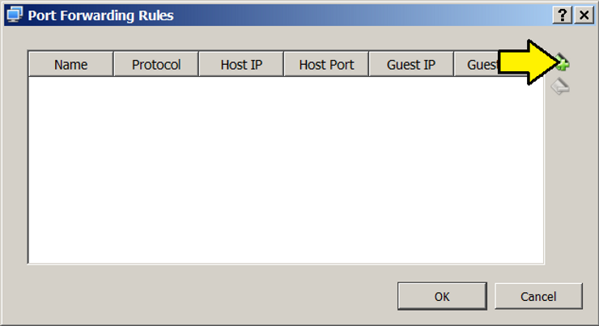
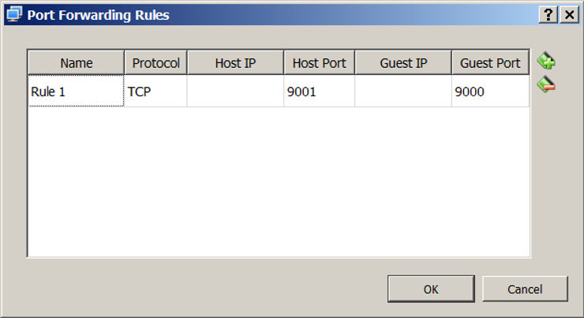

# Set Up and Test VirtualBox NAT Port Forwarding

This post shows how to set up NAT port forwarding between a Window's host and an Ubuntu guest running on VirtualBox and test it with netcat.

**Prerequisites**

You've installed VirtualBox. Click [here](http://www.zachpfeffer.com/single-post/2017/02/07/Installing-the-Oracle-VM-VirtualBox-5114-on-Windows-7-Professional-Service-Pack-1-CurrentBuild-7601) for instructions.

You've installed Ubuntu on VirtualBox . Click [here](http://www.zachpfeffer.com/single-post/2017/02/15/Installing-the-64-bit-PC-AMD64-desktop-image-of-Ubuntu-16041-LTS-Xenial-Xerus-in-Oracle-VM-VirtualBox-5114-running-in-Windows-7-Professional-Service-Pack-1-CurrentBuild-7601-on-a-ThinkPad-T460-model-20FNCTO1WW-with-an-IntelR-CoreTM-i7-6600U-CPU) for instructions.

You've installed netcat on Windows. Click [here](http://www.zachpfeffer.com/single-post/Create-a-TCP-Client-and-Server-and-Send-Messages-with-Netcat) for instructions.

**Set Up**

1\. Click **Network**



2\. (**1**) Expand **Advanced** and (**2**) click **Port Forwarding**



3\. Click on the **Adds new port forwarding rule.** button.



4\. Enter **9000** for the Guest port, **9001** for the Host Port, leave **TCP** as the **Protocol** and Leave the **Name** as-is. Click OK. You don't need to restart the VM.



**Test**

1\. Open a terminal in Ubuntu and type:

```
nc -l -p 9000
```

2\. Open a CMD window in Windows and type:

```
nc localhost 9001
```

3\. In the CMD window type **Hello, World**. You should see **Hello, World** in Ubuntu.