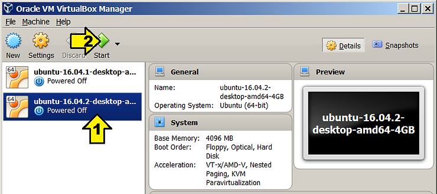
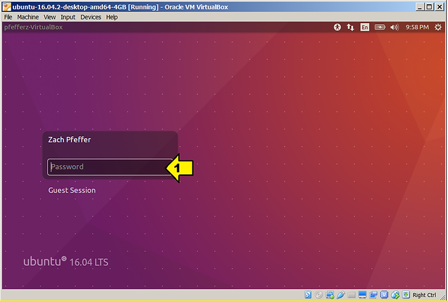
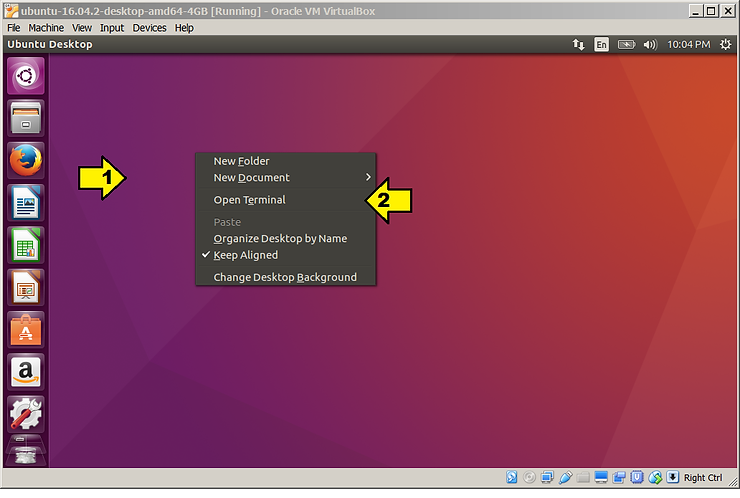
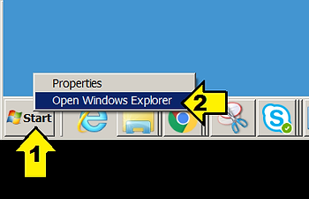
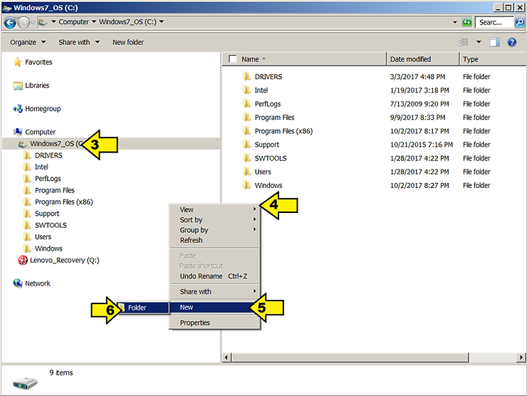
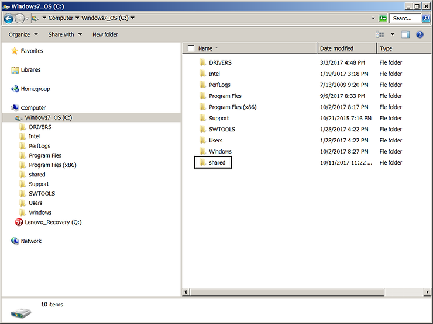
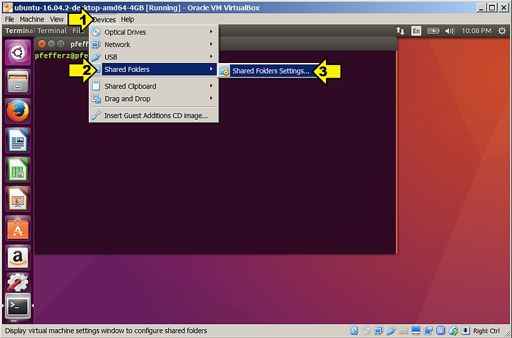
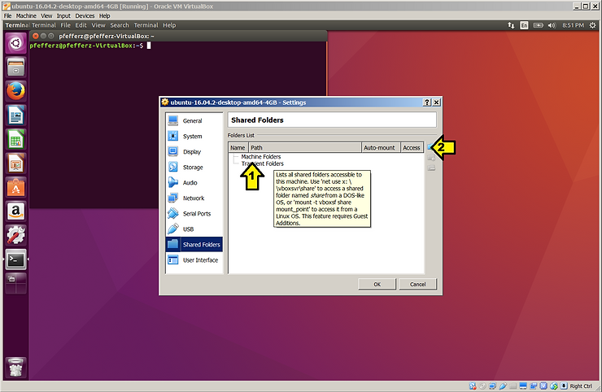
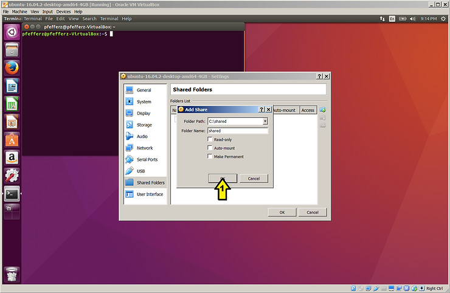
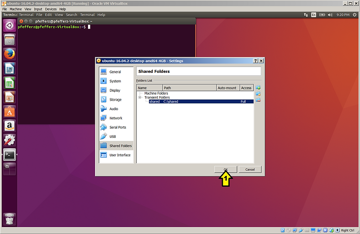

# Share a directory between Ubuntu on VirtualBox and Windows

Verified step-by-step instructions for sharing a directory between Ubuntu running on VirtualBox and Windows.

**Prerequisites**

-   If you haven't installed VirtualBox and/or Ubuntu 16.04 on VirtualBox, click [here](http://www.zachpfeffer.com/single-post/2017/02/17/Installing-the-64-bit-PC-AMD64-desktop-image-of-Ubuntu-16042-LTS-Xenial-Xerus-in-Oracle-VM-VirtualBox-5114-running-in-Windows-7-Professional-Service-Pack-1-CurrentBuild-7601-on-a-ThinkPad-T460-model-20FNCTO1WW-with-an-IntelR-CoreTM-i7-6600U-CPU%E2%80%8B%E2%80%8B).
    
-   If you haven't installed VirtualBox guest additions, click [here](http://www.zachpfeffer.com/single-post/2017/02/18/Enabling-copying-and-pasting-text-between-an-Ubuntu-16042-guest-running-in-Oracle-VM-VirtualBox-5114-running-on-Windows-7-and-the-Windows-7-host).
    

**Step 1** - Start VM after launching VirtualBox if its not running: click 1, click 2

**Step 2** - Login: click 1, enter password, hit Enter

**Step 3** - Open a terminal: right click 1, click 2

**Step 4** - Create c:\\shared in Windows: right click **Start** (1), click 2

...click C: (3), right click 4, hover 5, click 6

...name the folder **shared.** Result:

**Step 5** - Open the **Shared Folders Settings**: click 1, hover 2, click 3

... click **Transient Folders** (1)and the **Add Folder** icon (2).

... browse to c:\\shared and click the **Ok** button (1). Leave the radio buttons unchecked.

...click **OK** (1).

**Step 6** - Back in the VM, create a directory and mount the shared directory.

On the guest, in the terminal type:

$ mkdir ~/guest\_shared

$ sudo mount -t vboxsf shared ~/guest\_shared

$ echo "Hello, World!" > ~/guest\_shared/hello.txt

Back on the Windows host:

Look in c:\\shared. You should see hello.txt. Open it up. You should see: Hello, World!

If you saw: Hello, World!, **_congratulations_**!

**Other Info**

**Specific configuration**

-   VirtualBox Version 5.1.14 r112924 (Qt5.6.2)
    
-   In VirtualBox Manager: Help > About VirtualBox...
    
-   Ubuntu 16.04.2 Guest in VirtualBox
    
-   From: [http://old-releases.ubuntu.com/releases/16.04.2/ubuntu-16.04.2-desktop-amd64.iso](http://old-releases.ubuntu.com/releases/16.04.2/ubuntu-16.04.2-desktop-amd64.iso)
    
-   4 GB Memory
    
-   32 GB VMDK
    
-   Windows Host (what VirtualBox is running on)
    
-   Windows 7 Professional Service Pack 1
    
-   System
    
-   Component Details (Subscore) (Base score)
    
-   Processor Intel(R) Core(TM) i7-6600U CPU @ 2.60GHz (7.3) (5.1) Determined by lowest subscore
    
-   Memory (RAM) 12.0 GB (7.6)
    
-   Graphics Intel(R) HD Graphics 520 (5.1)
    
-   Gaming graphics 1888 MB Total available graphics memory (6.9)
    
-   Primary hard disk 366GB Free (462GB Total) (7.9)
    
    ​			Windows 7 Professional     
    
-   System
    
-   Manufacturer LENOVO
    
-   Model 20FNCTO1WW
    
-   Total amount of system memory 12.0 GB RAM
    
-   System type 64-bit operating system
    
-   Number of processor cores 2
    
-   Storage
    
-   Total size of hard disk(s) 477 GB
    
-   Disk partition (C:) 366 GB Free (462 GB Total)
    
-   Disk partition (Q:) 4 GB Free (14 GB Total)
    
-   Graphics
    
-   Display adapter type Intel(R) HD Graphics 520 ([gfxbench](http://gfxbench.com/device.jsp?benchmark=gfx40&os=Windows&api=gl&D=Intel%28R%29+Core%28TM%29+i7-6600U+CPU+with+HD+Graphics+520&testgroup=overall))
    
-   Total available graphics memory 1824 MB
    
-   Dedicated graphics memory 192 MB
    
-   Dedicated system memory 0 MB
    
-   Shared system memory 1632 MB
    
-   Display adapter driver version 20.19.15.4454
    
-   Primary monitor resolution 1920x1080
    
-   Secondary monitor resolution 1920x1200
    
-   DirectX version DirectX 10
    
-   Network
    
-   Network Adapter Intel(R) Ethernet Connection I219-LM
    
-   Network Adapter Intel(R) Dual Band Wireless-AC 8260
    
-   Network Adapter Microsoft Virtual WiFi Miniport Adapter
    
-   Network Adapter Microsoft Virtual WiFi Miniport Adapter
    
-   Network Adapter Bluetooth Device (Personal Area Network)
    
-   Network Adapter VirtualBox Host-Only Ethernet Adapter
    
-   System Info from
    
-   Right click **Start** > Click **Open Windows Explorer**
    
-   Right click **Computer** > Click **Properties**
    
-   Click **Windows Experience Index**
    
-   Click **View and print detailed performance and system information**