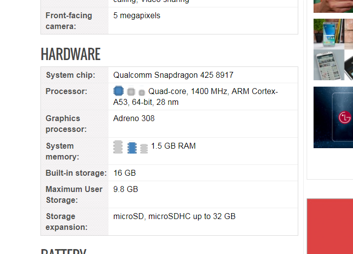

# Spectre and Meltdown - Is my phone vulnerable?

This post lists a way to see if your phone is affected by Spectre and/or Meltdown.

**Is my phone are vulnerable?**

Most phones run an Arm chip. Arm chips have processors. These processors are named things like Cortex-A72, Cortex-A73, etc. Arm has posted a [table](http://developer.arm.com/support/security-update) that shows which processor is vulnerable to Spectre or Meltdown. The table shows this vulnerability in terms of Variant 1,2,3 and 3a. Google's [Project Zero](http://googleprojectzero.blogspot.com/2018/01/reading-privileged-memory-with-side.html) has given us a decoder ring:

-   Spectre (Variants 1 and 2)
    
-   Meltdown (Variant 3)
    

To figure out which phone is vulnerable you can:

-   Find your phone's model
    
-   Settings > System > About phone > Model
    
-   Google your phone's model + the word "**specs**"
    
-   In the results look for **_Cortex-something_**
    
-   Find the **_Cortex-something_** in the table from Arm, if its in the table, its vulnerable
    

**Example**

Google "LG M210N Aristo Specs" got [link](http://www.phonearena.com/phones/LG-Aristo_id10416) @ https://www.phonearena.com

Found Cortex-A53:

Look in Arm's [table](http://developer.arm.com/support/security-update):

Not there!

Here's the table Arm posted:

| Processor  | Variant 1          | Variant 2 | Variant 3 | Variant 3a |
| ---------- | ------------------ | --------- | --------- | ---------- |
| Cortex-R7  | Yes*               | Yes*      | No        | No         |
| Cortex-R8  | Yes*               | Yes*      | No        | No         |
| Cortex-A8  | Yes (under review) | Yes       | No        | No         |
| Cortex-A9  | Yes                | Yes       | No        | No         |
| Cortex-A15 | Yes (under review) | Yes       | No        | Yes        |
| Cortex-A17 | Yes                | Yes       | No        | No         |
| Cortex-A57 | Yes                | Yes       | No        | Yes        |
| Cortex-A72 | Yes                | Yes       | No        | Yes        |
| Cortex-A73 | Yes                | Yes       | No        | No         |
| Cortex-A75 | Yes                | Yes       | Yes       | No         |

**Will the company that released my phone be able to fix it?**

Probably not. The software that runs a phone is baked into the phone. Some companies do provide updates to the software they shipped on the phone, but many don't. Apple definitely does. So does Samsung.

Here are some responses. This is not an exhaustive list.

-   Good
    
    -   Arm's post (from above) released on Jan 3rd
        
    -   [Apple's Spectre and Meltdown post](http://support.apple.com/en-us/HT208394) [(Apple gets a big thumbs up this was posted Jan 5th 2018)](http://support.apple.com/en-us/HT208394)
        
    -   Amazon [link](http://www.amazon.com/Spectre-Dave-Bautista/dp/B017HYSN0A) (j/k) here's their [disclosure](http://aws.amazon.com/security/security-bulletins/AWS-2018-013/)
    
-   Something
    
    -   [A post related to Samsung Galaxy (A search from samsung.com came up empty)](http://us.community.samsung.com/t5/Galaxy-Note-Phones/Spectre-Vulnerability/td-p/242809)
    
-   Couldn't find
    
    -   Nvidia
        
    -   LG
        
    -   Intel
