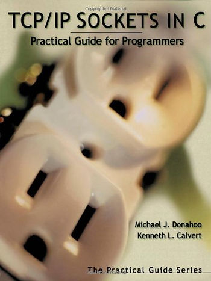

# TCPEchoClient.c With More Error Checking



This post contains a derivative of TCPEchoClient.c that performs more error checking. See the server at \[[link](https://www.centennialsoftwaresolutions.com/blog/tcpechoserver-c-inspired-echo-server)\].

```
/*
 * Derivate of TCPEchoClient.c in:
 * TCP/IP Sockets in C, 1st Edition, Practical Guide for Programmers
 * with more error checking. 
 *
 * To test, without a server run 
 *     netcat -v -l 49152 (netcat-openbsd) 
 * and
 *     ./tcpclient 127.0.0.1 "Hello" 49152
 * when you get the Hello at the netcat console, type Hello back
 * You'll get the same string back, except for a newline.
 * 
 * Everything is in main to aid readbility.
 *
 * Build with
 *     CFLAGS=-Wall make tcpclient
 */

#include <sys/socket.h>
#include <netinet/in.h>
#include <arpa/inet.h>
#include <stdio.h>
#include <string.h>
#include <errno.h>
#include <stdlib.h>
#include <unistd.h>
#include <ctype.h>

#define stringify(str) #str
#define xstringify(str) stringify(str)

/* https://www.iana.org/assignments/service-names-port-numbers/service-names-port-numbers.txt */
#define MINPORT 1
#define MINPORT 1
#define MINUSRPORT 49152
#define MAXPORT 65535

#define MAXMSG 16

int main(int argc, char *argv[])
{

	if ((argc < 3) || (argc > 4)) {
		fprintf(stderr, "Usage: %s <srv ip> <quoted str> [<port>]\n",
				argv[0]);
		exit(EXIT_FAILURE);
	}

	/* Sanity check the length of the arguments */
	if (strlen(argv[1]) > strlen("xxx.xxx.xxx.xxx")) {
		fprintf(stderr, "<srv ip> is too long for an IP address\n");
		exit(EXIT_FAILURE);
	}

	if (strlen(argv[2]) > MAXMSG) {
		fprintf(stderr, "<quoted str> is longer than %i chars\n",
				MAXMSG - 1);
		exit(EXIT_FAILURE);
	}

	long port;
	if (argc == 4) {
		int toolong = 0;
		int containsnondigit = 0;

		/* Sanity check the length of the port*/
		if (strlen(argv[3]) > strlen(xstringify(MAXPORT)))
			toolong = 1;

		int i;
		char *ptr = argv[3];
		for (i = 0; i < strlen(argv[3]); ++i)
			if (isdigit(ptr[i]) == 0)
				containsnondigit = 1;

		if (toolong && containsnondigit) {
			fprintf(stderr, "<port> is too long ");
			fprintf(stderr, "and contains non-digits\n");
			exit(EXIT_FAILURE);
		} else if (toolong) {
			fprintf(stderr, "<port> is too long\n");
			exit(EXIT_FAILURE);
		} else if (containsnondigit) {
			fprintf(stderr, "<port> contains non-digits\n");
			exit(EXIT_FAILURE);
		}

		errno = 0;
		port = strtol(argv[3], NULL, 10);
		if (errno != 0) {
			fprintf(stderr, "error converting port %s\n",
					strerror(errno));
			exit(EXIT_FAILURE);
		}
	} else {
		port = 7;
	}

	/* check IP: http://man7.org/linux/man-pages/man3/inet_pton.3.html */
	unsigned char ip_buf[sizeof(struct in_addr)];
	int s;

	s = inet_pton(AF_INET, argv[1], ip_buf);
	if (s <= 0) {
		if (s == 0)
			fprintf(stderr, "%s not in presentation format\n",
					argv[1]);
		else
			perror("inet_pton");
		exit(EXIT_FAILURE);
	}

	/* Present arguments */
	printf("Server: %s\n", argv[1]);
	/*
	printf("String to echo: %s\n", argv[2]);
	*/

	int sock;
	sock = socket(PF_INET, SOCK_STREAM, IPPROTO_TCP);
	if (sock == -1) {
		fprintf(stderr, "error opening socket: %s\n", strerror(errno));
		exit(EXIT_FAILURE);
	}

	struct sockaddr_in addr;
	memset(&addr, 0, sizeof(addr));
	addr.sin_family = AF_INET;
	addr.sin_port = htons(port);
	inet_pton(AF_INET, argv[1], &addr.sin_addr.s_addr);
	/* we've already checked errors, the address, the IP addr is okay */

	if (connect(sock, (struct sockaddr *) &addr, sizeof(addr)) != 0) {
		fprintf(stderr, "error connect socket: %s\n", strerror(errno));
		exit(EXIT_FAILURE);
	}


	ssize_t bytes_sent = 0;
	size_t buflen = strlen(argv[2]) + 1;
	char *buf = argv[2];
	while (buflen > 0) {
		bytes_sent = send(sock, buf, buflen, 0);
		if (bytes_sent < 0) {
			fprintf(stderr,
				"error send socket: %s\n", strerror(errno));
			exit(EXIT_FAILURE);
		}

		buf += bytes_sent;
		buflen -= bytes_sent;
	}

	ssize_t bytes_recv = 0;
	ssize_t total_bytes_recv = 0;
	char recvbuf[MAXMSG];
	memset(&recvbuf, 0, sizeof(recvbuf));
	char *rxbuf = recvbuf;
	size_t rxbuflen = MAXMSG;
	while (total_bytes_recv < (strlen(argv[2]) + 1)) {
		bytes_recv = recv(sock, rxbuf, rxbuflen, 0);
		if (bytes_recv < 0) {
			fprintf(stderr,
				"error recv socket: %s\n", strerror(errno));
			exit(EXIT_FAILURE);
		}  else if (bytes_recv == 0) {
                        /* no messages are available to be received and the
                         * peer has performed an orderly shutdown */
                        break;
                }
		total_bytes_recv += bytes_recv;
		rxbuf += bytes_recv;
		rxbuflen -= bytes_recv;
	}
	printf("Received: [%s]\n", recvbuf);

	if (strcmp(argv[2], recvbuf) == 0) {
		printf("Success: got back what I sent\n");
	} else {
		printf("Fail: sent %s got back %s\n", argv[2], recvbuf);
	}

	close(sock);
	exit(EXIT_SUCCESS);
}
```

**<u><span>Reference</span></u>**

Image from \[[link](https://www.amazon.com/TCP-IP-Sockets-Practical-Programmers/dp/1558608265)\]