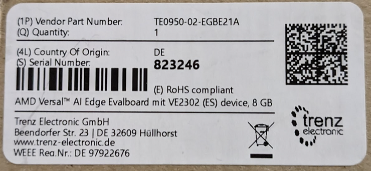
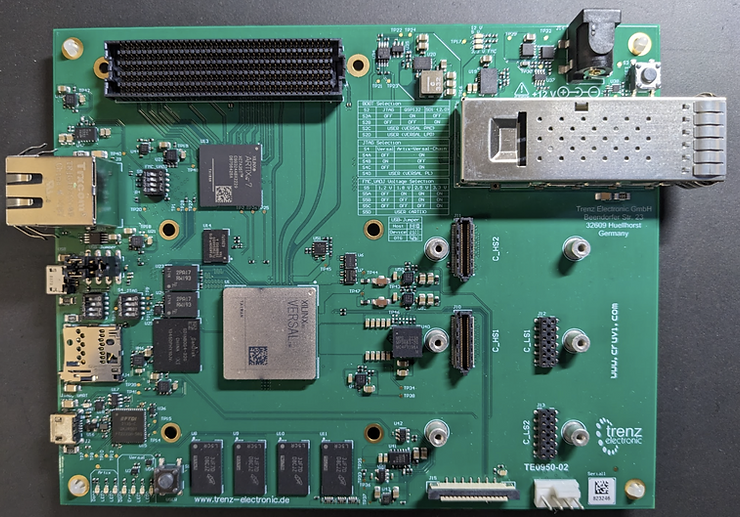
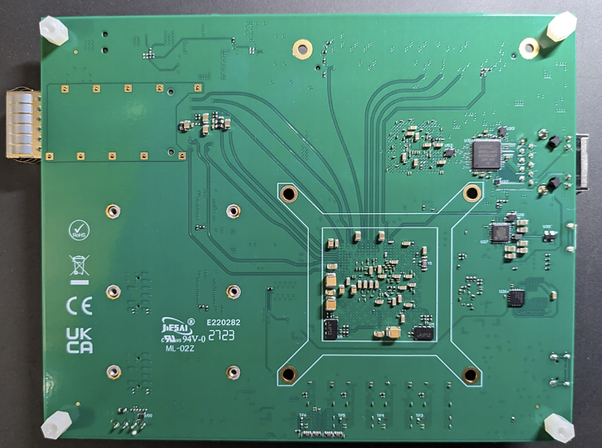

# Versal AI Edge Device - Essential Licensing Instructions for Early Silicon Users ( TE0950-02-EGBE21A )

This post is meant to help anyone searching for how to bring up a board with an AMD Versal™ AI Edge XCVE2302-1LSESFVA784 device (engineering sample), such as the TE0950-02-EGBE21A from Trenz.

**<u>Board Documentation</u>**

-   [<u>https://wiki.trenz-electronic.de/display/PD/TE0950+Resources</u>](https://wiki.trenz-electronic.de/display/PD/TE0950+Resources)
    
-   [<u>https://wiki.trenz-electronic.de/display/PD/TE0950+TRM</u>](https://wiki.trenz-electronic.de/display/PD/TE0950+TRM)
    
-   [<u>https://wiki.trenz-electronic.de/display/PD/TE0950+Reference+Designs</u>](https://wiki.trenz-electronic.de/display/PD/TE0950+Reference+Designs)
    
-   [<u>https://wiki.trenz-electronic.de/display/PD/TE0950+PCN</u>](https://wiki.trenz-electronic.de/display/PD/TE0950+PCNhttps://wiki.trenz-electronic.de/display/PD/TE0950+AN)
    
-   [<u>https://wiki.trenz-electronic.de/display/PD/TE0950+AN</u>](https://wiki.trenz-electronic.de/display/PD/TE0950+AN)
    
-   [<u>https://shop.trenz-electronic.de/search?sSearch=TE0950</u>](https://shop.trenz-electronic.de/search?sSearch=TE0950)
    
-   [<u>https://shop.trenz-electronic.de/Download/?path=Trenz_Electronic/Development_Boards/TE0950/</u>](https://shop.trenz-electronic.de/Download/?path=Trenz_Electronic/Development_Boards/TE0950/)
    
-   [<u>https://shop.trenz-electronic.de/Download/?path=Trenz_Electronic/Pinout</u>](https://shop.trenz-electronic.de/Download/?path=Trenz_Electronic/Pinout)
    
-   [<u>https://shop.trenz-electronic.de/trenzdownloads/Trenz_Electronic/Development_Boards/TE0950/REV02/Documents/SCH-TE0950-02-EGBE21A.PDF</u>](https://shop.trenz-electronic.de/trenzdownloads/Trenz_Electronic/Development_Boards/TE0950/REV02/Documents/SCH-TE0950-02-EGBE21A.PDF)
    

**<u>Pictures</u>**

Pictures of the board so you'll be able to tell:

Your board requires special licensing for tool access.

Here's a guide to help you navigate the licensing process:

1\. **Vitis/Vivado License**: Your board's ES silicon necessitates a unique license, not covered by the standard support in Vitis/Vivado tools. To obtain this ES license, you'll need to contact AMD.

2\. **PDI License**: Accessing the device in the tool does not automatically enable you to generate a PDI. For this capability, registration at the Errata Lounge is necessary. Post-registration, AMD will approve your request, and you'll receive the license to generate PDI files.

3\. **Vitis AI Support**: If your work involves implementing a CNN inference model using Vitis AI, you'll require access to the EA DPU. This is available through a separate registration process. Please be aware that the C20B1 DPU provided is specifically for early-access customers. It's functional for development but lacks optimizations to exploit the full performance potential of the silicon.

**<u>Additional Resources</u>**

**PDI** stands for "**Programmable Device Image**"

Reference: [https://xilinx-wiki.atlassian.net/wiki/spaces/A/pages/2037088327/Versal+Platform+Loader+and+Manager](https://xilinx-wiki.atlassian.net/wiki/spaces/A/pages/2037088327/Versal+Platform+Loader+and+Manager)

Cached: [https://drive.google.com/file/d/1Yakjj8TnbyWmR\_Nxp8rJTWUm8CR4sah5/view?usp=sharing](https://drive.google.com/file/d/1Yakjj8TnbyWmR_Nxp8rJTWUm8CR4sah5/view?usp=sharing)

**PDI** Doc: [https://docs.xilinx.com/r/en-US/ug1304-versal-acap-ssdg/Creating-a-Boot-Image-PDI](https://docs.xilinx.com/r/en-US/ug1304-versal-acap-ssdg/Creating-a-Boot-Image-PDI)

"A Brief **Overview of the Versal Boot files**"

Original: [https://support.xilinx.com/s/article/1146981?language=en\_US](https://support.xilinx.com/s/article/1146981?language=en_US)

Cached: [https://drive.google.com/file/d/1Y\_sxCAaAzzrR160eKUKFc-k4MGu2CKBK/view?usp=drive\_link](https://drive.google.com/file/d/1Y_sxCAaAzzrR160eKUKFc-k4MGu2CKBK/view?usp=drive_link)

**Trenz Logo:** [https://wiki.trenz-electronic.de/download/attachments/393218/global.logo?version=4&modificationDate=1366710180000&api=v2](https://wiki.trenz-electronic.de/download/attachments/393218/global.logo?version=4&modificationDate=1366710180000&api=v2)

**Buy a TE0950-02-EGBE21A from Trenz:** [https://shop.trenz-electronic.de/en/TE0950-03-EGBE21A-AMD-Versal-AI-Edge-Evalboard-with-VE2302-device-8-GB-DDR4-SDRAM-15-x12-cm](https://shop.trenz-electronic.de/en/TE0950-03-EGBE21A-AMD-Versal-AI-Edge-Evalboard-with-VE2302-device-8-GB-DDR4-SDRAM-15-x12-cm)