# The Guppy LoRaWAN Configuration Tool Ver 1.9

This post presents a description of the Guppy LoRaWAN Configuration Tool Ver 1.9 based on the online documentation from Digital Matter with corrections based on observation.

**<u>Param Date</u>**

When the Guppy's parameters were last changed.

**<u>Region</u>**

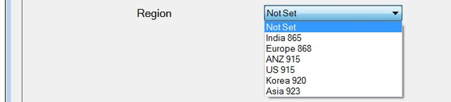

Selects the radio frequencies base on your country.

**The region cannot be reconfigured over the air.**

**<u>Activation</u>**

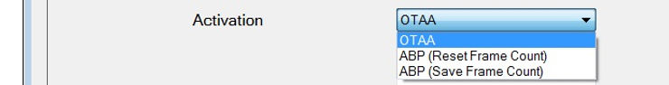

**OTAA**

Default (and recommended) Over The Air Activation

**ABP (Reset Frame Count)** - need to set **NwkSKey**, **AppSKey** and **Device Address**

-   Reset the uplink and downlink frame counts whenever the device is reset
    
-   This defeats the encryption entirely, but is required in LoRaWAN 1.0 so that the network server can detect the device reset, and reconfigure the device's channels
    

**ABP (Save Frame Count)**

-   Set if your network doesn't need to detect the device reset and reconfigure the channels
    
-   Encryption is not compromised, but there is no opportunity for the network server to reconfigure the device
    

**Note on ABP**

-   The update to LoRaWAN 1.1 will do something to resolve this (TBD what?)
    

**<u>AppEUI &amp; AppKey</u>**

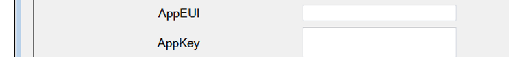

**AppEUI**

-   The website to send data to.
    
-   70-B3-D5-70-50-00-00-01 used if blank
    

**AppKey** (_Sensitive! Don't Share!_)

-   32 character key authenticates the Guppy with the website and network server
    
-   If blank, the Guppy will uses a unique random key, which was written to it in the factory
    
-   This default key can be read from the DevEUI list dialog, or the label on the box. It is not printed on the Guppy's label
    
-   **The AppKey cannot be reconfigured over the air**
    

**<u>NwkSKey, AppSKey &amp; Device Address</u>** <u> (if </u> **<u>Activation</u>** <u> is set to </u> **ABP**)

**NwkSKey** (_Sensitive! Don't Share!_)

-   32 character key
    
-   Authenticates the Guppy with the network server.
    

**AppSKey** (_Sensitive! Don't Share!_)

-   32 character key
    
-   Authenticates the Guppy with the website & network server.
    

**Device Address**

-   8 character number identifies the Guppy with the network server
    

**<u>Channel Mask</u>**

**Mask**

-   Set in US and ANZ region
    
-   Selects which of the 72 uplink channels your network provider uses
    
-   Parameter is a hexadecimal number
    
-   Lowest channels corresponding to the rightmost digits
    

**Examples**

-   Sub-band 1 uses channels 00-07, 64, mask is 0100000000000000FF
    
-   Sub-band 2 uses channels 08-15, 65, mask is 02000000000000FF00
    
-   Sub-band 3 uses channels 16-23, 66, mask is 040000000000FF0000
    
-   Sub-band 4 uses channels 24-31, 67, mask is 0800000000FF000000
    
-   Sub-band 5 uses channels 32-39, 68, mask is 10000000FF00000000
    
-   Sub-band 6 uses channels 40-47, 69, mask is 200000FF0000000000
    
-   Sub-band 7 uses channels 48-55, 70, mask is 4000FF000000000000
    
-   Sub-band 8 uses channels 56-63, 71, mask is 80FF00000000000000
    
-   To select all channels, use FFFFFFFFFFFFFFFFFF
    

**Default**

-   Default is blank
    
-   Region's default channels are used
    
-   In US and ANZ region, this is the same as enabling all channels
    
-   Will lead to packet loss if your network is only using a single sub-band
    

**MachineQ**

-   The channel mask is set automatically by the network server
    
-   The default channel mask is CH0 – CH7 (0000000000000000FF) for MachineQ indoor gateways.
    

**<u>Min Data Rate &amp; Max Data Rate</u>**

**Valid When?**

-   Valid when ADR is not active
    

**Use**

-   Set the minimum and maximum data rates to transmit at
    
-   Using a range of data rates allows the network to support more devices per gateway, but reduces your guaranteed range to the range of the highest data rate.
    
-   Using higher data rates may allow you to send more messages per day.
    

**Setting**

-   With a range, Guppy will alternate between the allowed data rates to spread the transmit time evenly: means it will use the higher data rates more often
    
-   Set **both to same** to **always transmit at that rate**
    

**Valid Values**

-   A **0** selects DR0, the lowest data rate with the longest range.
    
-   Can set to **15**
    

**Tuning**

-   Set low enough to meet network and battery life requirements
    

**Examples**

-   At DR0, this gives you 25 messages per day with 100% range
    
-   At DR1, this gives you 45 messages per day with 75% range
    
-   At DR2, this gives you 90 messages per day with 50% range (DR0 in U.S.)
    
-   At DR3, this gives you 181 messages per day with 37% range (DR1 in U.S.)
    
-   At DR4, this gives you 323 messages per day with 28% range
    
-   At DR5, this gives you 647 messages per day with 21% range
    

**<u>Adaptive Data Rate</u>**

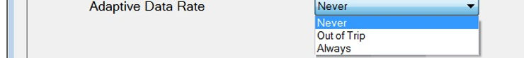

**Use**

To optimize power usage and network capacity when the tracked asset is mostly stationary

**Setting: Never**

-   Don't request ADR when sending uplinks, device will control the data rate according to **<u>Min Data Rate &amp; Max Data Rate</u>**
    

**Setting: Out of Trip**

-   Switch to lowest configured data rate and highest transmit power, whenever a trip ends.
    
-   After, the network server will configure it to a lower power mode if needed
    

**Setting: Always**

-   Always control the rate using a policy on the network server
    

**Warning**

-   ADR adaptation rate in LoRaWAN 1.0 is extremely slow
    
-   If the device loses connectivity, it takes 96 lost transmissions before it will attempt to increase its transmit range
    
-   This adaptation rate will be adjustable in a future LoRaWAN release
    

**<u>Rejoin Period</u>**

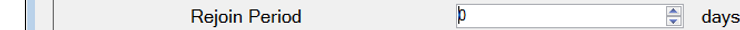

**Use**

-   Rejoin the network (in case the network server has somehow forgotten the session keys).
    

**Setting**

-   Rejoin every 1 to 255 days
    
-   0 disables rejoins
    

**Note**

-   Rejoining weekly generates several extra transmissions, but lowers the time spent out of service in the event of an accident
    
-   The rejoin is exactly equivalent to a **device reset**, and takes place even if **Activation** is set to **ABP**
    

**<u>Status Updates: Heartbeat Tx</u>**

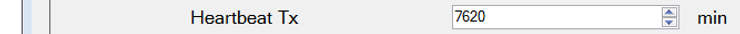

**Use**

-   Maximum time between status updates
    
-   If movement causes additional updates, the next heartbeat update is scheduled for **what ever is set** minutes after the last movement update.
    
-   The default is 1440 min (24 hours)
    

**Range**

-   1 to 7620 minutes
    

**In Days**

-   1 day = 1day \* 60 (mins/hour) \* 24 (hours/day) = 1440 mins
    
-   Max 5 days ~= 7620 mins \* 1/60 (hours/min) \*1/24 (days/hour)
    

**<u>Status Updates: In Trip Tx</u>**

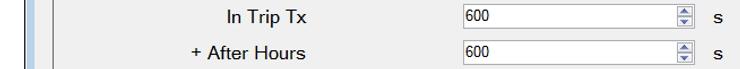

**Details**

-   The time between status updates when in-trip (and when in-trip and after hours)
    
-   0 to disable status updates in-trip
    
-   Default is 600 seconds (10 min)
    

**Note**

In Europe, radio regulations prevent the effective time between transmissions from dropping lower than about 115 seconds when using the lowest data rate.

**<u>Trips: Trip End Timeout</u>**

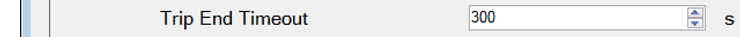

**Setting**

-   The amount of time no movement needs to be detected before a trip ends
    
-   Default is 300 (5 min)
    
-   0 disables trip tracking (disables the accelerator, saving a little power)
    
-   Set in 10 second increments: 0, 10, 20, ... 2550 seconds
    

**<u>Status Updates &amp; Trips: Tx On Start, + After Hours, Tx On End, + After Hours</u>**

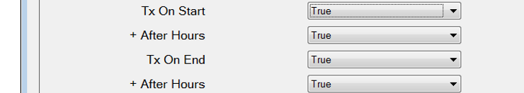

**Tx On Start**

-   When set, a status update is scheduled at the start of a trip
    
-   This is often unnecessary, since the start position is generally already known from the end of the previous trip
    
-   The **default** is **true**
    

**\+ After Hours**

-   When set, a status update is scheduled at the start of a trip when the trip is after-hours
    
-   You can use this to implement theft alerting
    
-   The **default** is **true**
    

**Tx On End**

-   When set, a status update is scheduled at the end of a trip
    
-   This lets you know where the asset is, with one caveat - if the destination is underground parking, it may have no coverage
    
-   The **default** is **true**
    

**\+ After Hours**

-   When set, a status update is scheduled at the end of a trip when the trip is after-hours.
    
-   The **default** is **true**
    

**<u>Man Down Timeout, + Tx On Set &amp; Tx On Clear</u>**

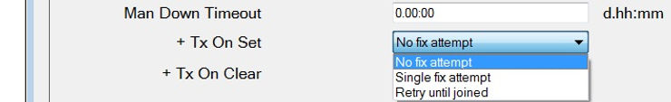

**Details**

-   Take an action when no movement has been detected for a certain time
    
-   Set 10 minutes to 21h10m, in 10 minute increments, or from 1 day to 63 days 12 hours, in 12 hour increments
    
-   A value of 0 disables Man Down indication, saving a minuscule amount of battery life (< 1%).
    
-   The default is disabled
    

**When Set of Cleared**

-   **No fix attempt** - the bit will upload when the next heartbeat is sent (default)
    
-   **Single fix attempt** - if join has been successful
    
-   **Retry until joined** - keep trying until network is ready (join successful) then tx once
    

**<u>Send Statistics</u>**

**Details**

-   Send a statistics message every 3 days
    
-   The statistics help keep track of battery usage, and diagnose vibration issues
    
-   Default **enabled**
    
-   Disable the statistics to minimize transmissions
    

**<u>Tilt / Triggers</u>**

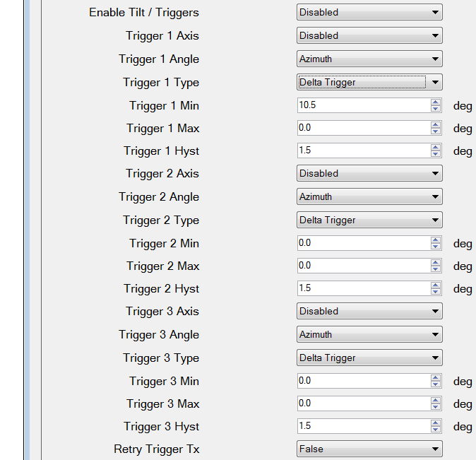

**Axis**

-   Axis to measure tilt against: x, y, z
    

**Angle**

-   Measure the angle between access and down - inclination
    
-   Measure the angle around (right hand rule) - azimuth
    

**Type: Delta Trigger**

-   Goes off if the angle changes by more than the Min angle, since it was last reported
    

**Type: Range Trigger**

-   Goes off if the angle leaves the range defined by Min, Max, and Hysteresis
    
-   The Hysteresis is added to or subtracted from the range boundaries, to prevent chattering of the trigger when the angle is close to the threshold
    

**Retry Trigger TX**

-   Retry the trigger link once the network is available
    

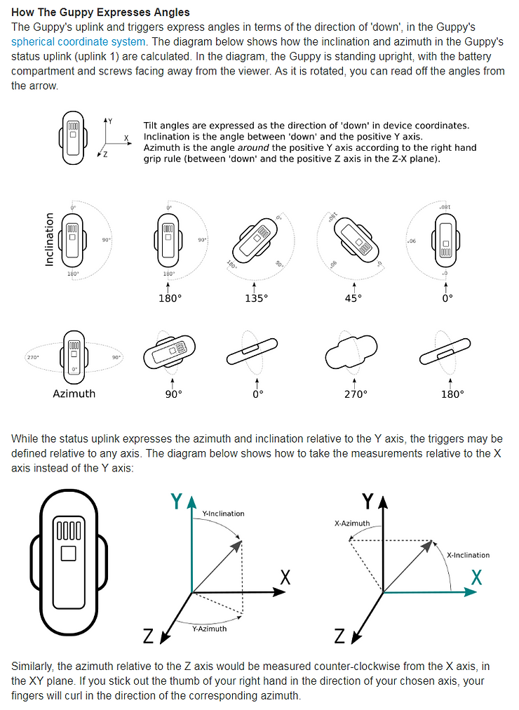

**<u>Timezone</u>**

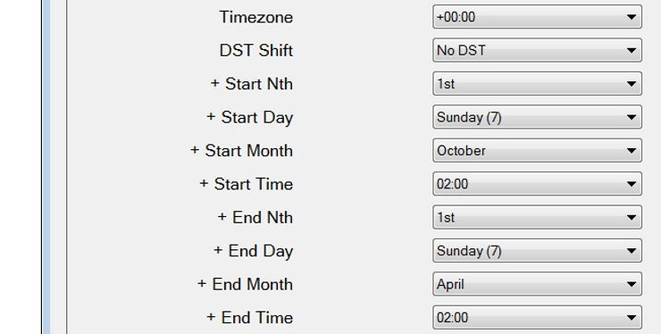

**Timezone**

-   This is the timezone used for after-hours calculations.
    
-   The default is UTC.
    

**DST Shift**

-   This is the amount of time that the clock shifts during daylight savings time, if applicable.
    
-   It applies only to the after-hours calculations, and will usually be one hour, or zero to disable daylight savings.
    
-   The **default** is **disabled**.
    

**\+ Start / End Nth / Day / Month / Time**:

-   These parameters allow you to specify the start and end times of daylight savings, if DST Shift is nonzero. They only apply to the after-hours calculations.
    
-   Most countries use a relative specification such as 'The 1st Sunday of April, at 02:00 local time', or 'The Friday before the last Sunday of October, at 2:00 local time'.
    
-   For the first example you would choose '1st', 'Sunday', 'April', '2:00'. For the second, you'd choose 'Last', 'Sunday', 'October', '-2d 02:00'.
    
-   You can also choose a fixed date and time using for instance 'Absolute Day', 'Day 28', 'April', '02:00'.
    
-   The time is always in the current local time zone, including any daylight savings adjustment.
    

**<u>Trip: Afterhours</u>**

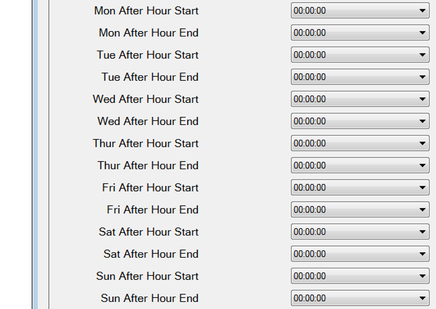

**Info**

-   These parameters allow you to specify which times are after-hours, for the purpose of applying different trip tracking parameters at those times.
    
-   Set both the start and end parameters to **00:00 to disable (default)**.
    
-   Set the **start to 00:00**, and the **end to 24:00**, to make the **entire day after-hours**.
    
-   Setting a start time to before the end time makes the intervening times after-hours.
    
-   Setting the start time to after the end time makes the times between 00:00 and the end time, and between the start time and 24:00, after-hours.
    

**<u>Wakeup Threshold</u>**

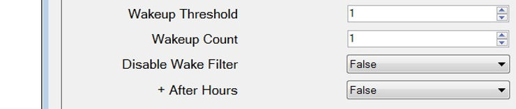

**Wakeup Threshold**

-   Required amount of force
    
-   Range 1 to 8
    
-   In units of 63 mG
    
-   To wake accelerometer up
    

**Wakeup Count**

-   Required time of the force
    
-   Range 1 to 8
    
-   In units of 80 ms
    

**Disable Wake Filter**

-   Set to disable the trip-start filtering, that is usually applied in addition to the Wakeup Threshold and Wakeup Count
    
-   The wake filter rejects small disturbances, requiring sustained jostling before a trip starts
    
-   The filter only starts a trip when it has seen 1 seconds worth of above-threshold movement in a 4 second period, or repeated short movements over several 4 second periods
    
-   This setting disables the filter during work hours only
    
-   The **default** is **false (not disabled)**
    
-   This is good for battery life, but if you require higher sensitivity, or the filtering is causing too much latency for your application, you can disable it
    

**\+ After Hours**

-   Set to disable the trip-start filtering after-hours
    
-   The **default** is **false (not disabled)**
    
-   This can be useful for theft alerting, as it allows you to detect even minor bumps after-hours, without producing many false positives during normal work hours
    

**<u>References</u>**

-   Download at \[[<u>link</u>](https://support.digitalmatter.com/support/solutions/articles/16000072392-guppy-configuration-application)\]
    
-   Documented at \[[<u>link</u>](https://support.digitalmatter.com/support/solutions/articles/16000063353-configuration-and-usage-guide)\] (info for this post)