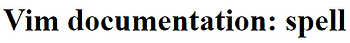

# To spellcheck in Vim

Purpose

Summarizes what I always refer to in [http://vimdoc.sourceforge.net/htmldoc/spell.html](http://vimdoc.sourceforge.net/htmldoc/spell.html).

To spellcheck in Vim type:

:setlocal spell spelllang=en\_us

To correct the spelling of a word use:

\]s Move to next misspelled word after the cursor.

\[s Like "\]s" but search backwards z= For the word under/after the cursor suggest correctly spelled words

Other resources: 

Jake Harding has a good write up on "Using Spell Check in Vim" here: 

http://thejakeharding.com/tutorial/2012/06/13/using-spell-check-in-vim.html.