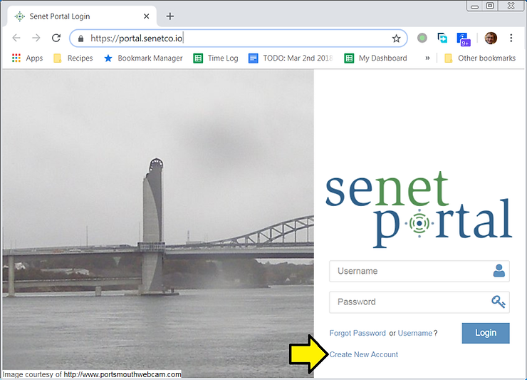
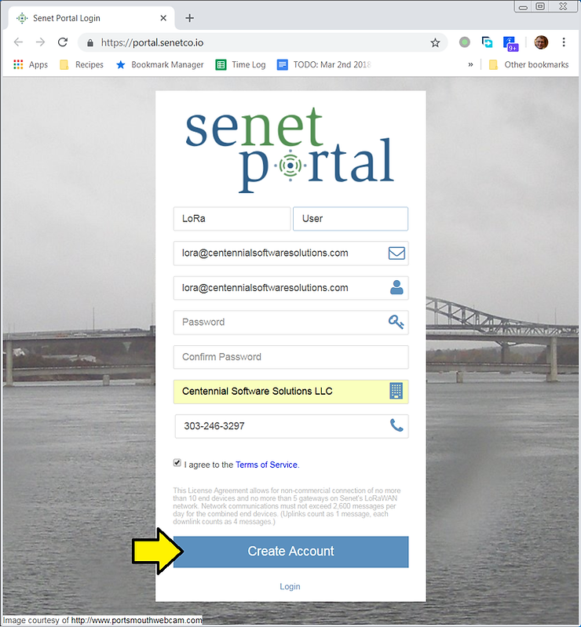
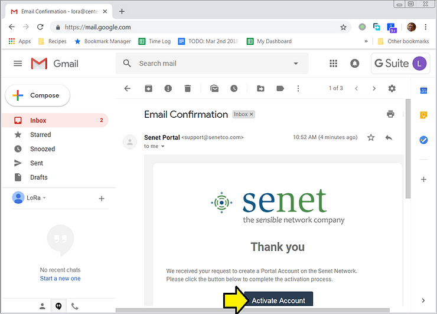
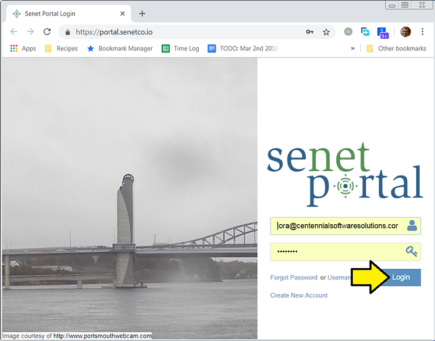
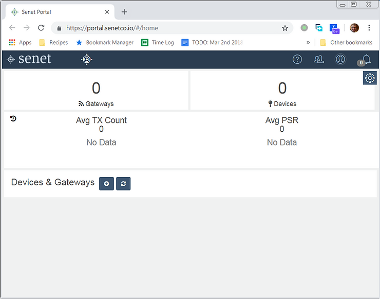
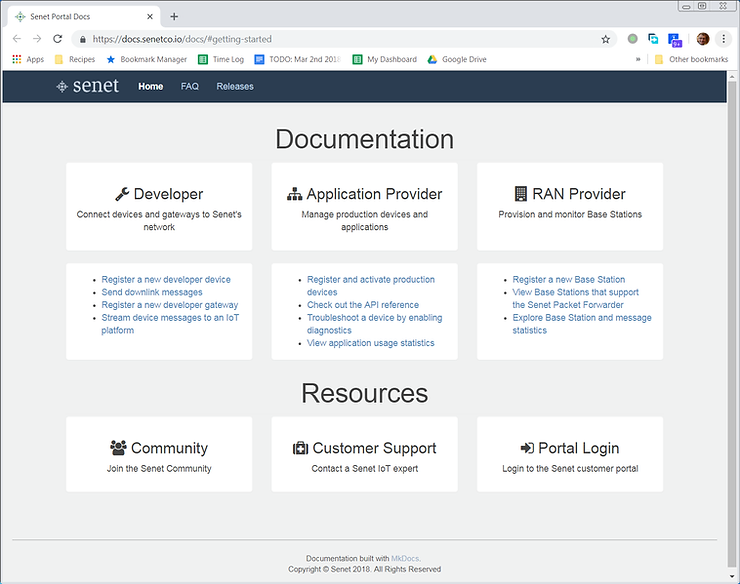

# Try Out Senet's LoRaWAN: Step 1 Create an Account

This post lists the links and steps to create and login to Senet to try out your device on a LoRaWAN.

<u>Steps to Create a New Account and Log In</u>

1\. Go to \[[<u>link</u>](https://portal.senetco.io/)\] and click **Create New Account**

2\. Fill in your details and click the **Create Account** button

3\. An email will be sent to you, click the **Activate Account** link

4\. This will take you back to \[[<u>link</u>](https://portal.senetco.io/)\]. Login.

5\. You'll see a dashboard:

... and a **Getting Started Documentation** page at \[[<u>link</u>](https://docs.senetco.io/docs/#getting-started)\]

**<u>Reference</u>**

Senet logo from \[[<u>link</u>](https://www.senetco.com/wp-content/uploads/2018/06/Senet-Logo.png)\].