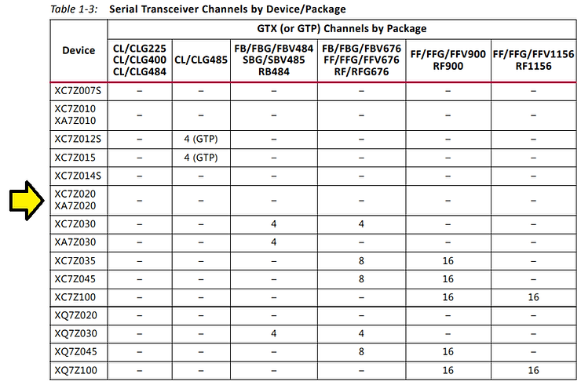

# TUL PYNQ-Z2 Unboxing, Zynq-7000 Details, and Links to Documentation

This post presents a TUL PYNQ-Z2 unboxing, Zynq-7000 details, and links to documentation. It also lists which Zynq-7000 is used (XC7Z020-1CLG400C), its features, and some package details.

## TUL PYNQ-Z2 Unboxing, Zynq-7000 Details, and Links to Documentation

**Unboxing**

The box

...the bottom of the box

...opened

A close up of the board...

...and the bottom of the board.

...and the SD Card:

Power

...and a close up on the power supply:

Some of the details on adapter:

AC ADAPTER

Model: ATS036T-W120V LPS

Input: 100-240V 50-60Hz 1A MAX.

Output: 12V 3A

EFFICIENCY LEVEL V1

**Zynq-7000 Feature, Package & Mechanicals Summary**

The PYNQ-Z2 has a XC7Z020-1CLG400C

Device/Package I/O at \[[link](http://www.xilinx.com/support/packagefiles/z7packages/xc7z020clg400pkg.txt)\]

**Feature Summary**

**Package Specification**

**Mechanicals**

**Documentation** (All docs listed are available at \[[link](http://drive.google.com/open?id=1ZqgxgUacsKG1CXAxdeqhJYpKzBbPbVa4)\])

-   **PYNQ-Z2 User Manual (PDF)**
    
-   pynqz2\_user\_manual\_v1\_0.pdf at \[[link](http://d2m32eurp10079.cloudfront.net/Download/pynqz2_user_manual_v1_0.pdf)\]
    
-   copy @ \[[link](http://drive.google.com/file/d/1Ych3B-1r6lIoNBsal2jo5den1X758HpR/view?usp=sharing)\]
    
-   **PYNQ-Z2 Boot Image**
    
-   pynq\_z2\_v2.3.zip at \[[link](http://d2m32eurp10079.cloudfront.net/Download/pynq_z2_v2.3.zip)\]
    
-   copy @ \[[link](http://drive.google.com/file/d/1Atf8h8oP6qtgdk_Uc44-VShQfiLn95m0/view?usp=sharing)\]
    
-   **PYNQ-Z2 Board File** (for Pmod IP support please refere here)
    
-   pynq-z2.zip at \[[link](http://d2m32eurp10079.cloudfront.net/Download/pynq-z2.zip)\]
    
-   copy @ \[[link](http://drive.google.com/file/d/1nEa7D82G1oNgQ_sU_K8FGiE9u4Sa5fOQ/view?usp=sharing)\]
    
-   **Master XDC**
    
-   pynq-z2\_v1.0.xdc.zip at \[[link](http://www.tul.com.tw/download/pynq-z2_v1.0.xdc.zip)\]
    
-   copy @ \[[link](http://drive.google.com/open?id=1Gowa9TBGlDZmLeGmnzAtK5uB_663WNLW)\]
    
-   **Protective Acrylic Case (PDF)**
    
-   PYNQ\_Z2-AcrylicCaseDrawing.PDF at \[[link](http://www.tul.com.tw/download/PYNQ_Z2-AcrylicCaseDrawing.PDF)\]
    
-   copy @ \[[link](http://drive.google.com/open?id=1XfxePpCsMszA19Ao_s0s5wZsItLe9ZIU)\]
    
-   **Zynq Datasheet (PDF)**
    
-   ds187-XC7Z010-XC7Z020-Data-Sheet.pdf at \[[link](http://www.xilinx.com/support/documentation/data_sheets/ds187-XC7Z010-XC7Z020-Data-Sheet.pdf)\]
    
-   copy @ \[[link](http://drive.google.com/open?id=1M6E9a4tsn6nT10LjYrIUEV18nLbeMIWT)\]
    
-   **Zynq Manual (PDF)**
    
-   ug585-Zynq-7000-TRM.pdf at \[[link](http://www.xilinx.com/support/documentation/user_guides/ug585-Zynq-7000-TRM.pdf)\]
    
-   copy @ \[[link](http://drive.google.com/open?id=1UvpYdfA5EjT3_FQUluyDqTsPZxRgmSQv)\]
    
-   **Schematics (PDF)**
    
-   TUL\_PYNQ%20Schematic\_R12.pdf at \[[link](http://www.tul.com.tw/download/TUL_PYNQ%20Schematic_R12.pdf)\]
    
-   copy @ \[[link](http://drive.google.com/open?id=1PlaQUh9yRxJ4mWCrdTqcLsry2GWjPbrZ)\]
    

**References**

-   TUL PYNQ-Z2 Product Announcement, Product Specification, Downloads, Ordering, Technical Support and Distribution Partners at \[[link](http://www.tul.com.tw/ProductsPYNQ-Z2.html)\]
    
-   Zynq-7000 SoC Data Sheet: Overview - ds190-Zynq-7000-Overview.pdf - \[[link](http://www.xilinx.com/support/documentation/data_sheets/ds190-Zynq-7000-Overview.pdf)\]
    
-   Zynq-7000 SoC Packaging and Pinout Product Specification - ug865-Zynq-7000-Pkg-Pinout.pdf - \[[link](http://www.xilinx.com/support/documentation/user_guides/ug865-Zynq-7000-Pkg-Pinout.pdf)\]