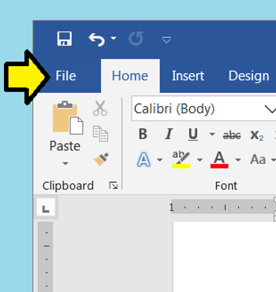
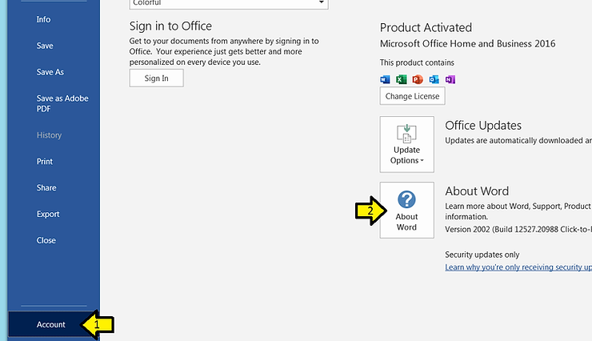
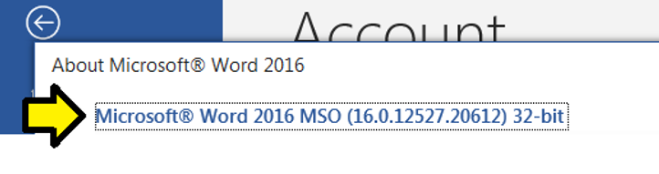
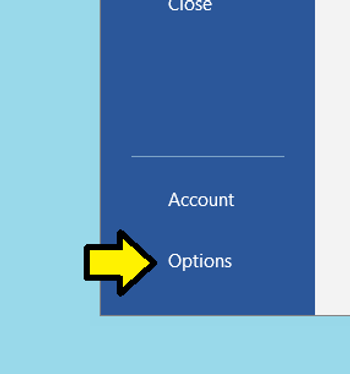
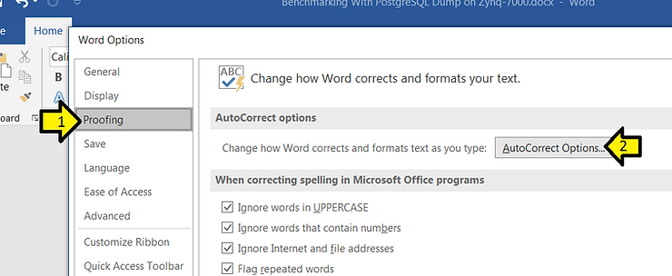
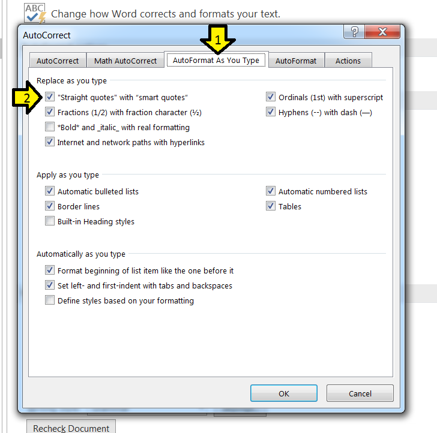
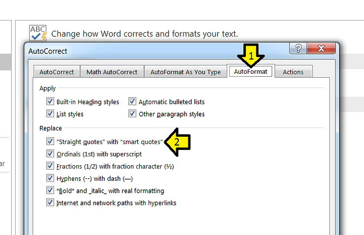
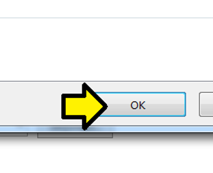
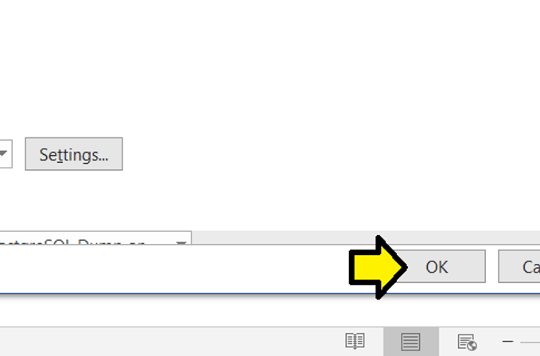

# Turn off Curved Quotes in Word 2016

This post shows how to turn off curved quotes in **Word 2016**. It also shows you how to check the version of **Word** you're using.

**Check Word Version**

Step [#1](https://www.centennialsoftwaresolutions.com/blog/hashtags/1): Click **File**

Step [#2](https://www.centennialsoftwaresolutions.com/blog/hashtags/2): 

1) Click **Account**

2) Click **About Word**

The version:

**Turn off Curly Quotes**

Step [#1](https://www.centennialsoftwaresolutions.com/blog/hashtags/1): Click **File**

Step [#2](https://www.centennialsoftwaresolutions.com/blog/hashtags/2): Click **Options**

 Step [#3](https://www.centennialsoftwaresolutions.com/blog/hashtags/3): 

1) Click **Proofing**

2) Click **AutoCorrect Options...**

Step [#4](https://www.centennialsoftwaresolutions.com/blog/hashtags/4): 

1) Click **AutoFormat As You Type**

2) Click the **"Straight quotes" with "smart quotes"** check box off

Step [#5](https://www.centennialsoftwaresolutions.com/blog/hashtags/5): 

1) Click AutoFormat

2) Click the **"Straight quotes" with "smart quotes"** check box off

Step [#6](https://www.centennialsoftwaresolutions.com/blog/hashtags/6): Click **OK**

Step [#7](https://www.centennialsoftwaresolutions.com/blog/hashtags/7): Click **OK** again

**Reference**

Word icon from \[[link](http://www.microsoft.com/en-us/store/d/word-2016/cfq7ttc0k5d7?activetab=pivot%3aoverviewtab)\].