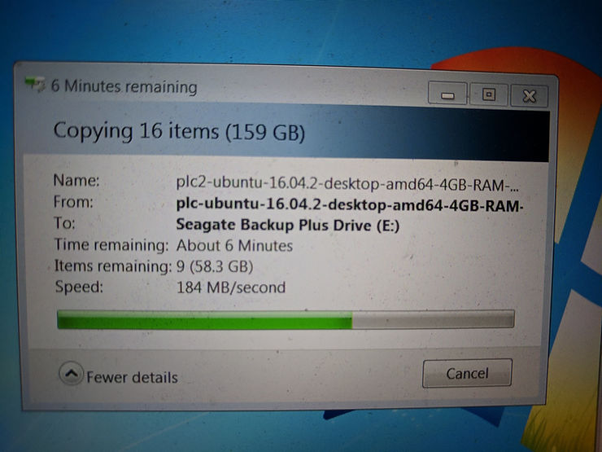

# Unboxing a Seagate STEL4000100 4 TB

This post shows an unboxing of the **Seagate STEL4000100 4 TB USB 3.0 Desktop Backup Plus Hub Hard Drive (STEL4000100)** Item : 2431928 / Model : STEL4000100 from Staples \[[link](http://www.staples.com/External-Hard-Drives/cat_CL160403)\] on July 1st 2018.

From Staples website \[[link](http://www.staples.com/External-Hard-Drives/cat_CL160403)\]:

Picked up the drive from 6767 S. Vine Street, Centennial, CO 80122 \[[link](http://goo.gl/maps/YjeugHnzFh62)\] on July 1st.

Unboxing

After plugging in the drive, Windows automatically mounted it to E:\\.

**Some Performance Shots**

184 to 228 MB/second, 10 min to transfer 153 GB

**References**

Seagate icon clipped from \[[link](http://www.facebook.com/seagate/)\]