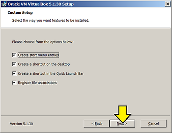
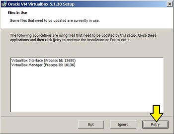

# Upgrade to VirtualBox 5.1.30 from 5.1.14 on Windows 7

Overview

This post gives step-by-step instructions for upgrading VirtualBox from 5.1.14 to 5.1.30.

Before starting

You may want t completely restart your Windows machine before attempting this.

Steps

1\. Click the link: http://download.virtualbox.org/virtualbox/5.1.30/VirtualBox-5.1.30-118389-Win.exe.

2\. Save the file to C:\\Users\\your\_username\\Documents\\Installers

3\. [Double-click](http://en.wikipedia.org/wiki/Double-click) it.

4\. Click **Run**

5\. Click **Run** again

6\. Click **Next**

7\. Click on the **VirtualBox Application** box and select **Entire feature will be installed on local hard drive** the click **Next**

8\. Click **Next** again

9\. The next step warns that the installation may reset the network device. Don't worry, the network reset will occur during install after you click **Yes** (and Install in the next step)

10\. Before clicking **Install**:

-   Save any work that relies on a network connection
    
-   Close VirtualBox if its still open
    

10.a If you didn't close VirtualBox you'll see a window that says that its still open. Close VirtualBox and click **Retry**.

10.b There may additional files still in use. The installer may list a few numbers. These are PIDs.

10.c To figure out what to close you can type Control-Alt-Delete. Click the **Processes** tab. Click **View** then click **Select Columns...**

10.d Select the PID (Process Identifier) checkbox

Back in Windows Task Manager, make sure the **Show processes from all users** checkbox is checked. find the numbers listed (1868, 5604, 7084 in the example above). You can click on the PID column to sort the numbers. For each number click **End Process**

If any PID is a SYSTEM PID you may get an Access is denied error

If you get this, stop the installation, reboot the computer and try again.

11\. Click Finish and open Oracle VM VirtualBox

Notes

Difference between 5.1.14 and 5.1.30 detailed at: [https://www.virtualbox.org/wiki/Changelog-5.1](http://www.virtualbox.org/wiki/Changelog-5.1).