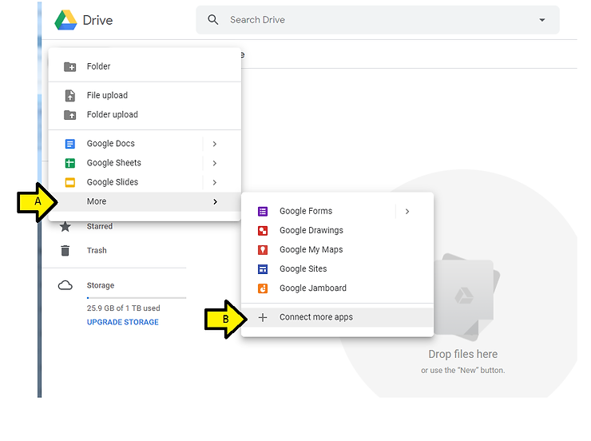

# Use draw.io in Google Drive (and Get Rid of draw.io )

This post lists step by step instructions for using draw,io in Google Drive. It also list how to get rid of it.

**Nomenclature**

Google Drive has you **CONNECT** to an app you want to use (install the app) and **DISCONNECT** from an app you don't want to use (uninstall).

**Steps**

**Connect draw.io (or any app)**

Step 1: Click **New**

Step 2:

A. Click **More**

B. Click **Connect more apps**

Step 3:

A. Type **draw** and hit **ENTER** on your keyboard

B. Click the **CONNECT button** next to **draw.io Diagrams**

Step 4:

A. Look for the **green checkmark** in the corner of the draw.io entry

B. Ensure the **checkbox** is checked to use draw.io Diagrams as the default app to open files in can open

C. Click **OK**

Step 5: Click the **x**

Step 6: Check that you can access draw.io

A. Click **New**

B. Click **More**

C. Click **draw.io Diagrams**

**Disconnect draw.io (or any app)**

Step 1:

A. Click the **gear icon**

B. Click **Settings**

Step 2:

A. Click **Manage Apps**

B. Click the **OPTIONS** drop down

B. Click **Disconnect from Drive**

Step 3: Click **DISCONNECT**

Step 4: Click **DONE**

**References**

-   Steps to remove apps from Google Drive found at \[[link](http://www.bettercloud.com/monitor/the-academy/how-to-manage-google-drive-apps/)\]
    
-   Drive logo from \[[link](http://www.google.com/drive/)\]