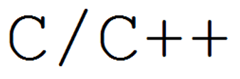

# Where do I find C and C++ standard documents?

This post describes where you can buy and view free drafts of the current and past C and C++ standards. It was inspired by [1]. It is a work-in-progress. 

###### C 

- C11  
- 198 CHF (Swiss francs) @ [ISO/IEC 9899:2011](http://www.iso.org/iso/iso_catalogue/catalogue_tc/catalogue_detail.htm?csnumber=57853)    
- Publicly at [WG14 N1570](http://www.open-std.org/JTC1/SC22/WG14/www/docs/n1570.pdf) (2011-04-12) [2]  
- [Wiki](http://en.wikipedia.org/wiki/C11_(C_standard_revision))    
- C99   
- Can't purchase @ [ISO/IEC 9899:1999](http://www.iso.org/iso/home/store/catalogue_ics/catalogue_detail_ics.htm?csnumber=29237&ICS1=35&ICS2=060)   
- Publicly at [WG14 N1256](http://www.open-std.org/jtc1/sc22/wg14/www/docs/n1256.pdf) (2007-09-07) [2]  
- [Wiki](http://en.wikipedia.org/wiki/C99)    
- [C90, C89, ANSI C, ISO C or Standard C ](http://www.iso.org/iso/home/store/catalogue_ics/catalogue_detail_ics.htm?csnumber=17782&ICS1=35&ICS2=060)  
- Can't purchase @ [ISO/IEC 9899:1990](http://www.iso.org/iso/home/store/catalogue_ics/catalogue_detail_ics.htm?csnumber=17782&ICS1=35&ICS2=060)  
- Need link to ANSI X3.159-1989   
- [Wiki](http://en.wikipedia.org/wiki/ANSI_C)   

## C++ 

- C++14  
- 198 CHF (Swiss francs) @ [ISO/IEC 14882:2014](http://www.iso.org/iso/home/store/catalogue_ics/catalogue_detail_ics.htm?ics1=35&ics2=060&ics3=&csnumber=64029)  
- Looking for public link  
- Based on [ISO/IEC 9899:1999](http://www.iso.org/iso/home/store/catalogue_ics/catalogue_detail_ics.htm?csnumber=29237&ICS1=35&ICS2=060)  
- [Wiki](http://en.wikipedia.org/wiki/C%2B%2B14)    
- C++11  
- Can't purchase @ [ISO/IEC 14882:2011](http://www.iso.org/iso/home/store/catalogue_ics/catalogue_detail_ics.htm?csnumber=50372&ICS1=35&ICS2=060)  
- Publicly at [N3242](http://www.open-std.org/jtc1/sc22/wg21/docs/papers/2011/n3242.pdf) (2011-02-28) [3]  
- [Wiki](http://en.wikipedia.org/wiki/C%2B%2B11)    
- C++03  
- Can't purchase @ [ISO/IEC 14882:2003](http://www.iso.org/iso/home/store/catalogue_ics/catalogue_detail_ics.htm?csnumber=38110&ICS1=35&ICS2=060)  
- Looking for public link  
- [Wiki](http://en.wikipedia.org/wiki/C%2B%2B03)    
- C++98  
- Can't purchase @ [ISO/IEC 14882:1998](http://www.iso.org/iso/home/store/catalogue_ics/catalogue_detail_ics.htm?csnumber=25845&ICS1=35&ICS2=060)  
- Looking for public link  
- [Wiki](http://en.wikipedia.org/wiki/C%2B%2B)   

## More Info

[35.060: Languages used in information technology](http://www.iso.org/iso/home/store/catalogue_ics/catalogue_ics_browse.htm?ICS1=35&ICS2=060&)

A list of standards covering languages like: ALGOL, Fortran, COBOL, PL/1, Pascal, APL, Ada, SQL, C, BASIC, Modula-2, Prolog, C++, FORTH, C#, Eiffel, Ruby and lauguage extensions, file formats and other topics

## Reference

[1] Inspired by: http://stackoverflow.com/questions/81656/where-do-i-find-the-current-c-or-c-standard-documents 

[2] [JTC1/SC22/WG14 - C](http://www.open-std.org/JTC1/SC22/WG14/)

[3] [JTC1/SC22/WG21 - The C++ Standards Committee - ISOCPP](http://www.open-std.org/jtc1/sc22/wg21/)