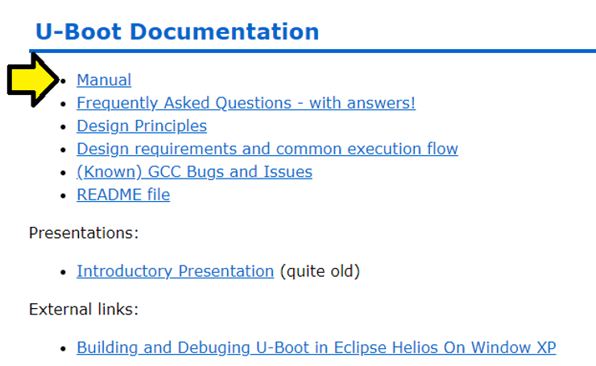
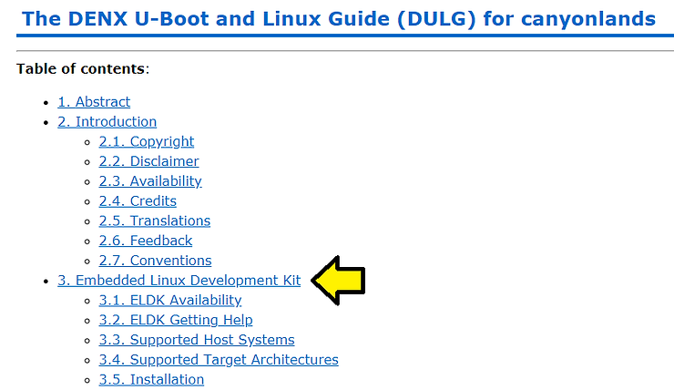
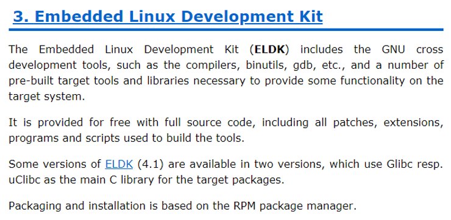
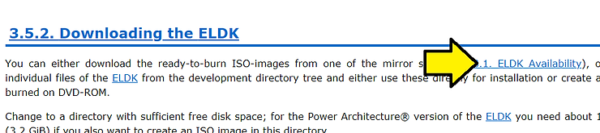

# Where is U-Boot's Manual?

This post describes where U-Boot is documented.

**TL;DR**

The link to U-Boot's documentation lists some documentation under a chapter called Das U-Boot (@ [link](http://www.denx.de/wiki/view/DULG/UBoot)). The link also lists something called the Embedded Linux Development Kit. The Embedded Linux Development Kit is \_not\_ U-Boot, it is used to build and test U-Boot. This description of what the ELDK \_is\_ is not available in the manual, a note that describes it is available in U-Boot's README (@ [link](http://git.denx.de/?p=u-boot.git;a=blob;f=README;h=6f98e09e680d539246c279a18059c2f38ad7ce10;hb=HEAD)). Also, the listing to download the ELDK doesn't work from the online U-Boot manual; a method to download is is given below.

**Walk Through**

The U-Boot manual is linked from [https://www.denx.de/wiki/U-Boot/Documentation](http://www.denx.de/wiki/U-Boot/Documentation):



Clicking on it directs you to [https://www.denx.de/wiki/DULG/Manual](http://www.denx.de/wiki/DULG/Manual):



Huh? Didn't I click on the U-Boot manual? What is the Embedded Linux Development Kit? Maybe it says what it is:



Nope!

One purpose of the ELDK is listed in the U-Boot README @ [link](http://git.denx.de/?p=u-boot.git;a=blob;f=README;h=6f98e09e680d539246c279a18059c2f38ad7ce10;hb=HEAD):

```
Building the Software:
======================

Building U-Boot has been tested in several native build environments
and in many different cross environments. Of course we cannot support
all possibly existing versions of cross development tools in all
(potentially obsolete) versions. In case of tool chain problems we
recommend to use the ELDK (see http://www.denx.de/wiki/DULG/ELDK)
which is extensively used to build and test U-Boot.
```

When I tried:

```
wget ftp://ftp.sunet.se/pub/Linux/distributions/eldk/4.2/ppc-linux-x86/iso/ppc-2008-04-01.iso
```

I got:

```
pfefferz@plc2:~/dev$ wget ftp://ftp.sunet.se/pub/Linux/distributions/eldk/4.2/ppc-linux-x86/iso/ppc-2008-04-01.iso
--2018-04-26 16:45:02--  ftp://ftp.sunet.se/pub/Linux/distributions/eldk/4.2/ppc-linux-x86/iso/ppc-2008-04-01.iso
           => ‘ppc-2008-04-01.iso’
Resolving ftp.sunet.se (ftp.sunet.se)... 194.71.11.173, 194.71.11.165, 2001:6b0:19::165, ...
Connecting to ftp.sunet.se (ftp.sunet.se)|194.71.11.173|:21... connected.
Logging in as anonymous ... Logged in!
==> SYST ... done.    ==> PWD ... done.
==> TYPE I ... done.  ==> CWD (1) /pub/Linux/distributions/eldk/4.2/ppc-linux-x86/iso ... 
No such directory ‘pub/Linux/distributions/eldk/4.2/ppc-linux-x86/iso’.
```

To find it I needed to click on ELDK Availability ([link](http://www.denx.de/wiki/view/DULG/ELDKAvailability)) from http://www.denx.de/wiki/view/DULG/ELDKDownload.



The **ELDK Availability** page lists:

-   for download on the following server:
    

FTP | HTTP

[ftp://ftp.denx.de/pub/eldk/](http://ftp.denx.de/pub/eldk/) | http://www.denx.de/ftp/pub/eldk/  

-   for download on the following mirrors:
    

FTP | HTTP

[ftp://ftp-stud.hs-esslingen.de/pub/Mirrors/eldk](http://ftp-stud.hs-esslingen.de/pub/Mirrors/eldk)/ | http://ftp-stud.hs-esslingen.de/pub/Mirrors/eldk/ 

[ftp://mirror.switch.ch/mirror/eldk/](http://mirror.switch.ch/mirror/eldk/) | http://mirror.switch.ch/ftp/mirror/eldk/ 

not available | http://mira.sunsite.utk.edu/eldk/ 

[ftp://ftp.sunet.se/pub/Linux/distributions/eldk/](http://ftp.sunet.se/pub/Linux/distributions/eldk/) | http://ftp.sunet.se/pub/Linux/distributions/eldk/ 

You can pull all the ELDK's with:

```
wget -r -np -R "index.html*" ftp://ftp.denx.de/pub/eldk/5.6
```

**ELDK Documentation**

[ftp://ftp.denx.de/pub/eldk/5.6/README](http://ftp.denx.de/pub/eldk/5.6/README) redirects you to http://www.denx.de/wiki/view/ELDK-5/WebHome

This documentation does not actually say what the ELDK \_is\_.

**References**

-   HTML Escape / Unescape @ [link](http://www.freeformatter.com/html-escape.html)
    
-   Recursive wget found @ [link](http://stackoverflow.com/questions/273743/using-wget-to-recursively-fetch-a-directory-with-arbitrary-files-in-it)