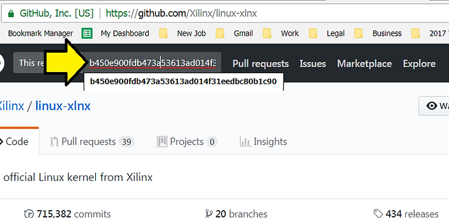
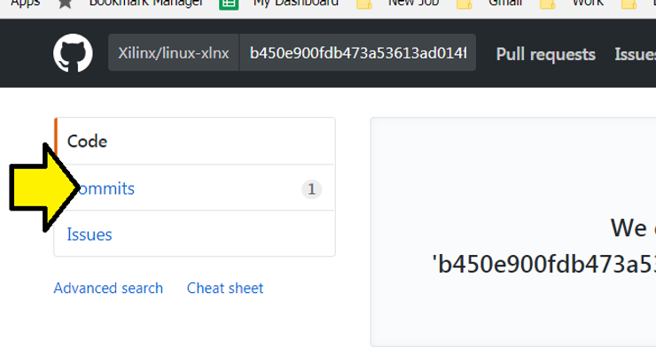
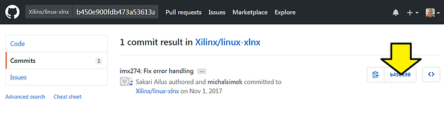
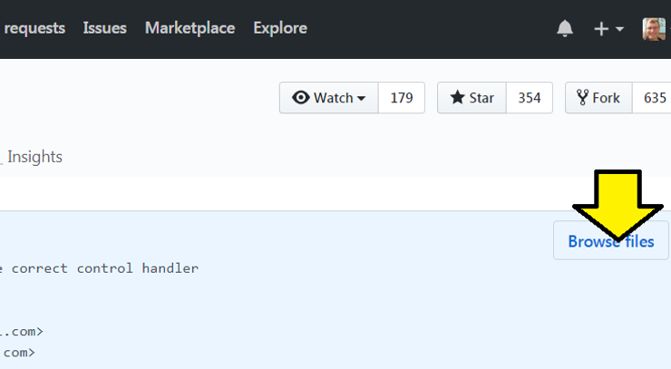

# Which Linux kernel is PetaLinux Tools using?


This post shows you a way to figure out which Linux kernel PetaLinux Tools is pulling in.

**Versions Used**

PetaLinux 2017.4 (install help at [link](http://www.zachpfeffer.com/single-post/Download-and-Install-Xilinxs-20174-PetaLinux-Tools) , creating a PetaLinux build help at [link](http://www.zachpfeffer.com/single-post/Create-Build-and-Test-a-PetaLinux-Tools-20174-Project))

**Motivation**

If you hit an issue you need to know \_exactly\_ which source code tree you're working with and the exact version of that tree.

**Steps**

1\. In your PetaLinux build search for "Documentation"

```
find . -name "Documentation"
```

You should see:

```
./build/tmp/work-shared/plnx_aarch64/kernel-source/drivers/staging/greybus/Documentation
./build/tmp/work-shared/plnx_aarch64/kernel-source/drivers/staging/iio/Documentation
./build/tmp/work-shared/plnx_aarch64/kernel-source/drivers/staging/unisys/Documentation
./build/tmp/work-shared/plnx_aarch64/kernel-source/drivers/staging/i4l/Documentation
./build/tmp/work-shared/plnx_aarch64/kernel-source/drivers/staging/most/Documentation
./build/tmp/work-shared/plnx_aarch64/kernel-source/tools/objtool/Documentation
./build/tmp/work-shared/plnx_aarch64/kernel-source/tools/perf/Documentation
./build/tmp/work-shared/plnx_aarch64/kernel-source/tools/build/Documentation
./build/tmp/work-shared/plnx_aarch64/kernel-source/Documentation
```

The Linux kernel "Documentation" folder is in the root folder of the kernel so the kernel is at:

```
./build/tmp/work-shared/plnx_aarch64/kernel-source/Documentation
```

2\. Cd into the root of the checked out kernel tree:

```
cd ./build/tmp/work-shared/plnx_aarch64/kernel-source
```

3\. Look at the HEAD commit

```
git show HEAD
```

You should see:

```
commit b450e900fdb473a53613ad014f31eedbc80b1c90
Author: Sakari Ailus <sakari.ailus@linux.intel.com>
Date:   Wed Nov 1 20:22:30 2017 -0700

    imx274: Fix error handling
    
    Fix error handling in driver probe and unregister the correct control handler
    in driver remove.
    
    Signed-off-by: Sakari Ailus <sakari.ailus@linux.intel.com>
    Signed-off-by: Christian Kohn <christian.kohn@xilinx.com>
    Reviewed-by: Vishal Sagar <vishal.sagar@xilinx.com>
    Signed-off-by: Michal Simek <michal.simek@xilinx.com>

diff --git a/drivers/media/i2c/imx274.c b/drivers/media/i2c/imx274.c
index ab6a5f3..737dbf5 100644
--- a/drivers/media/i2c/imx274.c
+++ b/drivers/media/i2c/imx274.c
@@ -1770,8 +1770,7 @@ static int imx274_probe(struct i2c_client *client,
        return 0;
 
 err_ctrls:
-       v4l2_async_unregister_subdev(sd);
-       v4l2_ctrl_handler_free(sd->ctrl_handler);
+       v4l2_ctrl_handler_free(&imx274->ctrls.handler);
 err_me:
        media_entity_cleanup(&sd->entity);
 err_regmap:
@@ -1788,7 +1787,7 @@ static int imx274_remove(struct i2c_client *client)
        imx274_write_table(imx274, mode_table[IMX274_MODE_STOP_STREAM]);
 
        v4l2_async_unregister_subdev(sd);
-       v4l2_ctrl_handler_free(sd->ctrl_handler);
+       v4l2_ctrl_handler_free(&imx274->ctrls.handler);
        media_entity_cleanup(&sd->entity);
        mutex_destroy(&imx274->lock);
        return 0;
```

4. Go to [https://github.com/Xilinx/linux-xlnx](http://github.com/Xilinx/linux-xlnx) 



5\. Click on **Commits**



6\. Click on the **b45e90**



7\. Click on **Browse files**



You should be at the link: [https://github.com/Xilinx/linux-xlnx/tree/b450e900fdb473a53613ad014f31eedbc80b1c90](http://github.com/Xilinx/linux-xlnx/tree/b450e900fdb473a53613ad014f31eedbc80b1c90)

**Reference**

Xilinx logo from [https://twitter.com/xilinxinc](http://twitter.com/xilinxinc) at [link](http://pbs.twimg.com/profile_images/535545777020338176/pEWdIYq__400x400.png)