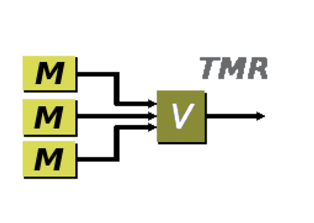
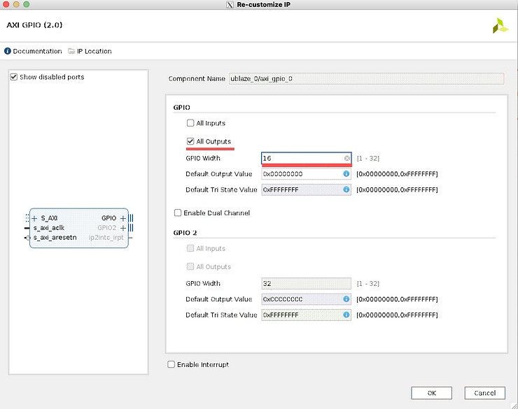
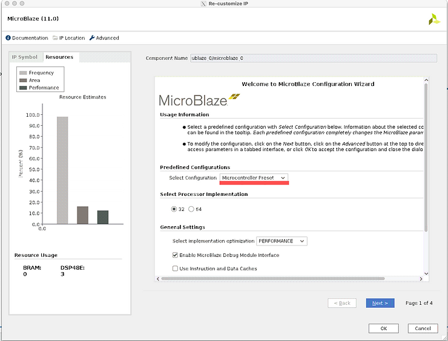
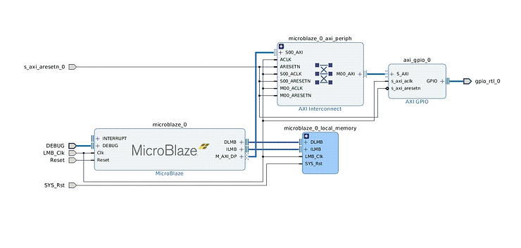
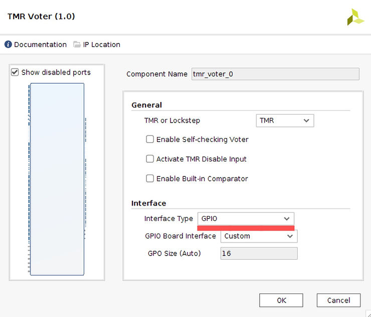
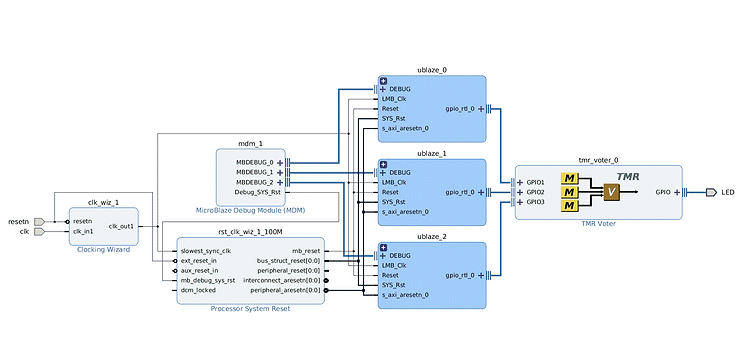
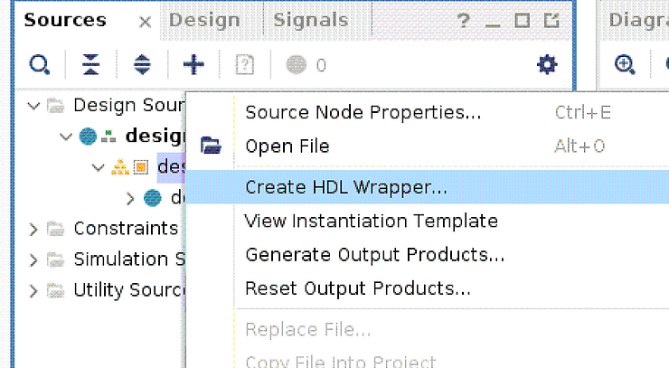
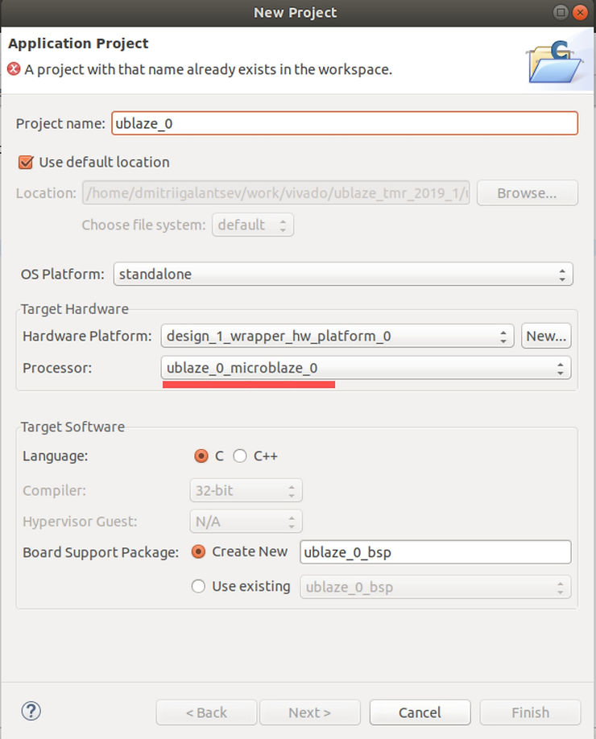
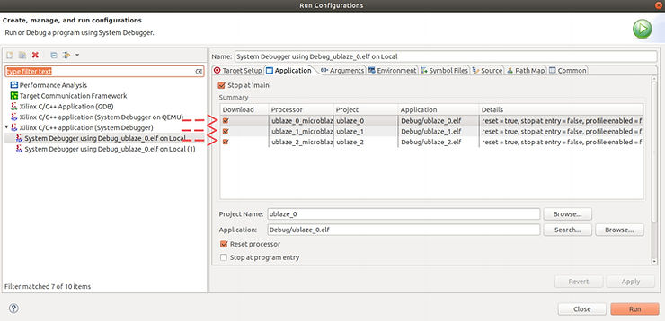
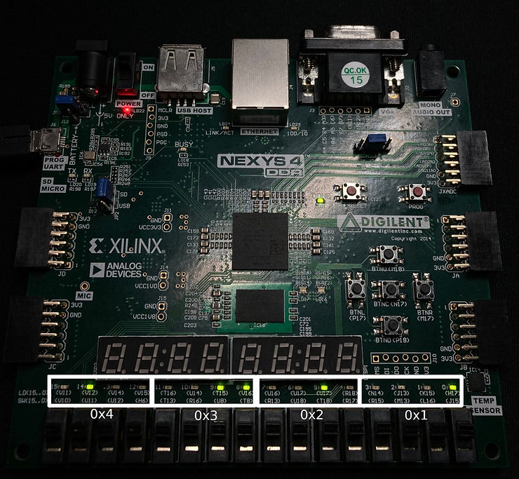

# MicroBlaze TMR 2019.1



In this post I will briefly explain how to put 3 MicroBlaze soft-core CPUs on Nexys 4 DDR FPGA (Xilinx Artix 7 FPGA) and use Triple Modular Redundancy (TMR) block on GPIO!

## Add the following IPs into a block design:

-   AXI GPIO
    
-   Microblaze
    

### GPIO config: **16 bit output**



### MicroBlaze config: **Select Configuration-> Microcontroller Preset**



## ublaze block design

You will end up with something similar.

After configuring all blocks as explained above - create a ublaze hierarchy

1.  Select all blocks
    
2.  Right click, _Create Hierarchy_
    
3.  _OK_
    
4.  Copy-paste it twice, connect signals as shown below
    



### Add TMR Voter config: (Set Interface Type to GPIO)



### Top block design



### Create HDL Wrapper:



This will result in something like:

```
//Copyright 1986-2019 Xilinx, Inc. All Rights Reserved.
//--------------------------------------------------------------------------------
//Tool Version: Vivado v.2019.1 (lin64) Build 2552052 Fri May 24 14:47:09 MDT 2019
//Date        : Thu Mar 11 20:17:31 2021
//Host        : predator running 64-bit Ubuntu 18.04.5 LTS
//Command     : generate_target design_1_wrapper.bd
//Design      : design_1_wrapper
//Purpose     : IP block netlist
//--------------------------------------------------------------------------------
`timescale 1 ps / 1 ps

module design_1_wrapper
   (LED_tri_o,
    clk,
    resetn);
  output [15:0]LED_tri_o;
  input clk;
  input resetn;

  wire [15:0]LED_tri_o;
  wire clk;
  wire resetn;

  design_1 design_1_i
       (.LED_tri_o(LED_tri_o),
        .clk(clk),
        .resetn(resetn));
endmodule
```

### Modify your constraints file like this:

Nexys-4-DDR-Master.xdc

```
## This file is a general .xdc for the Nexys4 DDR Rev. C
## To use it in a project:
## - uncomment the lines corresponding to used pins
## - rename the used ports (in each line, after get_ports) according to the top level signal names in the project

## Clock signal
set_property -dict { PACKAGE_PIN E3    IOSTANDARD LVCMOS33 } [get_ports { clk }]; #IO_L12P_T1_MRCC_35 Sch=clk100mhz
create_clock -add -name sys_clk_pin -period 10.00 -waveform {0 5} [get_ports {clk}];


## LEDs

set_property -dict { PACKAGE_PIN H17   IOSTANDARD LVCMOS33 } [get_ports { LED_tri_o[0] }]; #IO_L18P_T2_A24_15 Sch=led[0]
set_property -dict { PACKAGE_PIN K15   IOSTANDARD LVCMOS33 } [get_ports { LED_tri_o[1] }]; #IO_L24P_T3_RS1_15 Sch=led[1]
set_property -dict { PACKAGE_PIN J13   IOSTANDARD LVCMOS33 } [get_ports { LED_tri_o[2] }]; #IO_L17N_T2_A25_15 Sch=led[2]
set_property -dict { PACKAGE_PIN N14   IOSTANDARD LVCMOS33 } [get_ports { LED_tri_o[3] }]; #IO_L8P_T1_D11_14 Sch=led[3]
set_property -dict { PACKAGE_PIN R18   IOSTANDARD LVCMOS33 } [get_ports { LED_tri_o[4] }]; #IO_L7P_T1_D09_14 Sch=led[4]
set_property -dict { PACKAGE_PIN V17   IOSTANDARD LVCMOS33 } [get_ports { LED_tri_o[5] }]; #IO_L18N_T2_A11_D27_14 Sch=led[5]
set_property -dict { PACKAGE_PIN U17   IOSTANDARD LVCMOS33 } [get_ports { LED_tri_o[6] }]; #IO_L17P_T2_A14_D30_14 Sch=led[6]
set_property -dict { PACKAGE_PIN U16   IOSTANDARD LVCMOS33 } [get_ports { LED_tri_o[7] }]; #IO_L18P_T2_A12_D28_14 Sch=led[7]
set_property -dict { PACKAGE_PIN V16   IOSTANDARD LVCMOS33 } [get_ports { LED_tri_o[8] }]; #IO_L16N_T2_A15_D31_14 Sch=led[8]
set_property -dict { PACKAGE_PIN T15   IOSTANDARD LVCMOS33 } [get_ports { LED_tri_o[9] }]; #IO_L14N_T2_SRCC_14 Sch=led[9]
set_property -dict { PACKAGE_PIN U14   IOSTANDARD LVCMOS33 } [get_ports { LED_tri_o[10] }]; #IO_L22P_T3_A05_D21_14 Sch=led[10]
set_property -dict { PACKAGE_PIN T16   IOSTANDARD LVCMOS33 } [get_ports { LED_tri_o[11] }]; #IO_L15N_T2_DQS_DOUT_CSO_B_14 Sch=led[11]
set_property -dict { PACKAGE_PIN V15   IOSTANDARD LVCMOS33 } [get_ports { LED_tri_o[12] }]; #IO_L16P_T2_CSI_B_14 Sch=led[12]
set_property -dict { PACKAGE_PIN V14   IOSTANDARD LVCMOS33 } [get_ports { LED_tri_o[13] }]; #IO_L22N_T3_A04_D20_14 Sch=led[13]
set_property -dict { PACKAGE_PIN V12   IOSTANDARD LVCMOS33 } [get_ports { LED_tri_o[14] }]; #IO_L20N_T3_A07_D23_14 Sch=led[14]
set_property -dict { PACKAGE_PIN V11   IOSTANDARD LVCMOS33 } [get_ports { LED_tri_o[15] }]; #IO_L21N_T3_DQS_A06_D22_14 Sch=led[15]


##Buttons

set_property -dict { PACKAGE_PIN C12   IOSTANDARD LVCMOS33 } [get_ports { resetn }]; #IO_L3P_T0_DQS_AD1P_15 Sch=cpu_resetn

```

### Export hardware:

_File > Export > Export Hardware > Include bitstream > OK_

### Open SDK

_File > Launch SDK_

## SDK

### Create new application projects:

_File > New > Application Project_

Configure like this: (ignore my error up-top. I already have this project created)



pay close attention to Processor: field!

Create 2 more application projects, name them ublaze\_1 and ublaze\_2. Use **ublaze\_1\_microblaze\_0** and **ublaze\_2\_microblaze\_0** for Processor accordingly.

### C project

right-click ublaze\_0, _New > File_, name it **blink.c**

Fill it with:

```
int main()
{
	int * led_ptr = 0x40000000;
	*led_ptr = 0x4321;
	return 0;
}
```

Repeat for ublaze\_1 and ublaze\_2.

### Set **Run Configurations**

_Run > Run Configurations..._

Set them up like this:



### Program FPGA

_Xilinx > Program FPGA > Program_

### Run application

_Run > Run As > Launch On Hardware (System Debugger)_

(You might need to select blink.c and run it explicitly)

Your LEDs should light up now!



You're controlling GPIO with microblaze! And if one of them fails - it's okay. You can still control the LEDs with 2 other ones.

Try to disable one of the microblaze cores, run the other two. Your LEDs will still work as expected.

## Video Guide

NOTE: This video slightly different from the rest of the guide (specifically when it comes to signal names). However, it demonstrates the entire process in detail.

https://video.wixstatic.com/video/ceda41_0b5bf7ee8ed34abb97d713569e20b10a/1080p/mp4/file.mp4

## TODO

-   Add arrows to screenshots
    
-   Add explanation of how TMR works
    
-   Add error injection
    

## Reference

\- Nexys 4 ddr constraints: https://github.com/Digilent/digilent-xdc/blob/master/Nexys-4-DDR-Master.xdc

\- Xilinx TMR Microblaze reference: https://www.xilinx.com/support/documentation/ip_documentation/tmr/v1_0/pg268-tmr.pdf