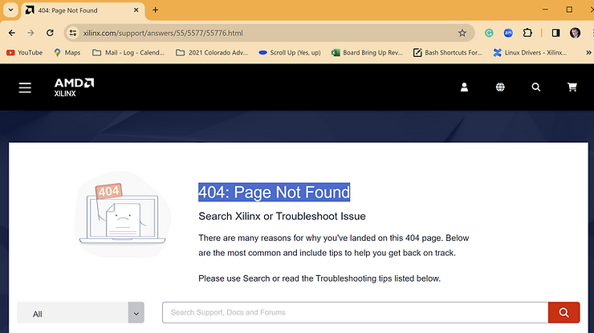

# Xilinx 404 Page Not Found Workaround

This post shows a Xilinx 404 Page Not Found workaround. I needed this as of 2024-01-30. It may have been fixed now.

## Xilinx 404 Page Not Found Workaround

If you get a **404: Page Not Found** with a link like this:

[https://www.xilinx.com/support/answers/55/5577/](https://www.xilinx.com/support/answers/55/5577/55776.html)[**55776**](https://www.xilinx.com/support/answers/55/5577/55776.html)[.html](https://www.xilinx.com/support/answers/55/5577/55776.html)

Try this:

[https://support.xilinx.com/s/article/](https://support.xilinx.com/s/article/55776?language=en_US)[**55776**](https://support.xilinx.com/s/article/55776?language=en_US)[?language=en\_US](https://support.xilinx.com/s/article/55776?language=en_US)

