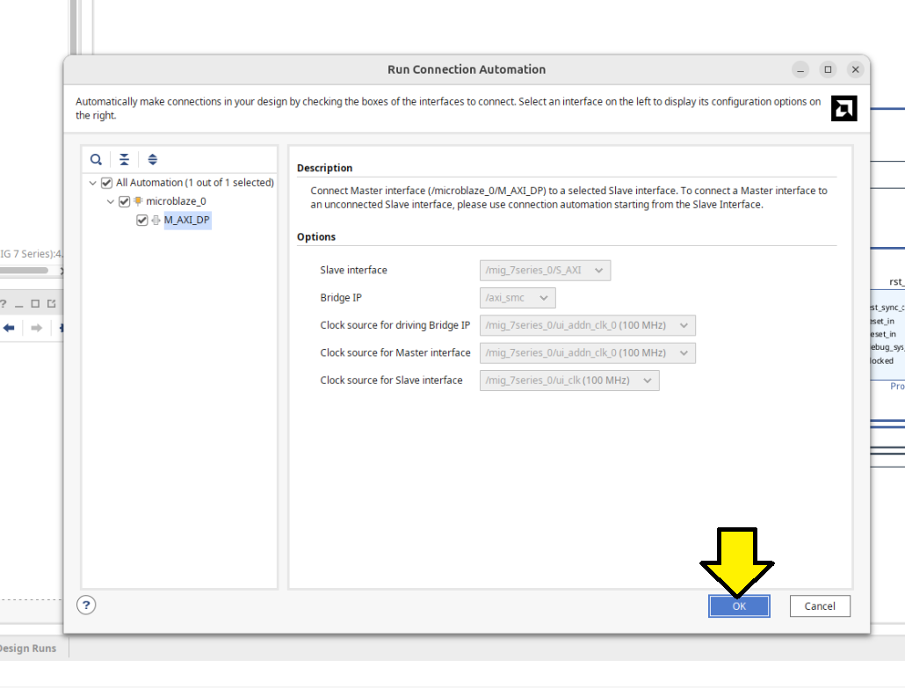
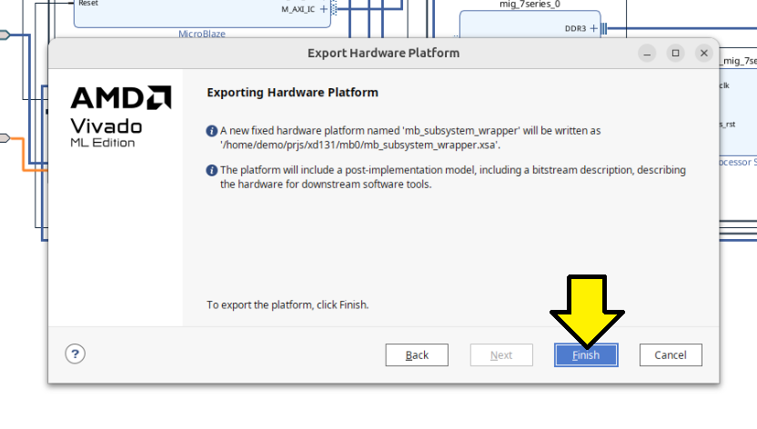
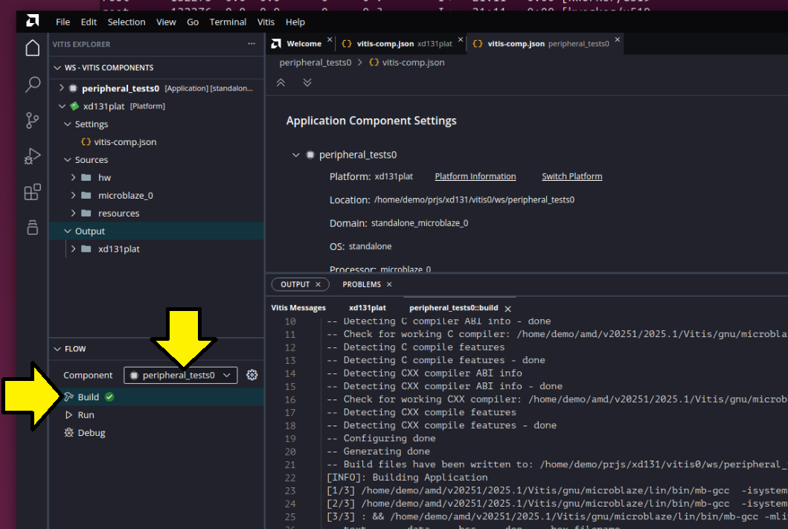

# Follow XD131 on 2025.1

This is a record of the steps I followed up to **Step 10** of [Programming an Embedded MicroBlaze Processor (XD131)](https://docs.amd.com/r/en-US/xd131-zynq-embedded-design-tutorial/Programming-an-Embedded-MicroBlaze-Processor-XD131) using **Vivado ML Enterprise 2025.1**. 

A PDF of the 2025.1 version can be found [here](xd131_20251.pdf). 

# Checked Vivado Version

I checked if **Vivado ML Enterprise** was needed to work with the SP701 FPGA Evaluation Kit. To figure this out I looked up the specific device on the board. The **AMD Spartan 7 SP701 FPGA Evaluation Kit** has an **XC7S100** FPGA. According to [Architecture Support](https://www.amd.com/en/products/software/adaptive-socs-and-fpgas/vivado/vivado-buy.html#tabs-413944f675-item-d41fa24f69-tab) this device is supported in the free **Vivado Standard Edition**.

# Add 7 Series to Vivado

When creating a Vivado project for **AMD Spartan 7 SP701 FPGA Evaluation Kit**, I saw that I hadn't installed **7 Series** device support needed work with the **XC7S100**.

To add it I:

1. Launched the installer:

   ```bash
   /home/demo/amd/v20251_2/.xinstall/2025.1/xsetup
   ```

2. Selected **Vivado ML Edition**.

3. In the **Vivado 2025.1 Installer – Select Extra Content** window, enabled:

   * **\[x] Devices**
  * **\[x] 7 Series**
     * **\[x] Spartan-7 FPGAs**

4. Clicked **Next** through the remaining wizard screens, using defaults, to complete the installation.

After this, the **7 Series** devices were available in my **Vivado 2025.1 ML Edition** install.

# Follow Step 1

Started [**Step 1: Start the Vivado IDE and Create a Project**](https://docs.amd.com/r/en-US/xd131-zynq-embedded-design-tutorial/Step-1-Start-the-Vivado-IDE-and-Create-a-Project?tocId=3bBQtHgNI7_xtTm1ArFtKg).

## Start Vivado

```bash
source /home/demo/amd/v20251_2/2025.1/Vivado/settings64.sh 
mkdir -p ~/prjs/xd131
cd ~/prjs/xd131
vivado
```

**Vivado** launched with this output:

```
****** Vivado v2025.1 (64-bit)
  **** SW Build 6140274 on Wed May 21 22:58:25 MDT 2025
  **** IP Build 6138677 on Thu May 22 03:10:11 MDT 2025
  **** SharedData Build 6139179 on Tue May 20 17:58:58 MDT 2025
  **** Start of session at: Tue Sep  9 08:56:04 2025
    ** Copyright 1986-2022 Xilinx, Inc. All Rights Reserved.
    ** Copyright 2022-2025 Advanced Micro Devices, Inc. All Rights Reserved.

start_gui
```

## Create a New Project

1. **File → Project → New\...**

2. On **Create a New Vivado Project**, click **Next**.

3. On **Project Name**:

   * Project name: **mb0**
   * Project location: `/home/demo/prjs/xd131`
   * \[✔] Create project subdirectory
   * Click **Next**.

4. On **Project Type**:

   * (●) **RTL Project**
   * \[✔] Do not specify sources at this time
   * Click **Next**.

5. On **Default Part**:

   * Select the **Boards** tab.
   * Search for **sp701**.
   * Choose **Spartan-7 SP701 Evaluation Platform**.


> [!CAUTION]
>
> If you don't see **Spartan-7 Evaluation Platform** listed, install support for **Devices** > **7 Series** > **Spartan-7 FPGAs** during your Vivado installation.  See the instructions above to add support for this device to your current installation. 

> [!NOTE]
>
> The Name: **Spart-7 SP701 Evaluation Platform** existed even though I didn't have **Devices** > **7 Series** > **Spartan-7 FPGAs** installed. This looks like a bug. 

7. Clicked **Next** to progress to the New Project: **New Project Summary** screen:

( ! )  A new RTL project named mb0 will be created

( ! ) The default part and product family for the new project:
Default Board: Spartan-7 SP701 Evaluation Platform
Default Part: xc7s100fpga676-2
Family: Spartan-7
Package: fpga676
Speed Grade:-2

8. On the New Project: **New Project Summary** screen, clicked **Finish**.

# Follow Step 2

I followed [**Step 2: Create an IP Integrator Design**](https://docs.amd.com/r/en-US/xd131-zynq-embedded-design-tutorial/Step-2-Create-an-IP-Integrator-Design?tocId=yGvL2d8l4Cy8qYoiyZDlPg) **until** I completed the **7th step** of **Step 2**. 

After the **7th step**, I clicked **Run Connection Automation**:


Used the **Run Connection Automation** screen **defaults** and clicked OK:


Saw:


Continued Step 2, parts 8 and 9. After step 9, clicked **Run Block Automation** again and followed these steps instead of those listed:


Accepted the defaults on the **Run Block Automation** screen and clicked **OK**:


Clicked **Run Connection Automation** when I saw:


Made sure to select **All Automation** and click **OK**:


On the next screen click **Run Connection Automation** again:


Accept defaults and click OK on the **Run Connection Automation** screen that pops up:



Now click **Run Block Automation**:


Accept the defaults and click **OK**:


You should see something like this:


Click Board tab, click and drag UART onto the diagram:


Click **OK** and click **Run Connection Automation**:


Accept defaults (**axi_uartlite_0** selected) and click **OK**:


Saw a **axi_uartlite_0** in the block design:


To keep aligned with the original guide, pulled the LED in:


Again, clicked **OK** and clicked **Run Connection Automation**:


Clicked **OK** to run automation:


Added the **AXI BRAM controller:**


Clicked **Run Connection Automation**:


Selected **All Automation (3 out of 3 selected)** and clicked **OK**:


My block design looked like this:


> [!WARNING]
>
> Later, I saw an implementation error because I had **reset** and **reset_0**. I fixed this later by removing reset_0 and connecting rst_mig_7series_0_100M to reset.

Now marked nets for debugging. **Right-clicke****d** on the **axi_gpio_0**'s **S_AXI** port and selected **Debug**. 


> [!IMPORTANT]
>
> The guide said I should right-click on M00_AXI, but depending on automation, **axi_gpio_0** may be on a different M0*_AXI interface.

Checked that I saw **little green bugs** by the ports and clicked **Run Connection Automation**:

 

 Clicked **OK** to run the automation:


Double clicked **mdm_0** and selected: 

[ x ] Enable AXI Memory Access From Debug 

[ x ] Enable Cross Trigger. 

Noticed that the block diagram changed. Left all other options at their default and clicked **OK**. 


Clicked **Run Connection Automation**:


Selected **All automation (3 out of 3 selected)** and clicked **OK**:


The full diagram now contained all of the components listed in the original guide:


# Follow Step 3

Skipped checking the address ranges because it will be caught later if there's an issue.

# Follow Step 4

Continued with [**Step 4: Validate Block Design**](https://docs.amd.com/r/en-US/xd131-zynq-embedded-design-tutorial/Step-4-Validate-Block-Design?tocId=hRvz6g5Q8CPuSWo07Klahg). Saw **Validation successful.**:


# Follow Step 5

Continued with **Step 5,** which toke some 90-ish min on my 8 core 17.5.2 VMWare Workstation VM with 64 GB or RAM). Here's a diagram missing from the guide on where to click **Generate Output Products**.


Clicked **Generate**:


> [!NOTE]
>
> The first time I ran **Generate Output Products**, I launched it and then switched from the Linux VM desktop to another Windows 11 desktop. When I returned to the VM, the UI was frozen with a small red icon with an in the top right of my Ubuntu 24.04.3 desktop, and the Vivado GUI was unresponsive. Clicking the icon made it disappear. 
>
> 
>
> I killed Vivado and restarted it. When I restarted Vivado, the GUI was responsive, and I saw the Running **mb_subsystem_mig_7serier_0_0_synth_1** status in the top right of the Vivado GUI. However, after 30 minutes and not seeing Elapsed update, I canceled the run and restarted **Generate Output Products**. It finished. I noticed the UI was stuck again. I killed Vivado and restarted. 
>
> 
>
> It seem that when I saw `'this->recurse > 0' failed at ../src/pipewire/thread-loop.c:63 do_unlock()`
>
> ```
> demo@demo:~/prjs/xd131$ vivado
> 
> ****** Vivado v2025.1 (64-bit)
>   **** SW Build 6140274 on Wed May 21 22:58:25 MDT 2025
>   **** IP Build 6138677 on Thu May 22 03:10:11 MDT 2025
>   **** SharedData Build 6139179 on Tue May 20 17:58:58 MDT 2025
>   **** Start of session at: Tue Sep  9 17:18:54 2025
>     ** Copyright 1986-2022 Xilinx, Inc. All Rights Reserved.
>     ** Copyright 2022-2025 Advanced Micro Devices, Inc. All Rights Reserved.
> 
> start_gui
> 'this->recurse > 0' failed at ../src/pipewire/thread-loop.c:63 do_unlock()
> 
> ```
>
> ...the UI had hung. 

# Follow Step 6

Continued with [**Step 6: Create a Top-Level Wrapper**](https://docs.amd.com/r/en-US/xd131-zynq-embedded-design-tutorial/Step-6-Create-a-Top-Level-Wrapper?tocId=gJ6KNW5k0tcI_fKoA3MvPw). No issues. 

# Follow Step 7

Continued with [**Step 7: Take the Design through Implementation**](https://docs.amd.com/r/en-US/xd131-zynq-embedded-design-tutorial/Step-7-Take-the-Design-through-Implementation?tocId=FhfAVmTEvIspzJTYFDARIA).

I saw a warning and an error:


In text:

Implementation > Design Initialization

```
[Vivado 12-1411] Cannot set LOC property of ports, Cannot set PACKAGE_PIN property of ports,  port reset_0 can not be placed on PACKAGE_PIN AE15 because the PACKAGE_PIN is occupied by port reset. Please note that for projects targeting board parts, user LOC constraints cannot override constraints provided with the board. ["/home/demo/prjs/xd131/mb0/mb0.gen/sources_1/bd/mb_subsystem/ip/mb_subsystem_rst_mig_7series_0_100M_0/mb_subsystem_rst_mig_7series_0_100M_0_board.xdc":3]
```

Write Bitstream > DRC > Pin Planning

```
demo@demo:~/Desktop$ # [DRC UCIO-1] Unconstrained Logical Port: 1 out of 62 logical ports have no user assigned specific location constraint (LOC). This may cause I/O contention or incompatibility with the board power or connectivity affecting performance, signal integrity or in extreme cases cause damage to the device or the components to which it is connected. To correct this violation, specify all pin locations. This design will fail to generate a bitstream unless all logical ports have a user specified site LOC constraint defined.  To allow bitstream creation with unspecified pin locations (not recommended), use this command: set_property SEVERITY {Warning} [get_drc_checks UCIO-1].  NOTE: When using the Vivado Runs infrastructure (e.g. launch_runs Tcl command), add this command to a .tcl file and add that file as a pre-hook for write_bitstream step for the implementation run.  Problem ports: reset_0.

```

I opened my Block Design and saw that I had two reset pins for some reason:


Removing the **reset_0** pin and rerunning automation produced the same result and did not clear the error.

Removing the **reset_0** pin and connecting the **ext_reset_in** port of **rst_mig_7series_0_100M**  to the reset pin allowed me to clear this error and complete [Step 7](https://docs.amd.com/r/en-US/xd131-zynq-embedded-design-tutorial/Step-7-Take-the-Design-through-Implementation?tocId=FhfAVmTEvIspzJTYFDARIA).


# Follow Step 8

Continued with [**Step 8: Export the Design to the Vitis software platform**](https://docs.amd.com/r/en-US/xd131-zynq-embedded-design-tutorial/Step-8-Export-the-Design-to-the-Vitis-software-platform?tocId=lnXHVADbF72pCP_R5RgFJw).

As part of step 8, I also included the binary in my hardware platform:




Saw an error:


```
[Common 17-69] Command failed: Unable to get BIN file from implementation run. Please ensure implementation has been run all the way through Bitstream generation. Aborting write_hw_platform..
```

Regenerated without binary:


Launched Vitis

# Follow Step 9

Continued on to [**Step 9: Create a "Platform Component"**](https://docs.amd.com/r/en-US/xd131-zynq-embedded-design-tutorial/Step-9-Create-a-Platform-Component?tocId=Xb~nlnvqXAjnWho93DyIbA):

Saw:


This is not correct ^^^ and may explain the "PCIe" [issue](https://adaptivesupport.amd.com/s/question/0D5Pd00000oFcBbKAK/simple-microblaze-design-to-vitis?language=en_US) the user reported on the community forum.

Reran my unified installer and upgraded to the Vitis Unified Software Platform:

```
/home/demo/amd/v20251_2/.xinstall/2025.1/xsetup
```

> [!NOTE]
>
> 2025.1 is the last time AMD will release a full single file download aka standalone installer. See [note](https://www.xilinx.com/support/download/index.html/content/xilinx/en/downloadNav/vivado-design-tools/2025-1.html). 

Selected **Vitis Unified Software Platform** and clicked **Next **:


Used the defaults and clicked **Next**:

Design Tools

​	[ x ] Vitis Model Composer(A toolbox for Simulink) (can't unselect)

​	[ x ] Vitis Unified Software Platform

​		[ x ] Vitis

​		[    ] Vitis IP Cache (Enable faster onboarding for new users)

​		[ x ] Vivado

​		[    ] Vitis HLS

​	[    ] Power Design Manager (PDM)

​	[ x ] DocNav  


Agreed to all licenses:


Install:


Reran Vivado, opened my mb0 project and launched Vitis again, Tools > Launch Vitis IDE and saw the same issue:


Checked:


Saw:


Launched a version of Vitis I installed in another location installed from the **Vitis Embedded Development**:

```
demo@demo:~/Desktop$ source /home/demo/amd/v20251/2025.1/Vitis/settings64.sh 
demo@demo:~/Desktop$ vitis

****** Vitis Development Environment
****** Vitis v2025.1 (64-bit)
  **** SW Build 6137779 on 2025-05-21-18:10:04
    ** Copyright 1986-2022 Xilinx, Inc. All Rights Reserved.
    ** Copyright 2022-2025 Advanced Micro Devices, Inc. All Rights Reserved.
```

> [!IMPORTANT]
>
> In my experience now with 2025.1, launching **Vitis** depends on your installation. If you run Vitis from a **Vitis Embedded Development** install, you see different options than when you launch it from the **Vivado** install. This behavior is new in **2025.1**. In **2024.2**, selecting Vitis from the Vivado install gave you **Vitis Embedded Development**. Now, in 2025.1, it no longer does.
>
> To install the **Vitis Embedded Development**, when the Unified Installer runs, select **Vitis Embedded Development,** not **Vitis.**
>
> I suggest installing **Vitis Embedded Development** into a completely different directory from the Vivado install to keep it separate from **Vitis** installed by the **Vivado** installer or the **Vitis Unified Software Platform**.

Now I was able to select:


Continued with [Step 9: Create a “Platform Component”](https://docs.amd.com/r/en-US/xd131-zynq-embedded-design-tutorial/Step-9-Create-a-Platform-Component?tocId=Xb~nlnvqXAjnWho93DyIbA).

Here were my last two screens:


Saw a successful platform build


# Follow Step 10

Continued with [Step 10: Create a “Peripheral Test” Application](https://docs.amd.com/r/en-US/xd131-zynq-embedded-design-tutorial/Step-10-Create-a-Peripheral-Test-Application?tocId=gH7UCfS5__bgluVZMddArQ).

The path **From Example**s in Select **File > New Component > From Examples** or under **Get Started** click **Examples** did not exist. Selected **File > New Example**.


Added Peripheral Tests:


Named my component peripheral_tests0:


Selected the platform I built eariler:


Selected the domain **standalone_microblaze_0** and clicked **Next**:


Clicked **Finish**:


Built and saw the build complete:


