# Xilinx 2016.4 WebPACK Vivado and SDK Install on Windows 7 SP1

This post shows a WebPACK install of the 2016.4 release of Vivado and the SDK. It also lists the features and devices supported in WebPACK.

**<u>Notes</u>**

The steps use the 50.44 MB Web Installer which will download 5.38 GB during the install. The install requires an additional 26.86 GB of space.

To find space you can (A) click on C:\\ and (B) type size:gigantic to see if anything can be archived or removed:

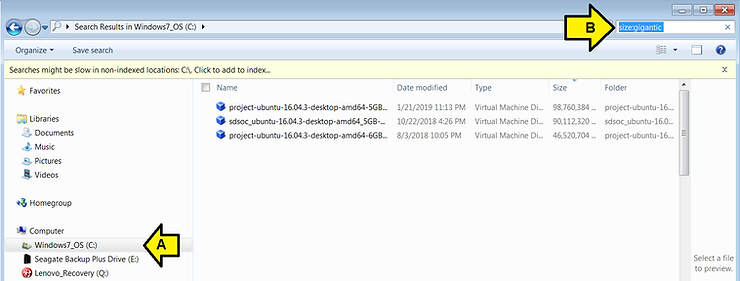

**<u>Steps</u>**

1\. Vivado 2016.4 is available in the archives @ \[[<u>link</u>](https://www.xilinx.com/support/download/index.html/content/xilinx/en/downloadNav/vivado-design-tools/archive.html)\]. SDK is included with Vivado.

2\. (A) Click **Archive** and (B) click **2016.4**

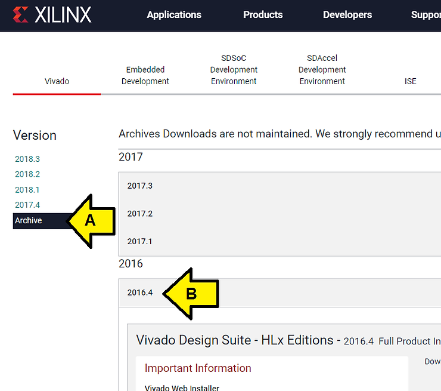

3. Scroll down and click [[Vivado HLx 2016.4: WebPACK and Editions - Windows Self Extracting Web Installer](https://www.xilinx.com/member/forms/download/xef.html?filename=Xilinx_Vivado_SDK_2016.4_0124_1_Win64.exe)] then login to download.

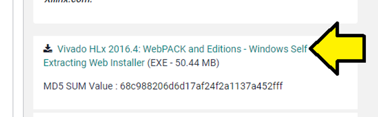

4\. Double-click **Xilinx\_Vivado\_SDK\_2016.4\_0124\_1\_Win64.exe** and click through the acceptance.

Note: At the **Welcome** screen you can click **Preferences** to select a **proxy** or the **\# of cores to use to download and install**

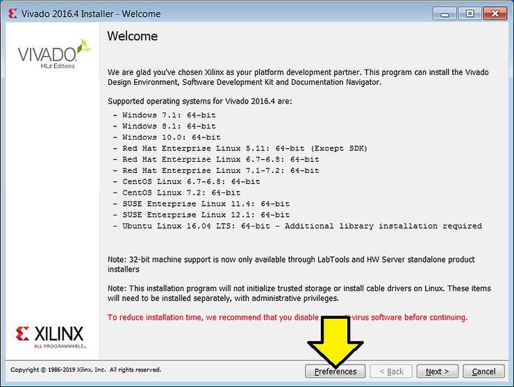

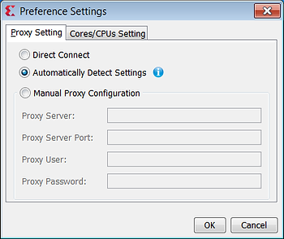

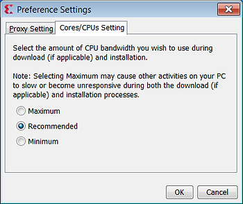

5\. Click through the screens to login and agree to terms. At the **Select Edition to Install** screen select **Vivado HL WebPACK** and click **Next**

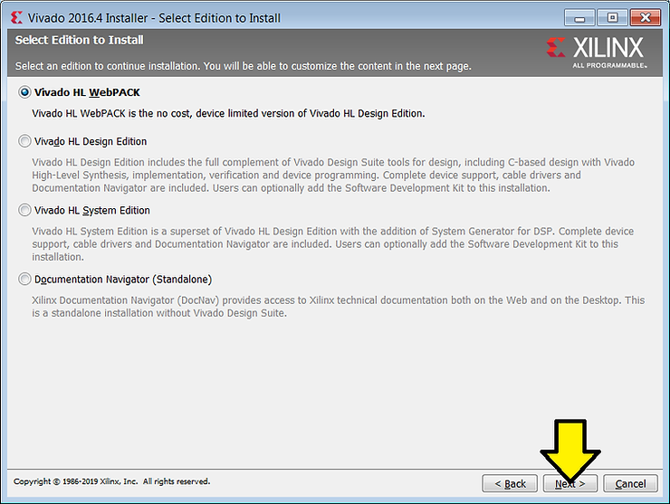

The features of each edition are (from \[[<u>link</u>](https://www.xilinx.com/products/design-tools/vivado/vivado-webpack.html)\]):

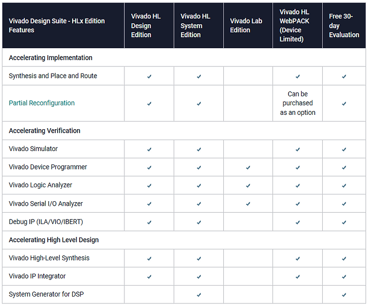

The devices that are supported in the WebPACK are (from \[[<u>link</u>](https://www.xilinx.com/products/design-tools/vivado/vivado-webpack.html#architecture)\]):

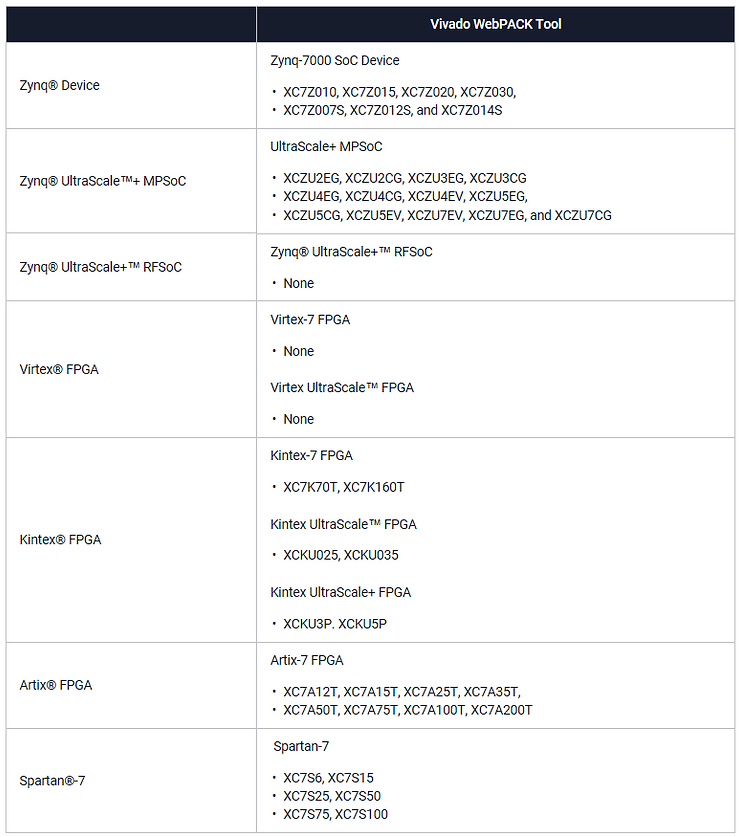

6\. At the Vivado HL WebPACK screen ensure you (A) click the Software Development Kit (SDK) check box before (B) clicking **Next**:

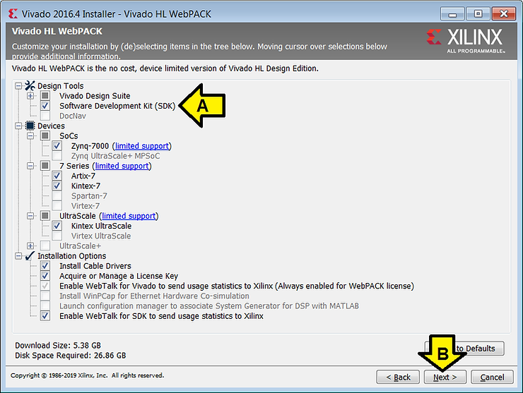

If you don't have enough space to install you'll see a the installation directory text as red:

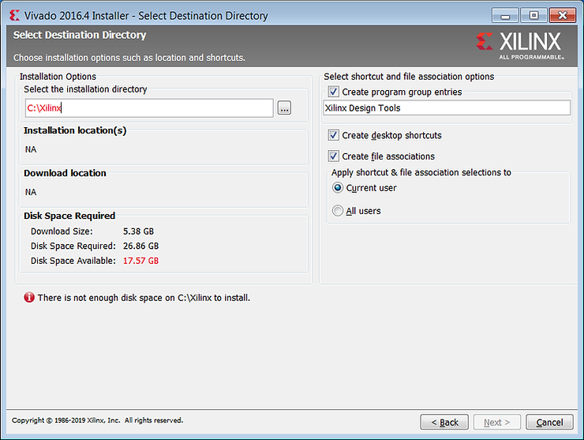

Note 2: if you're installing for all users make sure you click **All users**! I have not found a way to fix this after the fact with an existing install. I have had to uninstall and reinstall the release.

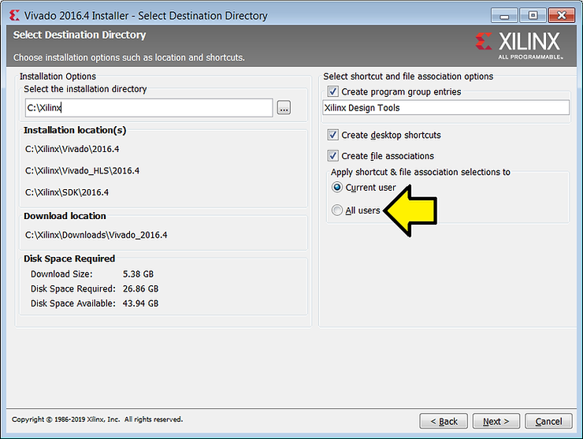

7\. If you have enough room (see note above about **All users** if you need to install for All users). Click **Next**

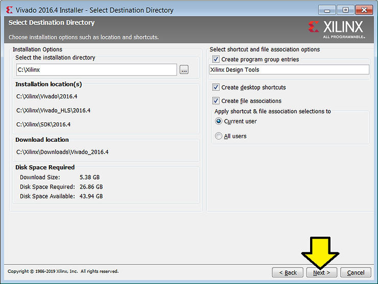

8\. Click **Install** on the **Installation Summary** screen:

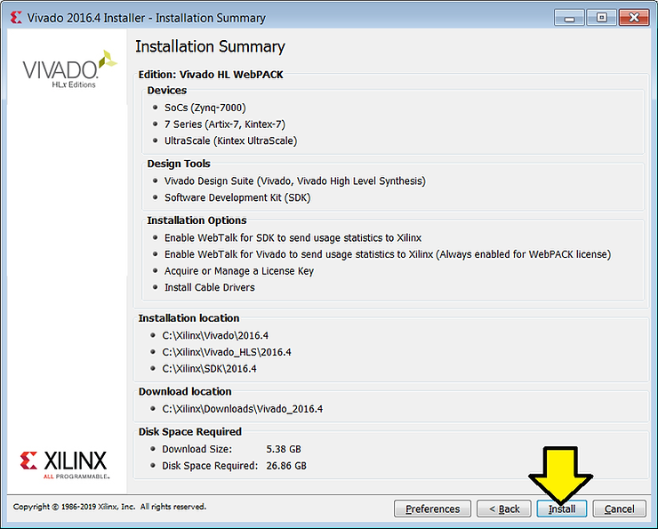

8\. At the **Vivado License Manager 2016.4** page, you can simply click the \[x\] to close the License Manager. Everything will still work.

9\. Click Yes

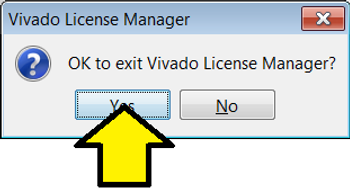

You should see:

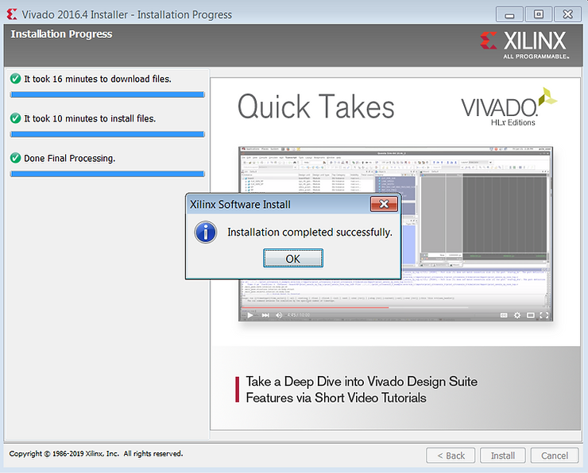

Click **OK**.