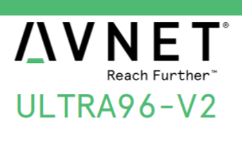

# Links to the Ultra96-V2 BSP, Related Xilinx Components, Build Guide, and Hardware

This post lists links to all of the installers you'd likely use to work with the Ultra96-v2. You will need a Xilinx account to access these links. It also lists a link that lists where you can get all the hardware you'll need.

## <u>Get a Xilinx Account</u>

Go to [xilinx.com](http://xilinx.com/) and click:

...or go to https://login.xilinx.com/. 

## <u>Links</u>

This guide:

**PetaLinux Build Guide for Ultra96-V2**

https://www.96boards.org/documentation/consumer/ultra96/ultra96-v2/build/peta-linux.md.html 

...needs:

**PetaLinux 2018.2 Installer (TAR/GZIP - 6.15 GB)**

MD5 SUM Value : 686edec30123bacf94102f2bc6ed70ff

https://www.xilinx.com/member/forms/download/xef.html?filename=petalinux-v2018.2-final-installer.run 

**Ultra96 BSP**

https://www.xilinx.com/member/forms/download/xef.html?filename=xilinx-ultra96-reva-v2018.2-final.bsp 

You may also want one of::

**SDK 2018.2 Web Install for Windows 64 (EXE - 50.4 MB)**

MD5 SUM Value : 59608302b8ca67537246bcb962bfac5d

https://www.xilinx.com/member/forms/download/xef.html?filename=Xilinx_SDK_2018.2_0614_1954_Win64.exe 

**SDK 2018.2 Web Install for Linux 64 (BIN - 99.29 MB)**

MD5 SUM Value : 4e6e7c0623da7d22cb196a1ed920ccc0

https://www.xilinx.com/member/forms/download/xef.html?filename=Xilinx_SDK_2018.2_0614_1954_Lin64.bin 

...and:

**2018.2  Full Product Installation Vivado HLx 2018.2: All OS installer Single-File Download (TAR/GZIP - 17.11 GB)**

MD5 SUM Value : e878f870bb9d1dfc882b005550cfdbef

https://www.xilinx.com/member/forms/download/xef-vivado.html?filename=Xilinx_Vivado_SDK_2018.2_0614_1954.tar.gz 

## Get the Hardware

https://www.centennialsoftwaresolutions.com/post/ultra96-v2-hardware-and-tools-initial-setup 

## Reference

Logo created from elements in [[link](https://www.avnet.com/opasdata/d120001/medias/docus/193/5365-pb-ultra96-v2-v4a.pdf)] 