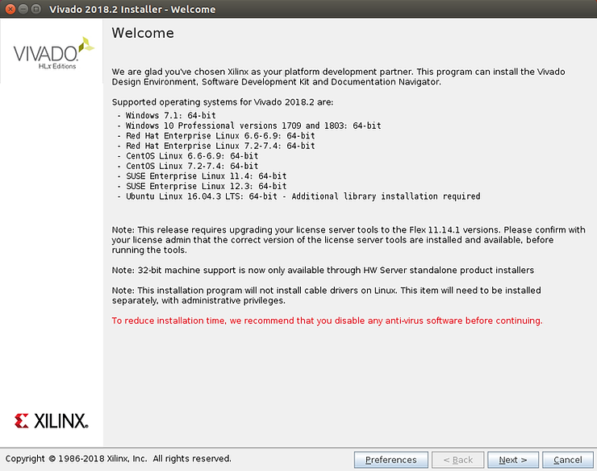

# Xilinx's 2018.2 Release of Vivado, SDK and PetaLinux Tools Only Runs on CentOS 7.3: 64-bit

This post shows why as of Apr 17th 2018, the only OS that will run 2018.2's Vivado, SDK and PetaLinux Tools is CentOS 7.3: 64-bit.

**2018.2 Vivado Supported OSs**

As presented in the Vivado installer screen:

...the following OSs are supported:

 \- Windows 7.1: 64-bit

 \- Windows 10 Professional versions 1709 and 1803: 64-bit 

 \- Red Hat Enterprise Linux 6.6-6.9: 64-bit 

 \- Red Hat Enterprise Linux 7.2-7.4: 64-bit 

 \- CentOS Linux 6.6-6.9: 64-bit 

 \- CentOS Linux 7.2-7.4: 64-bit 

 \- SUSE Enterprise Linux 11.4: 64-bit 

 \- SUSE Enterprise Linux 12.3: 64-bit 

 \- Ubuntu Linux 16.04.3 LTS: 64-bit - Additional library installation required

**2018.2 SDK Supported OSs**

According to the 2018.2 SDK documentation at \[[link](http://www.xilinx.com/html_docs/xilinx2018_2/SDK_Doc/index.html)\] under Getting Started with Xilinx SDK > System Requirements at \[[link](http://www.xilinx.com/html_docs/xilinx2018_2/SDK_Doc/xsct/intro/xsct_system_requirements.html)\]

...the supported OS's are:

-   Windows 7 SP1: 64-bit
    
-   Windows 8.1: 64-bit
    
-   Windows 10 Pro: 64-bit
    
-   Red Hat Enterprise Linux 6.6-6.9: 64-bit
    
-   Red Hat Enterprise Linux 7.0-7.1: 64-bit
    
-   CentOS Linux 6.7-6.8: 64-bit
    
-   CentOS Linux 7.2-7.3: 64-bit
    
-   SUSE Linux Enterprise 11.4: 64-bit
    
-   SUSE Linux Enterprise 12.2: 64-bit
    
-   Ubuntu Linux 16.04.2 LTS: 64-bit
    

**2018.2 PetaLinux Tools Support OSs**

And PetaLinux Tools 2018.2 at \[[link](http://www.xilinx.com/support/documentation/sw_manuals/xilinx2018_2/ug1144-petalinux-tools-reference-guide.pdf)\]

...is supported on:

-   Red Hat Enterprise Workstation/Server 7.2-7.4: 64-bit
    
-   CentOS 7.2, 7.3, 7.4: 64-bit
    
-   Ubuntu Linux 16.04.3: 64-bit
    

Here is the union of the OS's that the 2018.2 Vivado, SDK and PetaLinux Tools releases can run on as documented:

**CentOS 7.3: 64-bit**

**Commentary**

Xilinx only being able to release its 3 major tools across one common operating system indicates a lack of software release and testing coordination between these tools. If Xilinx can only release its tools for one common OS version, it may indicate that there are other structural issues with how Xilinx develops the software that is crucial to working with its chips.

**References**

Logo via [https://twitter.com/xilinxinc](http://twitter.com/xilinxinc) at [[link](http://pbs.twimg.com/profile_images/535545777020338176/pEWdIYq__400x400.png)].