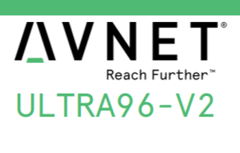

# ZCU102" Development Using an Ultra96-V2

This post lists the hardware needed to do "ZCU102" development on an Ultra96-V2, i.e. connect Vivado, the SDK and PetaLinux Tools to a target via JTAG and a serial port. It also lists prices as of May 5th 2020.

**List of Equipment Needed**

**Ultra96-V2 Zynq UltraScale+ ZU3EG Single Board Computer** 

[[docs](http://www.avnet.me/ultra96-v2)] [[buycommercial](https://www.newark.com/avnet/aes-ultra96-v2-g/single-board-computer-64bit-arm/dp/99AC7784)]

Cost: **$249.00** ($335.22 with $57.27 estimated tariff, $8.00 shipping FedEx ground, $20.95 estimated tax)

Avnet Manufacturer Part #: AES-ULTRA960V2-G 

Zynq UltraScale+ MPSoC: **XCZU3EG-1SBVA484E**

Temperature range of 0°C to 60°C

**USB-to-UART and Xilinx USB-to-JTAG capability** 

[[buy&docs\]](http://www.avnet.me/ultra96jtag)

aka serial port (COM) and JTAG connection with one cable 

Cost: **$39.00** ($59.80 with $8.97 estimated tariff, $8.00 shipping FedEx ground, $3.83 estimated tax)

Avnet Manufacturer Part #: AES-ACC-U96-JTAG 

**External 96Boards/Ultra96 compliant power supply kit (12V, 4A, International plugs)** 

[[buy&docs](https://www.avnet.com/shop/us/products/avnet-engineering-services/90152-2208-3074457345635740760/)]

Cost: **$19.99** ($34.87 with $4.60 estimated tariff, $8.00 shipping FedEx ground, $2.28 estimated tax)

Avnet Manufacturer Part #: AES-ACC-U96-4APWR 

**AmazonBasics USB 2.0 A-Male to Micro B Charger Cable, 3 feet, Black**

[[Amazon](https://www.amazon.com/dp/B0711PVX6Z/ref=twister_B072FHJVT2?_encoding=UTF8&psc=1)]

Cost: **$5.26** ($12.17 with $5.99 shipping and handling, 0.92 tax)

Total cost: **$313.25** ($442.06 with taxes, tariffs, etc...)

**References**

Logo created from elements in [[link](https://www.avnet.com/opasdata/d120001/medias/docus/193/5365-pb-ultra96-v2-v4a.pdf)]  