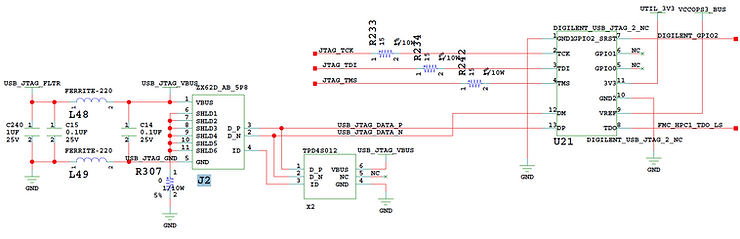
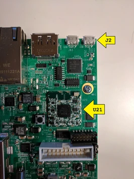
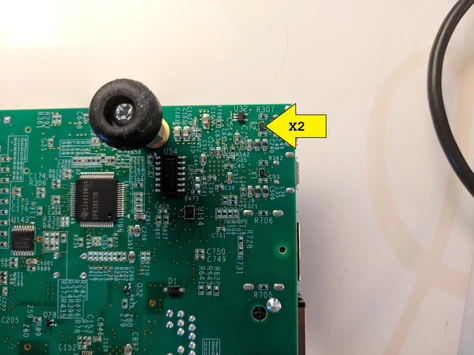
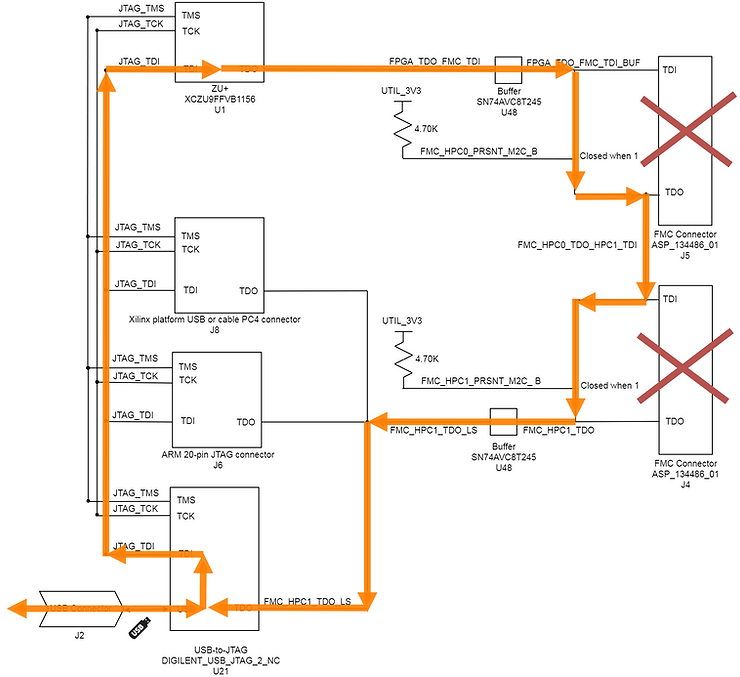

# ZCU102 Digilent USB-to-JTAG Module, Circuit, Pictures and Diagram

This post contains details about the ZCU102's USB-to-JTAG Digilent module, the circuit its used in, a picture of the components on the board and a diagram of the resultant JTAG chain.

**<u>Overview</u>**

The ZCU102 allows JTAG to be used over USB with a Digilent USB JTAG-to-USB module.

The module is available at \[[<u>link</u>](https://store.digilentinc.com/jtag-smt2-nc-surface-mount-programming-module/)\].

Info from the ZCU102 BOM:

-   Reference designation on board: **U21**
    
-   Device: **USB Module**
    
-   Package: **DIGILENT\_USB\_JTAG\_2\_NC**
    
-   Manufactured and distributed by **Digilent**
    
-   Manufacturer part number: **JTAG-SMT2-NC**
    
-   Distributor part number: **410-308P**
    

**<u>Circuit</u>**

**Board**

JTAG\_TDI, JTAG\_TMS and JTAG\_TCK also route to J6, U48 and the Zynq UltraScale+ MPSoC as seen at \[[<u>link</u>](https://www.centennialsoftwaresolutions.com/blog/diagram-of-the-zcu102-jtag-chain)\].

When used without FMC cards, the JTAG chain from the DIGILENT\_USB\_JTAG\_2\_NC looks like:

Diagram available at \[[<u>link</u>](https://drive.google.com/open?id=1qhvHiXUlf03x5rUsxRKqzL9QNyOPYsuV)\].

**References**

-   <u>ZCU102 BOM</u> ([<u>zcu102-bom-rdf0404.zip</u>](http://zcu102-bom-rdf0404.zip/)) at \[[<u>link</u>](https://www.xilinx.com/member/forms/download/design-license.html?cid=473392&filename=zcu102-bom-rdf0404.zip)\] (sign-in required)
    
-   <u>ZCU102 Board Schematics</u> ([<u>zcu102-schematic-source-rdf0403.zip</u>](http://zcu102-schematic-source-rdf0403.zip/)) at \[[<u>link</u>](https://www.xilinx.com/member/forms/download/design-license.html?cid=473360&filename=zcu102-schematic-source-rdf0403.zip)\] (sign-in required)
    
-   ZCU102 Layout (bug: see \[[<u>link</u>](https://www.centennialsoftwaresolutions.com/blog/0-kb-zcu102-board-and-gerber-file-archives-sept-8th-2018)\])
    
-   <u>Allegro Viewer</u> at \[[<u>link</u>](https://www.cadence.com/content/cadence-www/global/en_US/home/tools/allegro-downloads-contact.html)\] (needed to view layout files)
    
-   Xilinx logo found via [<u>https://twitter.com/xilinxinc</u>](https://twitter.com/xilinxinc) at \[[<u>link</u>](https://pbs.twimg.com/profile_images/535545777020338176/pEWdIYq__400x400.png)\]