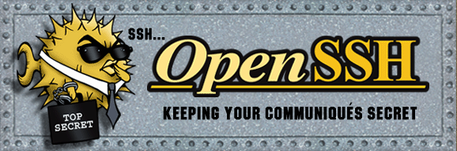

# How can I connect to my Windows machine from inside my Linux VM?


This post answers, "How can I connect to my Windows machine from inside my Linux VM?" It uses a "reverse SSH tunnel." This is useful when the VM is "behind a NAT."    

## Prerequisites

The post assumes you've completed https://www.centennialsoftwaresolutions.com/post/how-can-i-open-a-terminal-to-a-linux-vm-from-windows . 

## Install sshd on Windows

## 1\. Start Windows PowerShell (Admin)

Win + x, a

From PowerShell (Admin):

```
Add-WindowsCapability -Online -Name OpenSSH.Server~~~~0.0.1.0 
```

Output:

```

Path          :
Online        : True
RestartNeeded : False

```

## 2\. Start sshd on Windows

From PowerShell (Admin):

```

Start-Service -Name sshd

```


## 3\. Make sure sshd is running on Windows

From PowerShell (Admin):

Output

```
Status   Name               DisplayName
------   ----               -----------
Running  sshd               OpenSSH SSH Server

```

## The Reverse Tunnel

## 1\. Create a reverse tunnel from the Windows machine to the VM

From PowerShell or CMD:

```
ssh -R 2222:localhost:22 -i "C:\Users\Zach Pfeffer\.ssh\id_rsa_vm2" demouser@192.168.239.128
```

-   **2222** is the port on the **Windows machine** that will forward traffic.
    
-   **localhost:22** is the VM's SSH port (the default SSH port).
    

## 2\. Figure out my Windows username

From PowerShell or CMD:

Output:
```
whoami
```


```
laptop-3mcnkkjo\zach pfeffer
```

"zach pfeffer" is my user name.

From PowerShell or CMD:
```
echo $env:USERNAME
```

Output:
```
Zach Pfeffer
```

"Zach Pfeffer" is my user name (both capitalizations will work).

## 3\. Connect to the Windows machine from the VM

From VM:

```
ssh "zach pfeffer@localhost" -p 2222
```

Or From VM:

```
ssh "Zach Pfeffer@localhost" -p 2222
```

SSH connections are made on **port 22 by default**, but the **\-p** option allows you to connect to a different port if the SSH server is listening on one.

## Clean Up

## 1\. Stop sshd on Windows

From PowerShell (Admin):

```
Stop-Service -Name sshd
```

## 2\. Uninstall sshd on Windows

From PowerShell (Admin):

```
Remove-WindowsCapability -Online -Name OpenSSH.Server~~~~0.0.1.0
```

Output:

```
Path          :
Online        : True
RestartNeeded : True

```

Note: despite stopping service or uninstalling it, if you have an existing tunnel, it will remain established until you close down the tunnel or reboot your machine.

## Why This Works Behind NAT

-   **No Inbound Restrictions on the Tunnel:** When a tunnel is established over an outbound SSH connection, all traffic going through that tunnel is considered part of the same session. This means the NAT device treats any inbound traffic over the tunnel as return traffic, which it allows.
    
-   **The Tunnel is Bidirectional:** Once established, an SSH tunnel can carry data in both directions. The SSH protocol manages this, so once the outbound SSH connection is set up from the VM to the remote server, the reverse tunnel uses this existing connection.
    
-   **NAT Only Blocks Unsolicited Inbound Connections:** NAT typically blocks unsolicited inbound connections (i.e., new connections initiated from the outside). However, the reverse SSH tunnel is not considered unsolicited because it is initiated from the inside and uses the established SSH session.
    


