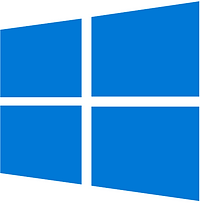

# How can I find recent items in Windows 10?

This post answers, "How can I find recent items in Windows 10?"

## **<u>Steps</u>**

\# Type: **Windows Key + r**

\# Type: **shell:recent**

Many more "shell" examples listed @

\[ [<u>https://ss64.com/nt/shell.html</u>](https://ss64.com/nt/shell.html) \]

\[ [<u>https://www.tenforums.com/tutorials/3109-shell-commands-list-windows-10-a.html</u>](https://www.tenforums.com/tutorials/3109-shell-commands-list-windows-10-a.html) \]

## **<u>Cache</u>**

Here's a copy from Shawn Brink's site listed above (putting this copy here so if the other page disappears, I won't lose it):

| Shell Command                                                | Opens                                                        |
| :----------------------------------------------------------- | :----------------------------------------------------------- |
| shell:3D Objects                                             | %UserProfile%\3D Objects                                     |
| shell:AccountPictures                                        | %AppData%\Microsoft\Windows\AccountPictures                  |
| shell:AddNewProgramsFolder                                   | Control Panel\All Control Panel Items\Get Programs           |
| shell:Administrative Tools                                   | %AppData%\Microsoft\Windows\Start Menu\Programs\Administrative Tools |
| shell:AppData                                                | %AppData%                                                    |
| shell:Application Shortcuts                                  | %LocalAppData%\Microsoft\Windows\Application Shortcuts       |
| shell:AppsFolder                                             | Applications                                                 |
| shell:AppUpdatesFolder                                       | Installed Updates                                            |
| shell:Cache                                                  | %LocalAppData%\Microsoft\Windows\INetCache                   |
| shell:Camera Roll                                            | %UserProfile%\Pictures\Camera Roll                           |
| shell:CD Burning                                             | %LocalAppData%\Microsoft\Windows\Burn\Burn                   |
| shell:ChangeRemoveProgramsFolder                             | Control Panel\All Control Panel Items\Programs and Features  |
| shell:Common Administrative Tools                            | %ProgramData%\Microsoft\Windows\Start Menu\Programs\Administrative Tools |
| shell:Common AppData                                         | %ProgramData%                                                |
| shell:Common Desktop                                         | %Public%\Desktop                                             |
| shell:Common Documents                                       | %Public%\Documents                                           |
| shell:CommonDownloads                                        | %Public%\Downloads                                           |
| shell:CommonMusic                                            | %Public%\Music                                               |
| shell:CommonPictures                                         | %Public%\Pictures                                            |
| shell:Common Programs                                        | %ProgramData%\Microsoft\Windows\Start Menu\Programs          |
| shell:CommonRingtones                                        | %ProgramData%\Microsoft\Windows\Ringtones                    |
| shell:Common Start Menu                                      | %ProgramData%\Microsoft\Windows\Start Menu                   |
| shell:Common Startup                                         | %ProgramData%\Microsoft\Windows\Start Menu\Programs\Startup  |
| shell:Common Templates                                       | %ProgramData%\Microsoft\Windows\Templates                    |
| shell:CommonVideo                                            | %Public%\Videos                                              |
| shell:ConflictFolder                                         | Control Panel\All Control Panel Items\Sync Center\Conflicts  |
| shell:ConnectionsFolder                                      | Control Panel\All Control Panel Items\Network Connections    |
| shell:Contacts                                               | %UserProfile%\Contacts                                       |
| shell:ControlPanelFolder                                     | Control Panel\All Control Panel Items                        |
| shell:Cookies                                                | %LocalAppData%\Microsoft\Windows\INetCookies                 |
| shell:Cookies\Low                                            | %LocalAppData%\Microsoft\Windows\INetCookies\Low             |
| shell:CredentialManager                                      | %AppData%\Microsoft\Credentials                              |
| shell:CryptoKeys                                             | %AppData%\Microsoft\Crypto                                   |
| shell:desktop                                                | Desktop                                                      |
| shell:device Metadata Store                                  | %ProgramData%\Microsoft\Windows\DeviceMetadataStore          |
| shell:documentsLibrary                                       | Libraries\Documents                                          |
| shell:downloads                                              | %UserProfile%\Downloads                                      |
| shell:dpapiKeys                                              | %AppData%\Microsoft\Protect                                  |
| shell:Favorites                                              | %UserProfile%\Favorites                                      |
| shell:Fonts                                                  | %WinDir%\Fonts                                               |
| shell:Games (removed in [version 1803](https://www.tenforums.com/tutorials/32961-find-windows-10-version-number.html)) | Games                                                        |
| shell:GameTasks                                              | %LocalAppData%\Microsoft\Windows\GameExplorer                |
| shell:History                                                | %LocalAppData%\Microsoft\Windows\History                     |
| shell:HomeGroupCurrentUserFolder                             | Homegroup\(user-name)                                        |
| shell:HomeGroupFolder                                        | Homegroup                                                    |
| shell:ImplicitAppShortcuts                                   | %AppData%\Microsoft\Internet Explorer\Quick Launch\User Pinned\ImplicitAppShortcuts |
| shell:InternetFolder                                         | Internet Explorer                                            |
| shell:Libraries                                              | Libraries                                                    |
| shell:Links                                                  | %UserProfile%\Links                                          |
| shell:Local AppData                                          | %LocalAppData%                                               |
| shell:LocalAppDataLow                                        | %UserProfile%\AppData\LocalLow                               |
| shell:MusicLibrary                                           | Libraries\Music                                              |
| shell:MyComputerFolder                                       | This PC                                                      |
| shell:My Music                                               | %UserProfile%\Music                                          |
| shell:My Pictures                                            | %UserProfile%\Pictures                                       |
| shell:My Video                                               | %UserProfile%\Videos                                         |
| shell:NetHood                                                | %AppData%\Microsoft\Windows\Network Shortcuts                |
| shell:NetworkPlacesFolder                                    | Network                                                      |
| shell:OneDrive                                               | OneDrive                                                     |
| shell:OneDriveCameraRoll                                     | %UserProfile%\OneDrive\Pictures\Camera Roll                  |
| shell:OneDriveDocuments                                      | %UserProfile%\OneDrive\Documents                             |
| shell:OneDriveMusic                                          | %UserProfile%\OneDrive\Music                                 |
| shell:OneDrivePictures                                       | %UserProfile%\OneDrive\Pictures                              |
| shell:Personal                                               | %UserProfile%\Documents                                      |
| shell:PicturesLibrary                                        | Libraries\Pictures                                           |
| shell:PrintersFolder                                         | All Control Panel Items\Printers                             |
| shell:PrintHood                                              | %AppData%\Microsoft\Windows\Printer Shortcuts                |
| shell:Profile                                                | %UserProfile%                                                |
| shell:ProgramFiles                                           | %ProgramFiles%                                               |
| shell:ProgramFilesCommon                                     | %ProgramFiles%\Common Files                                  |
| shell:ProgramFilesCommonX64                                  | %ProgramFiles%\Common Files (64-bit Windows only)            |
| shell:ProgramFilesCommonX86                                  | %ProgramFiles(x86)%\Common Files (64-bit Windows only)       |
| shell:ProgramFilesX64                                        | %ProgramFiles% (64-bit Windows only)                         |
| shell:ProgramFilesX86                                        | %ProgramFiles(x86)% (64-bit Windows only)                    |
| shell:Programs                                               | %AppData%\Microsoft\Windows\Start Menu\Programs              |
| shell:Public                                                 | %Public%                                                     |
| shell:PublicAccountPictures                                  | %Public%\AccountPictures                                     |
| shell:PublicGameTasks                                        | %ProgramData%\Microsoft\Windows\GameExplorer                 |
| shell:PublicLibraries                                        | %Public%\Libraries                                           |
| shell:Quick Launch                                           | %AppData%\Microsoft\Internet Explorer\Quick Launch           |
| shell:Recent                                                 | %AppData%\Microsoft\Windows\Recent                           |
| shell:RecordedTVLibrary                                      | Libraries\Recorded TV                                        |
| shell:RecycleBinFolder                                       | Recycle Bin                                                  |
| shell:ResourceDir                                            | %WinDir%\Resources                                           |
| shell:Ringtones                                              | %ProgramData%\Microsoft\Windows\Ringtones                    |
| shell:Roamed Tile Images                                     | %LocalAppData%\Microsoft\Windows\RoamedTileImages            |
| shell:Roaming Tiles                                          | %AppData%\Microsoft\Windows\RoamingTiles                     |
| shell:::{2559a1f3-21d7-11d4-bdaf-00c04f60b9f0}               | Run dialog box                                               |
| shell:SavedGames                                             | %UserProfile%\Saved Games                                    |
| shell:Screenshots                                            | %UserProfile%\Pictures\Screenshots                           |
| shell:Searches                                               | %UserProfile%\Searches                                       |
| shell:SearchHistoryFolder                                    | %LocalAppData%\Microsoft\Windows\ConnectedSearch\History     |
| shell:SearchHomeFolder                                       | search-ms:                                                   |
| shell:SearchTemplatesFolder                                  | %LocalAppData%\Microsoft\Windows\ConnectedSearch\Templates   |
| shell:SendTo                                                 | %AppData%\Microsoft\Windows\SendTo                           |
| shell:Start Menu                                             | %AppData%\Microsoft\Windows\Start Menu                       |
| shell:StartMenuAllPrograms                                   | StartMenuAllPrograms                                         |
| shell:Startup                                                | %AppData%\Microsoft\Windows\Start Menu\Programs\Startup      |
| shell:SyncCenterFolder                                       | Control Panel\All Control Panel Items\Sync Center            |
| shell:SyncResultsFolder                                      | Control Panel\All Control Panel Items\Sync Center\Sync Results |
| shell:SyncSetupFolder                                        | Control Panel\All Control Panel Items\Sync Center\Sync Setup |
| shell:System                                                 | %WinDir%\System32                                            |
| shell:SystemCertificates                                     | %AppData%\Microsoft\SystemCertificates                       |
| shell:SystemX86                                              | %WinDir%\SysWOW64                                            |
| shell:Templates                                              | %AppData%\Microsoft\Windows\Templates                        |
| shell:ThisPCDesktopFolder                                    | Desktop                                                      |
| shell:UsersFilesFolder                                       | %UserProfile%                                                |
| shell:User Pinned                                            | %AppData%\Microsoft\Internet Explorer\Quick Launch\User Pinned |
| shell:UserProfiles                                           | %HomeDrive%\Users                                            |
| shell:UserProgramFiles                                       | %LocalAppData%\Programs                                      |
| shell:UserProgramFilesCommon                                 | %LocalAppData%\Programs\Common                               |
| shell:UsersLibrariesFolder                                   | Libraries                                                    |
| shell:VideosLibrary                                          | Libraries\Videos                                             |
| shell:Windows                                                | %WinDir%                                                     |

## **<u>References</u>**

Windows 10 logo adapted from commons.wikimedia.org @ \[[<u>link</u>](https://commons.wikimedia.org/wiki/File:Windows_10_Logo.svg)\]