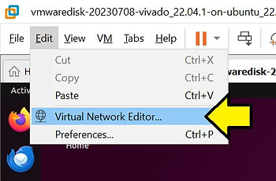
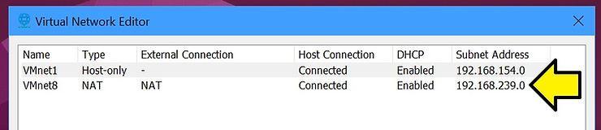

# How can I open a terminal to a Linux VM from Windows?


This post answers, "How can I open a terminal to a Linux VM from Windows?" It shows how to use SSH, generate SSH keys, transfer the public part of the key to the VM, and create a bat file to support one-click terminal launch. It also lists descriptions of NAT, what 192.168.1.0/24 means, gives an overview of addresses for private networks, and lists common ports to make further exploration more fun.

## Steps to Answer: "How can I open a terminal to a Linux VM from Windows?"

## 1\. Check if sshd is already running

If sshd is already running, no install or set up is needed.

From VM:

```
sudo systemctl status sshd
```

Example output:

```
● ssh.service - OpenBSD Secure Shell server
     Loaded: loaded (/lib/systemd/system/ssh.service; enabled; vendor preset: enabled)
     Active: active (running) since Wed 2024-08-28 19:13:32 MDT; 13h ago
       Docs: man:sshd(8)
             man:sshd_config(5)
    Process: 989 ExecStartPre=/usr/sbin/sshd -t (code=exited,
status=0/SUCCESS)
   Main PID: 1026 (sshd)
      Tasks: 1 (limit: 38369)
     Memory: 3.0M
        CPU: 71ms
     CGroup: /system.slice/ssh.service
             └─1026 "sshd: /usr/sbin/sshd -D [listener] 0 of 10-100 startups"

Aug 28 19:13:32 fpgadev systemd[1]: Starting OpenBSD Secure Shell server...
Aug 28 19:13:32 fpgadev sshd[1026]: Server listening on 0.0.0.0 port 22.
Aug 28 19:13:32 fpgadev sshd[1026]: Server listening on :: port 22.
Aug 28 19:13:32 fpgadev systemd[1]: Started OpenBSD Secure Shell server.
```

## 2\. Install sshd if needed

From VM:

```
sudo apt update
sudo apt install openssh-server
```

## 3\. Start and enable the SSH server if needed

From VM:

```
sudo systemctl start sshd
sudo systemctl enable sshd
```

## 4\. Check the SSH server status to ensure it's running (possibly again)

From VM:

```
sudo systemctl status sshd
```

## 5\. Find NAT VMWare virtual network (VMnet8)

Select:

VMWare > Edit > Virtual Network Editor...



Select:

VMWare > Edit > Virtual Network Editor... > Connections



### 5.a. NAT: Network Address Translation

A method to allow one or more "internal" IP address to use one "external" IP address. **Here's an example of how NAT works.** A private network uses IP addresses in the range [<u><span>192.168.1.0/24</span></u>](https://www.centennialsoftwaresolutions.com/post/how-can-i-open-a-terminal-to-a-linux-vm-from-windows#viewer-bnkqb34270), and the NAT router has a public IP address of 203.0.113.5. **(1) Initiate.** A device with a private IP address, 192.168.1.10, sends a request to a web server on the internet. The packet has a source IP of 192.168.1.10 and a destination IP of 198.51.100.20 (the web server). **(2) Translation.** The NAT router receives the packet and replaces the source IP address (192.168.1.10) with its own public IP (203.0.113.5). The router also changes the source port to a unique value (e.g., 10500) and records this translation in its NAT table. **(3) Internet Response.** The web server responds to 203.0.113.5:10500. The NAT router receives the response, looks up the original IP address and port in its NAT table, and forwards the packet to 192.168.1.10 on the internal network.

#### 5.a.i. Understanding the Range 192.168.1.0/24

The IP address range **192.168.1.0/24** represents a **subnet** with a total of **256 IP addresses**, commonly used in private networks. The /24 denotes the **subnet mask** 255.255.255.0, which means the first 24 bits of the IP address are fixed, and the last 8 bits are available for hosts.

##### Reserved Addresses

-   **Network Address:** 192.168.1.0
    
    -   This is the **network identifier** and cannot be assigned to any device.
    
-   **Broadcast Address:** 192.168.1.255
    
    -   This is the **broadcast address** used to send data to all devices on the network and cannot be assigned to a device.
    
-   **Usable IP Addresses:** 192.168.1.1 to 192.168.1.254
    
    -   These are the IP addresses that can be assigned to devices (hosts) on this network.
        

##### Examples of Typical Uses in the Usable IP Addresses192.168.1.0/24 Range

-   **192.168.1.1:** Often used as the **default gateway** (router address) in many home and small office networks.
    
-   **192.168.1.2:** Typically assigned to the first device on the network (like a computer, printer, or IoT device).
    
-   **192.168.1.10:** Can be used for another device, such as a second computer or server.
    
-   **192.168.1.50:** Could be assigned to a Wi-Fi access point or a network printer.
    
-   **192.168.1.100:** Commonly used for dynamic IP assignment by a DHCP server (e.g., for mobile devices).
    
-   **192.168.1.150:** Can be manually assigned to a specific device that needs a static IP, like a NAS (Network Attached Storage) device.
    
-   **192.168.1.200:** Another possible static IP for an additional network device.
    
-   **192.168.1.254:** Typically, the last usable IP address in the subnet, often reserved for network management or specific devices.
    

##### Key Points

-   **Usable IP Range:** 192.168.1.1 to 192.168.1.254 (254 usable IP addresses).
    
-   **Subnet Mask:** /24 or 255.255.255.0.
    
-   **Private Network:** The 192.168.x.x range is designated for private networks, so these IPs are not routable on the public internet.
    

##### Link to NAT RFC (RFC 2663 - IP Network Address Translator (NAT) Terminology and Considerations)

-   [<u><span>https://datatracker.ietf.org/doc/html/rfc2663</span></u>](https://datatracker.ietf.org/doc/html/rfc2663)
    

##### 5.a.i.1. Private IP Address Specification

The specification for private IP address ranges is defined in **RFC 1918**, titled **"Address Allocation for Private Internets."** This RFC was published in 1996 by the Internet Engineering Task Force (IETF) and outlines the IP address ranges that are reserved for private use in internal networks.

###### Key Points from **RFC 1918**

-   **Purpose of RFC 1918:**
    
    -   **RFC 1918** defines a set of IP address ranges that are not routable on the public internet. These ranges are reserved for use in private networks (such as home, business, and enterprise networks) and are commonly used for local area networks (LANs) that connect to the internet via a gateway, typically using Network Address Translation (NAT).
    
-   **Private IP Address Ranges Defined by RFC 1918:** RFC 1918 specifies three blocks of IPv4 addresses for private network use:
    
    -   **10.0.0.0/8**:
        
        -   Range: 10.0.0.0 to 10.255.255.255
            
        -   Subnet Mask: 255.0.0.0
            
        -   Total Addresses: 16,777,216
            
        -   Commonly used in large enterprise networks.
        
    -   **172.16.0.0/12**:
        
        -   Range: 172.16.0.0 to 172.31.255.255
            
        -   Subnet Mask: 255.240.0.0
            
        -   Total Addresses: 1,048,576
            
        -   Often used in medium-sized networks.
        
    -   **192.168.0.0/16**:
        
        -   Range: 192.168.0.0 to 192.168.255.255
            
        -   Subnet Mask: 255.255.0.0
            
        -   Total Addresses: 65,536
            
        -   Most commonly used in small home or office networks.
    
-   **Characteristics of Private IP Addresses:**
    
    -   **Not Routable on the Public Internet:** Devices with private IP addresses can communicate within the private network but must use NAT to access the public internet.
        
    -   **Common Usage:** Private IP ranges are used for internal communications within an organization or a local network, like a home network.
        
    -   **Avoids Address Conflicts:** Prevents conflicts with publicly routable IP addresses by ensuring that private addresses do not overlap with publicly assigned IP ranges.
        

###### Link to "Private Internet" RFC (RFC 2663 - Address Allocation for Private Internets)

-   [<u><span>https://www.ietf.org/rfc/rfc1918.txt</span></u>](https://www.ietf.org/rfc/rfc1918.txt)
    

##### 5.a.i.2. Typical Assignments of Ports

-   **Well-Known Ports (0-1023):**
    
    -   **Assigned by the Internet Assigned Numbers Authority (IANA)**, these ports are used by well-known protocols and services.
        
    -   Examples:
        
        -   **Port 80 (HTTP):** Used for web traffic (unencrypted).
            
        -   **Port 443 (HTTPS):** Used for secure web traffic (encrypted with SSL/TLS).
            
        -   **Port 22 (SSH):** Used for Secure Shell, a protocol for secure remote login and command execution.
            
        -   **Port 25 (SMTP):** Used for Simple Mail Transfer Protocol, which is used to send emails.
            
        -   **Port 53 (DNS):** Used for Domain Name System queries.
            
        -   **Port 21 (FTP):** Used for File Transfer Protocol, which allows for the transfer of files between client and server.
            
        -   **Port 110 (POP3):** Used for Post Office Protocol version 3, an email retrieval protocol.
    
-   **Registered Ports (1024-49151):**
    
    -   These ports are **assigned by IANA** to specific services and applications upon request, but they are less commonly known than the well-known ports.
        
    -   Examples:
        
        -   **Port 3306 (MySQL):** Used for the MySQL database server.
            
        -   **Port 3389 (RDP):** Used for Remote Desktop Protocol, allowing remote connections to Windows desktops and servers.
            
        -   **Port 5432 (PostgreSQL):** Used for the PostgreSQL database server.
            
        -   **Port 8080 (HTTP Alternate):** Often used as an alternative to port 80 for web servers.
            
        -   **Port 5060 (SIP):** Used for Session Initiation Protocol, commonly used in VoIP (Voice over IP) services.
    
-   **Dynamic or Private Ports (49152-65535):**
    
    -   These ports are not assigned to any specific service or application by IANA and are typically used for **ephemeral (temporary) communications**.
        
    -   Operating systems dynamically allocate these ports when a client application initiates a connection.
        
    -   Examples:
        
        -   **Ephemeral Ports:** Used temporarily for client-side communication when a device connects to a service (e.g., when a web browser connects to a web server).
            

###### Link to "Port Assignment" RFC (RFC 1340 - Assigned Numbers)

-   [<u><span>https://datatracker.ietf.org/doc/html/rfc1340</span></u>](https://datatracker.ietf.org/doc/html/rfc1340)
    

## 6\. Get the VM's IP address

From VM:

```
ip a
```

Example output:

```
1: lo: &lt;LOOPBACK,UP,LOWER_UP&gt; mtu 65536 qdisc noqueue state UNKNOWN group default qlen 1000
    link/loopback 00:00:00:00:00:00 brd 00:00:00:00:00:00
    inet 127.0.0.1/8 scope host lo
       valid_lft forever preferred_lft forever
    inet6 ::1/128 scope host 
       valid_lft forever preferred_lft forever
2: ens33: &lt;BROADCAST,MULTICAST,UP,LOWER_UP&gt; mtu 1500 qdisc fq_codel state UP group default qlen 1000
    link/ether 00:0c:29:18:7d:a9 brd ff:ff:ff:ff:ff:ff
    altname enp2s1
    inet 192.168.239.128/24 brd 192.168.239.255 scope global dynamic noprefixroute ens33
       valid_lft 1563sec preferred_lft 1563sec
    inet6 fe80::bb94:212f:f521:2539/64 scope link noprefixroute 
       valid_lft forever preferred_lft forever
```

**<u>Notice: ens33's IP address is 192.168.239.128/24</u>**

## 7\. Check host interface IP addresses in CMD or PowerShell

From PowerShell:

```
ipconfig
```

### Output

```
Ethernet adapter VMware Network Adapter VMnet1:

   Connection-specific DNS Suffix  . :
   Link-local IPv6 Address . . . . . : fe80::1e03:16c9:48c:5c4c%20
   IPv4 Address. . . . . . . . . . . : 192.168.154.1
   Subnet Mask . . . . . . . . . . . : 255.255.255.0
   Default Gateway . . . . . . . . . :

Ethernet adapter VMware Network Adapter VMnet8:

   Connection-specific DNS Suffix  . :
   Link-local IPv6 Address . . . . . : fe80::34b0:1fcd:53ee:66d9%8
   IPv4 Address. . . . . . . . . . . : 192.168.239.1
   Subnet Mask . . . . . . . . . . . : 255.255.255.0
   Default Gateway . . . . . . . . . :
```

## 8\. Test ssh From Windows

From CMD or PowerShell:

```
ssh demouser@192.168.239.128
# Log in at the prompt
```

## 9\. Set Up Key Login (No Need to Login)

Set up with passphrase prompt, default key

From PowerShell:

```
ssh-keygen -t rsa -b 4096 -C "demouser@192.168.239.128"
```

...or set up with passphrase prompt, custom key

From PowerShell:

```
ssh-keygen -t rsa -b 4096 -C "demouser@192.168.239.128" -f "C:/Users/Zach Pfeffer/.ssh/id_rsa_vm2"
```

...or set up, no prompt for passphrase

From PowerShell:

```
ssh-keygen -t rsa -b 4096 -C "demouser@192.168.239.128" -f "C:/Users/Zach Pfeffer/.ssh/id_rsa_vm2" -N '""'
```

...or set up, no prompt for passphrase, existing key

From PowerShell:

```
Remove-Item -Force -ErrorAction Ignore "C:/Users/Zach Pfeffer/.ssh/id_rsa_vm2"
```

```
Remove-Item -Force -ErrorAction Ignore "C:/Users/Zach Pfeffer/.ssh/id_rsa_vm2.pub"
```

```
ssh-keygen -t rsa -b 4096 -C "demouser@192.168.239.128" -f "C:/Users/Zach Pfeffer/.ssh/id_rsa_vm2" -N '""'
```

## 10\. Copy key with ssh-copy-id if available (its not on Windows)

From PowerShell:

```
ssh-copy-id -i "C:/Users/Zach Pfeffer/.ssh/id_rsa_vm2.pub" demouser@192.168.239.128
```

## 11\. If no ssh-copy-id, copy the key manually

From PowerShell:

```
ssh demouser@192.168.239.128
```

From VM:

```
mkdir -p ~/.ssh 
chmod 700 ~/.ssh exit
```

From PowerShell:

```
scp "C:\Users\Zach Pfeffer\.ssh\id_rsa_vm2.pub" demouser@192.168.239.128:~/.ssh/temp_key.pub 
ssh demouser@192.168.239.12
```

From VM:

```
touch ~/.ssh/authorized_keys 
chmod 600 ~/.ssh/authorized_keys 
cat ~/.ssh/temp_key.pub &gt;&gt; ~/.ssh/authorized_keys 
rm ~/.ssh/temp_key.pub exit
```

Test

From PowerShell:

```
ssh -i "C:\Users\Zach Pfeffer\.ssh\id_rsa_vm2" demouser@192.168.239.128
```

## 12\. Create a "vm.bat" to open a terminal when you click on it

```
ssh -i "C:\Users\Zach Pfeffer\.ssh\id_rsa_vm2" demouser@192.168.239.128
```

Click on it to launch a terminal from Windows into the VM.

## 13\. Remove the need to use -i by using a 'config' file to specify the key

### Create a config file manually:

Create "C:/Users/Zach Pfeffer/.ssh/config" and add:

```
Host myvm
    HostName 192.168.239.128
    User demouser
    Port 22
    IdentityFile C:\Users\Zach Pfeffer\.ssh\id_rsa_vm2
```

### Create a config file from CMD:

From CMD:

```
echo Host myvm &gt; "%USERPROFILE%\.ssh\config"
echo     HostName 192.168.239.128 &gt;&gt; "%USERPROFILE%\.ssh\config"
echo     User demouser &gt;&gt; "%USERPROFILE%\.ssh\config"
echo     Port 22 &gt;&gt; "%USERPROFILE%\.ssh\config"
echo     IdentityFile "C:\Users\Zach Pfeffer\.ssh\id_rsa_vm2" &gt;&gt; "%USERPROFILE%\.ssh\config"
```

### Create a config file from PowerShell

From PowerShell:

```
@" 
Host myvm 
HostName 192.168.239.128 
User demouser 
Port 22 
IdentityFile "C:\Users\Zach Pfeffer\.ssh\id_rsa_vm2" 
"@ | Out-File -FilePath "$HOME\.ssh\config" -Encoding utf8
```

Test

From PowerShell or CMD:

```
ssh myvm
```


## Other Useful Things

## Stop the SSH server (sshd)

From VM:

```
sudo systemctl stop sshd
```


## Restart the SSH server (sshd)

From VM:

```
sudo systemctl restart sshd
```
